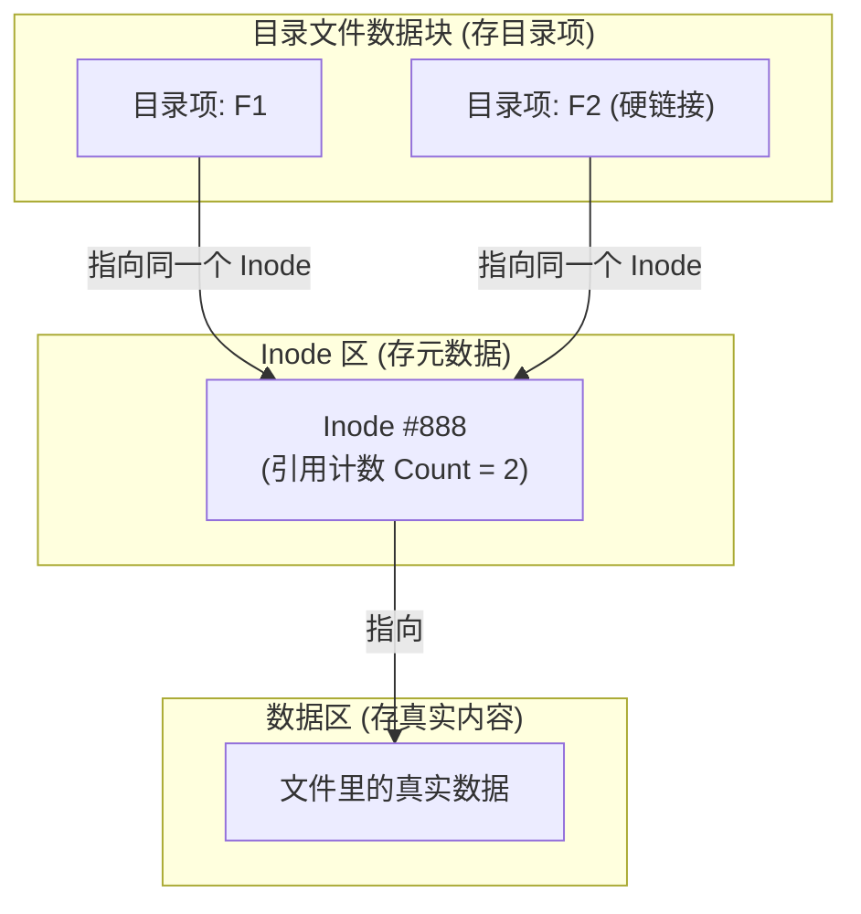
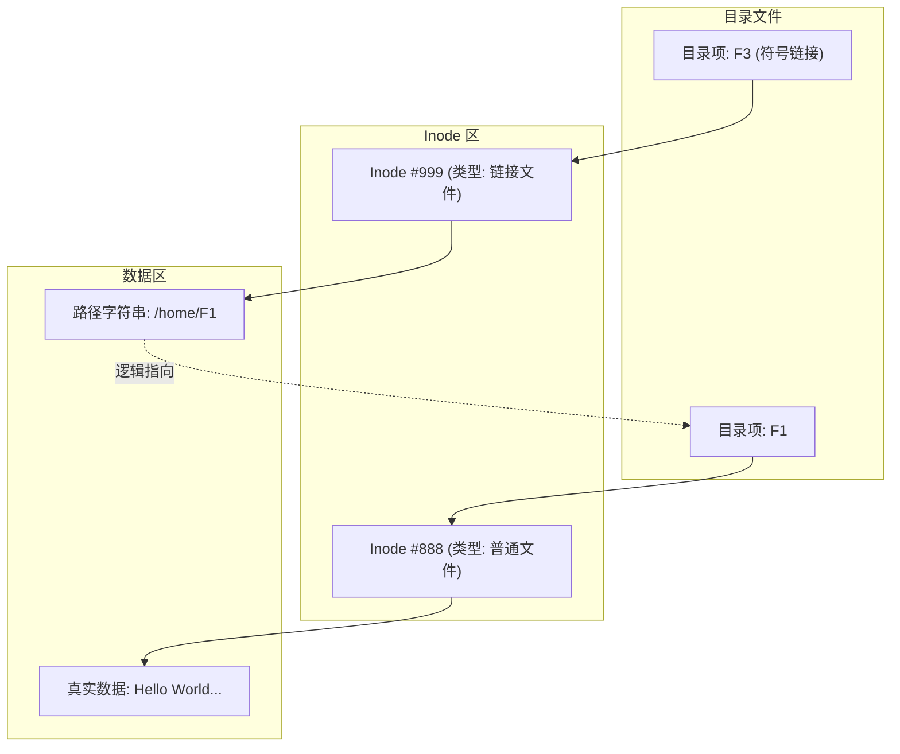

# cpu调度
- 为了实现人机交互应采用哪个调度算法？
	时间片轮转
	为什么“时间片轮转 (RR)”可以？

RR 算法通过**切分时间**，强制实现了**“雨露均沾”**：

- **公平性：** 系统规定每个进程一次只能跑 $q$ (时间片，例如 20ms)。
    
- **强制剥夺：** 哪怕后台有一个巨大的计算任务，跑了 20ms 后，时钟中断会强制它下机。
    
- **快速响应：** CPU 迅速切换到你的交互进程，处理你的键盘输入（通常只需几毫秒），然后给你反馈。
    
**宏观结果：** 哪怕有 100 个进程在跑，只要时间片设得合理，用户也会感觉自己是独占 CPU 的，操作非常丝滑。这就是**分时系统 (Time-Sharing System)** 的本质。

>[!notice] 虽然短作业优先能改善平均周转时间，但它需要**预知**作业的运行时间（这在交互系统中不可能，你没法预知用户要玩多久游戏）。而且长作业容易“饥饿”。

**日期**：2025-12-24
### 💡 核心概念纠错

#### 1. 调度层次与目标
> [!NOTE] 中级调度 (内存调度)
> * **核心行为**：将暂时不能运行的进程挂起（Swapping-out）到外存，或将具备运行条件的进程调入（Swapping-in）内存。
> * **核心目的**：
>     1.  提高 **内存利用率** (通过置换腾出空间)。
>     2.  提高 **系统吞吐量**。
>     3.  **注意**：其直接目的并非为了提高 CPU 利用率（那是低级调度的副作用），而是为了控制 **多道程序度 (Degree of Multiprogramming)**。

#### 2. 调度算法特性
| 特性维度 | 详情 & 辨析 |
| :--- | :--- |
| **互斥性** | **调度算法本身不考虑互斥性**。互斥是由同步机制（如信号量、管程）保证的，调度器只负责分配 CPU 时间片。 |
| **临界区调度** | 进程处于临界区时 **可以被调度**（例如：在临界区内申请 I/O 阻塞，或时间片用完）。<br>⚠️ **特例**：在**操作系统内核**的临界区中（如修改就绪队列指针），通常是不可抢占的，但在普通临界区（访问共享数据）是可以切换的。 |
| **交互式系统** | 首选 **时间片轮转 (RR)**。<br>**原因**：为了最小化响应时间的方差，保证所有用户在一定时间内都能得到响应（公平性）。 |

#### 3. 作业 vs 进程 (概念辨析)
> [!ABSTRACT] 这是一个高频混淆点
> * **作业 (Job)**：
>     * **视角**：用户视角，任务的单位。
>     * **来源**：用户向系统提交。
>     * **生命周期**：从提交到作业完成。
> * **进程 (Process)**：
>     * **视角**：操作系统视角，资源分配和调度的单位。
>     * **来源**：系统根据作业自动生成（一个作业可能对应一个或多个进程）。
>     * **生命周期**：从创建到撤销。

#### 4. 负载类型与算法匹配
* **CPU 繁忙型 (CPU-bound)**：
    * **特征**：占用 CPU 时间长，很少请求 I/O。
    * **类比**：长作业。
    * **匹配倾向**：**FCFS** (先来先服务) 更有利于长作业（但可能导致护航效应）。
* **I/O 繁忙型 (I/O-bound)**：
    * **特征**：频繁请求 I/O，CPU 计算时间短。
    * **类比**：短作业。
    * **匹配倾向**：**SJF/SPF** (短作业/进程优先) 或 **高优先级调度**，目的是为了让 I/O 设备尽早忙碌起来，提升系统并行度。

#### 5. 状态流转细节
* **时间片用完**：状态从 **运行态 (Running)** $\rightarrow$ **就绪态 (Ready)**。
* *注意：不是阻塞态，因为并未等待除了 CPU 以外的资源。*

### ⚠️ 易错概念辨析 (Pitfalls)

#### 1. 状态转换的本质
> [!FAILURE] 错题警示：时间片用完 vs 阻塞
> * **场景**：进程在临界区内（如访问共享数据），时间片用完。
> * **错误直觉**：认为会阻塞 (Blocked) 或不能切换。
> * **正确逻辑**：
>     * **时间片用完** = 被剥夺 CPU = **就绪态 (Ready)**。
>     * **阻塞** = 等待非 CPU 资源 (I/O, 信号量)。
>     * **结论**：只要不是内核级的关中断临界区，进程随时可能被切回就绪态，即使它持有锁。

#### 2. 调度算法的负面效应
| 算法               | 负面现象                     | 解释                                                                 |
| :--------------- | :----------------------- | :----------------------------------------------------------------- |
| **FCFS (先来先服务)** | **护航效应 (Convoy Effect)** | 大作业在前面霸占 CPU，导致后面的 I/O 型小作业长时间等待 CPU，致使 I/O 设备空闲，系统并行度下降。（注意：不是饥饿） |
| **SJF (短作业优先)**  | **饥饿 (Starvation)**      | 长作业可能因为源源不断的短作业插队，而永远得不到服务。                                        |
| **优先级调度**        | **饥饿 (Starvation)**      | 低优先级进程可能永远得不到服务。                                                   |
# 一些误区
### 1. 纠正：不仅是链接时定址，还有“动态库”

> **问题**：是不是全都是链接时定址？

**回答**：**不是。**

- **主程序 (.exe)**：通常是 **链接时定址**。代码里的地址确实是写死的（例如 `0x0804xxxx`）。
    
- **动态库 (.dll / .so)**：它们使用 **PIC (Position Independent Code，位置无关代码)** 技术。
    
    - **为什么？** 因为 `libc.so` 被映射到进程 A 的位置可能是 `0x1000`，映射到进程 B 的位置可能是 `0x2000`。它的代码里不能写死绝对地址。
        
    - **怎么做？** 它们使用 **相对寻址**（比如“跳转到当前指令往后 500 字节处”），而不是绝对寻址（“跳转到 `0x1000`”）。
        

---

### 2. 重构：一个进程的诞生全流程 (重点修正)

你的理解：“`fork()` -> PCB到内存 -> 就绪 -> 调度 -> **开始编译链接装入**？” **❌ 错！大错特错！**

**“编译和链接”在你双击程序之前的几个月（开发阶段）就已经结束了！** **“装入”发生在“调度执行”之前！**

让我们把时间轴理顺：

#### Phase A: 前世 (开发阶段 - 在程序员的电脑上)

1. **编写**: 程序员写好 `hello.c`。
    
2. **编译**: `gcc -c hello.c` -> 生成 `hello.o`。
    
3. **链接**: `ld hello.o` -> 生成 `hello.exe`。
    
    - _此时：逻辑地址已经分配好了，文件存放在硬盘上。_
        

**(过了很久很久，你下载了这个程序，准备运行...)**

#### Phase B: 今生 (运行阶段 - 在你的 OS 里)

这里是关键流程，请仔细看：

1. **创建 (Creation)**:
    
    - 你输入命令 `./hello`。
        
    - **Fork**: 当前 Shell 进程调用 `fork()`。
        
        - **内核操作**: 在 **内核内存 (Kernel RAM)** 中申请一个 `task_struct` (PCB)。
            
        - 注意：PCB 永远在内存里（除非被 Swap 出去），不在磁盘！
            
    - **Exec**: 子进程调用 `execve("./hello")`。
        
        - **Loader 介入**: 读取硬盘上的 `hello.exe` 头部。
            
        - **建立映射**: 修改 PCB 里的内存管理结构 (mm_struct)，把虚拟地址映射到磁盘文件。**（这一步叫装入！）**
            
2. **就绪 (Ready)**:
    
    - 进程状态变为 `READY`，挂入 **就绪队列 (Ready Queue)**。
        
    - 此时，物理内存里可能连一行代码都没有（只有 PCB）。
        
3. **调度 (Scheduling)**:
    
    - OS 调度器选中了这个进程。
        
    - **上下文切换**: 把 CPU 的寄存器（CR3 页表基址）指向这个进程。
        
4. **执行 (Execution)**:
    
    - CPU 尝试读取第一条指令 (PC 指针)。
        
    - **缺页中断 (Page Fault)**: 发现物理内存空的。
        
    - **调页**: 从磁盘读取代码到物理内存。
        
    - **运行**: 程序正式开始跑。
        

> [!FAILURE] 你的误区 你认为 CPU 调度到了进程才开始“编译链接”。 **实际上**：CPU 调度到进程时，代码早就变成了二进制机器码，躺在硬盘里等着被读进内存了。

---

### 3. 线程栈：真的是私有的吗？

> **问题**：线程栈是私有的只是逻辑上私有吗？怎么保证呢？

这是一个非常深刻的安全/架构问题。

**结论：是的，只是【逻辑上】私有。硬件上【没有任何强制隔离】。**

#### 为什么？

因为同一个进程内的所有线程，**共享同一个页表 (Page Table)**！ 只要是同一个页表，就意味着：

- 线程 A 只要知道 线程 B 栈的内存地址（指针），线程 A 就可以随意读写线程 B 的栈数据。
    

#### 那“私有”体现在哪？

1. **独立的栈指针 (SP)**：
    
    - CPU 只有一套 SP 寄存器。
        
    - 线程切换时，OS 会把 **线程 A 的 SP 值** 保存起来，换上 **线程 B 的 SP 值**。
        
    - 所以线程 B 跑的时候，`push/pop` 操作自然就在它自己的栈空间里。
        
2. **编程规范**：
    
    - 编译器和编程语言保证了局部变量默认分配在当前栈顶。除非你故意作死（把局部变量的地址传给另一个线程），否则它们互不干扰。
        

#### 怎么保证不越界？(Guard Page)

虽然防不住“故意访问”，但为了防止“无意溢出”（比如递归太深爆栈），OS 有一个小技巧：

- **Guard Page (警戒页)**：
    
    - 在线程 A 的栈顶（最低地址处）下面，OS 故意留了一页 **不映射物理内存** (或者设为不可访问)。
        
    - 如果线程 A 的栈用完了，还要往下写，就会碰到这个警戒页。
        
    - **结果**：触发 **Segmentation Fault**，程序崩溃（而不是悄悄覆盖掉旁边线程 B 的栈）。
        
```mermaid
graph TD
    subgraph Process Memory
        StackA[线程A 栈]
        GuardA[❌ 警戒页 Guard Page]
        StackB[线程B 栈]
        GuardB[❌ 警戒页 Guard Page]
        Heap[堆 (共享)]
    end
    
    subgraph Thread A Context
        SPA[SP 指针] --> StackA
    end
    
    subgraph Thread B Context
        SPB[SP 指针] --> StackB
    end
    
    SPA -.->|恶意访问/野指针| StackB
    style GuardA fill:#f00
    style GuardB fill:#f00
    style SPA stroke-dasharray: 5 5
```

---

### 🟢 总结

1. **全都是链接时定址？** -> `.exe` 是，但动态库 `.so/.dll` 是运行时计算（PIC）。
    
2. **流程纠正**：开发时编译链接 -> 运行时 `fork` 创建 PCB (内存) -> `exec` 建立映射 (装入) -> 加入就绪队列 -> CPU 调度 -> 缺页中断加载数据 -> 执行。
    
3. **线程栈**：只有“君子协定”（不同的 SP 指针），没有“硬件锁”。同一个屋檐下（进程），防君子不防小人。

- **TLB 命中不代表不缺页**，看存在位
    
- 是否缺页只看页表存在位
    
- 缺页中断是同步异常
    
- 缺页一定阻塞，但不一定切换
    
- LRU 是理论最优，工程中多为近似
# 文件管理部分错题与误解
#自总结重点 
### 误解：
建立F1的硬链接文件F2 是F1指向F2的索引节点吗？
不对。F1 和 F2 是平等的，它们都直接指向同一个索引节点（Inode）。
2. 建立F1的符号链接文件F3，F1的引用计数不变，是F3中存着F1的路径，而F1不知道
#### 详解：
 一、 硬链接的真相：平起平坐

**并不是** F1 指向 F2，也**不是** F2 指向 F1。

**实际情况是：**

1. **F1** 是一个目录项（文件名），它指向 **Inode \#888**。
    
2. **F2** 是另一个目录项（文件名），它**也指向 Inode \#888**。
    
**图解如下：**


**关键点（考研必考）：**

- **地位平等**：系统根本分不清哪个是原件，哪个是硬链接。F1 和 F2 对系统来说完全一样，只是同一个人的两个不同名字（比如“雨佳”和“学号2027”都是你）。
    
- **Inode 唯一**：磁盘上只有一个 Inode，只有一个数据区。
    
- **引用计数 (Reference Count)**：Inode 里有一个计数器。
    
    - 建立 F1 时，Count = 1。
        
    - 建立硬链接 F2 时，Count = 2。
##### 一、 核心区别：地位完全不同

- **F1 (主子)**：它是**原件**。它的数据块里存的是真正的文章、代码或图片。
    
- **F3 (影子)**：它是**快捷方式**。它的数据块里存的仅仅是**一串字符**（即 F1 的路径）。
    

##### 二、 图解：符号链接（软链接）的内部构造

为了和刚才的硬链接对比，请仔细看这张图的区别：


**解析图中的关键点（408 考点）：**

1. **两个 Inode**：
    
    - 硬链接 F1 和 F2 用的是**同一个** Inode (\#888)。
        
    - 软链接 F3 用的是**全新**的 Inode (\#999)。**F1 和 F3 是两个完全不同的文件。**
        
2. **F3 的内容是什么？**
    
    - F3 的 Inode \#999 会告诉系统：“去读我的数据块”。
        
    - 系统读出来一看，里面不是照片也不是代码，而是一行字：**`/home/F1`**。
        
    - 系统瞬间明白：“哦，原来你想访问的是 F1 啊”，于是系统**自动跳转**去寻找 F1。
        
3. **F1 知道 F3 吗？**
    
    - **完全不知道。** F1 的 Inode 引用计数（count）不会增加。F1 甚至不知道世界上有一个 F3 在暗恋它。
        

---

##### 三、 灵魂拷问：如果 F1 没了？

这能帮你彻底分清谁指谁。

- **场景**：你把 F1 删了（或者把 F1 改名叫 F4 了）。
    
- **F3 的反应**：
    
    - 当你双击 F3 时，系统读取 F3 的内容，发现是 `/home/F1`。
        
    - 系统按图索骥去找 F1，发现**找不到**！
        
    - **结果**：报错“File not found”或“链接已失效”。这就是传说中的 **“死链” (Dangling Link)**。

### 错题
F1的软链接F2，删掉F1之后，F2的引用计数还是1，当之后访问发现F1不存在以后再-1
快捷方式相当于软链接，删除文件时内核不必删除快捷方式，理由同上 

# 内存管理误区
装入程序是高级调度吗？从外存到内存？？
- **高级调度（作业调度）** 是 **“决策者”**（Policy）。
- **装入程序（Loader）** 是 **“执行者”**（Mechanism）。
在传统的操作系统模型中，流程是这样的：

1. **高级调度**（决策）：看到磁盘上有个作业 `A.exe`，决定运行它。于是申请一个 PID，创建 PCB。
    
2. **装入程序**（执行）：接到指令，去磁盘读取 `A.exe` 的指令和数据，经过**地址重定位**，把它们写到内存条的 `0x0040000` 号单元去。
    
3. **低级调度**（进程调度）：CPU 开始执行内存里 `0x0040000` 处的代码。

| **维度**        | **高级调度 (Job Scheduler)** | **装入程序 (Loader)**    |
| ------------- | ------------------------ | -------------------- |
| **角色**        | 决策者 (Boss)               | 执行工具 (Worker)        |
| **输入**        | 后备队列中的作业                 | 链接好的可执行文件 (.exe, .o) |
| **关键产出**      | **PCB (进程控制块)**          | **内存中的指令/数据**        |
| **核心技术**      | 调度算法 (FCFS, SJF 等)       | **地址重定位** (静态/动态)    |
| **是否涉及外存到内存** | 宏观上**决定**谁能去             | 微观上**实施**搬运的过程       |
线程有自己的寄存器，寄存器是硬件吗？？在我印象里好像只有cpu有？
没错，就是cpu的。
- **物理上**：寄存器永远只有 CPU 里那一套（黑板只有一块）。
    
- **逻辑上**：每个线程都觉得“我有自己的寄存器”，其实它拥有的是**保存在内存（TCB）里的那一套寄存器数据的副本**。
    
- 当线程**运行**时，它的数据才真正霸占了 CPU 的物理寄存器。

| **资源类型**                 | **归属**   | **物理位置**                                             | **备注**                      |
| ------------------------ | -------- | ---------------------------------------------------- | --------------------------- |
| **寄存器** (PC, SP, 通用寄存器等) | **线程独占** | **CPU 内部** (运行时)<br><br>  <br><br>**内存 TCB 中** (休眠时) | 所谓独占，是指独占“上下文数据”。           |
| **栈 (Stack)**            | **线程独占** | **内存 (RAM)**                                         | 既然是函数调用产生的，必须独立。            |
| **堆 (Heap)**             | **进程共享** | **内存 (RAM)**                                         | `new/malloc` 出来的对象，线程间可以互访。 |
| **代码段/全局变量**             | **进程共享** | **内存 (RAM)**                                         | 所有线程执行同一套代码逻辑。              |
段页式存储相关计算
快表命中也要访存一次啊！
算几级页表时取上整
**一级页表项（PDE）中存的，本质上确实是二级页表的“基地址”，但在物理存储的比特位上，它存的是“二级页表所在的物理页框号（PFN）”。**
页框号省空间，低位页偏移都是0，那么仅存前面的页框号作为物理地址，之后用再补零
低位用来存标志位等
注意地址转换和页面访问时间的差别，访问时间是算页面访存的，地址转换不算，只算快表和页表的访问
ns和ms差6个0
页表除不开咋整  ->向上取整
虚拟地址怎么转物理地址……  
页面分配和置换策略不熟
页面大小和逻辑地址？
物理地址结构……：
$$物理地址 = \text{页框号 (Physical Frame Number, PFN)} \times \text{页面大小} + \text{页内偏移量}$$
以及页框号是物理内存里的，比如0页换出，1页换入，1页就是0页的页框号
我草了，偏移量，直接把页框号和偏移量拼起来就行……忘了页框号乘页面大小就是往前偏移  偏移量大小了！   
### 十六进制与页号

脑子都是水……虚拟地址写成十六进制想不起来了。
#### 1. 最核心的定律：看页面大小是 2 的多少次方

逻辑地址结构 = **页号 (P) + 页内偏移量 (W)**

在计算机底层，这种拆分是纯粹的**位（Bit）操作**。

- $1$ 个十六进制位（Hex Digit） = $4$ 个二进制位（Bits）。
    
- 这是铁律：$1 \text{ Hex} \leftrightarrow 4 \text{ Bits}$。
    

#### 2. 408 考研最常考的场景：4KB 页面

这是考研出现概率 90% 的情况。我们来推导一下为什么它好算：

1. **页面大小**：$4\text{KB} = 4 \times 1024 \text{ Byte} = 2^{12} \text{ Byte}$。
    
2. **偏移量位数**：既然页面大小是 $2^{12}$，那么地址的**低 12 位**就是页内偏移量。
    
3. **Hex 换算**：$12 \text{ Bits} \div 4 \text{ Bits/Hex} = \mathbf{3}$ **个十六进制位**。
    

**结论（口诀）：**

> **如果是 4KB 页面，直接把十六进制地址的最后 3 位切下来做偏移量，剩下的就是页号。**

##### 举个栗子（实战）：

假设逻辑地址是 `0x2A05C`，页面大小是 4KB。

- **第一步：看末尾 3 位。**
    
    - `05C` $\rightarrow$ 这就是**页内偏移量**。
        
- **第二步：看剩下的前面部分。**
    
    - `2A` $\rightarrow$ 这就是**页号**。
        

就是这么快！不需要算出 `2A` 等于十进制的 42，通常题目给你页表时，索引也是用 Hex 给出的，直接查 `0x2A` 号页表项即可。

---

#### 3. 其他常见页面大小的“切法”

考研偶尔会出非 4KB 的页面，你只需要记住 **$1 \text{ Hex} = 4 \text{ Bits}$** 的换算关系：

|**页面大小**|**大小(2n)**|**偏移量占几位二进制?**|**偏移量占几位十六进制?**|**切分方法**|
|---|---|---|---|---|
|**256 B**|$2^8$|低 8 位|**2 位** ($8/4=2$)|切掉最后 **2** 位|
|**4 KB**|$2^{12}$|低 12 位|**3 位** ($12/4=3$)|切掉最后 **3** 位 (最经典)|
|**64 KB**|$2^{16}$|低 16 位|**4 位** ($16/4=4$)|切掉最后 **4** 位|
|**1 MB**|$2^{20}$|低 20 位|**5 位** ($20/4=5$)|切掉最后 **5** 位|

---

#### 4. 进阶：如果遇到“不整齐”的页面大小怎么办？

这是最麻烦的情况。比如：**页面大小 1KB ($2^{10}$)**。

- $10$ 除以 $4$ 除不尽（等于 $2.5$ 个 Hex 位）。
    
- 这时候就不能简单地直接在 Hex 数字中间“切一刀”了，必须**先展开成二进制，切完再合回去**。
    

##### 例子：

逻辑地址 `0x1234`，页面大小 1KB ($2^{10}$)。

1. 展开 Hex 为 Binary：
    
    1 $\rightarrow$ 0001
    
    2 $\rightarrow$ 0010
    
    3 $\rightarrow$ 0011
    
    4 $\rightarrow$ 0100
    
    组合：0001 0010 0011 0100
    
2. 数低 10 位作为偏移量：
    
    ... 10 0011 0100 (二进制) $\rightarrow$ 0x234 (十六进制) 是偏移量。
    
    (注意：这里的 2 其实是二进制 10 凑出来的)
    
3. 剩下的高位作为页号：
    
    0001 00 (前 6 位) $\rightarrow$ 000100 $\rightarrow$ 4 (十进制)。
    
    页号是 4。
    

> 考研经验：
> 
> 408 大题中为了不增加无意义的计算量，绝大多数情况都会凑成 4KB (切3位) 或者 256B (切2位)。如果真的遇到 1KB 这种，大概率题目是让你填二进制，或者给的地址很简单。