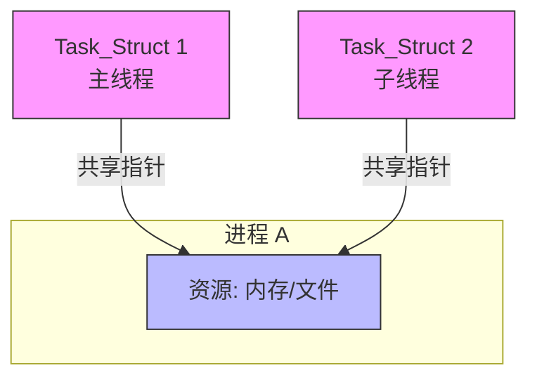

## 1. 进程的概念与特征（深度辨析）

### 核心定义

进程是进程实体的**运行过程**，是系统进行**资源分配**和**调度**的一个独立单位（_注：引入线程后，调度单位变为线程_）。

### ⚠️ 进阶考点与避坑指南

- **进程实体 (Process Image)** =[[ PCB]] (核心) + **程序段** + **数据段**。
    
    - _考点_：**PCB 是进程存在的唯一标志**。创建进程就是创建 PCB，撤销进程就是撤销 PCB。
        
- **动态性 vs 并发性**：
    
    - **动态性**：进程最基本的特征。强调“生命周期”（创建、运行、暂停、消亡）。
        
    - **并发性**：强调“时间段内同时存在”。**没有并发性，就不是现代操作系统**（只是批处理）。
        
- **程序 vs 进程**：
    
    - 程序是静态的（存在磁盘上），进程是动态的（存在内存中）。
        
    - **一对多关系**：一个程序代码（如 Chrome 浏览器）可以对应多个进程（开了多个标签页）。
        
    - **核心区别**：程序是永久的，进程是暂时的。
        

---

## 2. 进程的状态与转换（五态/七态模型）

### 📌 必考：三态转换图的深层逻辑

不要只背图，要理解**背后的事件**：

1. **运行 $\rightarrow$ 就绪**：
    
    - **原因**：时间片用完（Time Slice Expiration）或 被更高优先级进程抢占（Preemption）。
        
    - _注意_：这是**唯一**一个由进程自身“被动”让出的非阻塞行为。
        
2. **运行 $\rightarrow$ 阻塞**：
    
    - **原因**：请求资源失败（如申请打印机）、等待 I/O 完成、P操作（信号量）。
        
    - _特征_：这是进程**主动**的行为（System Call）。
        
3. **阻塞 $\rightarrow$ 就绪**：
    
    - **原因**：I/O 完成、资源得到满足、V操作。
        
    - _注意_：**阻塞永远不能直接变运行**（必须先排队！）。
        

### 🔥 进阶：挂起状态（Suspend）—— 七态模型

考研中常考“挂起”与“阻塞”的区别：

- **阻塞 (Blocked)**：进程还在**内存**中，只是在等事件。
    
- **挂起 (Suspended)**：进程被调出到了**外存（磁盘对换区）**。
    
    - **主动挂起**：用户调试需要、父进程请求。
        
    - **被动挂起**：内存不足（操作系统为了腾空间）。
        
- _易错点_：**阻塞态可以被挂起（成为阻塞挂起），就绪态也可以被挂起（成为就绪挂起）。**
    

---

## 3. 进程控制（原语操作）

### 知识点摘要

- **原语 (Primitive)**：由若干条指令组成，执行过程**不可中断**（原子性）。通过“关中断”和“开中断”指令实现。
    
- **核心原语**：
    
    - `Create`：申请 PCB $\rightarrow$ 分配资源 $\rightarrow$ 初始化 PCB $\rightarrow$ 插入就绪队列。
        
    - `Terminate`：找 PCB $\rightarrow$ 终止执行 $\rightarrow$ **归还资源给父进程或OS** $\rightarrow$ 删 PCB。
        
    - `Block`（阻塞）：**自我阻塞**（运行 $\rightarrow$ 阻塞），保护现场，改状态，插阻塞队列，**调度新进程**。
        
    - `Wakeup`（唤醒）：**合作唤醒**（阻塞 $\rightarrow$ 就绪），通常由中断处理程序或释放资源的进程调用。
        

### ⚠️ 考研陷阱

- **Block 和 Wakeup 必须成对出现**，但不在同一个进程中（你在等数据，得由发数据的人叫醒你）。
    
- **进程切换 vs 模式切换**：
    
    - **模式切换 (Mode Switch)**：用户态 $\rightleftarrows$ 核心态。**不一定**引起进程切换（比如只是系统调用）。
        
    - **进程切换 (Process Switch)**：进程 A $\rightarrow$ 进程 B。**一定**包含模式切换（因为切换工作只能在核心态做）。
        
    - _代价_：进程切换代价 > 模式切换代价（因为要刷新 TLB、Cache 等）。
        

---

## 4. 进程通信 (IPC) —— 三大方式对比

|**通信方式**|**核心机制**|**特征/限制**|**适用场景**|
|---|---|---|---|
|**共享内存** (Shared Memory)|映射同一块物理内存|**速度最快**（数据少复制一次）；需要同步互斥机制辅助。|大数据量传输|
|**消息传递** (Message Passing)|格式化消息 + 发送/接收原语|也就是 Socket / 管道的底层思想；分直接（发给进程）和间接（发给信箱）。|分布式、微内核|
|**管道通信** (Pipe)|共享文件（内存缓冲区）|**半双工**（单向流动）；**互斥**访问；**写满/读空**策略。|父子进程、简单流|

- _考点补充（管道）_：
    
    - 管道是一个**固定大小**的缓冲区（Linux 默认 4KB）。
        
    - 只要管道没满，写进程就可以写；只要没空，读进程就可以读（不需要完全写满或读空，但必须**互斥**）。
        

---

## 5. 线程 (Thread) —— 引入的本质

### 为什么要引入线程？

为了**减小并发执行的开销**（创建、撤销、切换）。

### 进程 vs 线程（背诵级对比）

1. **调度**：线程是**独立调度**的基本单位；进程是**资源分配**的基本单位。
    
2. **并发性**：进程间可并发，线程间也可并发（并发度更高）。
    
3. **拥有资源**：**线程不拥有系统资源**（只有必不可少的栈、寄存器、PC），但共享所属进程的资源（代码段、数据段、打开的文件）。
    
4. **开销**：线程切换 < 进程切换。
    
    - _注意_：同一进程内的线程切换，不需要切换内存页表（TLB不失效），速度快。不同进程的线程切换，等同于进程切换。
        

### 线程实现方式（N:M 模型）

- **用户级线程 (ULT)**：管理在用户空间（库函数）。OS 看来还是一个进程。
    
    - _缺点_：一个线程阻塞，整个进程（所有线程）阻塞。无法利用多核。
        
- **内核级线程 (KLT)**：管理在核心空间（OS支持）。
    
    - _优点_：多核并行，一个阻塞不影响其他。
        
    - _缺点_：切换代价大（需陷入内核）。
    
>在 Linux 操作系统中（采用内核级线程），如果一个线程崩溃了（比如非法访问内存），是只死这一个线程，还是整个进程都会死掉？
整个线程会死掉！因为操作系统大概率不管线程，直接操作进程
### 第一部分：核心概念 (Concept)

#### 1. 什么是线程？

线程是操作系统能够进行**运算调度的最小单位**。它被包含在进程之中，是进程中的实际运作单位。

- **比喻：**
    
    - **进程 (Process)** 就像是一个**工厂**（拥有独立的资源，如地皮、电力、原材料）。
        
    - **线程 (Thread)** 就像是工厂里的**工人**（利用工厂的资源干活）。
        
    - 一个工厂至少有一个工人（主线程），也可以有多个工人（多线程）同时协作。
        

#### 2. 进程 vs 线程 (重点笔记)

这是面试和考试中最常考的对比，建议整理成表格：

|**特性**|**进程 (Process)**|**线程 (Thread)**|
|---|---|---|
|**根本区别**|资源分配的最小单位|CPU 调度的最小单位|
|**内存空间**|独立（互不干扰）|共享所属进程的内存（堆、全局变量），但有独立的栈|
|**开销**|创建/销毁/切换开销大|开销较小（轻量级）|
|**通信方式**|IPC (管道、消息队列等)，复杂|直接读写共享变量，简单但需同步|
|**健壮性**|强（一个进程崩了不影响其他）|弱（一个线程崩了可能导致整个进程挂掉）|

---

### 第二部分：内存与底层结构

理解线程的内存模型是理解并发问题的关键。

1. **共享区域 (Shared Memory):**
    
    - **堆 (Heap):** 存放对象实例。所有线程都能访问，这是产生**线程安全问题**的根源。
        
    - **方法区 (Method Area):** 存放类信息、常量、静态变量。
        
2. **私有区域 (Thread Local):**
    
    - **程序计数器 (PC Register):** 记录当前线程执行到哪一行代码了（切换回来得知道从哪继续）。
        
    - **虚拟机栈 (VM Stack):** 存放局部变量、方法调用链。**因为栈是私有的，所以局部变量永远是线程安全的。**
        

> **笔记重点：** 线程之间“共享堆，独占栈”。

---

### 第三部分：线程的生命周期 (Lifecycle)

线程不是生来就一直跑的，它会经历不同的状态。通用的五态模型如下：

1. **新建 (New):** 创建了线程对象，但还没有调用 `start()`。
    
2. **就绪 (Runnable/Ready):** 调用了 `start()`，线程在等待队列中排队，等待 CPU 翻牌子（分配时间片）。
    
3. **运行 (Running):** CPU 开始执行该线程的代码。
    
4. **阻塞 (Blocked/Waiting):** 线程暂停运行，让出 CPU。原因可能是：
    
    - 等待 I/O (比如读文件、网络请求)。
        
    - 等待锁 (synchronized)。
        
    - 调用了 `sleep()` 或 `wait()`。
        
5. **终止 (Terminated):** 任务执行完毕或异常退出。
    

---

### 第四部分：并发的核心挑战 (Concurrency Issues)

这是线程部分最难、也是最重要的内容。多线程虽然快，但会带来三个主要问题：

#### 1. 竞态条件 (Race Condition) 与 原子性

当多个线程同时修改同一个共享变量时，结果可能不可预测。

- **经典案例：** 两个线程同时对 `i = 0` 做 `i++`。
    
    - 预期结果：2
        
    - 实际可能：1 (线程 A 读到 0，还没加完，线程 B 也读到了 0，两人都写回 1)。
        
- **解决：** 使用**锁 (Lock)** 或 **原子类 (Atomic)** 保证操作的**原子性**。
    

#### 2. 内存可见性 (Visibility)

一个线程修改了变量，另一个线程能马上看到吗？

- **问题：** 为了快，CPU 有高速缓存 (Cache)。线程 A 改了缓存里的值，还没刷回主内存，线程 B 读的还是主内存里的旧值。
    
- **解决：** 也就是 Java 中的 `volatile` 关键字的作用（强制刷新回主内存）。
    

#### 3. 死锁 (Deadlock)

两个或多个线程互相持有对方需要的资源，导致大家都卡住，谁也动不了。

- **产生的四个必要条件：**
    
    1. 互斥（资源只能被一个用）。
        
    2. 请求与保持（拿着手里的，还要申请别人的）。
        
    3. 不剥夺（不能强行抢别人的）。
        
    4. 循环等待（A等B，B等A）。
        

---

### 第五部分：并发与并行 (Concurrency vs Parallelism)

这两个词经常混用，但物理含义不同：

- **并发 (Concurrency):** 宏观上“同时”发生，微观上是**交替执行**。
    
    - _场景：_ 单核 CPU 运行多线程。CPU 像是一个飞速旋转的电风扇，一会处理线程 A，一会处理线程 B，速度太快让你觉得它们在同时动。
        
- **并行 (Parallelism):** 真正的同时执行。
    
    - _场景：_ 多核 CPU。核心 1 跑线程 A，核心 2 跑线程 B。
        

> **公式化笔记：**
> 
> - 并发 = 任务提交的逻辑结构（应对大量任务）。
>     
> - 并行 = 硬件物理执行的状态（利用多核加速）。
>     

---

### 第六部分：高级应用 - 线程池 (Thread Pool)

在实际开发中，我们几乎**从不**手动 `new Thread()`，而是使用线程池。

- **为什么要用线程池？**
    
    1. **降低资源消耗：** 重复利用已创建的线程，避免频繁创建/销毁线程带来的开销。
        
    2. **提高响应速度：** 任务来了直接用现成线程，不用等创建。
        
    3. **便于管理：** 防止无限创建线程把内存撑爆 (OOM)。
        
- **线程池的工作流程 (笔记核心):**
    
    1. 来了任务，核心线程 (Core Threads) 先接客。
        
    2. 核心线程满了，任务放进**等待队列 (Queue)**。
        
    3. 队列也满了，创建临时线程 (Max Threads) 帮忙。
        
    4. 全都满了，执行**拒绝策略 (Reject Policy)**（比如抛异常或丢弃）。
### 线程的实现
#### 一、 用户级线程 (User-Level Threads, ULT)

**模型代码：$N:1$ （多对一模型）**

在这个模型中，线程的创建、销毁、调度和同步完全由**用户空间的线程库**（Runtime Library）来完成。**操作系统内核完全不知道线程的存在**，内核只认为该进程是一个单线程进程。

##### 1. 工作原理

- **管理位置：** 线程控制块 (TCB) 在用户空间的库中维护。
    
- **调度：** 进程内部自己决定哪个线程跑，就像在应用程序里写了一个循环调度器。
    
- **内核视角：** 内核只看到了一个进程 (Process)，分配给该进程一个 CPU 时间片。
    

##### 2. 优点

- **极快：** 线程切换不需要切入内核态（System Call），只涉及简单的用户态寄存器保存，开销极小。
    
- **灵活：** 可以在不支持多线程的操作系统上实现多线程；调度算法可以由程序自己定制（比如针对数据库专门优化的调度）。
    

##### 3. 缺点 (致命伤)

- **阻塞问题：** 因为内核不知道有多个线程，如果其中**任何一个线程**执行了阻塞系统调用（如读文件），内核会认为整个进程阻塞了，导致**所有线程都停工**。
    
- **无法利用多核：** 内核只给该进程分配一个 CPU 核心，所以无论你开了多少个用户线程，它们只能在一个核上并发（交替）执行，无法并行。
    

> **典型历史案例：** Java 早期的 "Green Threads"。

---

#### 二、 内核级线程 (Kernel-Level Threads, KLT)

**模型代码：$1:1$ （一对一模型）**

这是现代主流通用操作系统（如 Linux, Windows）默认的实现方式。线程的管理全权交给操作系统内核。

##### 1. 工作原理

- **管理位置：** 线程控制块 (TCB) 在内核空间。
    
- **调度：** 内核负责调度。内核把每一个线程都视为一个独立的调度单元。
    
- **映射：** 应用程序每 `new` 一个线程，内核里就对应创建一个内核线程。
    

##### 2. 优点

- **发挥多核优势：** 内核可以把同一个进程的不同线程分配给不同的 CPU 核心，实现真正的**并行计算**。
    
- **非阻塞：** 如果一个线程阻塞了（比如请求 I/O），内核会切换到该进程的其他线程继续执行，不会导致整个进程卡死。
    

##### 3. 缺点

- **开销大：** 每次线程切换都需要从**用户态 (User Mode)** 切换到 **内核态 (Kernel Mode)**，这需要保存更多的上下文信息，通过系统调用完成，速度比 ULT 慢得多。
    
- **资源限制：** 内核内存资源有限，不能无限创建线程（通常几千个就是极限了，再多机器就卡死了）。
    

> **典型案例：** 现代 Linux (NPTL 库), Windows, 现代 Java (HotSpot JVM)。

---

#### 三、 混合实现 / 轻量级进程 (LWP)

**模型代码：$M:N$ （多对多模型）**

为了结合上述两者的优点（用户级线程的快 + 内核级线程的并行），诞生了混合模型。这通常需要操作系统提供一种中间结构，称为 **轻量级进程 (Light Weight Process, LWP)**。

##### 1. 工作原理

- **分层结构：**
    
    - **最上层：** 有 $M$ 个用户线程。
        
    - **中间层：** 有 $N$ 个 LWP（通常 $N < M$）。LWP 是用户线程和内核线程沟通的桥梁。
        
    - **底层：** LWP 对应内核线程。
        
- **调度：**
    
    - 用户库负责把 $M$ 个用户线程调度到 $N$ 个 LWP 上（多路复用）。
        
    - 内核负责把 LWP 调度到 CPU 上。
        

##### 2. 优点

- 既能利用多核（因为有多个 LWP 对应多个内核线程）。
    
- 又能创建海量线程（因为用户线程在用户态，不占内核资源）。
    
- 上下文切换可以在用户态完成（只要不跨 LWP）。
    

##### 3. 缺点

- **实现极其复杂：** 需要用户调度器和内核调度器协同工作，很难写对。
    

> **典型案例：** **Go 语言的 Goroutine** (Go 运行时充当了 LWP 的调度角色)，以及 **Java 21 推出的 Virtual Threads**。

---

#### 四、 总结对比 (笔记表格)

|**特性**|**用户级线程 (ULT)**|**内核级线程 (KLT)**|**混合实现 (M:N)**|
|---|---|---|---|
|**可见性**|内核看不见|内核看得见|内核只看得到 LWP|
|**并发能力**|只能在一个核上并发|可在多核上并行|可在多核上并行|
|**阻塞影响**|一人阻塞，全家挂起|独立阻塞，互不影响|取决于 LWP 的处理|
|**切换开销**|小 (用户态操作)|大 (需要系统调用)|适中|
|**典型代表**|Python (受 GIL 限制类似 ULT), 早期 Java|Linux Pthreads, Windows, Java Platform Threads|**Go Goroutine**, **Java Virtual Threads**|

---

#### 💡 笔记小贴士：从代码角度看“线程实现”

你在面试或工作中，经常会听到 **“协程 (Coroutine)”** 或 **“虚拟线程 (Virtual Thread)”**。

其实，这本质上就是**在应用层（用户态）重新实现了 $M:N$ 模型**。

- **传统的 Java 线程 (`new Thread()`)：** 是 $1:1$ 模型。你创建一个 Thread，Linux 内核就得给你分配一个真实的 task_struct。所以你开 10 万个线程，机器就崩了。
    
- **Go 的 Goroutine / Java 的 Virtual Thread：** 是 $M:N$ 模型。你开 10 万个虚拟线程，底层可能只需要 10 个内核线程在干活。那些暂时没事干的虚拟线程，就乖乖待在内存里（用户态），不占用昂贵的内核资源。
    

这是目前高并发编程的**终极解决方案**。

---
tags:
  - 💻/OS/Threading
  - ⚙️/Backend/Architecture
  - 🧠/DeepDive
status: 🌲 Evergreen

---

# 🧵 线程实现的深层机制：从内核到用户态

> [!SUMMARY] 核心摘要
> 本文深入解析三种线程实现范式：
> 1.  **Linux**：以**进程**为底色的 $1:1$ 模型（诚实）。
> 2.  **Go (GMP)**：榨干 CPU 的 $M:N$ 模型（精明）。
> 3.  **Java (Loom)**：挂载与卸载的 **虚拟线程** 机制（灵活）。

---

## 1. Linux 内核：一切皆 Task ($1:1$)

> [!QUOTE] Linux 的哲学
> 在 Linux 内核眼里，**根本没有线程**，只有共享了资源的**进程**。

### 1.1 核心机制：`clone()`
Linux 不区分进程和线程，它们在内核层都由 ==`task_struct`== 结构体表示。

* **普通进程 (`fork`)**：复制父进程资源（Copy-on-Write）。
* **线程 (`clone`)**：不复制，直接**指向**父进程的资源（内存地址空间 `mm_struct`、文件描述符等）。

>[!FAILURE] 局限性 因为是 $1:1$ 映射，创建 10 万个线程 = 创建 10 万个内核对象。**调度开销大，内存占用高**。

    
[[进阶知识1]]
[[管程]]
## 进程通信
[[进程通信]]：包括共享存储器、管道、消息传递系统、套接字、远程过程调用、远程方法调用
> [!NOTE] 🧮 408 操作系统：进程通信 (IPC) 核心笔记
> **背景**：进程地址空间独立，需通过内核机制交换数据。
> 

### 1. 共享存储 (Shared Memory) ⭐最快
- **原理**：映射同一块物理内存到不同进程的虚拟空间。
- **特点**：
    - 数据**不**在内核与用户空间通过 `copy` 传输（零拷贝）。
    - **速度最快**。
    - **注意**：OS 不负责同步互斥，需用户通过 PV 操作解决。

### 2. 消息传递 (Message Passing)
- **原理**：以“消息”为单位，通过 `Send`/`Receive` 原语交互。
- **方式**：
    - **直接通信**：指定目标 PID，挂入接收进程的消息队列。
    - **间接通信**：通过“信箱 (Mailbox)”，解耦发送与接收。
- **场景**：微内核、分布式系统。

### 3. 管道通信 (Pipe) ⭐考点最多
- **本质**：内存中的固定大小缓冲区（文件形式）。
- **限制**：
    - **半双工**：同一时刻单向流动（双向需 2 个管道）。
    - **互斥**：读写互斥。
    - **同步**：
        - 缓冲区**满** $\rightarrow$ 写进程阻塞。
        - 缓冲区**空** $\rightarrow$ 读进程阻塞。
- **分类**：
    - **匿名管道**：仅限**亲缘关系**进程（父子/兄弟）。
    - **命名管道**：可用于**任意**进程。
> [!NOTE] 🌐 分布式通信：RPC 与 RMI
> 适用于网络环境下的进程通信，是对“消息传递”的高级封装。

### 1. RPC (远程过程调用)
- **定义**：调用远程主机上的过程就像调用本地过程一样。
- **关键技术**：
    - **Stub (存根)**：
        - **Client Stub**：参数打包 (Marshalling) $\rightarrow$ 发送网络消息。
        - **Server Stub**：接收消息 $\rightarrow$ 参数解包 $\rightarrow$ 调用本地函数。
    - **透明性**：屏蔽了网络传输、硬件差异、数据表示细节。
- **场景**：C/S 架构，微服务 (如 gRPC)。

### 2. RMI (远程方法调用)
- **定义**：**面向对象**版本的 RPC (如 Java RMI)。
- **特点**：
    - 调用的是**远程对象**的方法。
    - 支持传递**对象**或**对象引用**。
    - 依赖对象序列化机制。

### 3. 核心对比
| 维度 | RPC | RMI |
| :--- | :--- | :--- |
| **范式** | 面向过程 (C) | 面向对象 (Java) |
| **单位** | 函数 (Function) | 对象方法 (Method) |
| **通用性** | 跨语言支持较好 | 语言依赖性强 |
