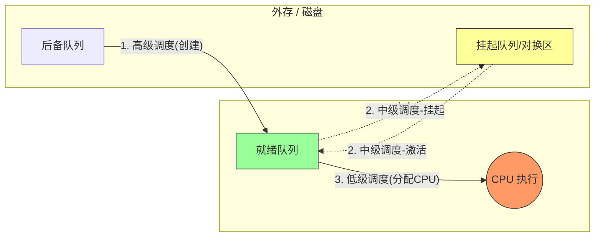
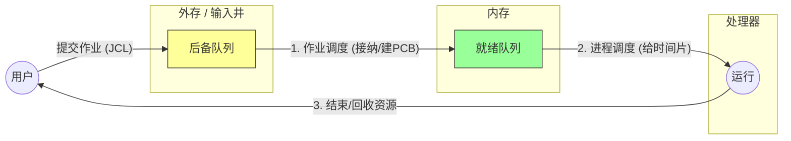

### 第一部分：处理机调度的三个层次
> [!SUMMARY] 核心摘要 
> 调度就是解决 **"供不应求"** 的问题（CPU 少，进程多）。 
> 操作系统通过三层过滤机制，确保 CPU 处理最重要的任务。 
>  1. **高级调度**：决定谁能**进门**（Disk $\to$ RAM）。 
>  2. **中级调度**：决定谁该**暂离**（RAM $\leftrightarrow$ Disk）。 
>  3. **低级调度**：决定谁能**干活**（Ready $\to$ CPU）。

你可以把操作系统看作一个**火爆的银行**，CPU 是唯一的**柜员**，而进程是**等待办理业务的客户**。

#### 1. 高级调度 (High-Level Scheduling) / 作业调度

- **别名：** 作业调度 (Job Scheduling)。
    
- **发生场所：** 外存（磁盘） $\to$ 内存。
    
- **频率：** 最低（几分钟或几小时一次）。
    
- **任务：** 银行门口排了长队（在外存里的后备队列）。高级调度就是**保安**，决定放哪几个客户进大厅（内存），并给他们发号牌（建立 PCB）。
    
- **关键点：** 它的主要目的是**接纳**。一旦被接纳，作业就变成了进程。
    
- **408 考点：** 在多道批处理系统中才有，分时/实时系统通常没有这个环节（因为是即时响应）。
    

#### 2. 中级调度 (Intermediate-Level Scheduling) / 内存调度

- **别名：** 内存调度 (Memory Scheduling)。
    
- **发生场所：** 内存 $\leftrightarrow$ 外存（对换区）。
    
- **频率：** 中等。
    
- **任务：** 大厅（内存）里人太多挤不下了，或者有人虽然拿了号但暂时办不了业务（阻塞）。中级调度就是**大堂经理**，把这些人请到休息区（外存对换区）去等待，这叫**挂起 (Suspend)**。等大厅空了，再把他们接回来，这叫**激活 (Activate)**。
    
- **关键点：** 它的目的是**提高内存利用率**和**系统吞吐量**。
    
- **状态变化：** 挂起态 (Suspend) $\leftrightarrow$ 就绪/阻塞态。
    

#### 3. 低级调度 (Low-Level Scheduling) / 进程调度

- **别名：** 进程调度 (Process Scheduling)。
    
- **发生场所：** 内存（就绪队列） $\to$ CPU。
    
- **频率：** 最高（毫秒级，几十 ms 一次）。
    
- **任务：** 柜员（CPU）办完一个人的业务了，按一下“下一位”。**进程调度器**决定叫哪个号（从就绪队列中选一个进程给 CPU）。
    
- **关键点：** 这是操作系统**最核心**的调度，不可或缺。
    
|**维度**|**高级调度 (作业调度)**|**中级调度 (内存调度)**|**低级调度 (进程调度)**|
|---|---|---|---|
|**发生频率**|**最低** (分/小时)|中等|**最高** (毫秒级)|
|**核心动作**|建立 PCB，分配内存|挂起/激活 (Swapping)|分配 CPU|
|**物理路径**|外存 $\to$ 内存|内存 $\leftrightarrow$ 外存|内存 $\to$ CPU|
|**存在性**|多道批处理系统|引入虚拟存储技术的系统|**所有系统必备**|

---

### 第二部分：调度的基本指标 (408 计算题核心)

在决定“谁先用 CPU”之前，我们需要一套评价标准。

1. **CPU 利用率：** CPU 忙碌的时间 / 总时间。
    
2. **系统吞吐量：** 单位时间内完成的作业数量。
    
3. **周转时间 (Turnaround Time, $T$):** 作业从提交到完成所用的时间。
    
    - 公式：
        
        $$T = t_{完成} - t_{提交}$$
        
4. **带权周转时间 (Weighted Turnaround Time, $W$):** (反映作业“排队”的冤枉程度)。
    
    - 公式：
        
        $$W = \frac{T}{t_{运行}}$$
        
    - _注意：_ $W$ 必然 $\ge 1$。越接近 1，说明排队时间越短，体验越好。
        
1. **响应时间：** 从用户提交请求到系统首次产生响应的时间（交互式系统看重这个）。
### 2. 调度方式 (什么时候触发低级调度?)

> [!QUESTION] 只有当进程执行完毕时才切换吗？
> 
> 不一定。这取决于操作系统采用的是剥夺式还是非剥夺式。

1. **非剥夺调度 (Non-preemptive)**:
    
    - **机制**：一旦把 CPU 给了某个进程，就一直让他跑，直到他**自愿**放弃（运行结束或请求 I/O）。
        
    - **特点**：实现简单，开销小，但**不适合分时/实时系统**（因为如果一个进程死循环，大家全完了）。
        
2. **剥夺调度 (Preemptive)**:
    
    - **机制**：系统可以根据规则（如时间片用完、有更高优先级进程插队），**强行**把 CPU 抢回来。
        
    - **特点**：开销大（频繁上下文切换），但公平，响应快。
        

---

## 3. 评价指标 (计算题公式)

> [!TIP] 做题技巧
> 
> 计算 "平均带权周转时间" 时，先算出每个作业的 $T$ 和 $W$，最后再取平均值。

- **周转时间 ($T$)** = $t_{完成} - t_{提交}$
    
    - _含义_：用户等待的总时长（包括等待时间 + 运行时间）。
        
- **带权周转时间 ($W$)** = $\frac{T}{t_{运行}}$
    
    - _含义_：$W$ 越小越好。$W=1$ 表示完全没排队；$W=10$ 表示运行 1 分钟，排队 9 分钟。
# 作业与作业调度
## 作业

> [!SUMMARY] 核心定义
> **作业**是用户提交给系统的**任务实体**（程序+数据+说明书）。
> **作业调度**是操作系统的**门卫**，负责决定让哪个作业从**外存**进入**内存**。

### 1. 作业的内部结构

一个完整的作业 ($Job$) 由三部分组成，缺一不可：

1.  **程序 (Program)**: 既然是干活，得有代码。
2.  **数据 (Data)**: 原材料。
3.  **作业说明书 (JCL)**: ==给 OS 看的配置单==。
    * *包含信息*：预估运行时间、内存需求、优先级、外设需求。

> [!NOTE] 核心概念：JCB
> 系统为了管理作业，会为每个作业生成一个 **JCB (作业控制块)**。
> JCB 是作业存在的唯一标志，类似于进程的 PCB。

>[!notice] 作业从第一次进入就绪状态开始直到运行结束前，在此期间都处于运行状态。
### 作业调度主要任务
作业调度（高级调度）的主要工作场所在**外存（输入井/后备队列）与内存**之间。它的核心任务可以概括为四个字：**接纳、配置**。

#### 1. 接纳 (Admission)

这是最核心的一步。

- **背景：** 外存里排队的作业可能有几百个（后备队列），但内存有限，只能放进去几个。
    
- **任务：** 根据某种**调度算法**（如先来先服务、短作业优先），从后备队列中挑选出一个或多个作业。
    

#### 2. 资源分配 (Resource Allocation)

选进来不是为了看，是为了跑。

- **任务：** 操作系统查看“作业说明书 (JCL)”，为该作业分配必要的**静态资源**。
    
- **包括：** 内存空间、外设（如打印机、磁带机）。
    
- _注意：_ 这里不分配 CPU，CPU 是进程调度的事。
    

#### 3. 建立进程 (Process Creation)

作业进入内存后，必须变成“活”的实体。

- **任务：** 调度器为这个作业建立**根进程**，也就是创建 **PCB (进程控制块)**。
    
- **结果：** 此时，作业就转变成了进程，进入了**就绪队列**，开始由“低级调度”接管，等待抢 CPU。
---

## 2. 作业调度 vs 进程调度

| 维度 | 作业调度 (高级) | 进程调度 (低级) |
| :--- | :--- | :--- |
| **发生场所** | 外存 $\to$ 内存 | 内存 $\to$ CPU |
| **操作对象** | 作业 (Job) | 进程 (Process) |
| **主要职能** | 分配内存、外设，**建立 PCB** | 分配 CPU 时间片 |
| **执行频率** | 低 (几分钟一次) | 极高 (毫秒级) |
| **比喻** | 考场保安 (决定谁能进考场) | 监考老师 (决定谁现在能答题) |

---

## 3. 作业调度的全生命周期

这是作业流转的完整物理过程：

>[!QUESTION] 既然有了进程，为什么还需要作业？
>- **历史原因**：在早期的批处理系统中，内存极小，必须严格控制进入内存的任务数量，所以需要“作业调度”这一层缓冲。
>- **现代视角**：在 Windows/Linux 个人电脑中，你双击一个图标，程序立刻运行。这里**作业调度和进程调度几乎合二为一了**，或者说作业调度的步骤被弱化为“加载程序”这一瞬间。
>- **考试视角**：**408 必须区分**。只要提到“后备队列”、“外存到内存”，指的一定是作业调度。

