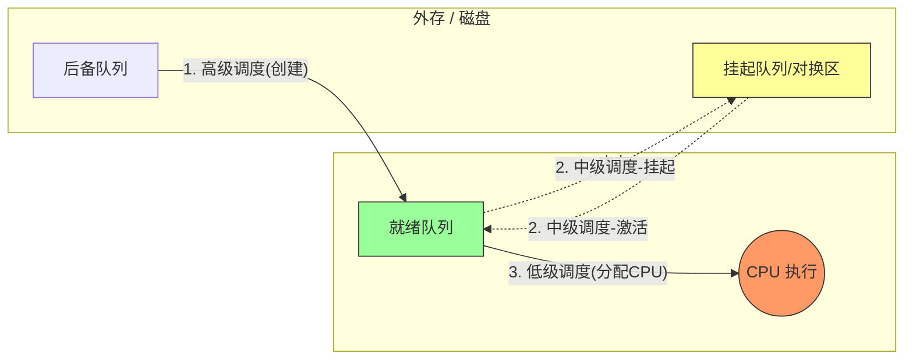
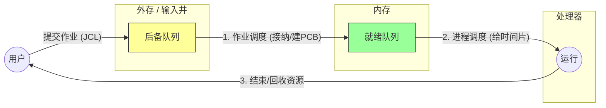
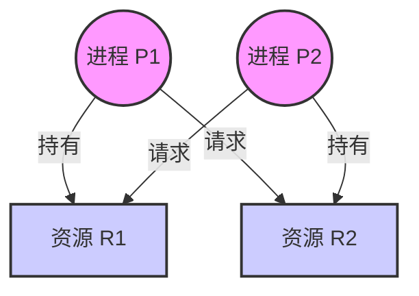

# cpu调度
### 第一部分：处理机调度的三个层次
> [!SUMMARY] 核心摘要 
> 调度就是解决 **"供不应求"** 的问题（CPU 少，进程多）。 
> 操作系统通过三层过滤机制，确保 CPU 处理最重要的任务。 
>  1. **高级调度**：决定谁能**进门**（Disk $\to$ RAM）。 
>  2. **中级调度**：决定谁该**暂离**（RAM $\leftrightarrow$ Disk）。 
>  3. **低级调度**：决定谁能**干活**（Ready $\to$ CPU）。

你可以把操作系统看作一个**火爆的银行**，CPU 是唯一的**柜员**，而进程是**等待办理业务的客户**。

#### 1. 高级调度 (High-Level Scheduling) / 作业调度

- **别名：** 作业调度 (Job Scheduling)。
    
- **发生场所：** 外存（磁盘） $\to$ 内存。
    
- **频率：** 最低（几分钟或几小时一次）。
    
- **任务：** 银行门口排了长队（在外存里的后备队列）。高级调度就是**保安**，决定放哪几个客户进大厅（内存），并给他们发号牌（建立 PCB）。
    
- **关键点：** 它的主要目的是**接纳**。一旦被接纳，作业就变成了进程。
    
- **408 考点：** 在多道批处理系统中才有，分时/实时系统通常没有这个环节（因为是即时响应）。
    

#### 2. 中级调度 (Intermediate-Level Scheduling) / 内存调度

- **别名：** 内存调度 (Memory Scheduling)。
    
- **发生场所：** 内存 $\leftrightarrow$ 外存（对换区）。
    
- **频率：** 中等。
    
- **任务：** 大厅（内存）里人太多挤不下了，或者有人虽然拿了号但暂时办不了业务（阻塞）。中级调度就是**大堂经理**，把这些人请到休息区（外存对换区）去等待，这叫**挂起 (Suspend)**。等大厅空了，再把他们接回来，这叫**激活 (Activate)**。
    
- **关键点：** 它的目的是**提高内存利用率**和**系统吞吐量**。
    
- **状态变化：** 挂起态 (Suspend) $\leftrightarrow$ 就绪/阻塞态。
    

#### 3. 低级调度 (Low-Level Scheduling) / 进程调度

- **别名：** 进程调度 (Process Scheduling)。
    
- **发生场所：** 内存（就绪队列） $\to$ CPU。
    
- **频率：** 最高（毫秒级，几十 ms 一次）。
    
- **任务：** 柜员（CPU）办完一个人的业务了，按一下“下一位”。**进程调度器**决定叫哪个号（从就绪队列中选一个进程给 CPU）。
    
- **关键点：** 这是操作系统**最核心**的调度，不可或缺。
    
|**维度**|**高级调度 (作业调度)**|**中级调度 (内存调度)**|**低级调度 (进程调度)**|
|---|---|---|---|
|**发生频率**|**最低** (分/小时)|中等|**最高** (毫秒级)|
|**核心动作**|建立 PCB，分配内存|挂起/激活 (Swapping)|分配 CPU|
|**物理路径**|外存 $\to$ 内存|内存 $\leftrightarrow$ 外存|内存 $\to$ CPU|
|**存在性**|多道批处理系统|引入虚拟存储技术的系统|**所有系统必备**|

---

### 第二部分：调度的基本指标 (408 计算题核心)

在决定“谁先用 CPU”之前，我们需要一套评价标准。

1. **CPU 利用率：** CPU 忙碌的时间 / 总时间。
    
2. **系统吞吐量：** 单位时间内完成的作业数量。
    
3. **周转时间 (Turnaround Time, $T$):** 作业从提交到完成所用的时间。
    
    - 公式：
        
        $$T = t_{完成} - t_{提交}$$
        
4. **带权周转时间 (Weighted Turnaround Time, $W$):** (反映作业“排队”的冤枉程度)。
    
    - 公式：
        
        $$W = \frac{T}{t_{运行}}$$
        
    - _注意：_ $W$ 必然 $\ge 1$。越接近 1，说明排队时间越短，体验越好。
        
1. **响应时间：** 从用户提交请求到系统首次产生响应的时间（交互式系统看重这个）。
### 2. 调度方式 (什么时候触发低级调度?)

> [!QUESTION] 只有当进程执行完毕时才切换吗？
> 
> 不一定。这取决于操作系统采用的是剥夺式还是非剥夺式。

1. **非剥夺调度 (Non-preemptive)**:
    
    - **机制**：一旦把 CPU 给了某个进程，就一直让他跑，直到他**自愿**放弃（运行结束或请求 I/O）。
        
    - **特点**：实现简单，开销小，但**不适合分时/实时系统**（因为如果一个进程死循环，大家全完了）。
        
2. **剥夺调度 (Preemptive)**:
    
    - **机制**：系统可以根据规则（如时间片用完、有更高优先级进程插队），**强行**把 CPU 抢回来。
        
    - **特点**：开销大（频繁上下文切换），但公平，响应快。
        

---

### 3. 评价指标 (计算题公式)

> [!TIP] 做题技巧
> 
> 计算 "平均带权周转时间" 时，先算出每个作业的 $T$ 和 $W$，最后再取平均值。

- **周转时间 ($T$)** = $t_{完成} - t_{提交}$
    
    - _含义_：用户等待的总时长（包括等待时间 + 运行时间）。
        
- **带权周转时间 ($W$)** = $\frac{T}{t_{运行}}$
    
    - _含义_：$W$ 越小越好。$W=1$ 表示完全没排队；$W=10$ 表示运行 1 分钟，排队 9 分钟。
# 作业与作业调度
## 作业

> [!SUMMARY] 核心定义
> **作业**是用户提交给系统的**任务实体**（程序+数据+说明书）。
> **作业调度**是操作系统的**门卫**，负责决定让哪个作业从**外存**进入**内存**。

### 1. 作业的内部结构

一个完整的作业 ($Job$) 由三部分组成，缺一不可：

1.  **程序 (Program)**: 既然是干活，得有代码。
2.  **数据 (Data)**: 原材料。
3.  **作业说明书 (JCL)**: ==给 OS 看的配置单==。
    * *包含信息*：预估运行时间、内存需求、优先级、外设需求。

> [!NOTE] 核心概念：JCB
> 系统为了管理作业，会为每个作业生成一个 **JCB (作业控制块)**。
> JCB 是作业存在的唯一标志，类似于进程的 PCB。

>[!notice] 作业从第一次进入就绪状态开始直到运行结束前，在此期间都处于运行状态。
### 作业调度主要任务
作业调度（高级调度）的主要工作场所在**外存（输入井/后备队列）与内存**之间。它的核心任务可以概括为四个字：**接纳、配置**。

#### 1. 接纳 (Admission)

这是最核心的一步。

- **背景：** 外存里排队的作业可能有几百个（后备队列），但内存有限，只能放进去几个。
    
- **任务：** 根据某种**调度算法**（如先来先服务、短作业优先），从后备队列中挑选出一个或多个作业。
    

#### 2. 资源分配 (Resource Allocation)

选进来不是为了看，是为了跑。

- **任务：** 操作系统查看“作业说明书 (JCL)”，为该作业分配必要的**静态资源**。
    
- **包括：** 内存空间、外设（如打印机、磁带机）。
    
- _注意：_ 这里不分配 CPU，CPU 是进程调度的事。
    

#### 3. 建立进程 (Process Creation)

作业进入内存后，必须变成“活”的实体。

- **任务：** 调度器为这个作业建立**根进程**，也就是创建 **PCB (进程控制块)**。
    
- **结果：** 此时，作业就转变成了进程，进入了**就绪队列**，开始由“低级调度”接管，等待抢 CPU。
---

## 2. 作业调度 vs 进程调度

| 维度 | 作业调度 (高级) | 进程调度 (低级) |
| :--- | :--- | :--- |
| **发生场所** | 外存 $\to$ 内存 | 内存 $\to$ CPU |
| **操作对象** | 作业 (Job) | 进程 (Process) |
| **主要职能** | 分配内存、外设，**建立 PCB** | 分配 CPU 时间片 |
| **执行频率** | 低 (几分钟一次) | 极高 (毫秒级) |
| **比喻** | 考场保安 (决定谁能进考场) | 监考老师 (决定谁现在能答题) |

---

## 3. 作业调度的全生命周期

这是作业流转的完整物理过程：

>[!QUESTION] 既然有了进程，为什么还需要作业？
>- **历史原因**：在早期的批处理系统中，内存极小，必须严格控制进入内存的任务数量，所以需要“作业调度”这一层缓冲。
>- **现代视角**：在 Windows/Linux 个人电脑中，你双击一个图标，程序立刻运行。这里**作业调度和进程调度几乎合二为一了**，或者说作业调度的步骤被弱化为“加载程序”这一瞬间。
>- **考试视角**：**408 必须区分**。只要提到“后备队列”、“外存到内存”，指的一定是作业调度。

## [[实时调度]]
基本条件：
提供有关信息：就绪时间、开始截止时间和完成截止时间、处理时间、资源要求、优先级
# [[死锁]]

## 1. 基本概念

**定义**：多个进程因竞争资源而造成的一种**互相等待**的僵局，若无外力作用，这些进程都将无法向前推进。

> [!NOTE] **死锁 vs 饥饿 vs 死循环**
> 
> - **死锁 (Deadlock)**：往往涉及**两个或以上**进程，互相等待对方手里的资源。状态是**阻塞 (Blocked)**。
>     
> - **饥饿 (Starvation)**：可能只有一个进程。因为长期得不到资源（如优先级太低）而无法执行。状态是**就绪 (Ready)** 或阻塞。
>     
> - **死循环**：通常是代码逻辑错误。进程可能一直在**运行 (Running)**，只是在做无用功。
>     

---

## 2. 死锁产生的四个必要条件

**必须同时满足**，缺一不可。如果不满足其中任何一个，死锁就不会发生。

1. **互斥条件 (Mutual Exclusion)**：
    
    - 资源是独占的，同一时间只能被一个进程使用。
        
2. **不剥夺条件 (No Preemption)**：
    
    - 进程获得的资源在未使用完之前，不能被其他进程强行夺走，只能主动释放。
        
3. **请求和保持条件 (Hold and Wait)**：
    
    - 进程已经**保持**了至少一个资源，但又提出了新的资源**请求**，而该资源被其他进程占有。
        
    - _即：吃着碗里的，看着锅里的。_
        
4. **循环等待条件 (Circular Wait)**：
    
    - 存在一种进程资源的循环等待链：$P_1$ 等 $P_2$，...，$P_n$ 等 $P_1$。
        
    - _注意：有循环等待不一定死锁（同类资源数>1时），但死锁一定有循环等待。_
        

### **Mermaid 示意图 (循环等待)**

---

## 3. 死锁的处理策略 (考研重点)

按照处理的严格程度，分为三种策略：

|**策略**|**核心思想**|**时机**|**特点**|
|---|---|---|---|
|**预防死锁** (Prevention)|**破坏四个必要条件**之一|死锁发生前|限制条件严格，系统效率低，资源利用率低。|
|**避免死锁** (Avoidance)|防止系统进入**不安全状态**|资源分配时|**银行家算法**。不限制用户申请，但在分配前预判。效率较好。|
|**检测与解除** (Detection)|允许死锁发生，事后补救|死锁发生后|需要系统维护资源分配图。通过**剥夺资源**或**撤销进程**来解决。|

### **(1) 预防死锁的具体方法**

- **破坏互斥条件**：使用 SPOOLing 技术（将独占设备虚拟化为共享设备）。_（极少用）_
    
- **破坏不剥夺条件**：当申请新资源得不到满足时，必须释放已占有的所有资源。_（实现复杂，代价大）_
    
- **破坏请求和保持条件**：采用**静态分配**，运行前一次性申请所有资源。_（资源浪费严重）_
    
- **破坏循环等待条件**：采用**顺序资源分配法**，给资源编号，必须按编号从小到大申请。_（限制编程灵活性）_
    

---

## 4. 银行家算法 (Banker's Algorithm)

**这是死锁避免的核心，大题必考。**

> [!TIP] 核心逻辑
> 
> 系统在分配资源前，先计算此次分配是否会导致系统进入不安全状态。如果会，就暂时不分配；如果安全，才分配。

### **关键概念**

- **安全序列 (Safe Sequence)**：指如果系统按照这种顺序为进程分配资源，每个进程都能顺利完成。
    
    - _只要能找到**一个**安全序列，系统就是安全的。_
        
    - _如果**找不到任何**安全序列，系统就是不安全的（可能死锁）。_
        

### **算法步骤 (做题口诀)**

1. **检查合法性**：请求量 $\le$ 需求量 (`Need`) 且 请求量 $\le$ 系统剩余量 (`Available`)。
    
2. **试探分配**：假设把资源分给它，修改系统数据。
    
3. **安全性检查 (核心)**：
    
    - 在剩下的进程中，找一个 `Need` $\le$ `Available` 的进程。
        
    - 假设让它跑完，**回收**它占用的所有资源（`Available` 变大）。
        
    - 重复上述步骤。
        
    - 如果所有进程都能跑完，则本次分配成功；否则，回滚，拒绝分配。
        

---

## 5. 死锁检测 (Resource Allocation Graph)

如果不采用预防和避免，系统需要定期检测死锁。

- **资源分配图**：
    
    - 圆圈代表进程，方框代表资源。
        
    - 边：进程 $\to$ 资源（请求边）；资源 $\to$ 进程（分配边）。
        
- **死锁定理 (简化法)**：
    
    - 在图中找到一个**既不阻塞又非孤立**的进程（能满足其请求的进程）。
        
    - **消去**该进程的所有边（相当于它跑完归还资源）。
        
    - 重复。如果最后图中**所有边都能被消去**，则无死锁。
        
    - 如果最后**还有边消除不掉**，则发生了死锁，剩下的进程就是死锁进程。
        

---

### **💡 备考小贴士**

1. **选择题**：经常给你几个场景，问你破坏了哪个条件？或者问死锁、饥饿的区别。
    
2. **大题**：90% 的概率是考**银行家算法**的手动计算表格。
    
    - _注意_：题目给出的通常是 `Max` (最大需求) 和 `Allocation` (已分配)，你需要自己算出 `Need = Max - Allocation`。这是最容易手滑算错的地方！

# 与系统调用辨析

**系统调用是“向上”给应用程序提供的服务接口，而CPU调度是“向上”对硬件资源的分配决策。**

---

### 1.系统调用（System Call）

系统调用是进程与内核之间的“桥梁”。由于用户程序运行在**用户态**（既定模式），不能直接操作硬件（如读写磁盘、分配内存），它必须通过系统调用来请求**核心态**的服务。

- **发起者**：用户进程。
    
- **触发方式**：执行特殊的指令（如`int 0x80`、`syscall`或中的“访管指令”）。
    
- **主要功能**：
    
    - **文件管理**：`open`, `read`, `write`。
        
    - **进程控制**：`fork`, `exit`, `wait`。
        
    - **设备管理**：`ioctl`, `read`。
        
- **核心特征**：发生了**模式切换**（用户模式->内核模式），会产生“一次中断”或“陷阱（Trap）”。
    

---

### 2.CPU调度（CPU Scheduling）

CPU调度是操作系统的“管家”占用权，决定在多个休眠进程中，哪一个进程应该获得CPU的执行权。

- **执行者**：操作系统的**调度程序 (Scheduler)** 。
    
- **触发条件**：
    
    - **主动触发**：运行中的进程执行了系统调用而进入阻塞状态（如等待I/O）。
        
    - **被动触发**：时间片用完（时钟中断）、有更高优先级的进程到达。
        
- **主要算法**：先来先服务 (FCFS)、短作业优先 (SJF)、时间片轮转 (RR)、多级反馈队列 (MLFQ) 等。
    
- **核心特征**：涉及到**上下文切换（Context Switch）**，即保存当前进程的PCB信息，恢复下一个进程的PCB信息。
    

---

### 3. 核心区别对比

|**维度**|**系统调用（系统调用）**|**CPU调度（CPU Scheduling）**|
|---|---|---|
|**本质属性**|**接口/服务**（OS对外的功能）|**管理/决策**（OS内部的资源分配）|
|**主体关系**|进程 → 内核（请求服务）|内核→进程（分配CPU）|
|**可见性**|程序员可视（通过API调用）|程序员不可见（由内核自动完成）|
|**触发指令**|访管指令（Trap/Software Interrupt）|中断指令（如时钟中断）或阻塞事件|
|**目的**|获得内核权限 执行特权操作|提高CPU利用率、保证公平/响应速度|

---

### 4.他们之间的联系（408高考点）

虽然它们定义不同，但**系统调用往往是触发CPU调度的诱因**：

1. **导致阻塞**：当进程执行一个系统调用（如`read`磁盘文件）时，由于磁盘速度慢，进程会进入**阻塞状态**。此时，内核必须调用**调度程序**，选出另一个可用进程来运行，从而获得CPU闲置。
    
2. **退出**：进程执行`exit`系统调用终止时，CPU 变为空闲，同时进程触发一次 CPU 调度。
    
3. **切换模式 vs 上下文切换**：
    
    - 系统调用一定会导致**模式切换完成**（从用户态变到内核态），但不一定会导致**上下文切换**（可能处理后还回到当前进程继续运行）。
        
    - CPU调度一定会导致**上下文切换**（从进程A换到进程B）。

## 调度程序
### 1. 调度的三个层次（框架图）

在 408 考研大纲中，你必须首先分清调度的三个级别，因为它们发生的频率和位置完全不同：

1. **高级调度（作业调度）**：
    
    - **发生地**：外存（磁盘）→ 内存。
        
    - **职责**：从后备队列中挑选作业，为其创建进程。
        
    - **频率**：最低。
        
2. **中级调度（内存调度/挂起调度）**：
    
    - **发生地**：外存（对换区）↔ 内存。
        
    - **职责**：为了提高内存利用率，把暂时不运行的进程换出到磁盘（挂起态），或者换回内存。
        
3. **低级调度（进程调度/CPU 调度）—— 狭义上的“调度程序”**：
    
    - **发生地**：就绪队列 → CPU。
        
    - **职责**：决定哪一个就绪进程获得 CPU。
        
    - **频率**：极高（毫秒级）。
        

---

#### 1. 排队器 (Queuer)

- **任务**：将就绪进程组织成队列。
    
- **动作**：当一个进程转为就绪态时，排队器根据它的优先级、到达时间等，把它插入到对应的**就绪队列**中。
    

#### 2. 分派器 (Dispatcher)

- **任务**：把 CPU 的使用权真正交给选中的进程。
    
- **动作**：它像是一个“转接员”，从就绪队列中取出一个进程，并为它准备好运行环境。
    
- **注意**：它并不决定“选谁”，它只负责“执行选出的结果”。
    

#### 3. 上下文切换器 (Context Switcher)

- **任务**：具体的“搬运工”，负责保护和恢复现场。
    
- **动作**：
    
    - **保存现场**：将当前 CPU 寄存器中的数据存入当前进程的 PCB。
        
    - **恢复现场**：将分派器选中的新进程的 PCB 数据加载回 CPU 寄存器。
        

---

### 🔍 为什么要分得这么细？

在 408 的选择题中，可能会考到这三者的**职责边界**：

- 如果你看到“**插入就绪队列**” -> 找 **排队器**。
    
- 如果你看到“**移出就绪队列并交给 CPU**” -> 找 **分派器**。
    
- 如果你看到“**保存/载入寄存器数据**” -> 找 **上下文切换器**。
    

---

### 💡 深度串联：一次调度的全过程

假设当前 CPU 在跑进程 A，时间片到了，要换进程 B：

1. **触发**：时钟中断发生，内核接管 CPU。
    
2. **排队**：**排队器**把被中断的进程 A 重新插入就绪队列。
    
3. **决策**：调度算法（如 RR）决定下一个跑 B。
    
4. **分派**：**分派器**启动。
    
5. **切换**：分派器调用**上下文切换器**，把 A 的寄存器存在 PCB-A，把 PCB-B 的内容塞进寄存器。
    
6. **跳转**：分派器最后一步，通过修改 PC 指针让 CPU 开始跑进程 B。
    

---

### 📊 对比总结表

|**组件**|**对应动作**|**考点关键词**|
|---|---|---|
|**排队器**|入队、维护队列顺序|组织就绪队列|
|**分派器**|从队列取出进程、控制权转移|分派延迟 (Dispatch Latency)|
|**上下文切换器**|读写寄存器、PCB 操作|保护现场、恢复现场|

---

### 3. 调度程序什么时候被触发？（触发时机）

调度程序不是一直运行的，它只有在特定的**调度点**才会被唤醒：

1. **进程主动放弃 CPU**：
    
    - 进程运行结束（`exit`）。
        
    - 进程请求 I/O 进入阻塞态（`wait`, `read`）。
        
2. **进程被动放弃 CPU（仅限抢占式系统）**：
    
    - **时钟中断**：当前进程的时间片用完了。
        
    - **高优先级抢占**：一个更重要的进程从阻塞态变成了就绪态。
        
    - **中断处理结束**：在从内核态返回用户态的那个瞬间，OS 会顺便看一眼：“现在有没有更合适的进程可以跑？”
3. **IO设备准备就绪后，IO中断发生**
### 不能进行进程调度与切换的情况：
处理中断的过程中
需要完全屏蔽中断的原子操作过程中，连中断都要屏蔽！

---

### 4. 两种调度方式（408 高频必考点）

这是区分不同操作系统的关键：

- **非剥夺式（Non-preemptive / 自愿式）**：
    
    - 除非进程自己死了或者阻塞了，否则谁也别想抢它的 CPU。
        
    - _优点_：简单，开销小。
        
    - _缺点_：实时性差，适合批处理。
        
- **剥夺式（Preemptive / 抢占式）**：
    
    - OS 可以根据某种原则（如时间片或优先级）强制中断当前进程。
        
    - _优点_：响应快，现代 OS（Windows, Linux, macOS）全是这种。
        
    - _缺点_：需要复杂的同步机制来防止数据混乱。
        

---

### 5. 调度程序的评估指标

在 408 计算题里，你经常需要计算这几个数：

- **CPU 利用率**：CPU 工作时间 / 总时间。
    
- **系统吞吐量**：单位时间内完成的作业量。
    
- **周转时间**：作业完成时间 - 作业提交时间。
    
    - _带权周转时间_ = 周转时间 / 实际运行时间（越接近 1 说明越满意）。
        
- **等待时间**：进程在就绪队列中等待的时间总和。
    
- **响应时间**：从用户提交请求到系统首次产生响应的时间。
    

---

### 💡 总结一个 408 核心考点：

**问：系统调用和中断处理过程中能进行进程调度吗？**

- **答**：在某些敏感时刻是**不能**的。
    
    1. **处理中断的过程中**：中断处理追求极致速度，此时屏蔽了更高级的中断，调度程序没法跑。
        
    2. **进程在操作系统内核临界区中**：如果进程正在修改内核的关键数据结构（比如正在修改就绪队列），此时如果强行切换，会导致内核崩溃。（注意：普通临界区，如用户加的锁，是可以调度的）。
        
    3. **原子操作过程中**。
### 🏗️ 调度程序的底层解构

在 Obsidian 的逻辑里，我们可以把调度程序看作一个大的 **MOC (Map of Content)**，它由以下几个原子节点组成：

#### 1. [[分派器 (Dispatcher)]] 的核心动作

分派器是调度算法的“执行终端”。在 408 考研中，如果大题要求你描述“从进程 A 切换到进程 B 的过程”，其实就是在考分派器的逻辑：

- **Step 1: 挂起 (Suspend)**：调用 `[[上下文切换器]]` 保存进程 A 的现场。
    
- **Step 2: 选路 (Routing)**：从内核栈中获取 `[[调度器]]` 选出的下一个 PID。
    
- **Step 3: 恢复 (Resume)**：调用 `[[上下文切换器]]` 加载进程 B 的现场。
    
- **Step 4: 降权 (Privilege Transition)**：将 CPU 从核心态切换回用户态。
    
- **Step 5: 跳转 (Jump)**：修改 PC 指针，让 CPU 开始跑 B 的代码。
    

> [!ABSTRACT] 核心结论
> 
> 调度器 (Scheduler) 负责“选谁”，分派器 (Dispatcher) 负责“怎么换”。而你提到的 上下文切换器，则是分派器手里最重的那把“扳手”。

---

### ⚡ 线程切换 vs. 进程切换 (408 必考对比)

刚才你问“线程切换小在哪里”，这是 408 区分“高分选手”的关键点。我们可以用一个表格来对比：

|**切换类型**|**需保存/恢复的上下文**|**是否切换页表 (CR3)**|**TLB / Cache 状态**|**开销等级**|
|---|---|---|---|---|
|**[[进程切换]]**|寄存器、PC、SP、内存映射|**是**（换一套映射）|**失效 (Flush)**，必须重新加载|极高 (Heavy)|
|**[[线程切换]]**|寄存器、PC、栈指针 (SP)|**否**（共享地址空间）|**继续有效**|较低 (Light)|

#### 为什么线程快？

1. **不换“地图”**：线程都在同一个进程里，它们的虚拟地址到物理地址的映射（页表）是一样的。CPU 不需要重新加载地址空间。
    
2. **缓存命中**：由于不换页表，CPU 里的 **TLB (快表)** 和 **Cache** 里的数据大部分依然有效。进程切换则会导致这些高速缓存瞬间失效。
    

---

### 🛠️ 与你的 "Yujia-RPC" 联动

在开发 **Yujia-RPC** 时，你可能会用到 **线程池 (Thread Pool)**：

- **为什么不用多进程处理请求？** 因为 `fork()` 导致的进程上下文切换会让你的 RPC 框架在 QPS 升高时，CPU 全浪费在“分派器”的损耗上（即 `Dispatch Latency`）。
    
- **进阶思考**：如果你未来在 RPC 里引入 **协程 (Coroutine)**，那它其实是“用户态切换”。这种切换甚至不需要触发 `[[访管指令]]` 进入内核，由你的程序代码手动保存寄存器，开销几乎可以忽略不计。
    

---

### 📝 Obsidian 备考 Tips (卡片复习建议)

> [!TIP] **408 考点闭环**
> 
> 1. **非特权指令**：访管指令 (Trap)。
>     
> 2. **特权指令**：中断返回 (IRET)、修改页表项、关中断。
>     
> 3. **上下文切换开销**：主要源于 **TLB 刷新** 和 **Cache 缺失**。
>
## 访管指令（trap/syscall)
### 1. 为什么需要它？（背景）

为了保证系统的安全，CPU 被划分为：

- **用户态（目态）**：你写的代码运行在这里，不能执行“危险”操作（如关机、直接改内存表）。
    
- **核心态（管态）**：操作系统内核运行在这里，拥有最高权限。
    

当你的程序（用户态）需要读写磁盘、创建进程（`fork`）时，它没有权限直接操作硬件。这时候，它必须通过执行一条**访管指令**，告诉 CPU：“我要请假去内核态找 OS 帮忙！”

---

### 2. 访管指令的执行流程

1. **用户态运行**：程序运行到需要系统调用的地方（如 `printf` 最终会调 `write`）。
    
2. **执行访管指令**：程序执行一条特殊的汇编指令（如 `int 0x80` 或 `syscall`）。
    
3. **触发异常（Trap）**：执行这条指令后，CPU 硬件会自动触发一个“内中断”（也叫异常/陷阱）。
    
4. **硬件自动切换**：
    
    - CPU 状态位（PSW）从用户态变为核心态。
        
    - PC 指针跳转到内核中预设的“系统调用入口点”。
        
5. **内核接管**：操作系统根据程序留下的“代号”（系统调用号），去执行对应的功能。
    

---

### 3. ⚠️ 408 考研最核心的“坑”：它到底是特权指令吗？

这是 408 考试中最喜欢考的单选题考点，一定要记清：

- **访管指令本身：是非特权指令。**
    
    - _原因_：它是在**用户态**下执行的。如果它是特权指令，用户态程序就没权利执行它，那程序就永远进不了内核了，这会陷入死循环。
        
- **访管指令的结果：是进入核心态。**
    
    - 虽然它本身不高级，但它执行的结果是让 CPU 切换到高级模式。
        

> **记法：** 访管指令就像是一个“报警按钮”。普通人（用户进程）可以按（非特权），但按完之后，警察（操作系统）就会进来处理情况（进入核心态）。

---

### 4. 总结：访管指令 vs 系统调用

这两个概念经常成对出现，区别在于：

- **系统调用**：是**功能层面**的称呼（比如“我要读文件”这个请求）。
    
- **访管指令**：是**硬件/汇编层面**的称呼（实现系统调用的那条具体指令）。
    

---

### 5. 常见考点总结表

|**维度**|**访管指令 (Trap/SVC)**|
|---|---|
|**执行状态**|在**用户态**执行|
|**指令类型**|**非特权指令**|
|**触发效果**|引发一个**内中断**（异常/陷阱）|
|**目的**|实现从用户态到核心态的转换|
|**关联概念**|是实现**系统调用**的底层硬件机制|
## [[线程进程切换]]
# 多处理机调度
## 一、 系统架构：你是如何组织“老板”们的？

在多个 CPU（核心）并存的情况下，首先要解决“谁听谁的”问题。

### 1. 非对称多处理（Asymmetric Multiprocessing, ASMP）

- **主从关系**：一个处理器作为“主（Master）”，负责所有的调度决策、I/O 处理；其他处理器作为“从（Slave）”，只负责执行代码。
    
- **优点**：简单，不存在资源竞争（只有主 CPU 能动内核数据结构）。
    
- **缺点**：主 CPU 是瓶颈。如果主 CPU 挂了，全家桶都挂了。
    

### 2. 对称多处理（Symmetric Multiprocessing, SMP）—— 现代主流

- **平等关系**：每个处理器都自我调度。每个核心都可以查看就绪队列并选择一个线程运行。
    
- **挑战**：**竞态条件（Race Condition）**。如果两个核心同时想调度同一个线程，必须加锁。这在 408 中常考：SMP 下的调度器必须是**重入**的，且需要精细的锁机制。
    

---

## 二、 调度方式：活儿怎么分？

这是多处理机调度的“直觉”核心：

### 1. 自调度（Self-Scheduling / Global Queue）

- **做法**：所有 CPU 共用一个全局就绪队列。
    
- **直觉**：就像银行柜台，所有顾客排一队，哪个窗口空了哪个窗口就叫号。
    
- **优点**：负载绝对均衡。
    
- **缺点**：**瓶颈严重**。每次叫号都要锁住整个队列。对于 64 核 CPU 来说，锁竞争会演变成灾难。
    

### 2. 组调度（Gang Scheduling）

- **做法**：将一组相关的线程（比如同一个并行算法的多个部分）**同时**调度到多个处理器上执行。
    
- **直觉**：团伙作案。大家必须同时到岗，否则互相等待（同步）会浪费 CPU 时间。
    
- **意义**：极大减少了因等待其他线程释放锁而导致的上下文切换。
    

### 3. 专用处理器分配（Dedicated Assignment）

- **做法**：在一个应用程序运行期间，专门给它分配几个核心，不准别人用。
    
- **直觉**：VIP 包厢。常用于高性能计算（HPC）或实时系统，彻底消除了切换开销。
    

---

## 三、 考研必备：两大关键特性

如果你在 408 卷子上看到多处理机调度，大概率会考这两个概念：

### 1. 处理机亲和性（Processor Affinity）

- **软亲和性（Soft Affinity）**：系统尽量让进程留在同一个 CPU 上，但不保证。
    
- **硬亲和性（Hard Affinity）**：明确规定进程 A 只能在 CPU 1 和 2 上跑（可通过 `sched_setaffinity` 系统调用设置）。
    
- **为什么需要？** 还记得我们上次讲的 **Cache 失效**吗？如果进程 A 在 CPU 0 上跑得好好的，Cache 里全它的数据，你把它换到 CPU 1，它的 L1/L2 Cache 就全变“冷”了，性能骤降。
    

### 2. 负载均衡（Load Balancing）

如果每个 CPU 都有自己的私有队列（避免全局锁），就会出现有的 CPU 累死，有的 CPU 闲死的情况。

- **推迁移（Push Migration）**：内核后台有个监控进程，发现 CPU A 太忙，就把它的任务“推”给闲置的 CPU B。
    
- **拉迁移（Pull Migration）**：当 CPU B 发现自己没活干了，主动去 CPU A 的队列里“拉”一个任务过来执行。
    

---

## 四、 进阶直觉：NUMA 架构（架构师视野）

虽然 408 课本较少深入，但现实中的服务器大多是 **NUMA（非统一内存访问）**。

- **痛点**：CPU 0 访问它旁边的内存条很快，访问 CPU 32 旁边的内存条就很慢。
    
- **调度直觉**：调度器不仅要考虑“亲和性”（让进程留在原 CPU），还要考虑“内存局部性”。如果一个进程的内存都在 Node 0，你把它调度到 Node 32 去跑，那它的内存访问延迟会让你怀疑人生。
    

---

## 五、 总结与直觉对比

| **特性**   | **单处理机调度** | **多处理机调度**                  |
| -------- | ---------- | --------------------------- |
| **主要目标** | 响应时间、周转时间  | **吞吐量、负载均衡、缓存热度**           |
| **核心挑战** | 算法复杂度      | **同步开销、数据一致性**              |
| **就绪队列** | 一个         | 多个（私有）或 一个（加锁全局）            |
| **切换成本** | 寄存器/堆栈     | **TLB/Cache 失效、跨核通信 (IPI)** |
# Linux底层解析
## 一、 硬件底座：缓存一致性与 MESI 协议

这是单处理机绝对不会遇到的问题。当多个 CPU 共享同一块物理内存时，每个 CPU 的私有 Cache 里都可能有该内存的副本。

### 1. 数据的“分身”危机

如果进程 A 在 CPU 0 上修改了变量 `x`，而 CPU 1 的 Cache 里也缓存了 `x`，此时 CPU 1 读到的就是旧数据（脏数据）。

### 2. MESI 协议（直觉建立）

为了解决这个问题，硬件层面引入了 **MESI 协议**（408 计组考点）。它给 Cache 中的每一行数据标记四个状态：

- **M (Modified)**：被修改，且只在我这，还没写回内存。
    
- **E (Exclusive)**：独占，只有我缓存了，且和内存一致。
    
- **S (Shared)**：共享，多个 CPU 都有副本。
    
- **I (Invalid)**：无效，我这的数据已经过时了，不能用。
    

> **对调度的影响**：当调度器把一个进程从 CPU 0 迁移到 CPU 1 时，CPU 0 的 Cache 状态会从 M/E 变成 I（失效），CPU 1 必须重新从内存加载数据。这产生的**总线流量（Bus Traffic）**和**延迟**就是“进程迁移”最昂贵的代价。

---

## 二、 跨核信号：IPI（处理机间中断）

在单机里，内核通过时钟中断来夺取控制权。在多机里，如果 CPU 0 决定把一个紧急任务交给正在偷懒的 CPU 1，它该怎么做？

它不能直接改 CPU 1 的寄存器，它必须发送一个 **IPI (Inter-Processor Interrupt)**。

- **本质**：这是硬件提供的一种电信号，CPU 0 像拍肩膀一样告诉 CPU 1：“别睡了，看一眼你的就绪队列，有新活了！”
    
- **场景**：
    
    - **重调度（Reschedule）**：强制让另一个核执行调度程序。
        
    - **TLB 射下（TLB Shootdown）**：当进程 A 释放了某块内存，CPU 0 必须发 IPI 告诉所有正在运行进程 A 的核心：“你们的 TLB 里关于这块内存的映射失效了，赶紧删掉！”
        

---

## 三、 现代内核的解决方案：调度域（Scheduling Domains）

这是 Linux 内核（及现代 OS）处理多核的灵魂。它不是把所有核看作平等的，而是根据**物理距离**划分层级。

### 1. 层级结构

- **SMT 层（超线程）**：同一个物理核里的两个逻辑核。它们共享 L1/L2，切换代价极小。
    
- **MC 层（多核）**：同一个芯片里的不同物理核。共享 L3，切换代价中等。
    
- **NUMA 层（多插槽）**：不同 CPU 插槽。不共享 Cache，访问对方的内存很慢，切换代价极大。
    

### 2. 调度直觉：先内后外

- **负载均衡时**：调度器会优先在 SMT 内部移动任务（因为 Cache 是热的）。只有当一个 SMT 组实在太忙，才会考虑把任务推向另一个 MC，最后才会跨越 NUMA 节点。
    

---

## 四、 锁的艺术：自旋锁（Spinlock）与调度

在多处理机内核中，为了保护全局数据结构（如进程表），必须加锁。

- **单机内核**：通过“关中断”就能实现原子操作。
    
- **多机内核**：关中断没用！你关了 CPU 0 的中断，CPU 1 照样能读内存。
    
- **自旋锁的引入**：CPU 1 如果发现资源被 CPU 0 锁住了，它不会睡眠（因为睡眠会导致进程切换，开销更大），而是**原地打转（自旋）**，等待 CPU 0 释放。
    
    - **直觉陷阱**：自旋锁只适合短时间的等待。如果持有锁的任务被调度走了，其他 CPU 就会在那里白白“自旋”浪费电，这叫**死锁风险**或**优先级反转**。
        

---

## 五、 408 考研高频直觉考点总结

在做多处理机相关的选择题或大题时，请握紧这三个“直觉武器”：

1. **并行性（Parallelism）vs 并发性（Concurrency）**：多处理机能实现真正的并行（同一时刻多个指令运行），而单处理机只能靠时间片轮转实现并发。
    
2. **吞吐量不等于线性增长**：2 个 CPU 的性能永远达不到单 CPU 的 2 倍。因为有**同步开销、Cache 一致性开销和总线竞争**。
    
3. **任务性质决定调度**：
    
    - **计算密集型**：强绑定（亲和性），减少迁移。
        
    - **I/O 密集型**：灵活调度，谁空闲给谁。
# [[cpu调度算法]]
## 一、 评价指标：人事部的“KPI”

在讲算法前，必须先看 408 考研最常考的 5 个性能指标，这是衡量算法好坏的尺子：

1. **CPU 利用率**：CPU 忙碌时间 / 总时间。
    
2. **系统吞吐量**：单位时间内完成的任务数量。
    
3. **周转时间（Turnaround Time）**：任务从提交到完成的总时间。
    
    - $周转时间 = 完成时间 - 提交时间$
        
    - $带权周转时间 = \frac{周转时间}{实际运行时间}$（该值越小，用户越满意）。
        
4. **等待时间**：进程在就绪队列中等待的时间总和。
    
5. **响应时间**：从提交请求到系统首次产生响应的时间（交互式系统核心指标）。
    

---

## 二、 经典调度算法：从简单到复杂

我们将算法分为**早期的批处理算法**和**现代的交互式算法**。

### 1. 先来先服务 (FCFS, First-Come First-Served)

- **策略**：谁先排队，谁先执行。
    
- **直觉**：最公平，但效率可能极低。
    
- **缺点**：**护航效应（Convoy Effect）**。如果一个长任务（如视频渲染）排在前面，后面的短任务（如点个鼠标）也要等很久，导致周转时间极差。
    
- **考研点**：非抢占式，对长作业有利。
    

### 2. 短作业优先 (SJF, Shortest Job First)

- **策略**：谁运行时间短，谁先上。
    
- **直觉**：为了追求“平均周转时间”最短的数学最优解。
    
- **分类**：
    
    - 非抢占式（SJF）。
        
    - 抢占式（SRTN，最短剩余时间优先）：新任务如果比当前任务剩余时间还短，直接踢掉当前任务。
        
- **缺点**：**饥饿（Starvation）**。如果短任务源源不断，长任务可能永远得不到运行。
    
- **考研点**：SJF 的平均周转时间和平均等待时间是所有算法中最优的（理论极限）。
    

### 3. 高响应比优先 (HRRN, Highest Response Ratio Next)

- **背景**：为了平衡 FCFS（公平）和 SJF（效率）。
    
- **公式**：$响应比 R = \frac{等待时间 + 要求服务时间}{要求服务时间} = 1 + \frac{等待时间}{要求服务时间}$
    
- **直觉**：
    
    - 短作业因为分母小，容易获得高响应比。
        
    - 长作业随着等待时间变长，分子变大，响应比也会提高，最终总能排到。
        
- **考研点**：非抢占式，有效防止了“饥饿”。
    

---

## 三、 现代交互式系统：时间片的艺术

### 4. 时间片轮转 (RR, Round Robin)

- **策略**：给每个进程分配一个小的时间片（如 10ms），用完就去排队尾。
    
- **直觉**：最公平，响应速度快。
    
- **关键点**：**时间片的大小**。
    
    - 太大：退化成 FCFS。
        
    - 太小：CPU 整天忙着做上下文切换，有效工作时间变少。
        
- **考研点**：抢占式，响应时间好，但平均周转时间通常比 SJF 差。
    

### 5. 优先级调度 (Priority Scheduling)

- **策略**：给每个进程打分，分高先走。
    
- **风险**：低优先级进程会“饥饿”。
    
- **解决方案：老化（Aging）**。随着等待时间增加，逐步提高进程的优先级。
    

---

## 四、 调度算法的“巅峰之作”：多级反馈队列 (MLFQ)

这是 408 考研的大题常客，也是 Windows、Linux、macOS 调度器的**核心思想原型**。

### 1. 它的结构

- 设置多个就绪队列，优先级从高到低。
    
- 优先级越高的队列，时间片越短。
    

### 2. 运行逻辑（直觉过程）

1. **新任务**：进入第一级（最高）队列。
    
2. **没跑完？**：如果任务在第一级的时间片内没跑完，说明它是“计算密集型”，降级到下一级队列。
    
3. **被剥夺？**：如果高优先级队列有新任务进入，当前任务立即停下。
    
4. **保底**：最低级队列通常采用 RR 轮转。
    

### 3. 为什么它牛？

- **对短作业友好**：短作业在第一级就能跑完，反应极快。
    
- **对 I/O 密集型友好**：I/O 任务经常放弃 CPU，能一直留在高优先级队列。
    
- **不需要预知运行时间**：不像 SJF 需要预测，MLFQ 通过“试错法”自动识别长短作业。
    

---

## 五、 架构师视野：Linux 的 CFS (Completely Fair Scheduler)

如果你想在面试中脱颖而出，除了 408 的基础，还要知道 Linux 现在用的是 **CFS（完全公平调度器）**。

- **核心工具**：**[[红黑树]] (Red-Black Tree)**。
    
- **直觉逻辑**：
    
    1. 系统记录每个进程的“虚拟运行时间”（vruntime）。
        
    2. vruntime 越小，说明这个进程被“亏待”了。
        
    3. 内核总是从红黑树的最左边挑出 vruntime 最小的那个进程来运行。
        
- **意义**：它不仅考虑优先级，还实现了真正的“精确公平”。
    

---

## 六、 408 考研解题直觉总结

当你遇到调度算法计算题时，请按此顺序思考：

1. **抢占还是非抢占？**（这是决定甘特图画法的第一步）。
    
2. **是否有新任务到达？**（每到一个任务，都要重新评估优先级或剩余时间）。
    
3. **时间片是多少？**（RR 算法中，注意进程正好运行完和时间片用完的细微差别）。