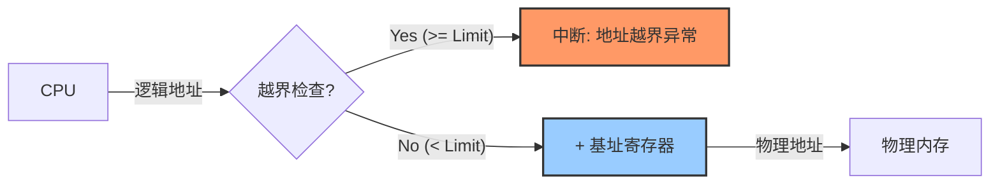
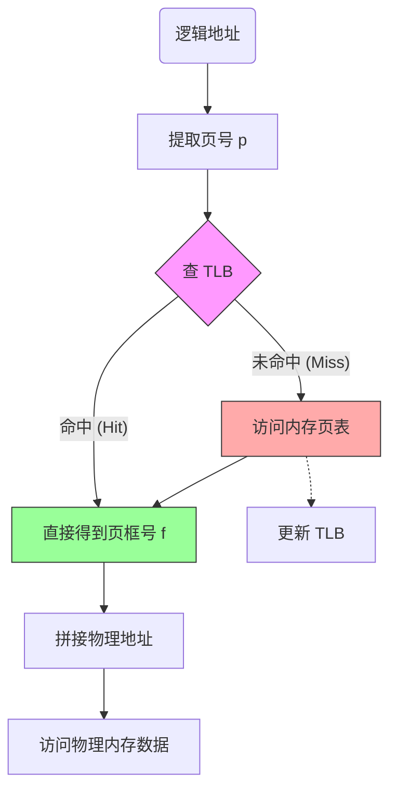
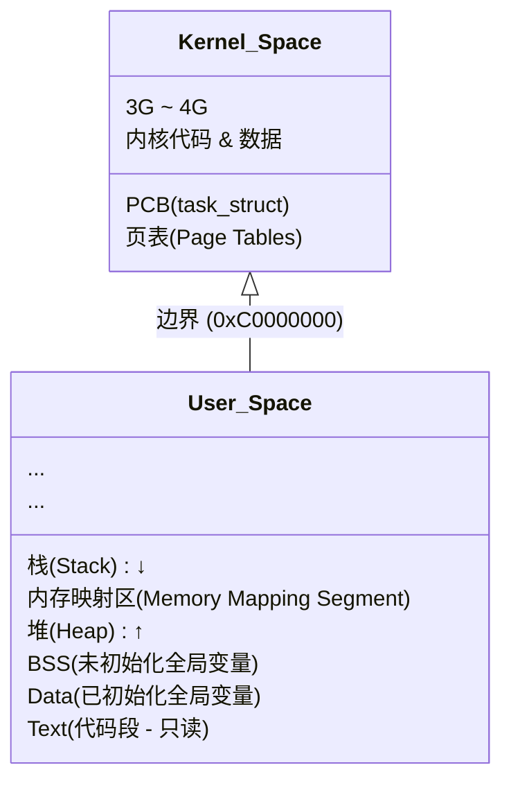
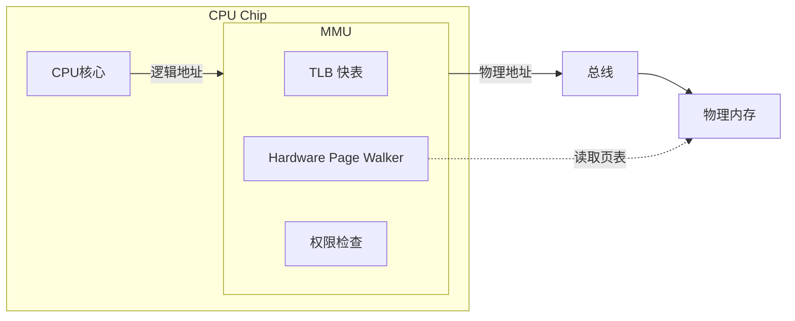
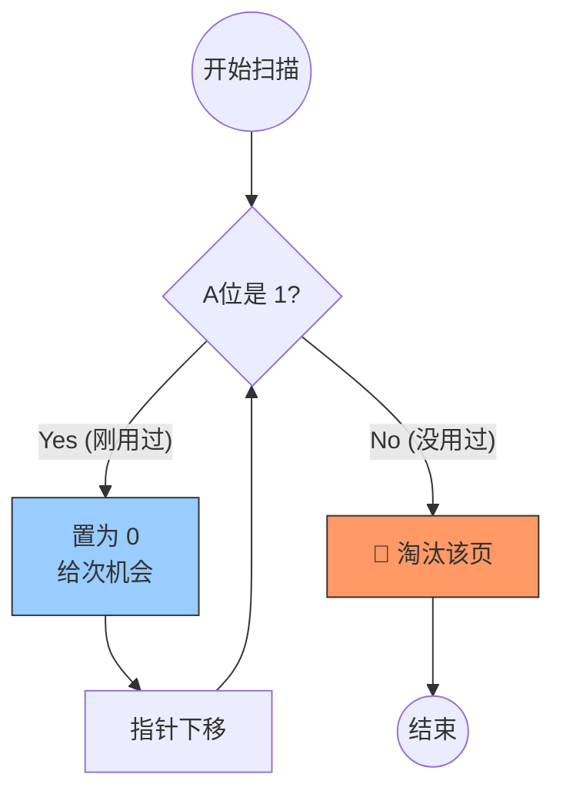
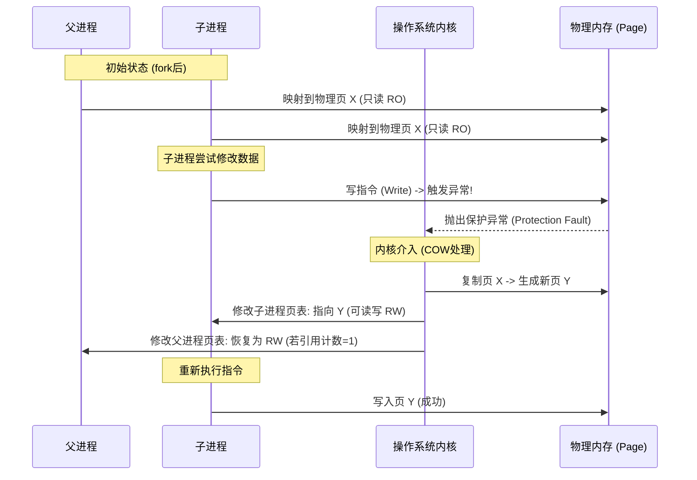
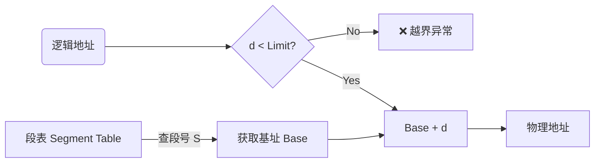

# Phase 1: 空间的假象 —— 基础与连续分配

> [!ABSTRACT] 核心目标
> 
> 理解操作系统如何让每个进程都“以为”自己独占内存，以及在早期的连续分配策略下，我们遇到了哪些难以调和的矛盾（碎片问题），从而引出了现代分页技术的诞生。

## 1.1 内存抽象与地址空间 (Address Space)

### 1. 为什么需要“逻辑地址”？

在最原始的计算机（直接在裸机上跑程序）中，程序直接操作物理地址。

如果指令是 MOV REG, 1000，CPU 就真的会去读物理内存地址 1000 的数据。

这带来了两个致命问题：

1. **不安全 (No Protection)**：用户程序可以随意修改操作系统的内存，导致系统崩溃。
    
2. **难重定位 (No Relocation)**：如果内存 `0~1000` 被占用了，第二个程序必须修改所有指令中的地址才能加载到 `1000~2000`。
    

**解决方案：创造一个“幻觉”——逻辑地址空间。**

### 2. 逻辑地址 vs 物理地址

> [!NOTE] 核心定义
> 
> - **逻辑地址 (Logical Address / Virtual Address)**：CPU 生成的地址，进程自己看到的地址。每个进程都认为自己从 `0` 开始。
>     
> - **物理地址 (Physical Address)**：内存单元中真实的地址，发送到内存总线上的地址。
>     

### 3. 动态重定位 (Dynamic Relocation)
[[程序链接与装入]]
现代 OS 使用 **基址寄存器 (Base Register)** 和 **界限寄存器 (Limit Register)** 这一对硬件来实现地址转换与保护。

- **基址 (Base)**：记录程序在物理内存的**起始位置**。
    
- **界限 (Limit)**：记录程序的**长度**。
    

转换公式：

$$\text{Physical Address} = \text{Logical Address} + \text{Base Register}$$

保护检查：

$$\text{IF } (\text{Logical Address} \ge \text{Limit Register}) \implies \text{TRAP (Segmentation Fault)}$$

> [!TIP] 直觉理解
> 
> 想象你在住酒店。
> 
> - **逻辑地址**：你说“我要去 3 号房间”。
>     
> - **基址**：前台知道你们团包下了从 500 号开始的楼层。
>     
> - **物理地址**：实际上你走进的是 $500 + 3 = 503$ 号房间。
>     
> - **界限**：如果你说要去 100 号房间（超出了包房范围），前台（硬件）会把你拦住（报错）。
>     

#### Mermaid: 硬件地址转换流程


---

## 1.2 连续分配管理 (Contiguous Allocation)

在这一阶段，我们要求：**一个进程必须占据一段连续的物理内存**。这非常符合直觉，但很难维护。

### 1. [[动态分区分配]] (Dynamic Partitioning)

当新进程到来时，OS 需要从空闲内存中切出一块足够大的区域给它。如何选择“哪一块”？有三种经典算法：

|**算法**|**策略**|**优点**|**缺点**|
|---|---|---|---|
|**First-fit** (首次适应)|从头扫描，找到**第一个**能塞下的空洞|**速度最快**，保留了高地址的大空洞|低地址产生很多小碎片|
|**Best-fit** (最佳适应)|扫描全部，找**最小且能塞下**的空洞|试图保留大空洞|**产生极多无法利用的微小碎片** (最烂的算法之一)|
|**Worst-fit** (最坏适应)|扫描全部，找**最大**的空洞|切割后剩下的空洞可能还够用|大空洞被迅速消耗，大进程来了没地放|

> [!FAILURE] 考研/面试常考点
> 
> 很多人直觉认为 Best-fit 是最好的。错！
> 
> Best-fit 会留下无数细碎的、连 1 字节都塞不进去的“边角料”，清理这些垃圾的开销极大。First-fit 通常是综合性能最好的。

### 2. 内存管理的噩梦：碎片 (Fragmentation)

这是连续分配无法解决的死结。

> [!NOTE] 内部碎片 vs 外部碎片 (必背)
> 
> - **内部碎片 (Internal Fragmentation)**：
>     
>     - **定义**：分配给进程的内存区域中，**进程没用完**的部分。
>         
>     - **场景**：固定分区分配（给 10MB，只用了 9MB，浪费 1MB）。
>         
>     - **特点**：在分区**内部**。
>         
> - **外部碎片 (External Fragmentation)**：
>     
>     - **定义**：内存中有很多**空闲的小坑**，加起来总空间足够，但**因为不连续**，无法分配给大进程。
>         
>     - **场景**：动态分区分配（随着进程反复创建销毁，内存变成了瑞士奶酪）。
>         
>     - **特点**：在分区**外部**。
>         

解决方案：内存紧缩 (Compaction)

像“磁盘碎片整理”一样，把所有进程往内存一端挪动，把空洞挤到另一端。

- **代价**：极高！因为要暂停程序，复制大量数据。
    

---

## 1.3 总结与关联

> [!Abstract] Phase 1 总结
> 
> - **Base/Limit 寄存器** 实现了最基础的地址隔离和动态重定位。
>     
> - **连续分配** 导致了严重的 **外部碎片** 问题。
>     
> - **内存紧缩** 开销太大，无法作为常规手段。
>     

思考：如果我们允许一个进程的内存不连续地存放，是不是就彻底解决了外部碎片？

-> 这就是 Phase 2: 分页与分段 的起源。

# Phase 2: 切分的艺术 —— 分页机制 (Paging)

> [!ABSTRACT] 核心目标
> 
> 这一章是现代操作系统的基石。我们将打破“物理内存必须连续”的限制，把内存切成无数个固定大小的小块。这是从“宏观管理”到“微观管理”的质变。

## 2.1 分页的物理视角：页与页框

为了实现非连续分配，我们将物理内存和逻辑内存都切成**一样大小**的块。

### 1. 核心定义 (必背)

> [!NOTE] 核心术语区分
> 
> - **页框 (Page Frame)** / **物理页**：
>     
>     - **对象**：**物理内存**。
>         
>     - 我们将物理内存切成固定大小的块（通常是 4KB）。
>         
>     - 编号为 $0, 1, 2, ...$。
>         
> - **页 (Page)** / **逻辑页**：
>     
>     - **对象**：**进程的逻辑地址空间**。
>         
>     - 进程也被切成同样大小的块。
>         
>     - 编号为 $0, 1, 2, ...$。
>         

### 2. 映射关系 (The Map)

既然切碎了，系统就可以把**进程的第 0 页** 放到 **物理内存的第 5 号页框**，把 **进程的第 1 页** 放到 **物理内存的第 3 号页框**。

- **彻底消除了外部碎片**：只要有一个页框空着，我就能塞进一个页，完全不浪费。
    
- **代价**：我们需要一张“地图”来记录每一页到底去哪了。这张地图就是 **页表 (Page Table)**。
    

---

## 2.2 页表 (Page Table) 的本质

页表是操作系统中最重要的数据结构之一。

> [!TIP] 直觉理解
> 
> 想象一本书（进程）。
> 
> - 书的内容被印在很多张独立的纸上（页）。
>     
> - 这些纸被打乱了，塞进了图书馆书架的随机空位里（页框）。
>     
> - **页表** 就是那张“索引清单”：
>     
>     - 第 1 页 -> 在书架第 50 格
>         
>     - 第 2 页 -> 在书架第 12 格
>         
>     - ...
>         

### 页表的结构

在最简单的模型中，页表就是一个**数组**。

- **索引 (Index)**：代表 **页号 (Page Number, $p$)**。
    
- **值 (Value)**：代表 **页框号 (Page Frame Number, $f$)**。
    

> [!FAILURE] 常见误区
> 
> 页表中不存储页号。页号是隐含的（就像数组下标 arr[0], arr[1] 不需要存 0 和 1 一样）。页表只存储物理页框号和一些控制位（如有效位）。

---

## 2.3 逻辑地址转物理地址 (重中之重)

这是 408 考研和面试的必考题。

### 1. 数学视角

给定一个逻辑地址 $L$ 和页面大小 $S$ (Size)，CPU 自动将其切割为两部分：

1. **页号 (Page Number, $p$)**：$p = L / S$ (整除)
    
2. **页内偏移 (Offset, $d$)**：$d = L \% S$ (取余)
    

物理地址计算公式：

$$PhysicalAddress = (PageTable[p] \times S) + d$$

### 2. 计算机视角 (位运算)

在计算机中，页面大小 $S$ 通常是 2 的幂（如 $4KB = 2^{12}$ 字节）。这使得计算极其快速，不需要做除法。

假设系统是 32 位地址，页面大小为 4KB ($2^{12}$ B)：

- **低 12 位**：直接作为 **偏移量 ($d$)**。
    
- **高 20 位**：直接作为 **页号 ($p$)**。
    

> [!CODE] 地址转换逻辑
> 
> 逻辑地址 (32bit): 00000000000000000001 000000000101
> 
> |------ 20位页号 (p) -----|-- 12位偏移 (d) --|
> 
> ↓ 查表
> 
> 页表 (Page Table): Index 1 -> Frame 5
> 
> ↓ 拼接
> 
> 物理地址 (32bit): 00000000000000000101 000000000101
> 
> |---- 20位页框号 (f) -----|-- 12位偏移 (d) --|

- **关键点**：**偏移量 ($d$) 永远不变**。逻辑页里的第 5 个字节，拷贝到物理页框里，依然是第 5 个字节。我们只改变了“基地址”。
    

---

## 2.4 关联与隐患

> [!NOTE] 总结
> 
> - **分页** 解决了外部碎片，实现了内存离散分配。
>     
> - **页表** 充当了翻译官，将用户视角的逻辑页映射到硬件视角的物理页框。
>     

**目前的隐患 (引出下一章)：**

1. **速度问题**：每次访问内存数据，都需要先访问一次页表（在内存中），再访问物理地址。**这让内存访问速度慢了一倍！** (解决方案：TLB)
    
2. **空间问题**：现代系统内存很大（4GB+），页表本身会变得超级大。一个页表可能就要占用几 MB 连续内存，这又回到了连续分配的老路！(解决方案：多级页表)
### 一个计算
>[!QUESTION] 计算题
某系统采用分页存储管理。
>- **页面大小**：$1KB$ ($1024$ 字节)
>- **进程 A 的页表**：
>- 页号 0 -> 页框号 2
>- 页号 1 -> 页框号 4
>- 页号 2 -> 页框号 7
>请计算：
>(进阶) 如果物理内存地址是 16 位的，上述物理地址的二进制表示是什么？
        
- 正确计算：
    
    $$物理地址 = (7 \times 1024) + 452 = 7168 + 452 = 7620$$
    

3. 二进制写法 (核心技巧)

这才是本题的精华。你提到了“2的13次方”，这说明你在尝试凑数字。但在计算机底层，我们使用拼接法，不需要做加法！

假设物理地址是 16 位：

- **Offset (偏移)**：$1KB = 2^{10}$，所以低 **10位** 是偏移量。
    
    - $452$ 的二进制是 `01 1100 0100` (凑数法：$256+128+64+4$)。
        
- **Frame (页框)**：剩下的高位是页框号。
    
    - 页框号 **7** 的二进制是 `111` (即 `000111`)。
        
- **拼接**：直接把 `Frame` 放到 `Offset` 前面。
    
    - `000111` (Frame 7) + `01 1100 0100` (Offset 452)
        
    - 结果：`0001 1101 1100 0100`
        

> [!TIP] 为什么是拼接？
> 
> $7 \times 1024$ 在二进制里就是把 $7 (111)$ 左移 10 位，后面补 10 个 0。
> 
> 加上 $452$，就是把那 10 个 0 填满。
> 
> 所以：物理地址 = 页框号二进制拼上偏移量二进制。

# Phase 3: 虚拟的魔法 —— 硬件加速与多级页表

> [!ABSTRACT] 核心目标
> 
> 既然分页这么好，为什么早期的系统不敢用？
> 
> 1. **太慢**：每次访问内存多了一次查表操作（性能减半）。
>     
> 2. 太大：页表本身占用大量内存。
>     
>     本章将揭示现代 CPU 如何用 TLB 和 多级页表 完美解决这两个问题。
>     

## 3.1 速度瓶颈：TLB (快表)

### 1. 为什么分页会让系统变慢？

如果没有特殊硬件，CPU 读取 `Address A` 的数据需要两步：

1. **访问页表**：去内存里查 `Page Table`，找到页框号。（第 1 次访存）
    
2. 访问数据：根据算出的物理地址，去内存里读数据。（第 2 次访存）
    
    结论：指令执行速度直接减半！这是无法接受的。
    

### 2. 解决方案：TLB (Translation Lookaside Buffer)

科学家们利用**局部性原理**，在 CPU 内部加了一块极快（也极贵）的小缓存，叫 **TLB**（快表）。它可以理解为页表的“高频热点缓存”。

- **全相联查询**：硬件并行地同时比对 TLB 中的所有条目。
    
- **流程**：
    
    1. CPU 拿到逻辑页号 $p$。
        
    2. **先查 TLB**：
        
        - **Hit (命中)**：直接得到页框号 $f$。**不需要访问内存中的页表！** (耗时 ~1ns)
            
        - **Miss (未命中)**：不得不去内存查页表，拿到 $f$ 后，顺便把这个映射塞进 TLB，以便下次用。
            

#### Mermaid: TLB 查找流程 



> [!FAILURE] 考研/面试常考坑点
> 
> TLB 刷新 (TLB Flush)：当进程切换时，页表变了，旧进程的 TLB 缓存就失效了。所以上下文切换时通常需要清空 TLB（除非有 ASID 硬件支持），这也是进程切换开销大的原因之一。

---

## 3.2 空间瓶颈：多级页表 (Multi-Level Paging)

### 1. 为什么页表会“大”？

假设 32 位系统，4KB 页面，每个页表项 (PTE) 4 字节。

- 页面总数 = $2^{32} / 2^{12} = 2^{20} = 100$ 万个页。
    
- 页表大小 = $100\text{万} \times 4\text{B} = 4\text{MB}$。
    
- **痛点**：每个进程都需要 **连续的** 4MB 内存来存页表。如果有 100 个进程，光页表就吃掉 400MB！而且这 4MB 必须**连续**（因为要用数组下标索引）。
    

### 2. 解决方案：多级页表

思路：**给页表再分个页**。将那张巨大的页表切碎，离散地放在内存里，然后用一个顶层目录（页目录）来管理它们。

> [!TIP] 直觉理解
> 
> - **单级页表**：一本书有 1000 页目录，太长了，要撕下来单独装订成一本册子，但这本册子太厚。
>     
> - **二级页表**：
>     
>     - **章目录 (页目录)**：只有 1 页，写着“第一章的目录在第 X 页”。
>         
>     - **节目录 (二级页表)**：分散存储，只有用到哪一章，才把那一章的目录加载进内存。
>         

### 3. 两级页表结构 (32位 x86 经典模型)

逻辑地址被切分为三段：

- **10位**：页目录号 (Page Directory Index) -> 查一级表
    
- **10位**：页表索引 (Page Table Index) -> 查二级表
    
- **12位**：页内偏移 (Offset)
    

优势：

如果一个进程只用了很少的内存，它只需要：

1 个页目录 (4KB) + 1 个二级页表 (4KB) = 8KB。

(对比单级页表的 固定 4MB，节省了 99% 的空间！)

---

## 3.3 总结与关联

> [!Abstract] Phase 3 总结
> 
> - **TLB** 利用硬件并行查找，解决了**时间**效率问题。
>     
> - **多级页表** 通过分层结构，解决了**空间**占用问题（允许页表离散存储，且按需分配）。
>     

目前的隐患 (引出下一章)：

到现在为止，我们假设 所有需要的页都在内存里。

如果内存满了怎么办？如果程序比物理内存还大怎么办？

-> 这就是 Phase 4: 虚拟内存与缺页中断 的核心。

---

## 🛑 检验思考题 (Critical Thinking)

> [!QUESTION] 深度分析
> 
> 某系统采用 二级页表。
> 
> 1. **访存次数**：在 TLB **未命中** 的情况下，读取一个数据需要访问几次内存？请列出每一步是去干什么。
>     
> 2. **权衡 (Trade-off)**：多级页表虽然节省了空间，但对 TLB 未命中时的性能有什么负面影响？
>     
> 3. **计算**：如果一级页表索引是 10 位，二级页表索引也是 10 位，页面大小是 4KB。那么一个进程的**最大**逻辑地址空间是多少？(提示：把所有位连起来看)

### 🟢 纠正：多级页表真的减少了大小吗？

> [!FAILURE] 你的理解：细粒度切分，并没有减少总大小？ **这是一个最常见的直觉误区。**
> 
> - 如果你把 4GB 内存**全部占满**，那么多级页表确实比单级页表更占空间（因为多了目录层）。
>     
> - **但是！** 现实中绝大多数进程的内存是 **“稀疏” (Sparse)** 的。
>     

**举个极端的例子：** 假设一个 32 位程序，它只用了两个页面：

1. 第 0 页（代码段）
    
2. 第 100万 页（栈底）
    

**对比：**

- **单级页表**：必须是一个**连续的数组**。为了能索引到第 100 万项，你必须申请一个能装下 100 万个条目的数组（中间 99 万个全是空的，但也必须占位）。**大小 = 4MB**。
    
- **二级页表**：
    
    - 一级目录：必须有（占 4KB）。
        
    - 二级表 1：负责第 0 页（占 4KB）。
        
    - 二级表 2：负责第 100 万页（占 4KB）。
        
    - **中间的 999 个二级表根本不需要创建！**
        
    - **总大小 = 4KB + 4KB + 4KB = 12KB**。
        

**结论**：多级页表通过 **“按需分配”**（只给用到的逻辑地址分配页表），在稀疏地址空间下，**极大地减少了**页表占用的内存。

# Phase Special-2: 只有内核才看到的风景 —— 从源码到进程的深层之旅

> [!ABSTRACT] 核心目标 你希望在 **编译、链接、装入、运行** 的过程中，把 **进程、线程、CPU调度、内存映像** 全部串起来。
> 
> 我们将通过**追踪一个 C 程序的生命周期**，揭示操作系统是如何“欺骗”应用程序，让它以为自己拥有整个世界的。

## S.1 静态视角：构建 (Build) —— 硬盘上的拼图

### 1. 编译 (Compiler)

编译器把 `.c` 翻译成汇编，再翻译成 **可重定位目标文件 (.o)**。 此时，代码被切分成了两个核心区域：

- **`.text` 段**：存放指令 (只读)。
    
- **`.data` 段**：存放全局变量 (读写)。
    

### 2. 链接 (Linker) —— 虚拟地址的诞生

链接器把你的 `.o` 和系统的启动代码（`crt0.o`）拼在一起。 **最关键的一步**：链接器决定了**逻辑地址 (Virtual Address)** 的布局。

- 它规定：代码段从 $0x08048000$ 开始放（Linux 32位经典值）。
    
- 此时，虽然程序还在硬盘上，但所有指令里的跳转地址（如 `JMP 0x08048050`）已经被写死了。
    

---

## S.2 运行时视角：装入 (Loading) —— 最大的谎言

> [!FAILURE] 常见误区 很多人以为“装入”就是把硬盘上的 `.exe` 整个读到内存里。 **大错特错！** 现代 OS 从不这么干。

### 1. 映射 (Mapping / mmap)

当你双击程序或在 Shell 输入 `./run` 时，OS 执行 `exec()` 系统调用：

1. **创建进程结构**：在内核里申请一个 `task_struct` (PCB)，记录进程信息。
    
2. **创建页表**：分配一个全新的、空的页目录 (Page Directory)。
    
3. **建立映射 (VMA)**：
    
    - OS 只是在内核里记了一笔账（创建 `vm_area_struct`）：
        
    - “这个进程的虚拟地址 `0x08048000 ~ 0x08049000` 对应硬盘文件 `run.exe` 的偏移量 0~4096。”
        
4. **完成**：这就结束了！**此时物理内存里一行代码都没有加载。**
    

### 2. 真正执行与缺页 (The Trigger)

1. OS 把 CPU 的 **PC 指针** 指向程序入口点 `$0x08048000`。
    
2. **CPU 调度**：选中这个进程，开始执行第一条指令。
    
3. **崩溃 (Page Fault)**：
    
    - CPU 发出逻辑地址 `$0x08048000`。
        
    - MMU 查页表 -> **空的！** (Valid Bit = 0)。
        
    - CPU 抛出 **缺页异常 (Page Fault)**。
        
4. **内核接管**：
    
    - 缺页处理程序检查那笔账 (VMA)：发现“哦，这个地址对应硬盘上的 `run.exe`”。
        
    - **磁盘 I/O**：从硬盘把那 4KB 代码读入物理页框。
        
    - **修改页表**：把物理页框号填进去。
        
5. **重新执行**：CPU 再次执行第一条指令 -> **成功！**
    

> [!TIP] 关联直觉 这就是为什么大型游戏加载时硬盘狂转，但进度条走完后，进新地图又要卡一下。因为它在利用 **缺页中断** 按需加载数据。

---

## S.3 运行时动态链接 (PLT & GOT) —— 高级魔法

你问到了 **运行时动态链接**。这是通过 **PLT (过程链接表)** 和 **GOT (全局偏移表)** 实现的。这是一个非常精妙的“中间人”机制。

假设你的代码调用了 `printf`：

1. **第一次调用**：
    
    - 代码 `call printf` 实际上跳到了 **PLT 表** (一段小代码)。
        
    - PLT 查看 **GOT 表** (存数据的)，发现里面是空的（或者指向 PLT 下一条指令）。
        
    - **触发动态链接器**：PLT 呼叫系统底层的 `ld-linux.so`。
        
    - 链接器去查找 `libc.so` 在内存中的位置，算出 `printf` 的真实物理地址。
        
    - **填表**：把真实地址填入 **GOT 表**。
        
    - 跳转执行 `printf`。
        
2. **第二次调用**：
    
    - 代码 `call printf` -> 跳到 PLT。
        
    - PLT 查 GOT -> **里面已经有真实地址了！**
        
    - 直接跳转执行。
        

> [!NOTE] 为什么这么麻烦？ 这样可以做到 **代码段只读共享**。`.text` 段不需要修改（因为跳转目标永远是固定的 PLT 地址），需要修改的只是数据段里的 GOT 表（每个进程独有一份 GOT）。

---

## S.4 深度整合：进程的内存映像 (Memory Image)

现在，让我们在脑海中画出一幅完整的 **进程内存图**，并关联 CPU 和 线程。

这是 32 位 Linux 进程的标准视图（0 ~ 4GB）：



### 关联底层细节：

1. **内核空间 (3G~4G)**：
    
    - **所有进程共享！** 你的进程 A 和进程 B，看到的高 1GB 空间是一模一样的（都映射到同一块物理内存，放着 OS 内核）。
        
    - **关联中断**：当系统调用或中断发生时，CPU 从用户态切到内核态，使用的就是这部分空间。
        
2. **栈 (Stack)**：
    
    - **关联线程**：**每个线程都有自己独立的栈！** (但在同一个地址空间内)。这是多线程并发执行的基础。
        
    - 存放局部变量、函数参数。
        
3. **内存映射区 (Mmap Region)**：
    
    - **关联动态库**：`libc.so`, `libGL.so` 等文件就被映射在这里。
        
    - **关联文件 I/O**：如果你用 `mmap` 读写大文件，也在这里。
        
4. **堆 (Heap)**：
    
    - `malloc/new` 分配的地方。
        
    - **关联内存碎片**：我们在 Phase 1 讲的碎片主要就发生在这里。
        
5. **代码段 (Text)**：
    
    - **只读**。
        
    - **关联物理内存**：如果是跑了 10 个 Chrome 标签页，这 10 个进程的虚拟地址不同，但物理页框指向同一块物理内存（共享代码）。
        

---

## S.5 总结：建立直觉 (Intuition)

> [!TIP] 终极直觉 计算机没有魔法，只有表格。
> 
> - **进程** = 一张页表 (CR3寄存器指向它) + 一堆 VMA (记账单)。
>     
> - **线程** = 一个独立的栈 + 共享同一个页表。
>     
> - **装入** = 建立 VMA 映射关系 (不读盘)。
>     
> - **运行** = 不断地缺页中断，把数据搬进来。
>     
> - **动态链接** = 运行时查表 (GOT) 找函数地址。
>     

---

## 🛑 检验思考题 (Deep Dive)

> [!QUESTION] 综合场景分析 假设你写了一个死循环程序 `while(1) { sleep(1); }`，编译出的 exe 只有 10KB。 但是当你运行它，打开任务管理器查看时，发现它占用了 **5MB** 的虚拟内存，**2MB** 的物理内存。
> 
> 1. **为什么虚拟内存远大于 exe 大小？** (提示：想一想 `libc.so` 和 栈)。
>     
> 2. **进程 A** 和 **进程 B** 都运行这个程序。
>     
>     - 它们的 **虚拟地址** 里的 `main` 函数地址相同吗？
>         
>     - 它们的 **物理地址** 里的 `main` 函数地址相同吗？
>         
> 3. **高级题**：如果此时我在代码里用 `malloc` 分配了 1GB 内存，但**没有读写它**。
>     
>     - 虚拟内存会增加吗？
>         
>     - 物理内存会增加吗？
>         
>     - 这体现了 OS 内存管理的什么核心策略？

## 小问题
### 1. 勘误与定性：地址写死是“链接时”还是“装入时”？

> **你的问题**：`JMP 0x08048050` 被写死在硬盘的 exe 里，这是“链接时装入”吗？

**不，这属于【链接时 (Link Time)】决定的【逻辑地址】。**

我们需要严格区分三个概念：

1. **链接 (Linking)**：
    
    - **发生时间**：在你的电脑上生成 `.exe` 的时候。
        
    - **行为**：链接器规定：“在这个程序**自己的世界**里，`main` 函数就住在 `0x08048050`。” 于是它把 `JMP 0x08048050` 刻在了硬盘文件里。
        
    - **结果**：确定了**逻辑地址 (Virtual Address)**。
        
2. **装入 (Loading)**：
    
    - **发生时间**：你双击运行程序的时候。
        
    - **行为**：OS 为它创建页表，建立映射。
        
    - **结果**：准备好了运行环境，但通常**不修改**指令里的地址（现代动态重定位模型）。
        
3. **地址翻译 (Translation)**：
    
    - **发生时间**：CPU 执行那条 `JMP` 指令的瞬间。
        
    - **行为**：MMU 硬件介入，把 `0x08048050` 变成物理地址。
        

> [!TIP] 比喻
> 
> - **链接时**：印制“演唱会门票”。上面写着“座位号：1排1座”（逻辑地址）。这个号码是印死的。
>     
> - **装入时**：检票进场。体育馆工作人员把“1排1座”这个区域划分好了。
>     
> - **运行时**：你真的去坐。假如体育馆为了省事（虚拟内存），其实“1排1座”对应的**物理椅子**还没搬来呢！等你走到了，工作人员才急忙搬把椅子放在那（缺页中断）。
>     

---

### 2. MMU (Memory Management Unit) 深度拆解

MMU 是 CPU 内部的一个硬件单元，它是**虚拟内存的硬件执行者**。没有它，OS 的分页机制就是纸上谈兵。

#### MMU 的核心工作流

当 CPU 要执行指令 `MOV EAX, [0x1000]` 时，由于开启了分页模式，CPU 实际上无法直接把 `0x1000` 发送到内存总线上。

1. **拦截**：CPU 核心发出逻辑地址 `0x1000`，被 MMU 拦截。
    
2. **查表**：
    
    - MMU 先看一眼 **TLB (快表)**：如果有，直接拿物理地址。
        
    - 如果没有，MMU 会启动 **Page Walker (页表游走器)**。这是一小段硬件电路，它会自动去读取内存里的页表（根据 CR3 寄存器找到页目录，一级级往下查）。
        
3. **计算与转换**：MMU 拿到物理页框号，拼上偏移量。
    
4. **输出**：MMU 把**物理地址**放到总线上，命令内存条读数据。
    
5. **权限检查**：同时，MMU 还会检查页表项里的位：是只读的吗？是内核态专属的吗？如果违规，直接给 CPU 报 **Page Fault**。
    

#### Mermaid: MMU 结构图


---

### 3. 线程栈 (Thread Stack) 的内存布局

> **你的问题**：线程有自己的栈，是把进程的栈划分了吗？

**不是划分了“原来的那个栈”，而是“新开辟了内存区域作为栈”。**

- **主线程 (Main Thread)**：使用进程标准的 Stack 区（通常在虚拟地址空间的高处，向下增长）。
    
- **新线程 (Child Threads)**：当你调用 `pthread_create` 时，函数库会调用 `mmap` 在 **堆 (Heap)** 和 **栈 (Stack)** 之间的空闲区域（也就是 Memory Mapping Region）申请一块新的内存（比如 8MB）。
    
    - 然后，CPU 的 **栈指针寄存器 (SP)** 被指向这块新内存的顶部。
        
    - 于是，这块普通的内存就被当成“栈”来用了。
        

#### 示意图：多线程内存布局
```plaintxt
高地址 (4GB)
+------------------+
|   Kernel Space   |
+------------------+
|   Main Stack     | <--- 主线程的栈 (往下长)
|        ↓         |
+------------------+
|                  |
|                  |
| [Thread 2 Stack] | <--- 这里的内存被 mmap 出来当作线程2的栈
|                  |
| [Thread 1 Stack] | <--- 这里的内存被 mmap 出来当作线程1的栈
|                  |
|   Shared Libs    | (libc.so 等)
|                  |
+------------------+
|        ↑         |
|       Heap       | <--- malloc 的数据在这里，所有线程共享！
+------------------+
|   Code / Data    | (所有线程共享代码)
+------------------+
低地址 (0)
```

> [!NOTE] 关键点
> 
> - **栈是私有的**：线程 A 的函数调用链不会干扰线程 B。
>     
> - **但没那么私有**：因为它们都在同一个页表里！如果线程 A 知道了线程 B 栈的地址（通过指针传递），线程 A **完全可以**去读写线程 B 的栈。没有硬件隔离，只有逻辑隔离。
>     

---

### 4. 解答之前的思考题（直觉构建）

现在我们用刚才的知识，回答那个让你困惑的场景题。

> **场景**：死循环程序 `while(1) { sleep(1); }`，exe 只有 10KB。 **现象**：虚拟内存 5MB，物理内存 2MB。

**Q1: 为什么虚拟内存 (5MB) 远大于 exe (10KB)？**

- **答案**：因为虚拟内存里不仅仅是你的代码。
    
    - **动态库**：程序需要 `libc.so` (C标准库) 来执行 `sleep`，这个库很大（几 MB），被映射到了你的虚拟空间。
        
    - **栈 (Stack)**：主线程默认分配 8MB (Linux默认) 或更少的虚拟空间配额。
        
    - **堆 (Heap)**：一些初始化的管理结构。
        
    - **结论**：exe 只是冰山一角，水面下是系统库和预留空间。
        

**Q2: 进程 A 和 进程 B 运行同一个程序。**

- **逻辑地址里的 `main` 相同吗？**
    
    - **相同**。因为它们是同一个 exe 变来的，链接器确定的地址是一样的（比如都是 `0x08048050`）。
        
- **物理地址里的 `main` 相同吗？**
    
    - **通常相同 (代码共享)**。现代 OS 发现你们运行的是同一个文件，为了省钱，**只在物理内存里加载一份代码**。
        
    - 进程 A 的页表：`虚拟页 8 -> 物理页框 100`。
        
    - 进程 B 的页表：`虚拟页 8 -> 物理页框 100`。
        
    - **注意**：如果是**数据段**（全局变量），一开始也相同（COW技术），一旦有一个进程修改了变量，物理地址就会变不同（复制一份新的）。
        

**Q3: `malloc` 分配 1GB 但不读写。**

- **虚拟内存增加吗？**
    
    - **会**。OS 会在 VMA (记账单) 上记一笔：“你拥有了 1GB 空间”。
        
- **物理内存增加吗？**
    
    - **几乎不会** (或者只增加几 KB 用于存页表)。
        
    - **原因**：**惰性分配 (Lazy Allocation)**。OS 实际上是在“开空头支票”。只有当你真正去**写**这块内存（发生缺页中断）时，OS 才会慌慌张张地去物理内存里找空地给你。
        
    - 这也解释了为什么你可以 `malloc` 出比物理内存还大的空间（只要你不一次性全用完）。
        

---

### 🟢 总结

我们现在已经扫清了所有底层障碍。你现在应该对“内存”有了立体的认识：

1. **逻辑地址**是链接器编造的幻境。
    
2. **MMU** 是维持这个幻境的辛苦劳工。
    
3. **栈** 只是 mmap 出来的一块地。
    
4. **物理内存** 是按需分配的珍贵资源。

# Phase 4: 决策的智慧 —— 页面置换算法 (Page Replacement)

> [!ABSTRACT] 核心场景 你的物理内存只有 4GB，但你运行了几个大型游戏和浏览器，它们宣称占用了 10GB 的虚拟内存。
> 
> 1. **缺页**：CPU 想要读取页面 `P`。
>     
> 2. **满员**：OS 发现所有物理页框 (Frames) 都被占满了。
>     
> 3. **抉择**：OS 必须从现有的页框里**踢出一个**（写入磁盘 Swap 区），腾出空位给页面 `P`。
>     
> 
> **核心问题**：**踢谁？** 踢错人会导致系统频繁读写磁盘，性能崩盘。

## 4.1 评判标准：缺页率

我们要找出一个算法，使得在给定的**页面引用序列 (Reference String)** 下，**缺页次数最少**。

**测试用例**（假设物理内存只能装 **3** 个页）： `7, 0, 1, 2, 0, 3, 0, 4`

---

## 4.2 经典算法巡礼
[[动态分区分配]]
[[页面置换算法]]
### 1. 最佳置换算法 (OPT - Optimal) —— 上帝视角

- **策略**：踢掉 **“在未来最长时间内不会被访问”** 的页面。
    
- **特点**：
    
    - **理论最优**：保证缺页率最低。
        
    - **不可实现**：OS 无法预知未来（除非你有水晶球）。
        
- **用途**：作为标杆，用来衡量其他算法离“完美”还有多远。
    

> [!EXAMPLE] OPT 演示 (内存容量=3)
> 
> - `7, 0, 1` -> 填满 (当前: 7, 0, 1)
>     
> - 来了 `2` -> 必须踢一个。看未来：`0` 马上用，`7` 和 `1` 很久不用。
>     
> - **踢掉 7**。 (当前: 2, 0, 1)
>     

### 2. 先进先出 (FIFO) —— 简单粗暴

- **策略**：踢掉 **“驻留内存时间最久”** 的页面（类似队列）。
    
- **特点**：
    
    - **实现简单**：维护一个链表即可。
        
    - **性能差**：最早进来的页面可能是一些核心初始化库（如 `libc.so`），虽然老，但经常用。踢了它马上又要调回来。
        

> [!FAILURE] 考研/面试核弹考点：Belady 异常 
> **直觉**：给进程的物理页框越多，缺页次数应该越少。 
> **现实**：在使用 FIFO 算法时，有时**增加物理页框数，缺页次数反而增加**！
> 
> - **原因**：FIFO 甚至连“局部性原理”都不遵守，它只看时间，不看热度。
>     
> - **注意**：LRU 和 OPT 算法**绝不会**出现 Belady 异常（它们是栈式算法）。
>     

### 3. 最近最久未使用 (LRU - Least Recently Used) —— 历史的镜像

- **策略**：踢掉 **“过去最长时间没被访问过”** 的页面。
    
- **理论基础**：**局部性原理**。如果一个页面很久没被访问，未来被访问的概率也很小。
    
- **特点**：性能非常接近 OPT，是工业界的金标准。
    

> [!EXAMPLE] LRU 演示 (内存容量=3) 序列：`7, 0, 1, 2, 0, 3, 0, 4`
> 
> - `7, 0, 1` -> 填满。
>     
> - 来了 `2` -> 看过去：`1` (刚用), `0` (刚用), `7` (最久没用)。**踢 7**。 (内存: 2, 0, 1)
>     
> - 来了 `0` -> 命中！(0 变成最新)。(内存: 2, 0, 1)
>     
> - 来了 `3` -> 看过去：`0` (最新), `2` (次新), `1` (最旧)。**踢 1**。 (内存: 2, 0, 3)
>     

- **硬件代价**：LRU 很难精确实现。需要给每个页面维护一个时间戳或移动链表节点，**开销太大**（每次访存都要写内存更新状态，太慢了）。
    

---

## 4.3 工业界的妥协：时钟置换算法 (Clock)

既然 LRU 太贵，我们需要一个近似算法。这就是 **Clock (也叫 NRU - Not Recently Used)**。

### 1. 核心机制：访问位 (Reference Bit)

- 页表项里增加一位：`Access Bit` (A位)。
    
- **当 CPU 读/写某页时**：硬件自动把该页的 `A位 = 1`。
    
- **OS 扫描时**：操作系统不仅看谁老，还看谁“最近有没有被摸过”。
    

### 2. 算法流程 (Mermaid 可视化)

把所有页框排成一个**环形链表**，像钟表一样。有一个指针指向当前扫描的位置。

> [!ALGO] Clock 算法逻辑
> 
> 1. 当需要踢人时，检查指针指向的页面。
>     
> 2. **如果是 1 (最近用过)**：
>     
>     - 给它一次机会（复活）：**把 1 改成 0**。
>         
>     - 指针下移，检查下一个。
>         
> 3. **如果是 0 (最近没用)**：
>     
>     - **处决它！** (踢出)。
>         
>     - 指针停在下一个位置（等待下一次缺页）。
>         



> [!TIP] 为什么叫“时钟”？ 那个指针像时钟的秒针一样转圈。
> 
> - 如果内存充足，所有页面的 A 位都是 1，指针就要狂转一圈把它们都变 0，然后踢掉第一个。这退化成了 FIFO。
>     
> - 如果内存紧张，常用的页 A=1 经常被复活，不常用的页 A=0 很快被淘汰。**完美近似了 LRU**。
>     

---

## 4.4 改进型 Clock (考虑脏位)

如果一个页面被**修改过 (Dirty / Modified)**，踢它更麻烦（因为必须写回磁盘）。如果没修改过（干净的），直接丢弃就行（磁盘里本来就有）。 **原则**：**优先踢“没用过”且“没修改过”的页面**。

**四类优先级 (从高到低，越低越容易被踢)：**

1. `(A=0, M=0)`：最近没用，也没修改 —— **最佳牺牲品**。
    
2. `(A=0, M=1)`：最近没用，但修改了 —— 次选（需要写回磁盘）。
    
3. `(A=1, M=0)`：最近用了，但没修改 —— 给次机会。
    
4. `(A=1, M=1)`：最近用了，且修改了 —— 最不想踢。
    

---

## 4.5 系统的崩溃：抖动 (Thrashing)

> [!WARNING] 警惕 当物理内存太小，无法容纳所有进程的**工作集 (Working Set)** 时：
> 
> 1. 进程 A 刚把页 1 读进来，就要踢掉页 2。
>     
> 2. 下一秒，进程 A 又要访页 2，只好踢掉页 1。
>     
> 3. **结果**：CPU 几乎不工作，全在忙着把数据在内存和磁盘之间搬来搬去。
>     
> 4. **现象**：磁盘灯狂闪，系统卡死。
>     

**解决方法**：

- **挂起进程**：暂停几个进程，把它们的内存全部释放，腾给剩下的进程用。
    
- **买内存条**：增加物理内存。
    

---

## 🛑 检验思考题 (Simulation)

这道题考察你对 **LRU** 和 **Clock** 的手动推演能力（必会）。

> [!QUESTION] 算法模拟 物理内存有 **3** 个页框 (Frames)。初始为空。 引用序列：`A, B, C, A, D, B`
> 
> **Task 1 (LRU)**: 请列出每一步内存中的页面变化，并计算总缺页次数。 _提示：A, B, C 进来了 (3次缺页)。A 又来了 (命中)。D 来了 (踢谁？)..._
> 
> **Task 2 (Clock/NRU)**: 假设初始 Reference Bit 均为 0。 规则：
> 
> - 访问页面 -> 将 Bit 置 1。
>     
> - 缺页替换 -> 从指针处开始找 0，遇 1 变 0 继续找。
>     
> - 指针初始指向 Frame 0。
>     
> 
> 当 `D` 进来时，需要替换谁？（请描述指针扫过的过程）


# Phase 5: 内核深处 —— 高级优化与实战

> [!ABSTRACT] 核心目标
> 
> 揭示 Fork 为什么快？文件读取 为什么可以不拷贝？以及内核自己是如何管理碎片的。
> 
> 1. **写时复制 (COW)**：进程创建的加速器。
>     
> 2. **内存映射 (mmap)**：零拷贝 I/O 的基石。
>     
> 3. **伙伴系统 & Slab**：内核级的内存分配器。
>     

---

## 5.1 写时复制 (Copy-on-Write, COW)

你在 Phase 3 问过：“子进程调用 fork() 时，是把父进程的内存全部拷贝一份吗？”

如果是在 30 年前的 Unix，答案是 Yes。但在现代 Linux 中，答案是 No。

### 1. 核心机制

当父进程 fork() 子进程时，内核并不复制物理内存页面。

相反，内核做了一件很“鸡贼”的事：

1. **只复制页表**：子进程的页表指向和父进程**相同的物理页框**。
    
2. **设为只读 (Read-Only)**：把父子进程中这些页面的权限都设为**只读 (RO)**。
    

### 2. 触发与分离

- **读 (Read)**：只要大家都是读数据，就一直共享同一份物理内存。速度飞快，内存占用极低。
    
- **写 (Write)**：
    
    1. 当任意一方试图**修改**数据时，MMU 发现该页是 RO，触发 **保护异常 (Protection Fault)**。
        
    2. **内核介入**：内核捕获异常，发现是因为 COW 机制。
        
    3. **复制**：内核这才把这**一页**数据复制一份新的，分配给当前进程。
        
    4. **恢复权限**：把两页的权限都改为 **可读写 (RW)**。
        
    5. **重试**：CPU 重新执行写指令，这次写入成功。
        

> [!TIP] 直觉理解
> 
> 就像你和室友合租，合同上写着“冰箱里的蛋糕一人一半”。
> 
> - 如果你只是**看**蛋糕（读），不需要把它切开。
>     
> - 只有当你真的拿刀要去**切**（写）那一刻，系统才赶紧跑过来，把蛋糕复制一份给你切，确保你不影响室友的那份。
>     

#### 流程示意图




## 5.2 内存映射 (Memory Mapped Files - mmap)

传统的 `read()` / `write()` 系统调用非常低效，因为涉及多次数据拷贝。`mmap` 是高性能服务器（如 Kafka, Nginx）的核心武器。

### 1. 传统 I/O vs. mmap

假设你要读取文件 `data.txt`：

- **传统方式 (`read`)**：
    
    1. 硬盘 -> **内核缓冲区 (Page Cache)** ([[DMA]] 拷贝)
        
    2. 内核缓冲区 -> **用户缓冲区** (CPU 拷贝)
        
    
    - **缺点**：数据在内存里存了两份，浪费空间且慢。
        
- **mmap 方式**：
    
    1. **直接映射**：把文件 `data.txt` 直接映射到进程的虚拟地址空间。
        
    2. **[[零拷贝]]**：进程读写这块虚拟地址，就等于直接读写 **内核缓冲区 (Page Cache)**。
        
    3. **缺页加载**：刚开始并没有读硬盘，直到你真正读写地址时，触发缺页中断，直接把磁盘数据搬到 Page Cache，进程直接用。
        

### 2. 优势

- **减少拷贝**：少了一次“内核 -> 用户”的拷贝。
    
- **共享**：如果多个进程 mmap 同一个文件（比如 `libc.so`），物理内存里只需要一份数据（Page Cache），大家都能看到。
    

---

## 5.3 内核分配器：伙伴系统与 Slab

在内核自己需要内存时（比如创建一个 `task_struct`），它不能像用户进程那样随意缺页。内核必须保证物理内存的**连续性**和**高效分配**。

### 1. [[伙伴系统]] (Buddy System) —— 解决外部碎片

内核管理物理内存的“大批发商”。

- **原理**：
    
    - 把所有空闲页框分组：1页块、2页块、4页块、8页块... $2^n$ 页块。
        
    - **分配**：如果你要 3 页，我就给你找个 4 页的块（最小能满足的 $2^k$）。如果没 4 页块，就把 8 页块**切一半**（变成两个 4 页，互为“伙伴”），一半给你，一半留着。
        
    - **回收**：当你还回来 4 页，我检查你的“伙伴”是不是也空闲。如果是，**合并**成 8 页。再检查 8 页的伙伴... 一路合并上去。
        
- **优点**：极快地合并内存，最大限度保证有大块连续内存可用。
    
- **缺点**：**内部碎片**（你要 3 页，我不得不给 4 页）。
    

### 2. Slab 分配器 —— 解决内部碎片

内核里的“零售商”。

- **痛点**：伙伴系统最小单位是 1 页 (4KB)。但内核经常需要很小的对象，比如一个 inode 可能只有 100 字节。给它 4KB 太浪费了。
    
- **原理**：
    
    - Slab 向伙伴系统申请一页内存（比如 4KB）。
        
    - 像**模具 (Slab)** 一样，把这一页切成无数个**固定大小的小块**（比如全是 100 字节的槽位）。
        
    - 专门用来存特定对象（如 `task_struct` 池, `inode` 池）。
        
- **优点**：
    
    - **无内部碎片**：小对象塞得满满当当。
        
    - **缓存友好**：对象复用，不需要反复初始化。
        

> [!NOTE] 总结
> 
> - **Buddy System**: 管大块物理页 (Page Frames)。
>     
> - **Slab**: 管页内的小对象 (Objects)。
>     
> - **关系**: Slab 是 Buddy 的大客户。
>     

---

# 🎓 终极毕业考试 (Final Challenge)

恭喜你！你已经学完了操作系统内存管理的全部核心内容。为了验证你的“宗师”地位，请回答这道综合了 **Phase 1~5** 的终极场景题。

> [!QUESTION] 场景：高性能 Web 服务器
> 
> 你正在开发一个类似 Nginx 的静态文件服务器。
> 
> 1. **启动**：主进程分配了一个 1GB 的全局缓存数组 `char *cache = malloc(1GB)`，并读取了一些数据进去。然后它 `fork()` 了 4 个子进程作为工作进程。
>     
>     - **Q1**: `fork` 瞬间，物理内存占用会翻 5 倍变成 5GB 吗？为什么？此时父子进程的页表有什么特殊标记？
>         
> 2. **运行**：子进程 A 接到一个请求，需要修改缓存数组里第 0 个字节的数据（记录访问次数）。
>     
>     - **Q2**: 此时 CPU 和内核发生了什么？（请用到 MMU, Page Fault, COW 术语）。物理地址发生了什么变化？
>         
> 3. **发送文件**：子进程 B 需要把磁盘上的 `video.mp4` 发送给用户。
>     
>     - **Q3**: 传统的 `read()` + `send()` 方式会把文件数据拷贝几次？如果用 `mmap` + `write` (或 `sendfile`) 可以优化到几次？
>         
> 4. **内核视角**：当 mmap 读入文件数据时，这些物理页是由内核的哪个系统分配的（Buddy 还是 Slab）？

# Phase Special: 被遗忘的艺术 —— 分段与段页式

> [!ABSTRACT] 核心差异
> 
> - **分页 (Paging)**：是从 **物理/硬件** 的角度切割内存。为了管理方便，把内存切成豆腐块。用户不可见。
>     
> - **分段 (Segmentation)**：是从 **逻辑/用户** 的角度切割内存。为了符合程序员的思维，把内存分成代码段、数据段、栈段。
>     
> - **段页式**：成年人不做选择，我全都要。
>     

---

## S.1 分段存储管理 (Segmentation)

### 1. 为什么有了分页还需要分段？

分页虽然解决了碎片问题，但把程序切得“支离破碎”。

程序员眼中的程序不是一堆 4KB 的块，而是有逻辑意义的模块：

- **主程序段 (Code)**：这是指令，是只读的。
    
- **变量段 (Data)**：这是全局变量，是读写的。
    
- **栈段 (Stack)**：这是函数调用，是动态伸缩的。
    

如果用**分段**，我们就可以针对不同的段设置不同的权限（保护）和长度。

### 2. 逻辑地址结构

在分段系统中，逻辑地址是二维的：

$$Logical Address = <Segment Number (S), Offset (d)>$$

- **段号 $S$**：你去哪个段？（比如去“代码段”）
    
- **段内偏移 $d$**：你在该段的第几行？
    

### 3. 硬件映射 (段表)

类似于页表，系统维护一张 段表 (Segment Table)。

但不同的是，每个段的长度是不一样的！所以段表项必须记录：

1. **基址 (Base)**：该段在物理内存的起始地址。
    
2. **段长 (Limit)**：该段有多长（用于越界检查）。
    

> [!FAILURE] 考研/面试常考点：越界检查
> 
> - **分页**：偏移量自动溢出到下一页（如果是连续的），或者通过页号检查。
>     
> - **分段**：必须严格检查 $d < Limit$。
>     
> - 如果 $Offset \ge Limit$，硬件直接抛出 **越界中断 (Segmentation Fault)**。
>     

#### Mermaid: 分段地址变换


### 4. 优缺点对比

- **优点**：
    
    - **逻辑清晰**：方便实现共享（整个代码段共享）和保护。
        
    - **动态增长**：段的长度可以动态变化（比如栈）。
        
- **缺点**：
    
    - **外部碎片 (External Fragmentation)**：这就回到了 Phase 1 的噩梦！因为段长短不一，内存里又会出现各种塞不进大段的小空洞。需要**内存紧缩**。
        

---

## S.2 段页式存储管理 (Segmented Paging)

既然“分段”对程序员友好（逻辑清晰），“分页”对操作系统友好（无外部碎片），那能不能结合一下？

### 1. 核心思想

**先分段，再分页。**

1. **用户视角**：程序依然被分为若干个逻辑**段**（代码段、数据段）。
    
2. **系统视角**：每个段不是连续存放的，而是被切碎成若干个固定大小的**页**。
    

### 2. 逻辑地址结构

这是三维的（但在指令里通常表现为分段的二维，分页由硬件自动拆分）：

$$Logical Address = <Segment Number (S), Page Number (P), Offset (d)>$$

### 3. 寻址过程 (三次访存)

这是段页式最大的性能痛点。读取一个字节，需要跑三趟内存：

1. **查段表**：根据段号 $S$，找到该段的 **页表存放地址**。
    
2. **查页表**：根据页号 $P$，找到该页对应的 **物理页框号**。
    
3. **访问数据**：拼出物理地址，去读数据。
    

> [!TIP] 缓解措施
> 
> 必须使用 TLB (快表)！
> 
> TLB 直接存储 <S, P> -> Frame Number 的映射，一次命中即可跳过前两步。

---

## S.3 终极对比表 (408 必背)

这是最容易搞混的知识点，请务必存入 Obsidian。

|**特性**|**分页 (Paging)**|**分段 (Segmentation)**|**段页式 (Segmented Paging)**|
|---|---|---|---|
|**信息的物理单位**|**页** (固定大小)|**段** (不定长)|**页** (固定大小)|
|**信息的逻辑单位**|无逻辑意义 (物理切割)|有完整逻辑意义 (功能模块)|有完整逻辑意义|
|**地址维度**|**一维** (系统自动切分)|**二维** (段号+偏移)|**二维** (段号+页号+偏移)|
|**碎片情况**|有**内部碎片** (页内零头)|有**外部碎片** (段间空洞)|有**内部碎片**|
|**内存利用率**|高|低 (需紧缩)|高|
|**绝对地址生成**|`页框号 * 页长 + 偏移`|`基址 + 偏移`|`页框号 * 页长 + 偏移`|
|**访存次数 (无TLB)**|2次|2次|**3次** (慢!)|

---

## S.4 为什么 Linux 看起来“不分段”？

既然分段这么好，为什么你在 Linux 编程时几乎感觉不到段的存在？

> [!NOTE] 扁平内存模型 (Flat Memory Model)
> 
> 现代 CPU (x86-64) 和 OS (Linux/Windows) 为了简化硬件设计和移植性，采用了一种“取巧”的策略：
> 
> - 它们依然有段寄存器 (CS, DS, SS)，因为 x86 硬件强行要求。
>     
> - **但是！** OS 把所有段的 **基地址 (Base) 都设为 0**，**长度 (Limit) 都设为 4GB (或 64TB)**。
>     
> - 结果：
>     
>     $$Physical = Base (0) + Logical = Logical$$
>     
>     逻辑地址直接等于线性地址。分段机制实际上被“屏蔽”了。
>     
> - **现状**：大家都在用 **“分页”** 裸奔，只有在权限检查或极少数底层切换时，才会用到段。

# Phase Supplement: 硬件细节与分段的高级特性

> [!ABSTRACT] 本节核心
> 
> 1. **多级页表架构**：谁是高层？寄存器存的是什么地址？
>     
> 2. **硬件寄存器组**：MMU 工作的“指挥棒” (CR0, CR2, CR3)。
>     
> 3. **分段的智慧**：为什么说分段实现“共享”和“保护”比分页更容易？
>     

---

## 1. 二级页表的层级与寄存器 (The Hierarchy)

你问：**“一级页表是高层还是二级页表是高层？CPU 基址寄存器存的是什么？”**

### 1.1 谁是高层？

在计算机术语中，我们通常把**入口点**称为“最高层”（Root）。

- **一级页表 (Level 1)** = **页目录 (Page Directory)** = **顶级页表**。这是最高层。
    
- **二级页表 (Level 2)** = **页表 (Page Table)**。这是次级。
    

> [!TIP] 图书馆比喻
> 
> - **CR3 寄存器**：你手里的“总索引卡片”。
>     
> - **一级页表 (页目录)**：**“书架区索引”**。它告诉你：“计算机类的书（前 10 位地址）在第 5 号书架”。
>     
> - **二级页表**：**“书架层索引”**。你走到第 5 号书架，看到一张表，写着：“操作系统（中间 10 位地址）在第 3 层”。
>     
> - **物理页**：**“具体的书”**。你走到第 3 层，拿到了书。
>     

### 1.2 寄存器里存的是什么？ (考研核弹级坑点)

CPU 中有一个专门的寄存器指向一级页表。在 x86 架构中，它叫 **CR3 (Control Register 3)**，也叫 **PDBR (Page Directory Base Register)**。

> [!FAILURE] 致命误区：CR3 存的是逻辑地址还是物理地址？
> 
> 答案：绝对是【物理地址】！
> 
> 为什么？
> 
> CR3 是给 MMU 用的。如果 CR3 里存的是逻辑地址，MMU 去读一级页表时，又得把这个逻辑地址翻译一遍……这就会无限递归（死循环）。
> 
> 所以，CR3 直接指向物理内存中的页目录起始位置。

### 1.3 寻址全景图 (Mermaid)


---

## 2. 分页相关的硬件寄存器 (The Toolbox)

除了 CR3，CPU 里还有一组寄存器专门伺候分页机制。了解它们，你就能看懂 OS 内核源码（如 Linux 的 `head.S`）。

|**寄存器**|**名称**|**作用与考点**|
|---|---|---|
|**CR3 (PDBR)**|页目录基址寄存器|**身份的象征**。每个进程都有自己的页目录，所以**进程切换 (Context Switch)** 的核心动作就是**重写 CR3 的值**（指向新进程的页目录）。|
|**CR0**|控制寄存器 0|**开关**。它的第 31 位是 **PG (Paging) 位**。<br><br>  <br><br>置 1 = 开启分页 (MMU 工作)；<br><br>  <br><br>置 0 = 实模式 (直接访问物理地址)。|
|**CR2**|缺页线性地址寄存器|**案发现场**。当发生 **缺页中断 (Page Fault)** 时，CPU 会把**导致崩溃的那个逻辑地址**自动填入 CR2。<br><br>  <br><br>缺页处理程序读取 CR2，就知道该去加载哪个页面了。|
|**TLB**|快表 (硬件缓存)|虽然不是寄存器，但它是 CPU 内部的硬件。切换 CR3 时，**TLB 通常会被全部清空** (Flush)，这就是进程切换开销大的主要原因。|

---

## 3. 分段的“独门绝技”：共享与保护

你问到了分段的共享和保护。这是分段机制虽然在底层被“架空”，但在逻辑层面依然无法被替代的原因。

### 3.1 分段实现“共享” (Sharing)

假设有两个用户（进程 A 和 进程 B）都运行了“文本编辑器 (Editor)”。

- **代码区 (Code)**：只读，1MB。两人一样。
    
- **数据区 (Data)**：读写，两人不同。
    

#### ❌ 分页的尴尬

如果用分页（假设页面 4KB）：

- 代码区有 1MB = 256 个页面。
    
- 你需要让进程 A 页表里的 256 个表项，和进程 B 页表里的 256 个表项，**一一对应**地指向相同的物理页框。
    
- **麻烦！** 只要有一个页表项填错，就乱了。
    

#### ✅ 分段的优雅

如果用分段，逻辑上极为简单：

- **进程 A 段表**：
    
    - `Seg 0 (代码)` -> 指向物理基址 `10000` (长度 1MB)。
        
    - `Seg 1 (数据)` -> 指向物理基址 `20000`。
        
- **进程 B 段表**：
    
    - `Seg 0 (代码)` -> **也指向物理基址 `10000`**。
        
    - `Seg 1 (数据)` -> 指向物理基址 `50000`。
        

**结论**：只需要**一个段表项**，就能共享一大块内存。这对动态链接库 (DLL) 来说非常自然。

### 3.2 分段实现“保护” (Protection)

保护的本质是**越界检查**和**权限检查**。

#### 1. 越界检查 (Limit Check)

- **分页**：很难做精细检查。比如一个数组只有 100 字节，但必须给它分 4KB 的一整页。如果访问了第 200 字节，硬件觉得没问题（还在页内），但逻辑上其实越界了。
    
- **分段**：**精准**。
    
    - 段表项里存了 `Limit = 100`。
        
    - 指令 `MOV EAX, [Seg:200]`。
        
    - 硬件算：$200 > 100$ ? **崩！(Segmentation Fault)**。
        

#### 2. 权限检查 (Access Rights)

- 段表项里有专门的位：`R (Read)`, `W (Write)`, `E (Execute)`。
    
- **代码段**：设为 `R=1, W=0, E=1`。防止程序意外修改指令。
    
- **数据段**：设为 `R=1, W=1, E=0`。防止把数据当成病毒代码执行（这就是 **NX/DEP 防御技术** 的前身）。
    

---

## 4. 总结 (Obsidian 笔记块)

> [!NOTE] 核心知识点归档
> 
> - **页表层级**：一级 (Directory) 是高层，二级 (Table) 是底层。
>     
> - **CR3 寄存器**：存储**一级页表的物理地址**。进程切换 = 修改 CR3。
>     
> - **CR2 寄存器**：存储**导致缺页中断的逻辑地址**（案发现场）。
>     
> - **分段共享**：按逻辑功能模块共享，只需复制一个段表项，比分页方便。
>     
> - **分段保护**：基于 `Base + Limit` 的检查比分页更贴合程序的逻辑边界。
>
# 深度探索的知识
### 缺页中断：是外部中断吗？(408 必考辨析)

> 你的问题：缺页中断是外部中断吧？
> 
> 我的回答：绝对不是！ 这是一个极其关键的概念区分。

在计算机体系结构中，“中断”分为两大类。缺页属于 **内部异常 (Exception)** 中的 **故障 (Fault)**。

#### 核心分类表 (Obsidian 必背)

|**类别**|**名称**|**来源**|**同步/异步**|**关键特征**|**例子**|
|---|---|---|---|---|---|
|**外部中断**|**Interrupt** (中断)|**CPU 外部** (I/O设备, 时钟)|**异步** (Asynchronous)|与当前执行的指令无关，随时可能发生。|鼠标点击、键盘输入、时钟Tick、网卡数据包|
|**内部异常**|**Trap** (陷阱)|**CPU 内部**|**同步** (Synchronous)|程序故意触发的，处理完后执行下一条。|`int 0x80` (系统调用), 断点调试|
|**内部异常**|**Fault** (故障)|**CPU 内部**|**同步** (Synchronous)|指令执行出错，但**可修复**。修复后**重新执行该指令**。|**缺页中断 (Page Fault)**|
|**内部异常**|**Abort** (终止)|**CPU 内部**|**同步** (Synchronous)|致命错误，无法修复，程序直接被杀。|整数除以0 (有时), 硬件内存错误|

> [!NOTE] 为什么缺页是 "Fault" 而不是 "Interrupt"？
> 
> - **同步性**：缺页一定是在 CPU 执行某条“读写内存”指令的那一瞬间发生的，是这条指令“惹的祸”。
>     
> - **可恢复性**：它不是致命错误。OS 把它修好（把页面调入内存）后，CPU 会**重新执行**刚才那条失败的指令。
>     
> - **外部中断**（比如鼠标动了一下）跟 CPU 正在跑什么代码毫无关系。
>     

---

### 🔬 3. 缺页发生的底层细节 (The Anatomy of a Page Fault)

让我们用慢动作回放：当 CPU 执行 `MOV EAX, [0x1000]` 时，发生了缺页。

#### Stage 1: 硬件截获 (Hardware)

1. **查表**：MMU 拿到逻辑地址 `0x1000`，去查页表。
    
2. **发现异常**：MMU 发现该页表项的 **存在位 (Present Bit / Valid Bit)** 是 **0**。
    
3. **触发异常**：
    
    - MMU 停止执行当前指令。
        
    - 硬件将 **CR2 寄存器** 填入 `0x1000`（案发现场）。
        
    - 硬件将当前的 **EIP/PC (指令指针)** 压入内核栈（为了等会儿能重试这条指令）。
        
    - CPU 跳转到 **中断向量表** 中记录的 **Page Fault Handler** 入口。
        

#### Stage 2: 软件处理 (OS Kernel)

4. **保护现场**：OS 保存通用寄存器。
    
5. **分析原因**：OS 读取 CR2，知道是 `0x1000` 缺页。
    
6. **检查合法性**：OS 查 [[VMA]] (Phase Special 讲过的账本)。如果这个地址是合法的（比如映射了文件），则继续；如果是野指针，直接 SegFault 杀进程。
    
7. **分配物理页**：OS 从空闲链表申请一个物理页框（如果满了，就执行 **Phase 4 的置换算法** 踢人）。
    
8. **启动磁盘 I/O**：OS 也就是驱动程序，向磁盘控制器发指令：“把文件 X 的第 Y 块读到物理页框 Z”。
    
9. **进程阻塞**：因为磁盘很慢，当前进程被挂起 (Blocked)，CPU 切换去跑别的进程。
    

#### Stage 3: 中断返回 (Back to Hardware)

10. **磁盘中断**：几毫秒后，磁盘说“读完了”。触发**外部中断**。
    
11. **更新页表**：OS 把刚才那个页表项的 **存在位设为 1**，填入物理页框号。
    
12. **恢复进程**：当前进程回到就绪态。
    
13. **重试**：当再次调度到该进程时，CPU 弹出之前保存的 EIP，**重新执行** `MOV EAX, [0x1000]`。
    
14. **成功**：这次 MMU 查表发现存在位是 1，成功拿到数据。
    

---

### ⚙️ 4. 虚拟存储器与地址变换机构 (MMU Deep Dive)

你问到了“地址变换机构”，这就是 **MMU (Memory Management Unit)**。它是 CPU 芯片上的一块专用电路，**纯硬件实现**，速度极快。

**虚拟存储器 (Virtual Memory)** 是一个系统概念，而 **页表 + MMU** 是它的实现手段。

#### 硬件如何“自动”查表？(以两级页表为例)

假设 CR3 指向物理地址 0x5000 (页目录)。

指令访问逻辑地址：0x12345678。

二进制拆分：

- **DIR (一级索引)**: 高 10 位 -> `0001 0010 00` (Index = 72)
    
- **PAGE (二级索引)**: 中 10 位 -> `11 0100 0101` (Index = 837)
    
- **OFFSET (偏移)**: 低 12 位 -> `0110 0111 1000` (Offset = 0x678)
    

**MMU 的硬件逻辑电路流：**

1. **第一跳 (页目录)**：
    
    - `PhysAddr1 = CR3 + (72 * 4)` // 4是表项大小
        
    - MMU 发送 `PhysAddr1` 给内存，读回 **页目录项 (PDE)**。
        
    - _检查 PDE 的 Valid 位。如果 0 -> 缺页。_
        
    - 提取 PDE 里的物理基址，假设是 `0x8000` (二级页表基址)。
        
2. **第二跳 (页表)**：
    
    - `PhysAddr2 = 0x8000 + (837 * 4)`
        
    - MMU 发送 `PhysAddr2` 给内存，读回 **页表项 (PTE)**。
        
    - _检查 PTE 的 Valid 位。如果 0 -> 缺页 (这就是我们刚才讨论的)。_
        
    - 提取 PTE 里的物理页框号，假设是 `0x9999`。
        
3. **第三跳 (拼接)**：
    
    - `FinalPhysAddr = (0x9999 << 12) | 0x678`
        
    - `FinalPhysAddr = 0x9999678`
        
    - MMU 把这个地址发给 Cache/内存，读到真正的数据。
        

> [!TIP] 总结
> 
> - **地址变换机构** 就是这套硬连线逻辑。
>     
> - **页表** 是躺在内存里的数据结构。
>     
> - **CR3** 是入口钥匙。
>     
> - **虚拟存储器** 是这一整套机制给用户造成的“假象”。

### 详解：分页系统地址变换过程 (从逻辑到物理的跃迁)

这是一个由**硬件全自动完成**的过程，发生在 CPU 执行每一条涉及内存的指令（如 `MOV`, `PUSH`, `JMP`）的微秒瞬间。

假设我们使用**单级页表**（为了逻辑清晰，多级页表只是多查几次表，原理一致），页面大小为 **4KB** ($2^{12}$)。

#### Step 1: 地址切分 (Hardware Split)

CPU 发出一个 32位逻辑地址（例如 0x00002456）。

MMU（内存管理单元）立刻按照页面大小将其切分为两部分：

- **页号 (P, Page Number)**：高 20 位。
    
    - 代表这是该进程的“第几页”。
        
- **页内偏移 (W, Offset)**：低 12 位。
    
    - 代表数据在该页内的“第几个字节”。
        
    - **关键点**：**偏移量 W 直接作为物理地址的低 12 位，完全不需要转换！**
        

#### Step 2: 越界检查 (Check)

MMU 检查 **页号 P** 是否超出了 **页表长度寄存器 (PTLR)** 的值。

- 如果 $P \ge PTLR$，说明进程想访问它没申请的页号 -> **越界中断 (Segmentation Fault)**。
    

#### Step 3: 查表 (Lookup)

MMU 需要找到第 $P$ 号页对应的物理位置。

- **页表始址寄存器 (PTBR)** 存了页表在内存中的物理起始地址 $F_{base}$。
    
- **计算查询地址**：$Target = F_{base} + (P \times \text{页表项长度})$。
    
- MMU 访问物理内存地址 $Target$，读出 **页表项 (PTE)**。
    

#### Step 4: 权限与存在位检查 (Validation)

MMU 拿到页表项后，立刻检查里面的控制位：

- **Valid (存在位)**：是 1 吗？如果是 0 -> **缺页中断 (Page Fault)**，转交给 OS 处理。
    
- **R/W (读写位)**：如果是写操作，但该位是只读 -> **保护异常**。
    

#### Step 5: 物理地址拼接 (Concatenation)

如果一切正常，页表项里存着 物理块号 (b, Block Number/Frame Number)。

MMU 将 物理块号 b 与之前的 页内偏移 W 直接拼接。

- **物理地址 = b 拼上 W**。
    
- _(不是加法运算，是二进制拼接，速度极快)_。
    

---

### 🚀 3. 快表 (TLB)：它是在 CPU 上的吗？

**答案：是的！TLB 就在 CPU 芯片内部。**

#### 3.1 位置与本质

- **位置**：TLB (Translation Lookaside Buffer) 集成在 **MMU (内存管理单元)** 内部。而 MMU 是现代 CPU 核心不可分割的一部分。
    
- **本质**：它是一种 **相联存储器 (Associative Memory)**。
    
    - 这就意味着它不是像数组那样通过下标查找，而是**硬件并行查找**。
        
    - 电路会同时比对 TLB 里所有的“钥匙”（页号），看有没有匹配的。
        

#### 3.2 为什么要放在 CPU 上？

为了**速度**。

- **内存太慢了**：访问一次内存（查页表）需要几百个时钟周期。如果没 TLB，每一条指令都要多访问一次内存查表，CPU 性能直接腰斩。
    
- **TLB 极快**：访问 TLB 只需要 1 个时钟周期左右（和 L1 Cache 差不多）。
    

#### 3.3 TLB 介入后的流程 (加入快表后的完整版)

这就是考试中让你画的“带有 TLB 的地址变换流程”：

1. **逻辑地址拆分** -> 得到页号 $P$。
    
2. **同时查找**：MMU **同时**拿着 $P$ 去问 **TLB** 和 **内存里的页表**（实际上通常先查 TLB，或者并行）。
    
3. **分支 A：TLB 命中 (Hit)**：
    
    - TLB 直接扔出物理块号 $b$。
        
    - **省了一次访存！** 直接拼接地址去读数据。
        
4. **分支 B：TLB 未命中 (Miss)**：
    
    - 不得不去内存查页表（慢）。
        
    - 拿到块号 $b$ 后，**顺手把这个映射关系写入 TLB**。
        
    - _(如果 TLB 满了，按 LRU 算法踢掉旧的)_。
        
    - 拼接地址去读数据。
        

> [!TIP] 形象比喻
> 
> - **页表 (在内存)**：是图书馆里那本厚厚的**大索引书**，查一次要走过去翻半天。
>     
> - **TLB (在 CPU)**：是你手里的**小纸条**，上面记着最近查过的 10 本书的位置。
>     
> - 每次找书，先看手里的纸条（TLB）。如果有，直接去拿书；如果纸条上没有，才去翻大索引书（页表），并把结果抄在纸条上。
>     

---

### 🛑 检验时刻

如果这部分清楚了，请确认：

1. **偏移量 (Offset)** 在变换过程中是不是**完全不变**？
    
2. **TLB** 存的是 **逻辑页号 -> 物理块号** 的映射，对吗？
    
3. 如果 TLB 命中，我们一共需要访问几次内存来读取数据？（1次还是2次？）

# Phase 6: 资源的博弈 —— 页框分配与调页详解

> [!ABSTRACT] 核心问题
> 
> 物理内存是有限的（比如 16GB），而所有进程想要的虚拟内存加起来可能是 100GB。
> 
> - **分配 (Allocation)**：给每个进程分几个物理页框？（分太少会抖动，分太多浪费）。
>     
> - **置换 (Replacement)**：当缺页时，是咬自己一口（踢自己的页），还是咬别人一口（抢别的进程的页）？
>     
> - **调入 (Fetch)**：去哪里把页面找回来？
>     

---

## 6.1 驻留集 (Resident Set) 与 分配策略

驻留集：是指一个进程当前实际占用的物理页框集合。

(注意区别：工作集 是进程需要的，驻留集 是进程拥有的)。

操作系统必须决定两个维度：**分多少 (分配策略)** 和 **怎么换 (置换策略)**。

### 1. 三种经典组合 (必考)

| **策略组合**                                                        | **描述**                                                               | **优点**                 | **缺点**                                    |
| --------------------------------------------------------------- | -------------------------------------------------------------------- | ---------------------- | ----------------------------------------- |
| **固定分配 + 局部置换**<br><br>  <br><br>(Fixed Alloc + Local Repl)     | 每个进程创建时，由 OS 决定给它 **固定的 $N$ 个页框**。如果缺页，只能从这 $N$ 个里**踢自己的**。          | 简单，进程间互不干扰。            | 很难确定 $N$ 到底是多少。给多了浪费，给少了频繁缺页。             |
| **可变分配 + 全局置换**<br><br>  <br><br>(Variable Alloc + Global Repl) | 进程刚开始分一点。缺页时，OS 从**系统空闲链表**或**抢占其他进程的页框**分给它。                        | 内存利用率最高，只要系统有空地，大家都能用。 | **盲目**。一个流氓进程狂吃内存，会把其他重要进程的页框全部抢光，导致系统崩溃。 |
| **可变分配 + 局部置换**<br><br>  <br><br>(Variable Alloc + Local Repl)  | 缺页时，原则上**踢自己的**。但 OS 会定期检查：如果某进程频繁缺页，就**多给它几页**；如果某进程从不缺页，就**收回几页**。 | **最科学**。动态调整，按需分配。     | 实现复杂，开销较大（需要监控缺页率）。                       |
- 全局置换意味着一个进程拥有的物理块数量必然会变
> [!FAILURE] 逻辑陷阱
> 
> 不存在 "固定分配 + 全局置换"。
> 
> 为什么？因为“固定分配”意味着你的页框数不能变。如果你去“全局置换”（抢了别人的页框），你的页框数就 $+1$ 了，这就不是固定分配了。

---

## 6.2 初始分配算法 (给多少?)

如果是 **固定分配** 策略，一开始该给多少物理块呢？

1. **平均分配 (Equal Allocation)**：
    
    - 100 个页框，5 个进程。每个分 20 个。
        
    - **蠢**。记事本程序根本用不了 20 个，而大型游戏 20 个根本不够。
        
2. **按比例分配 (Proportional Allocation)**：
    
    - 按进程的大小比例分。进程大，分得多。
        
    - $s_i$ = 进程大小, $S$ = 总大小, $m$ = 总页框。
        
    - 分配量 $a_i = (s_i / S) \times m$。
        
3. **优先权分配 (Priority Allocation)**：
    
    - 重要的人先吃饱。给高优先级的系统进程更多页框，防止它们卡顿。
        

---

## 6.3 调入页面的时机 (Fetch Policy)

什么时候把页面从磁盘拉进内存？

### 1. 请求调页 (Demand Paging) —— 现用现拿

- **机制**：进程启动时，根本不把代码读入内存。直接运行 -> 缺页 -> 调入 -> 继续运行。
    
- **优点**：I/O 压力小，内存利用率高（不用的代码永远不进内存）。
    
- **缺点**：程序启动初期会有大量的“启动抖动”（一直缺页），感觉卡顿。
    

### 2. 预调页 (Prepaging) —— 未雨绸缪

- **机制**：利用**局部性原理**。既然你读了第 $i$ 页，很可能马上要读 $i+1$ 页。干脆一次性把 $i, i+1, i+2$ 都读进来。
    
- **场景**：主要用于**进程启动瞬间**（把关键代码段一次拉进来）或 **顺序读文件** 时。
    
- **风险**：预判错误 = 白干。读进来的没用到，浪费了 I/O。
    

---

## 6.4 从何处调入页面 (Where to Fetch?)

这是 Linux/Unix 系统非常底层的细节。磁盘上有两个地方可以存页面：

1. **文件系统 (File System)**：存放 `.exe`, `.so`, `data.txt` 等普通文件。
    
2. **对换区 (Swap Space)**：没有文件名的原始磁盘空间，速度比文件系统快（因为不走复杂的文件系统逻辑）。
    

**调入策略 (Linux 为例)**：

- **代码段 (Code Segment)**：
    
    - **来源**：直接从 **文件系统** 中的 `.exe` 文件调入。
        
    - **踢出时**：**不写回！** 直接丢弃。因为文件系统里有一份只读的备份。下次要用再从文件读。
        
- **堆/栈/数据段 (Heap/Stack/Data)**：
    
    - 这些是动态修改的数据，文件系统里没有。
        
    - **第一次**：分配新的空物理页。
        
    - **踢出时**：写入 **Swap 区**。
        
    - **再调入**：从 **Swap 区** 读回来。
        

> [!TIP] 为什么有时候 swap 满了电脑会巨卡？
> 
> 因为 Swap 也是磁盘。当内存不够，OS 疯狂把堆栈数据往 Swap 写，又疯狂读回来。磁盘读写速度比内存慢 10 万倍，系统自然就“假死”了。

---

## 6.5 防止系统崩溃：工作集与抖动 (Thrashing)

> [!WARNING] 灾难场景：抖动
> 
> 如果给进程分的页框太少，少于它最基本的运行需求，它就会：
> 
> 刚调入 A -> 踢掉 B -> 马上要用 B -> 踢掉 A -> 调入 B...
> 
> CPU 利用率几乎降为 0，全在做 I/O。这就是 抖动 (Thrashing)。

### 解决方案：工作集模型 (Working Set Model)

为了解决抖动，Denning 提出了**工作集**概念。

1. **定义**：某段时间间隔 $\Delta$ 内，进程实际访问的页面集合。
    
    - $WS(t, \Delta)$ = 进程在时间 $t- \Delta$ 到 $t$ 之间访问过的所有页号。
        
2. **核心思想**：
    
    - OS 监控每个进程的工作集大小。
        
    - **分配策略**：**驻留集大小 $\ge$ 工作集大小**。
        
    - **如果内存不够**：与其让大家一起抖动，不如**挂起 (Suspend)** 一个进程，把它的页框全部抢过来分给别人，保证剩下的人能流畅运行。（弃车保帅）。
        

---

## 📝 Phase 6 总结

这一章我们讲的是“宏观调控”。

- **分给谁**：固定分配 vs 可变分配。
    
- **抢谁的**：局部置换 (自生自灭) vs 全局置换 (一方有难八方支援)。
    
- **何时拿**：请求调页 (懒) vs 预调页 (勤)。
    
- **哪里拿**：代码从文件拿，数据走 Swap。
    
- **底线**：必须满足**工作集**需求，否则会发生**抖动**。
    

---

## 🛑 终极挑战：内存分配综合题

这道题能检验你是否真的融会贯通了。

> [!QUESTION] 场景分析：Linux 的 Swap 机制
> 
> 假设你的 Linux 服务器物理内存 8GB，Swap 分区 4GB。
> 
> 运行了一个巨大的 Python 脚本，申请了 10GB 的内存数组并填满了数据。
> 
> 1. **能运行吗？** 进程会不会被 OOM (Out of Memory) 杀掉？
>     
> 2. **数据流向**：当你访问数组头部时，物理内存满了，数组尾部的数据去了哪里？
>     
> 3. **代码段**：如果此时内存极度紧张，OS 决定回收 Python解释器本身 (`python.exe`) 的代码段内存。它会把代码段写入 Swap 吗？为什么？
>     
> 4. **策略判定**：Linux 默认采用的是哪种分配与置换策略组合？（提示：思考一下你的电脑卡顿时，是不是所有软件都一起卡？）

### Part 1: 终极挑战题复盘与纠偏

> **Q1: 能运行吗？** **你的回答**：可以运行。 **点评**：✅ **正确**。 **原理**：物理内存 (8GB) + Swap (4GB) = 12GB 总虚拟内存容量。Python 申请 10GB，小于 12GB，所以不会立刻 OOM（Out of Memory）。

> **Q2: 数组尾部在哪里？** **你的回答**：还在磁盘中？ **点评**：✅ **方向正确，但需精确**。 **原理**：数组属于 **堆 (Heap)**，是 **匿名内存 (Anonymous Memory)**（因为没有文件名）。当物理内存满了，这部分数据会被挤到磁盘的 **Swap 分区**（对换区）。 _注意：不是普通的文件系统，是 Swap 专用地盘。_

> **Q3: 代码段 (`python.exe`) 会被写入 Swap 吗？** **你的回答**：不会吧，可以 swap 的只有可重入代码？ **点评**：❌ **这里有误区**。 **纠正**：
> 
> 1. **代码段绝对不会进入 Swap**。不是因为是否“可重入”，而是因为**它在文件系统里本来就有一份**（`python.exe` 文件本身）。
>     
> 2. **OS 的策略**：如果内存紧缺，需要回收代码段，OS 会直接**丢弃 (Drop)** 内存里的代码页。下次要用时，直接去硬盘读 `.exe` 文件就行了。
>     
> 3. **Swap 只存“脏数据”**：只有那些**被修改过且没地方存**的数据（比如你申请的数组、修改过的全局变量）才配进 Swap。
>     

> **Q4: 若全一起卡，那就是全局置换？** **你的回答**：全局置换？ **点评**：✅ **完全正确**。 **原理**：Linux 默认采用 **全局置换 (Global Replacement)**。一旦内存不足，内核的页面回收算法（PFRA）会扫描所有进程的页面。你的 Python 脚本吃光了内存，导致 Chrome、桌面环境的页面都被挤到了 Swap 里。于是你切个窗口都要读磁盘，大家一起卡。