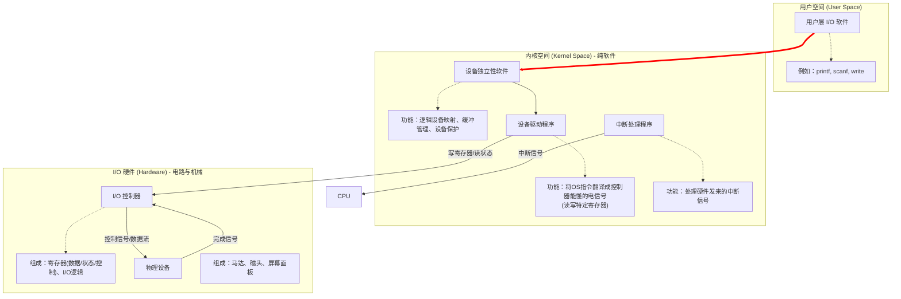
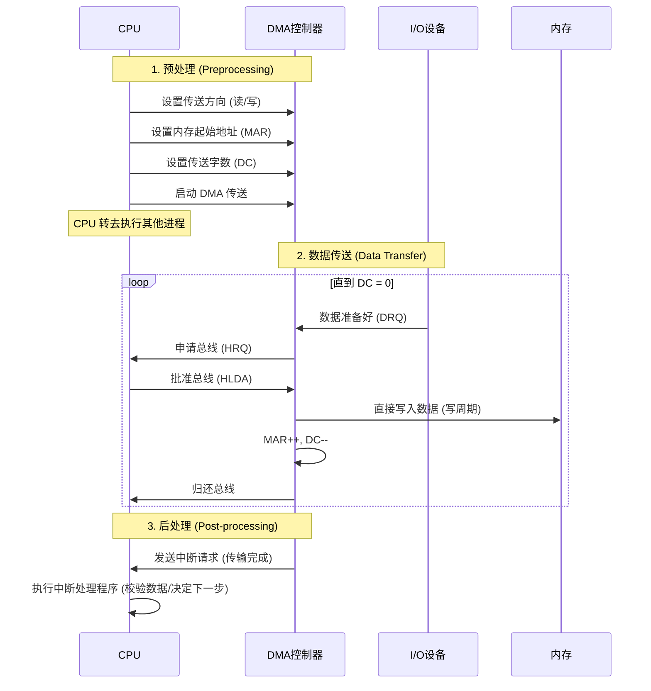

假脱机技术：[[Spooling]]
### 模块一（Part 1）：I/O 设备分类与设备控制器详解

> **核心逻辑**：操作系统（软件）无法直接控制物理设备的机械/电子细节（如控制磁盘马达转速、控制屏幕像素电压）。OS 只与**设备控  制器**交互，而设备控制器去指挥**物理设备**。

#### 1. I/O 系统的复杂性之源

在进入具体概念前，先建立一个宏观视角。为什么 I/O 系统是 OS 中最杂乱、代码量最大的部分？

1. **速度差异极大**：键盘输入（10 Bytes/s） vs NVMe SSD（7000 MB/s）。
    
2. **控制复杂度不同**：简单的蜂鸣器（开/关） vs 显卡（复杂的 GPU 指令集）。
    
3. **数据传输单位不同**：字节流（键盘） vs 数据块（磁盘）。
    
4. **错误处理**：I/O 是最容易出错的地方（介质损坏、网络超时、缺纸）。
    

---

#### 2. I/O 设备的分类（深度视角）

考试中最常考的是按**信息交换单位**分类。这不仅是分类，更是决定 OS 采用何种策略管理设备的依据。

##### A. 块设备 (Block Devices)

- **典型代表**：硬盘（HDD/SSD）、光盘、USB 闪存。
    
- **数据特征**：数据以固定大小的“块”（Block）为单位进行传输（如 512B 或 4KB）。
    
- **核心特性**：
    
    1. **可寻址 (Addressable)**：你可以说“我要读第 100 号块”。这是**文件系统**建立的基础。
        
    2. **高传输速率**：通常使用 **DMA** 方式传输。
        
    3. **可缓存 (Cacheable)**：因为数据是块状的，OS 可以很容易地在内存中建立 Buffer Cache 来优化性能。
        
- **OS 策略**：OS 会为块设备提供复杂的调度算法（如电梯算法）来优化寻道时间。
    

##### B. 字符设备 (Character Devices)

- **典型代表**：键盘、鼠标、打印机、串口终端。
    
- **数据特征**：数据以“字符”为单位，是**字节流 (Byte Stream)**。
    
- **核心特性**：
    
    1. **不可寻址**：你不能说“我要读键盘输入的倒数第 5 个字符”，它过去了就是过去了。
        
    2. **时序敏感**：通常由**中断**驱动，来一个字符处理一个。
        
    3. **无缓存或简单缓冲**：通常不需要复杂的块缓存，但可能需要行缓冲（Line Buffer）。
        
- **OS 策略**：OS 提供系统调用（如 `getc`, `putc`），通常不涉及复杂的调度算法。
    

> 💡 架构师视角的延展：
> 
> 在 Linux 中，你可以通过 ls -l /dev 查看设备文件。
> 
> - `b` 开头（如 `brw-rw----`）是块设备。
>     
> - `c` 开头（如 `crw-rw----`）是字符设备。
>     
> - 思考点：屏幕（显示器）是块设备还是字符设备？
>     
>     (虽然它显示像素矩阵，但在传统 Unix/Linux 哲学中，显存往往被映射，但在逻辑接口上，早期的终端是字符设备。现代 GPU 则是复杂的内存映射设备，不完全符合二分法，但在考研 408 语境下，打印机是字符设备，磁盘是块设备，这是铁律。)
>     

---

#### 3. 设备控制器 (Device Controller) —— 硬件核心

这是本模块的**重难点**。CPU 从来不直接跟磁盘的磁头说话，CPU 甚至不知道磁盘长什么样。CPU 只跟**设备控制器**说话。

##### A. 控制器的功能

设备控制器（Device Controller）是插在计算机主板扩展槽上的印刷电路板（或集成在南桥芯片中）。

1. **接收和识别命令**：CPU 发来指令（Read, Write），控制器将其存入控制寄存器并解码。
    
2. **数据交换**：作为 CPU 和设备之间的“中介”。CPU 处理速度极快，设备慢，控制器内部必须有**数据缓冲（Data Buffer）**来暂存数据。
    
3. **设备状态报告**：设备是忙（Busy）还是闲（Idle）？出错了没？控制器通过状态寄存器告诉 CPU。
    
4. **地址识别**：这就涉及到了后面要讲的 I/O 端口地址。
    

##### B. 控制器的内部组成（考研常考图）

你可以把控制器想象成一个小型的“专用 CPU”。

|**组件**|**功能**|**深度解析**|
|---|---|---|
|**控制器与 CPU 的接口**|数据线、地址线、控制线|这里包含三类寄存器：<br><br>  <br><br>1. **数据寄存器**：放数据（CPU $\leftrightarrow$ 寄存器 $\leftrightarrow$ 设备）<br><br>  <br><br>2. **控制寄存器**：放命令（CPU $\rightarrow$ 寄存器）<br><br>  <br><br>3. **状态寄存器**：放状态（寄存器 $\rightarrow$ CPU）|
|**控制器与设备的接口**|信号线|每个接口连接一个物理设备。包含数据信号、控制信号（启动马达）、状态信号（门没关）。|
|**I/O 逻辑**|类似 CPU 的运算单元|负责解码 CPU 的命令，并向物理设备接口发送对应的电信号。|

##### C. 为什么需要控制器？（从电子工程角度理解）

- **信号转换**：CPU 处理的是 TTL 电平（0V/5V 或 0V/1.8V 的数字信号），而磁盘驱动器可能需要模拟信号来控制磁头偏转，或者复杂的串行信号。控制器负责这种“数/模”或“协议”转换。
    
- **串并转换**：内部总线通常是**并行**的（32位/64位），而很多外部设备接口（如 SATA, USB）是**串行**的。控制器负责将串行比特流组装成字，或反之。
### 1. 核心图解：I/O 系统的软硬件分界
 
请仔细看中间的 **“软硬件分界线”**。



#### 深度解析这个误区

- **你以为的**：I/O 控制器是一个包罗万象的大黑盒，里面装了驱动程序。
    
- **实际情况**：
    
    - **驱动程序 (Driver)**：是 CPU 脑子里的**知识**（代码）。比如 CPU 想读磁盘，它需要知道“怎么跟这块特定的磁盘说话”，这就是驱动程序。
        
    - **I/O 控制器 (Controller)**：是设备的**耳朵和嘴巴**。它听不懂复杂的 OS 指令，它只能听懂很傻瓜的指令（比如：把端口 0x60 的电平拉高）。
        
    - **交互过程**：驱动程序（软件）通过总线，向控制器的**寄存器**（硬件）写数据。
        

---

### 2. 回顾你的 Check Point 回答

既然理清了软硬件，我们快速点评一下你刚才的回答，并补全剩下的细节。

- **Q1 (U盘是块设备?)**：
    
    - **你的回答**：“因为有设备控制器的封装，是块设备，可寻址传输快。”
        
    - **点评**：**正确且深刻**。
        
    - **补充细节**：U盘内部有一个 **FTL (Flash Translation Layer)** 芯片（即控制器逻辑），它专门负责把 Flash 芯片复杂的物理特性（擦除、写入寿命等）**伪装**成简单的、可寻址的“块”。OS 根本不知道下面是 Flash，以为就是块磁盘。
        
- **Q2 (数据流动路径 - 补全)**：
    
    - CPU 不会直接写磁盘盘片。
        
    - **路径**：`内存` -> `系统总线` -> `控制器的数据寄存器` -> `控制器的内部缓冲区` (暂存，进行并串转换/校验) -> `设备接口` -> `磁头写入盘片`。
        
    - **重点**：控制器里的**缓冲区**非常重要，它缓解了 CPU 和磁盘巨大的速度差异。
        
- **Q3 (如果没有状态寄存器 - 补全)**：
    
    - **后果**：CPU 变成了“瞎子”。
        
    - CPU 发出“写”命令后，不知道设备是不是正如火如荼地写，还是已经冒烟烧坏了，也不知道什么时候写完。
        
    - **结局**：CPU 只能进行“盲操作”（Open-loop control），这在现代计算机中是不可接受的，或者必须使用极其低效的延时等待（Sleep 一会儿猜它做完了）。
### 模块一（Part 2）：I/O 端口与编址方式

理清了控制器是硬件，接下来的问题是：CPU 也就是驱动程序，到底怎么找到这个控制器？

这就好比送快递，你手里有包裹（数据），但你得知道控制器的“门牌号”。这个门牌号就是 I/O 端口地址。

每个控制器有多个寄存器（数据、状态、控制），每个寄存器都需要一个地址。

#### 1. 两种核心编址方式（考研/期末必考对比）

这是 CPU 指令集架构（ISA）层面的设计差异。

##### A. 独立编址 (I/O Mapped I/O) —— 专用的路

- **原理**：内存的地址是 0~N，I/O 端口的地址是 0~M。**两套地址空间完全独立，互不干扰。**
    
- **指令区分**：CPU 必须有**专门的 I/O 指令**。
    
    - 读内存：`MOV AX, [1000]`
        
    - 读 I/O：`IN AL, 60H` (去 60H 号端口读数据)
        
- **典型代表**：**Intel x86 架构** (你现在的电脑)。
    
- **优点**：代码清晰，一看 `IN/OUT` 就知道是在操作硬件；不占用内存地址空间。
    
- **缺点**：I/O 指令通常功能少（不如内存指令丰富，无法直接运算），硬件设计复杂（需要两组控制信号：MEM Read/Write 和 IO Read/Write）。
    

##### B. 统一编址 (Memory Mapped I/O) —— 都是内存
内存映像IO
- **原理**：把内存地址空间的高端部分（比如 4GB 内存的最后几 MB）划出来，**强行分配**给 I/O 控制器。
    
- **指令区分**：**没有专门的 I/O 指令**。CPU 觉得它只是在读写内存，实际上是在操作硬件。
    
    - `MOV R1, [0xFF00]` -> 这个地址可能直接对应显卡的某个寄存器。
        
- **典型代表**：**ARM 架构** (手机、Mac M系列)、MIPS、RISC-V。
    
- **优点**：
    
    1. **指令丰富**：所有能操作内存的指令（加减乘除、位运算）都能直接对硬件寄存器操作！
        
    2. **可扩展性好**：硬件设计简单。
        
- **缺点**：
    
    1. **吞内存**：物理内存会被挖走一块（这就是为什么你买 4G 显存的显卡，系统内存可能会少一点）。
        
    2. **安全性**：需要利用虚拟内存机制小心保护，防止程序乱写“内存”导致硬件动作。
        
    3. **Cache 问题**：这是一大坑点！**对设备寄存器的访问绝对不能被 Cache**（必须由硬件或 OS 设置为 Uncacheable），否则 CPU 以为读的是 Cache 里的旧值，实际上设备状态早变了。
        

#### 2. 对比总结表（Obsidian 笔记素材）

|**特性**|**独立编址 (x86)**|**统一编址 (ARM/RISC)**|
|---|---|---|
|**地址空间**|内存与 I/O 独立|内存与 I/O 统一|
|**指令**|专用 (`IN`, `OUT`)|通用 (`MOV`, `LOAD`, `STORE`)|
|**地址范围**|I/O 地址空间较小|占用部分内存空间|
|**硬件设计**|复杂 (需区分 MEM/IO 信号)|简单 (视为内存访问)|
|**灵活性**|差|优 (可对端口进行复杂运算)|
### 🎯 深度复盘 Check Point 2

#### 1. 关于代码实现

- **你的回答**：“不需要（专用指令）...调用一个函数吗？”
    
- **专家修正**：
    
    - **不需要**是对的。
        
    - **不是调用函数**：在最底层的驱动代码（C语言）中，我们通常使用**指针**直接操作内存地址。
        
    - **标准写法**：
        ```c
        // 定义一个指向 0xF000 的指针，强制转换为无符号整型指针
        // volatile 是灵魂！下面会讲
        volatile unsigned int *led_register = (unsigned int *)0xF000;
        
        *led_register = 1; // 像写变量一样写硬件，灯亮
        ```
        

#### 2. 关于 Cache 问题（重难点）

- **你的回答**：“把寄存器存成cache然后读的是cache，但是cache没及时更新？”
    
- **专家修正**：
    
    - 现象描述基本正确，但**机制解释**可以更精准。
        
    - **问题核心**：这是 Cache 的 **Write-Back（回写）策略** 导致的。
        
    - **过程还原**：
        
        1. CPU 执行 `*led_register = 1`。
            
        2. 数据被写入了 **CPU Cache**，并将该 Cache 行标记为“脏”（Dirty），**并没有**立刻写穿（Write-through）到物理内存（也就是硬件寄存器）。
            
        3. **结果**：CPU 自嗨以为写了，Cache 里确实是 1（所以你读回来也是 1），但**硬件控制器根本没收到电信号**，灯当然不亮。
            
    - **解决方案**：
        
        1. **软件层面**：使用 C 语言的 **`volatile`** 关键字。它告诉编译器：“这个变量随时可能变，**别优化，别缓存到寄存器**，每次都老老实实去地址里读写”。
            
        2. **系统层面**：在页表（Page Table）中将这一页内存标记为 **Uncacheable（不可缓存）**。这是编写驱动程序的第一条军规。

### 模块二：I/O 控制方式（Part 1）

> **核心叙事线索**：I/O 控制方式的发展史，就是一部 **CPU 如何一步步摆脱“奴隶”身份，成为“管理者”** 的解放史。
> 
> 我们将介绍四种方式：程序直接控制 -> 中断驱动 -> DMA -> 通道。
> 
> 本次对话我们要彻底吃透前两种：从“忙等”到“被动响应”的跨越。

#### 1. 程序直接控制方式 (Programmed I/O) —— 也就是“轮询”

这是最古老、最简单，但也是最笨的方式。

- **原理**：CPU 发出 I/O 命令后，不断地去查询设备控制器的**状态寄存器**。
    
    - CPU：“好了没？” -> 控制器：“没”。
        
    - CPU：“好了没？” -> 控制器：“没”。
        
    - ... (重复一万次) ...
        
    - CPU：“好了没？” -> 控制器：“好了”。
        
    - CPU：“行，那我把数据读到寄存器里。”
        
- **流程图解**：
    
    1. CPU 向控制器发读指令。
        
    2. **死循环 (Busy Wait)**：CPU 读状态寄存器 -> 检查 Busy 位 -> 如果 Busy 继续循环。
        
    3. 从数据寄存器读字。
        
    4. 写入内存。
        
    5. 检查是否读完？没读完继续步骤 1。
        
- **缺点（致命）**：**CPU 利用率极其低下**。
    
    - CPU 的速度是纳秒级，I/O 是毫秒级。在等待的这段时间里，CPU 本可以执行几亿条指令，却全被浪费在问“好了没”上。
        
    - **无法并行**：CPU 和 I/O 设备串行工作。
        
- **优点**：硬件极其简单，无需中断控制器支持。
    

#### 2. 中断驱动方式 (Interrupt-Driven I/O) —— 也就是“叫号”

为了解决“忙等”问题，引入了**中断机制**。

- **原理**：
    
    1. CPU 发出读指令。
        
    2. **CPU 转头去干别的**：保留当前进程环境，调度其他进程运行（或者当前进程挂起）。
        
    3. **设备干活**：设备控制器准备数据。
        
    4. **发送信号**：数据准备好了，控制器通过中断线给 CPU 发送一个 **中断信号 (INTR)**。
        
    5. **CPU 处理**：CPU 收到信号，暂停当前工作，保存现场，跳到 **[[中断处理程序]] (ISR)**。
        
    6. **搬运数据**：在 ISR 里，CPU 把数据从控制器读到内存。
        
    7. **恢复**：CPU 恢复之前的现场，继续执行。
        
- **巨大的进步**：**CPU 和 I/O 设备并行工作了**。CPU 只有在“发命令”和“搬数据”这两个瞬间参与 I/O，中间漫长的等待时间被释放出来了。
    
- **依然存在的问题（瓶颈）**：
    
    - **中断也是有成本的**：
        
        - **保存/恢复现场**（压栈/弹栈）。
            
        - **流水线断流**（Pipeline Flush）。
            
        - **TLB/Cache 污染**。
            
    - **频率太高**：对于键盘（每秒几个字符），中断很完美。但对于**磁盘**（每秒传输几兆数据），如果 **每传输一个字节（或一个字）** 都打断一次 CPU，CPU 就会被中断淹没，根本没法干正事。
        
    - **关键结论**：中断驱动方式适合**低速、字符型**设备，不适合高速块设备。
        

#### 3. 深度对比：轮询 vs 中断（笔记表格）

| **特性**       | **程序直接控制 (轮询)**         | **中断驱动方式**      |
| ------------ | ----------------------- | --------------- |
| **CPU 状态**   | 忙等 (Busy Wait)，占用率 100% | 阻塞/切换，可执行其他进程   |
| **并行性**      | CPU 与设备**串行**           | CPU 与设备**并行**   |
| **I/O 传输单位** | 字 (Word) / 字节           | 字 (Word) / 字节   |
| **干预频率**     | 极高 (时刻监控)               | 高 (每传一个字就要中断一次) |
| **适用场景**     | 极简单的嵌入式系统               | 键盘、鼠标、低速外设      |
| **核心痛点**     | 浪费 CPU 时间               | 频繁中断导致 CPU 开销大  |
果然……中断传一个字就中断一次

### 模块二（Part 2）：DMA 方式 (Direct Memory Access)

#### 1. 核心思想：权限下放 (Delegation)

在中断方式中，CPU 是亲自通过 MOV 指令把数据从 I/O 寄存器读到 CPU 寄存器，再写入内存。

DMA 的核心思想是：CPU 告诉 DMA 控制器：“哪怕数据再多，你直接把它们从设备搬到内存里去，搬完了再叫我，别来烦我。”

- **谁是主导？** 在数据传输期间，**DMA 控制器取代 CPU 成为总线的主人 (Bus Master)**。
    
- **CPU 干嘛？** CPU 在设置好 DMA 后，可以去执行其他线程，完全不参与数据搬运。
    

---

#### 2. 硬件架构：DMA 控制器 (DMAC)

DMA 控制器 (DMAC) 是这一阶段的主角。为了能独立工作，它必须拥有类似 CPU 的部分寄存器结构。

|**核心寄存器**|**功能深度解析**|
|---|---|
|**MAR (Memory Address Register)**|**内存地址寄存器**。存放数据要写入（或读出）的**内存起始地址**。每传送一个字，该地址自动 +1。|
|**DC (Data Counter)**|**数据计数器**。存放还剩多少个字需要传送。每传送一个字，DC 自动 -1。当 DC 减为 0 时，表示传输结束。|
|**CR (Command Register)**|**命令寄存器**。存放 CPU 发来的指令（如：是读还是写？是用突发模式还是周期挪用？）。|
|**SR (Status Register)**|**状态寄存器**。记录当前状态（如：正在传输、传输完成、出错）。|

> 💡 架构师视角：总线仲裁 (Bus Arbitration)
> 
> 你可能会问：总线只有一条，CPU 要用，DMA 也要用，谁说了算？
> 
> 这涉及到一个硬件握手协议：
> 
> 1. **HRQ (Hold Request)**: DMAC 向 CPU 发送“总线请求”信号。
>     
> 2. **HLDA (Hold Acknowledge)**: CPU 执行完当前总线周期后，释放总线控制权，并回送“总线响应”信号。
>     
> 3. **接管**：DMAC 此时才获得总线控制权，开始搬运数据。
>     

---

#### 3. DMA 的工作流程 (四步曲)

这是考试简答题的标准答案，必须背熟。


1. **预处理**：CPU 初始化 DMAC 的寄存器。
    
2. **数据传送**：**完全由硬件（DMAC）控制**。注意，这里的数据流向是 `设备 -> DMAC -> 内存`，**完全不经过 CPU**。
    
3. **后处理**：当整块数据传完（DC=0），DMAC 发中断告诉 CPU：“老板，货搬完了”。
    

---

#### 4. DMA 的传输模式（深度考点）

DMA 抢占总线的方式有三种，这是细节中的魔鬼。

##### A. 停止 CPU 访问法 (Burst Mode / 突发模式)

- **原理**：DMAC 霸占总线，一口气把一块数据传完，传完才还给 CPU。
    
- **后果**：传输期间 CPU 彻底挂起，无法取指令，完全停止工作。
    
- **适用**：极高速的数据传输，或者 CPU 也没啥别的事干的时候。
    

##### B. 周期挪用法 (Cycle Stealing / 周期窃取) —— **最常考**

- **原理**：DMAC 和 CPU 交替使用总线。
    
    - 当 I/O 设备有数据时，DMAC **“偷”** 一个总线周期（Bus Cycle）来传一个字。
        
    - 传完这个字，立即归还总线给 CPU。
        
- **深度细节**：
    
    - 如果 CPU 正在做**内部运算**（不涉及总线访问），DMA 偷走总线对 CPU **毫无影响**！这是效率最高的时刻。
        
    - 如果 CPU 正想访存，那就得暂停一下（插入一个等待状态），让 DMA 先用。
        
- **特点**：既不让 CPU 彻底停摆，又能及时响应 I/O。
    

##### C. 透明 DMA 法 (Transparent Mode)

- **原理**：DMA 只在 CPU 不用总线的时候（例如 CPU 正在译码或做 ALU 运算时）偷偷用总线。
    
- **难点**：硬件必须极其精准地检测 CPU 的总线状态，硬件设计最复杂。
    

---

#### 5. 深度对比：中断 vs DMA（笔记核心表格）

这张表是你在考场上区分这两种方式的救命稻草。

| **维度**     | **中断驱动方式**                                    | **DMA 方式**              |
| ---------- | --------------------------------------------- | ----------------------- |
| **数据传输者**  | **CPU** (软件指令 `MOV`)                          | **DMAC** (硬件直接连线)       |
| **中断频率**   | 极高 (每传一个**字**就中断)                             | 低 (每传一个**块**才中断)        |
| **CPU 干预** | 开始、传输过程、结束都干预                                 | 仅在开始(预处理)和结束(后处理)干预     |
| **传输通道**   | 设备 $\leftrightarrow$ CPU $\leftrightarrow$ 内存 | 设备 $\leftrightarrow$ 内存 |
| **程序切换**   | 需要保护现场/恢复现场                                   | 不需要 (仅在借用总线，不涉及上下文切换)   |
| **硬件成本**   | 简单                                            | 复杂 (需要 DMA 控制器)         |
| **适用场景**   | 低速设备 (键盘/鼠标)                                  | 高速块设备 (磁盘/显卡/网卡)        |
### Checkpoint
#### 1. 核心疑问澄清：DMA 控制器在 CPU 里面吗？

**答案：不在 CPU 核心（Core）里面，它是 CPU 的“邻居”或“下属”。**

- **逻辑上（考试标准答案）**：DMA 控制器 (DMAC) 是一个**独立**于 CPU 的硬件组件。它和 CPU 一样，都是挂在**系统总线**上的设备。
    
    - CPU 是总经理，在总线的一端。
        
    - DMAC 是物流经理，在总线的另一端。
        
    - 内存是仓库。
        
    - 它们通过总线（走廊）来交换数据。
        
- **物理上（现代架构）**：虽然现在的 CPU（如 Intel i9 或 手机里的骁龙）把很多东西都封装在一起（SoC, System on Chip），但在**操作系统原理**的视图中，我们永远把 DMAC 看作是**外部**的一个独立模块，它必须通过竞争才能获得总线控制权。
    

#### 2. Check Point 4 复盘

##### Q1: 谁的优先级更高？（DMA vs CPU）

- **你的回答**：“DMA优先级更高，防止写数据丢失。”
    
- **点评**：✅ **完全正确**。
    
- **深度原理解析（笔记重点）**：
    
    - **I/O 的紧迫性**：磁盘在转，网线在传，数据稍纵即逝。如果不立刻把数据拿走，新的数据就会覆盖旧数据（**Data Overrun / 数据溢出**），导致硬件层面的丢包。
        
    - **CPU 的宽容度**：CPU 如果拿不到总线，无非就是晚一两个时钟周期取指令，最多只是运行慢了一点点，**不会发生错误**。
        
    - **结论**：**DMA 请求 > 中断请求 > 正常的 CPU 访存**。
        

##### Q2: CPU 真的完全不干预吗？

- **你的回答**：“不对的，一开始要有读指令DMA才会开始传数据。”
    
- **点评**：✅ **正确**。
    
- **深度原理解析**：
    
    - DMA 不是“全自动”，它是“半自动”。
        
    - **CPU 的工作**：
        
        1. **初始化**：设置传多少数据、从哪开始、去哪里（预处理）。
            
        2. **善后**：数据传完了，DMA 发中断，CPU 还要去检查传输是否成功（后处理）。
            
    - **结论**：CPU 是**总体指挥**，DMA 是**具体执行**。
### 模块二（Part 3）：通道控制方式 (Channel Control)

#### 1. 为什么有了 DMA 还需要通道？（核心痛点）

DMA 虽然好，但它有一个致命的弱点：**太“笨”了**。

- **DMA 的局限**：DMA 只能简单地搬运一块**连续**的数据。
    
- **场景**：假设你要读取磁盘上分散在 5 个不同位置的数据块。
    
    - **用 DMA**：CPU 需要发 5 次命令，处理 5 次中断（每次搬完一块都要向 CPU 汇报）。
        
    - **后果**：对于繁忙的服务器，这种频率的中断依然无法忍受。
        

**通道的出现**：为了进一步减少 CPU 的干预，我们引入了一个**专门负责 I/O 的小型处理器**。

#### 2. 通道是什么？

- **定义**：通道（I/O Channel）是一个具有**特殊指令集**的处理机。
    
- **核心特征**：
    
    1. **独立执行程序**：它能执行由 **通道指令**（也叫 **CCW**, Channel Command Word）组成的**通道程序**。
        
    2. **更强的控制权**：CPU 只要发一条指令“去把这几件事情办了”，通道就会根据内存里的“任务清单”自动指挥多个控制器完成所有任务，最后才给 CPU 发一次中断。
        
- **硬件层级**：`CPU` -> `通道` -> `I/O 控制器` -> `设备`。
    

#### 3. 通道的工作流程 (笔记重点)

这里最容易混淆的是：**通道程序是谁写的？在哪运行？**

1. **CPU 侧（准备阶段）**：
    
    - CPU 里的操作系统根据 I/O 请求，生成一段 **通道程序**，并存放在**内存**中。（注意：任务清单在内存里）。
        
    - CPU 发出一个极其简短的指令：**启动 I/O (Start I/O)**，告诉通道：“清单在内存地址 X 处，你去干活吧”。
        
2. **通道侧（执行阶段）**：
    
    - 通道从内存中取出通道指令。
        
    - 通道根据指令，向 I/O 控制器发出具体的命令（读/写/磁头移动）。
        
    - 通道控制数据在内存和设备之间流动。
        
3. **结束阶段**：
    
    - 当整个通道程序（可能包含多次读写）全部执行完毕，通道才向 CPU 发送**一次**中断信号。
        

> **💡 形象类比：**
> 
> - **中断方式**：老板（CPU）让员工搬砖，每搬一块砖，员工都跑来问老板：“搬好了，下一块搬哪？”
>     
> - **DMA 方式**：老板告诉员工：“把这堆砖从 A 搬到 B”。搬完了，员工才来汇报。
>     
> - **通道方式**：老板写了一张纸条（通道程序）：“1. 把 A 搬到 B；2. 休息 5 分钟；3. 把 C 搬到 D”。员工拿着纸条自己去干，全部做完了才来汇报。
>     

---

#### 4. 通道的类型（考研/期末必考选择题）

通道不仅是一个处理器，它还是一个“带宽分配器”。根据它连接和管理设备的方式，分为三类：

|**类型**|**中文名**|**英文名**|**形象比喻**|**适用设备**|**关键特性**|
|---|---|---|---|---|---|
|**字节多路通道**|字节多路|Byte Multiplexer|**发牌员**|低速设备 (键盘, 打印机)|**分时共享**。轮流为每个设备传送一个**字节**。虽然连接了很多设备，但看起来像是大家都在同时工作。|
|**选择通道**|选择通道|Selector Channel|**独占的消防水管**|高速设备 (磁盘, 磁带)|**独占式**。一旦连上一个设备，就死心塌地为它服务，直到数据传完。**缺点**：如果设备在寻道（慢），通道也得干等，效率低。|
|**数组多路通道**|数组多路|Block Multiplexer|**多线程下载**|高速且复杂的设备|**分时 + 独占的结合**。数据传输时独占（像选择通道），设备寻道/忙碌时释放通道去服务别人（像字节多路）。**效率最高**。|

---

### 5. 史诗级总结：I/O 控制方式的演进

这是本模块的**最终总结**，请务必完整摘录到笔记中。这是分析题和综合题的解题钥匙。

|**维度**|**1. 程序直接控制**|**2. 中断驱动**|**3. DMA 方式**|**4. 通道控制**|
|---|---|---|---|---|
|**CPU 干预频率**|极高 (100%)|高 (每字一次)|低 (每块一次)|**极低** (每组块/每个请求一次)|
|**数据传输单位**|字 (Word)|字 (Word)|**块 (Block)**|**一组块 (Block Group)**|
|**数据流向**|设 $\leftrightarrow$ CPU $\leftrightarrow$ 存|设 $\leftrightarrow$ CPU $\leftrightarrow$ 存|**设 $\leftrightarrow$ 存**|**设 $\leftrightarrow$ 存**|
|**主要缺点**|CPU 忙等|中断开销大|只能处理连续块|硬件复杂，成本高|
|**硬件角色**|无|中断控制器|DMA 控制器|**I/O 处理器 (通道)**|
|**并行程度**|串行|仅数据准备时并行|读写过程并行|**全并行** (甚至包含复杂的 I/O 逻辑)|
### 模块三：I/O 软件层次结构 (I/O Software Layers)

> **核心设计哲学**：**分层 (Layering)** 与 **封装 (Encapsulation)**。
> 
> 操作系统为了解决 I/O 设备的复杂性和多样性，将软件组织成一种层次结构。
> 
> - **下层**：屏蔽硬件细节，向上层提供统一服务。
>     
> - **上层**：不关心底层硬件是如何实现的，只关心逻辑操作。
>     
> 
> **终极目标**：实现 **设备独立性 (Device Independence)**。
> 
> - 即：编写应用程序时，无需硬编码特定的物理设备（如“希捷硬盘 S/N: 12345”），而只需要操作逻辑设备（如“文件 a.txt”）。
>     

#### 1. 层次结构总览图

这是理解整个 I/O 系统软件架构的地图。请在笔记中保留这个层级顺序（从下往上）。

---

#### 2. 各层深度解析（由底向上）

##### Layer 1: 中断处理程序 (Interrupt Handlers)

- **角色**：**硬件与系统的“第一接触点”**。
    
- **触发时机**：当 I/O 操作完成（或出错）时，硬件发出信号，CPU 强行跳转到这里。
    
- **核心任务**（必须极快）：
    
    1. **保护现场**：保存当前被中断进程的寄存器上下文。
        
    2. **确认中断源**：是谁发的中断？（读取中断控制器）。
        
    3. **消除中断**：向硬件发送 Acknowledge 信号（“我知道了，别叫了”）。
        
    4. **唤醒驱动**：通过信号量（V 操作）唤醒正在睡眠等待该 I/O 的驱动程序进程。
        
- **笔记重点**：它不仅处理 I/O，还处理时钟中断、异常等。它是操作系统最繁忙的部分。
    

##### Layer 2: 设备驱动程序 (Device Drivers)

- **角色**：**硬件的“翻译官”**。这是唯一知道硬件具体细节（寄存器、指令集）的软件层。
    
- **特点**：
    
    - **设备相关性**：每类设备（如 磁盘、网卡、打印机）都有专门的驱动。
        
    - **操作硬件**：它是唯一有权限直接读写 **I/O 端口（寄存器）** 的软件。
        
- **核心任务**：
    
    - 接收上层发来的抽象命令（如 `Read Block n`）。
        
    - 检查设备状态（是否忙碌）。
        
    - **翻译**：将抽象命令转化为控制器能懂的一系列寄存器操作（如：设置柱面、磁头、扇区，写入启动位）。
        

##### Layer 3: 设备独立性软件 (Device-Independent Software) —— **考研重灾区**

- **角色**：**系统的“大管家”**。它执行所有 **与具体硬件无关** 的 I/O 功能。
    
- **别名**：系统 I/O 软件 (System I/O Software)。
    
- **五大核心功能**（必须背诵）：
    
    1. **设备命名与映射**：
        
        - 将**逻辑设备名**（如 `/dev/printer` 或 `LPT1`）映射到**物理设备表**（如 端口 0x378）。
            
        - 这是实现“设备独立性”的关键步骤。
            
    2. **设备保护**：
        
        - 检查用户是否有权限访问该设备（类似文件的 rwx 权限）。
            
    3. **缓冲管理 (Buffering)**：
        
        - 管理缓冲区（单缓冲、双缓冲、缓冲池），解决 CPU 与设备速度不匹配的问题。
            
    4. **错误处理**：
        
        - 向上层报告统一的错误（如 `Device Busy`, `IO Error`），屏蔽底层的重试细节。
            
    5. **设备的分配与回收**：
        
        - 对于独占设备（如打印机），需要排队申请。
            

##### Layer 4: 用户层 I/O 软件 (User-Level I/O Software)

- **角色**：**用户的“接口”**。
    
- **组成**：
    
    1. **库函数**：C 语言的 `stdio` 库（`printf`, `scanf`, `fopen`）。它们并不直接操作硬件，而是封装了系统调用。
        
    2. **SPOOLing 系统**（假脱机）：在用户层实现的虚拟化技术（后面模块会详讲）。
        
- **工作方式**：通过 **系统调用 (System Call)** 陷入内核，请求 Layer 3 的服务。
    

---

#### 3. 纵向贯通：一个 `read()` 的一生

为了把这些层串起来，我们看一个具体的例子。 **场景**：用户程序执行 `read(fd, buffer, 100)` 从硬盘读取数据。

1. **用户层**：程序调用库函数 `read()`，库函数发起**系统调用**，陷入内核。
    
2. **设备独立性层**：
    
    - 解析 `fd`（文件描述符），找到对应的逻辑设备。
        
    - 查找设备驱动表，找到该设备的驱动程序入口。
        
    - 检查缓存：如果数据已经在高速缓存中，直接复制给用户（结束）；否则，向下请求。
        
3. **设备驱动层**：
    
    - 计算数据在磁盘上的物理位置（柱面、扇区）。
        
    - 向磁盘控制器的寄存器写入指令，启动 I/O。
        
    - **阻塞自己**，让出 CPU。
        
4. **硬件**：磁盘转动，读取数据。完成后，控制器发送**中断信号**。
    
5. **中断处理层**：
    
    - CPU 暂停当前工作，跳转到中断处理程序。
        
    - 保存现场，**唤醒**刚才阻塞的驱动程序。
        
6. **设备驱动层（后续）**：
    
    - 检查状态寄存器，确认读取成功。
        
    - 将数据向上层传递。
        
7. **最终**：数据层层返回，直到用户程序的 buffer 中出现数据。
    

---

### 💡 深度场景测试 (Check Point Module 3)

为了确保你彻底掌握了“哪一层做什么事”，请分析以下 3 个场景。回答完并确认无误后，我们再进入下一个关于“I/O 核心子系统（缓冲与调度）”的模块。

1. **场景 A (权限)**：你在 Linux 终端输入 `cat /dev/sda`，系统提示 `Permission denied`。请问是**哪一层**拒绝了你？为什么？
    
2. **场景 B (翻译)**：操作系统需要向磁盘写入数据，需要把逻辑块号 `LBN = 100` 转换为 `柱面=0, 磁头=1, 扇区=36`。这个复杂的计算是在**哪一层**完成的？
    
3. **场景 C (格式化)**：你在 C 代码中写错了 `printf` 的格式字符串（比如 `%d` 给了个字符串），导致输出乱码。这是**哪一层**的问题？
### 🎯 深度复盘 Check Point Module 3

1. **场景 A (权限拒绝)**：你回答 **“设备独立性层”**。
    
    - ✅ **完全正确**。
        
    - **解析**：设备独立性软件负责“设备保护”。它检查用户的所有权（UID/GID）和文件的权限位。驱动层不管权限，只管干活；硬件层更不管。
        
2. **场景 B (LBN -> CHS 地址翻译)**：你回答 **“设备驱动层”**。
    
    - ✅ **完全正确**。
        
    - **解析**：只有驱动程序知道这块硬盘有几个盘片、几个扇区。上层（设备独立性层）只把硬盘看作是一个巨大的数组（逻辑块 0 ~ N）。
        
3. **场景 C (Printf 格式错误)**：你猜测 **“还是设备驱动层？”**。
    
    - ❌ **错误**。这是 **“用户层 I/O 软件”** 的问题。
        
    - **解析**：`printf` 是 C 语言的标准库函数，运行在**用户态**。当你写错格式符时，库函数在**内存里**拼凑字符串时就出错乱码了。
        
    - **关键点**：等到这串乱码通过系统调用传给驱动层时，驱动层根本不知道这是“乱码”，它只把这看作是一串普通的字符流，忠实地把它打印出来。**驱动层不负责语法检查。**
### 模块四：I/O 核心子系统与关键技术

> 核心矛盾：CPU 的速度（纳秒级）与 I/O 设备的速度（毫秒级/秒级）之间巨大的鸿沟。
> 
> 解决手段：三大法宝 —— 调度、缓冲、假脱机 (SPOOLing)。

#### 1. I/O 调度 (I/O Scheduling)

- **概念**：就像进程调度一样，当多个进程同时请求同一个设备（比如磁盘）时，OS 需要决定先满足谁。
    
- **目标**：公平性 + 高效性（减少物理机械运动，如寻道时间）。
    
- **应用**：主要用于**磁盘调度**（将在模块五详细讲电梯算法等）。此处只需知道它是设备独立性层的功能。
    

---

#### 2. 缓冲技术 (Buffering) —— **计算题核心**

这是本模块的重中之重。OS 在内存中开辟一块区域作为缓冲区。

##### A. 为什么要缓冲？

1. **缓和速度差异**：CPU 算得快，打印机打得慢。先把数据堆在缓冲区，CPU 就可以走了。
    
2. **减少 CPU 中断频率**：
    
    - 无缓冲：每传 1 个字节中断一次。
        
    - 有缓冲：攒满 4KB 缓冲才中断一次。
        
3. **解决数据粒度不匹配**：输出是字节流，磁盘写入是块。
    

##### B. 缓冲的种类与时间分析 (笔记重点)

假设：

- $T$: 数据从设备输入到缓冲区的时间（Input）。
    
- $M$: 数据从缓冲区传送到用户工作区的时间（Move）。
    
- $C$: CPU 处理这块数据的时间（Compute）。
    

**1. 单缓冲 (Single Buffer)**

- **机制**：在操作系统内核空间只开辟**一个**缓冲区。
    
- **规则**：**互斥**。设备往缓冲区写数据时 ($T$)，CPU 不能从缓冲区取数据。必须等写满，$T$ 结束，CPU 才能挪走数据 ($M$)。
    
- 处理一块数据的总时间：
    
    $$Time = \max(C, T) + M$$
    
    - _解释_：设备输入($T$)和CPU处理($C$)可以并行（只要缓冲没在被移动）。但是“移动数据($M$)”必须单独占时间，且通常接在 $T$ 之后。
        
    - **瓶颈**：当设备输入时，CPU 可能在干等（如果 $C < T$）；或者设备在等 CPU 搬数据。
        

**2. 双缓冲 (Double Buffer) —— 也就是“缓冲对换”**

- **机制**：开辟**两个**缓冲区（Buffer 1, Buffer 2）。
    
- **规则**：
    
    - 设备往 Buffer 1 写数据。
        
    - CPU 从 Buffer 2 读数据。
        
    - 写满/读空后，交换角色。
        
- 处理一块数据的总时间：
    
    $$Time = \max(C + M, T)$$
    
    - _解释_：如果 $T$ (设备输入速度) 足够慢，慢到比 CPU 搬运+处理 ($M+C$) 还慢，那么系统就在等设备，时间就是 $T$。反之则是 $C+M$。
        
- **效果**：基本可以实现设备输入与 CPU 处理的**全并行**。
    

**3. 循环缓冲 (Circular Buffer)**

- 多个缓冲区连成一个环。分为“空缓冲区R”和“满缓冲区G”。适合生产者-消费者模型。
    

**4. 缓冲池 (Buffer Pool)**

- **公用**的缓冲区集合。不仅可以用于输入，也可以用于输出。这是现代 OS 的标配。
    

---

#### 3. 设备分配 (Device Allocation)

当进程想要使用设备时，怎么分给它？这涉及到数据结构。

##### A. 四大核心数据结构 (层级从大到小)

请务必在笔记中画出这个从属关系：

1. **SDT (System Device Table, 系统设备表)**：
    
    - 整个系统只有一张。
        
    - 记录所有设备的状态。指针指向 DCT。
        
2. **DCT (Device Control Table, 设备控制表)**：
    
    - **每个设备**一张。
        
    - 记录设备状态（忙/闲）、等待队列。指针指向 COCT。
        
3. **COCT (Controller Control Table, 控制器控制表)**：
    
    - **每个控制器**一张。
        
    - 指针指向 CHCT。
        
4. **CHCT (Channel Control Table, 通道控制表)**：
    
    - **每个通道**一张。
        

##### B. 分配算法（逻辑流程）

这就好比你要去借一本书（设备），你需要先找到图书馆（通道），再找到书架（控制器），最后拿书。

分配顺序：

1. **分设备**：根据逻辑名查 SDT -> 找到 DCT。如果忙，挂起；不忙，分配。
    
2. **分控制器**：查 DCT 找到 COCT。如果忙，挂起；不忙，分配。
    
3. **分通道**：查 COCT 找到 CHCT。如果忙，挂起；不忙，分配。
    

- **注意**：只有三者都分配成功，I/O 系统才算正式启动。**这里极易发生死锁**（银行家算法常用于此）。
    

---

#### 4. SPOOLing 技术 (假脱机) —— 虚拟化始祖

这也是考试简答题的高频考点。

- **全称**：**S**imultaneous **P**eripheral **O**peration **O**n-**L**ine (外部设备联机并行操作)。
    
- **核心思想**：**将独占设备（如打印机）改造为共享设备**。
    
- **原理**：
    
    1. 你按“打印”，数据**不是**直接发给打印机。
        
    2. 数据被拦截，存到了磁盘上的**输出井 (Output Well)** 中。
        
    3. OS 骗你的程序：“打印好了”。你的程序继续运行，不再阻塞。
        
    4. OS 会在后台启动一个守护进程，慢慢把“井”里的数据送给打印机。
        
- **组成部分**：
    
    - **输入井/输出井**：在**磁盘**上。
        
    - **输入缓冲区/输出缓冲区**：在**内存**中。
        
    - **输入进程/输出进程**。
        
- **意义**：实现了“虚拟设备”概念，多个用户可以同时请求打印，互不干扰。