## 调度算法辨析
### 一、 核心算法对比全景表（408 核心考点总结）

| **算法名称**         | **抢占方式** | **平均周转时间** | **系统开销** | **饥饿现象** | **408 核心直觉**       |
| ---------------- | -------- | ---------- | -------- | -------- | ------------------ |
| **FCFS**         | 非抢占      | 较长         | **极低**   | 无        | 对长作业有利，存在“护航效应”    |
| **SJF (非抢占)**    | 非抢占      | **最短（理论）** | 中（需预测）   | **有**    | 追求全局平均指标的最优解       |
| **SRTN (抢占SJF)** | 抢占       | **极短**     | 较高       | **有**    | 408 计算大题的高频考点      |
| **HRRN**         | 非抢占      | 较短         | 较高（需算R）  | 无        | 兼顾长短作业，完美解决饥饿      |
| **RR**           | 抢占       | 较长         | 较高（频繁切换） | 无        | 响应速度最快，时间片是灵魂      |
| **优先级调度**        | 两种均有     | 视优先级定      | 中        | **有**    | 容易造成“大权旁落”（低优先级饿死） |
| **MLFQ**         | 抢占       | 综合表现最优     | **最高**   | 有（理论上）   | 现代 OS 的通用选择，集大成者   |
#错题 
时间片轮转算法是绝对可抢占的！
感觉混淆了好久MLFQ的用法，这是可能饥饿的！

---

### 二、 深度辨析：五个维度的核心较量

#### 1. 平均周转时间（Performance）—— 谁能让用户等最少的时间？

- **冠军：SJF/SRTN**。在数学上，SJF 是证明过的能让平均周转时间达到最小的算法。
    
- **辨析点**：为什么 RR 表现较差？因为 RR 强制轮转，很多快跑完的短作业会被强行中断，推迟了完成时间。
    
- **考研直觉**：如果大题问你“如何让系统平均等待时间最小”，闭眼选 SJF 相关思想。
    

#### 2. 系统开销（Overhead）—— 调度器也是要吃资源的

- **最低：FCFS**。只需要一个简单的 FIFO 队列，不需要任何复杂的计算或频繁的上下文切换。
    
- **最高：MLFQ 和 RR**。
    
    - **RR** 的开销来自于**频繁的上下文切换**（我们之前讲的寄存器、Cache失效等开销）。
        
    - **MLFQ** 的开销来自于**多级队列的管理**和任务频繁的升降级计算。
        
- **计算开销：HRRN**。每次调度都要扫描所有就绪进程并计算响应比 $R$，这在实际系统中其实很奢侈。
    

#### 3. 饥饿风险（Starvation）—— 公平性的终极对决

- **会饥饿：SJF、SRTN、优先级调度、MLFQ**。
    
    - 只要有“插队”逻辑，就可能导致排在后面的长任务永远无法执行。
        
- **不会饥饿：FCFS、RR、HRRN**。
    
    - **HRRN 的精妙之处**：它的响应比公式中分子包含“等待时间”。随着长作业等得越来越久，它的优先级会**动态提高**，最终强行上车。
        

#### 4. 响应时间（Responsiveness）—— 交互式系统的命脉

- **RR 是绝对的王者**。它保证了在 $n$ 个进程下，任何进程都能在 $n \times q$（$q$ 为时间片）时间内获得响应。
    
- **FCFS 是反面教材**。如果前面排了个渲染任务，你的鼠标点击可能几分钟后才会被处理。
    

---

### 三、 408 考点深度避坑指南（考试直觉）

作为“AI 架构师”，你在做 408 题目时，要特别注意以下三个“陷阱”：

#### 陷阱 1：时间片大小对 RR 的影响

- 如果时间片 $\to \infty$，RR 就退化为 **FCFS**。
    
- 如果时间片 $\to 0$，就会产生**无限的上下文切换开销**，系统性能趋于零。
    
- **考点**：通常时间片应该略大于一次典型的交互时间。
    

#### 陷阱 2：SJF 的“不可实现性”

- SJF 虽好，但内核怎么知道一个进程还没运行完需要多久？
    
- **现实解决**：通常使用**指数平滑法**来预测下一次的 CPU 运行区间长度。
    
- **考点**：题目如果没给预测方法，通常是预设已知运行时间，但在理论题中要记得它是“难于实现的”。
    

#### 陷阱 3：MLFQ 的灵活配置

- MLFQ 是唯一一个可以同时具备其他算法优点的算法。
    
    - 第一级队列时间片短 $\to$ 像 RR，照顾短作业。
        
    - 最后一级队列 $\to$ 像 FCFS，照顾长作业。
        
- **考点**：MLFQ 如何防止饥饿？通常会设置一个机制，定时将低优先级队列的所有任务提拔到最高级（类似于“大赦天下”）。
    

---

### 四、 针对 408 大题的解题模板

当你拿到一道计算周转时间的大题，建议建立如下直觉步骤：

1. **列时间轴**：画出甘特图（Gantt Chart），这是唯一的得分保障。
    
2. **标记触发点**：
    
    - **非抢占式**：只看当前进程结束时刻。
        
    - **抢占式**：每当有新进程到达时刻 + 当前进程结束时刻。
        
3. **动态维护就绪队列**：在每个触发点，重新按算法规则排序（算响应比、比剩余时间、比优先级）。
    
4. **死磕定义**：
    
    - $周转 = 完成 - 到达$
        
    - $等待 = 周转 - 运行$
        
    - $带权周转 = \frac{周转}{运行} (\ge 1)$
        

---

### 总结建议

- **追求公平？** 选 RR。
    
- **追求效率？** 选 SJF。
    
- **追求平衡？** 选 HRRN。
    
- **现代系统？** 选 MLFQ。

# 重点：调度算法计算题
### 通用解题神器：甘特图 + 状态表

在开始任何计算之前，请务必在草稿纸上准备好这两个工具，千万不要心算！

1. **甘特图（Gantt Chart）**：横向的时间轴，画出谁在什么时候占用了 CPU。
    
2. **剩余时间表**：对于抢占式算法，必须实时记录每个进程还剩多少时间没跑完。
    

---

### 第一战：先来先服务 (FCFS) —— 只有唯一的坑

FCFS 逻辑最简单（谁先到谁先跑），但历年真题中，考生最容易栽在 **“CPU 空闲”** 这个陷阱上。

#### 1. 计算逻辑

- **规则**：按 `到达时间` 排序，非抢占。
    
- **关键点**：如果上一个进程结束时（例如 10:00），下一个进程还没到（例如 10:05 到），那么 **10:00~10:05 这段时间 CPU 是空闲的**。你必须把这段空窗期画出来！
    

#### 2. 典型例题演示

**题目**：

- P1: 到达 0，服务 5
    
- P2: 到达 7，服务 2
    

**解题过程**：

1. **t=0**：P1 到达，直接运行。
    
2. **t=5**：P1 运行结束。此时 P2 还没来（它 7 才来）。
    
3. **t=5~7**：**【高能预警】** CPU 空闲！不要直接让 P2 在 5 开始跑。
    
4. **t=7**：P2 到达，开始运行。
    
5. **t=9**：P2 结束。
    

甘特图：

| P1 (0~5) | 空闲 (5~7) | P2 (7~9) |

#### 3. 必考计算公式（死记）

- 周转时间 = $9 - 7 = 2$
    
- 带权周转 = $2 / 2 = 1.0$
    

---

### 第二战：最短剩余时间优先 (SRTN) —— 考研大题“终极杀手”

这是 **SJF 的抢占版本**。这是 408 计算题中**难度最高、坑最多**的算法。只要能拿下它，其他都是小菜。

#### 1. 核心心法：三个“关键时刻”

做 SRTN 题，你的眼睛要死死盯着这三个时刻，必须**暂停**下来做判断：

1. **有新进程到达时**：这是抢占发生的唯一机会。
    
2. **当前进程运行结束时**：需要从就绪队列挑新的。
    
3. **CPU 空闲时**：等新进程来。
    

#### 2. 抢占判据（背下来）

**当新进程到达时**，比较：

> **正在运行进程的“剩余时间”** VS **新到达进程的“服务时间”**

- 如果 **新进程更短** $\rightarrow$ 立即抢占（旧进程回队首，更新剩余时间）。
    
- 如果 **旧进程更短或相等** $\rightarrow$ 继续运行（新进程排队）。
    
    - _注：若相等，通常遵循“先来先服务”原则，不抢占。_
        

#### 3. 全真模拟演练（建议拿出纸笔跟我一起画）

题目数据：

| 进程  | 到达时间 | 服务时间(Burst) |
| :-- | :--- | :---------- |
| P1  | 0    | 8           |
| P2  | 1    | 4           |
| P3  | 2    | 9           |
| P4  | 3    | 5           |

**详细推演过程（建立直觉）：**

- **t = 0**：
    
    - 只有 P1 到达。P1 上机。
        
    - _状态_：P1 剩 8。
        
- **t = 1**（**关键时刻：P2 到达**）：
    
    - P1 跑了 1 秒，还**剩 7 秒**。
        
    - P2 需要 **4 秒**。
        
    - **PK**：$4 < 7$，**抢占发生！** P1 被赶下来，P2 上机。
        
    - _状态_：P1(剩7), P2(剩4)。当前运行：P2。
        
- **t = 2**（**关键时刻：P3 到达**）：
    
    - P2 跑了 1 秒，还**剩 3 秒**。
        
    - P3 需要 **9 秒**。
        
    - **PK**：$3 < 9$，抢占失败。P2 继续跑。
        
    - _状态_：P1(剩7), P2(剩3), P3(剩9)。当前运行：P2。
        
- **t = 3**（**关键时刻：P4 到达**）：
    
    - P2 又跑了 1 秒，还**剩 2 秒**。
        
    - P4 需要 **5 秒**。
        
    - **PK**：$2 < 5$，抢占失败。P2 继续跑。
        
    - _状态_：P1(剩7), P2(剩2), P3(剩9), P4(剩5)。当前运行：P2。
        
- **t = 5**（**关键时刻：P2 结束**）：
    
    - P2 完成任务。鞠躬下台。
        
    - **选秀环节**：此时队列里有 P1(剩7), P3(剩9), P4(剩5)。
        
    - **PK**：谁最短？**P4(5)** 最短。P4 上机。
        
- **t = 10**（**关键时刻：P4 结束**）：
    
    - P4 跑完 5 秒结束。
        
    - **选秀环节**：队列里有 P1(剩7), P3(剩9)。
        
    - **PK**：**P1(7)** 最短。P1 上机（注意！P1 是接着之前剩下的跑，不是重头跑）。
        
- **t = 17**（**关键时刻：P1 结束**）：
    
    - P1 跑完剩下的 7 秒（$10+7=17$）。
        
    - 只剩 P3。P3 上机。
        
- **t = 26**：
    
    - P3 跑完 9 秒（$17+9=26$）。全部结束。
        

#### 4. 最终甘特图

`| P1(0-1) | P2(1-5) | P4(5-10) | P1(10-17) | P3(17-26) |`

#### 5. 计算得分点（易错！）

算 **P1** 的周转时间时，千万别忘了它**中间被迫等待**的那段时间。

- **P1 周转时间** = 完成时刻(17) - 到达时刻(0) = 17。
    
- **P1 等待时间** = 周转(17) - 服务(8) = 9。（这 9 秒就是 P2 和 P4 插队导致的）。
    

---

### 必考“陷阱”总结（搜罗全网错题库）

在做 SRTN 时，注意这几个特殊情况：

1. **如果剩余时间 == 新进程时间？**
    
    - **规则**：通常**不抢占**。因为上下文切换有开销，且按照“先来先服务”的潜规则，原来的进程优先。
        
2. **如果题目没说“抢占式”还是“非抢占式”的 SJF？**
    
    - **默认**：通常指“非抢占式”。除非明确写了 SRTN 或“抢占式 SJF”。
        
3. **服务时间为 0？**
    
    - 极少见，但如果有，视为立即完成，不占用时间轴，但会影响后续进程的排队顺序。
        

---

**第一弹总结：**

- **FCFS**：只要注意 CPU 空闲。
    
- **SRTN**：时刻盯着**“剩余时间”**，每次新进程来都要 PK 一次。

### 第三战：高响应比优先 (HRRN) —— 计算器的噩梦

这个算法考的是你的**耐心**。因为每次有进程完成，你都必须暂停，拿出计算器，把后面排队的所有进程的响应比 $R$ 全部算一遍，谁高谁上。

#### 1. 核心公式（考场上写在草稿纸最上面）

$$响应比 R = \frac{等待时间 + 服务时间}{服务时间} = 1 + \frac{等待时间}{服务时间}$$

- **直觉技巧**：
    
    - 如果服务时间（分母）一样，谁等得久（分子大），谁先上。
        
    - 如果等待时间一样，谁短（分母小），谁先上。
        
    - **非抢占式**：一旦开始跑，就算外面来了个 $R$ 值爆炸的进程，也不停。
        

#### 2. 全真模拟演练

题目数据：

| 进程  | 到达时间 | 服务时间 |
| :-- | :--- | :--- |
| P1  | 0    | 10   |
| P2  | 2    | 4    |
| P3  | 4    | 3    |
| P4  | 5    | 5    |

**推演过程**：

1. **t=0**：只有 P1 到达。P1 上机，运行 10 秒（非抢占）。
    
    - _P1 运行期间，P2(t=2), P3(t=4), P4(t=5) 陆续到达进入等待队列。_
        
2. **t=10**（**P1 结束，关键时刻！**）：
    
    - 此时 P2, P3, P4 都在等。我们需要计算这三个家伙的 $R$ 值。
        
    - **P2**：等了 $10 - 2 = 8$ 秒。$R_{P2} = 1 + 8/4 = 3.0$
        
    - **P3**：等了 $10 - 4 = 6$ 秒。$R_{P3} = 1 + 6/3 = 3.0$
        
    - **P4**：等了 $10 - 5 = 5$ 秒。$R_{P4} = 1 + 5/5 = 2.0$
        
    - **PK 结果**：P2 和 P3 都是 3.0。规则通常是**谁先到的谁先上**。P2 胜出。
        
3. **t=14**（**P2 结束，跑了4秒**）：
    
    - 此时队列剩 P3, P4。再次计算 $R$（注意等待时间变了！）。
        
    - **P3**：当前时刻 14，到了 4，等了 10 秒。$R_{P3} = 1 + 10/3 \approx 4.33$
        
    - **P4**：当前时刻 14，到了 5，等了 9 秒。$R_{P4} = 1 + 9/5 = 2.8$
        
    - **PK 结果**：P3 完胜。P3 上机。
        
4. **t=17**（**P3 结束**）：
    
    - 只剩 P4。P4 上机。
        
5. **t=22**：全部结束。
    

#### 3. Obsidian Mermaid 甘特图代码

你可以直接复制下面的代码块放入 Obsidian：

```mermaid
gantt
    title 高响应比优先 (HRRN) 调度图
    dateFormat  X
    axisFormat %s
    
    section CPU执行流
    P1 (到达0, 服务10)      :crit, p1, 0, 10
    P2 (R=3.0胜出)         :active, p2, 10, 14
    P3 (R=4.33胜出)        :crit, p3, 14, 17
    P4 (最后执行)           :p4, 17, 22
```



---

### 第四战：时间片轮转 (RR) —— 细节魔鬼

这是最容易做错的算法，没有之一。**90% 的错误都出在“新进程到达”和“旧进程时间片用完”同时发生时，谁排前面的问题。**

#### 1. 黄金规则（408 默认标准）

如果 **进程 A 时间片用完** 的时刻，刚好 **进程 B 到达**：

> 默认规则：先“到达”，后“入队”。
> 
> 也就是说：新进程 B 先进入就绪队列尾部，然后旧进程 A 再排到 B 的后面。
> 
> 口诀：喜新厌旧，新来的排前面。

#### 2. 全真模拟演练

**题目数据**：

- **时间片 q = 2**
    
- **P1**: 到达 0, 服务 5
    
- **P2**: 到达 2, 服务 4
    
- **P3**: 到达 4, 服务 1
    

**推演过程（请拿笔画队列变化）：**

- **t=0**：
    
    - P1 到达。队列：`[P1]`。
        
    - P1 上机。
        
- **t=2**（**冲突高发时刻！**）：
    
    - **事件1**：P1 跑完 2 秒，还剩 3 秒，**时间片用完**。
        
    - **事件2**：P2 刚好**到达**。
        
    - **排队操作**：
        
        1. P2 先进入队列。
            
        2. P1 被剥夺，排到 P2 后面。
            
    - **当前队列**：`[P2, P1]` （P2 在头，P1 在尾）。
        
    - **动作**：P2 上机。
        
- **t=4**（**再次冲突！**）：
    
    - **事件1**：P2 跑完 2 秒，还剩 2 秒，**时间片用完**。
        
    - **事件2**：P3 刚好**到达**。
        
    - **排队操作**：
        
        1. P3 先入队。
            
        2. P2 再入队。
            
        3. 别忘了 P1 还在前面等着呢。
            
    - **当前队列**：`[P1, P3, P2]` （P1 是上次排进去的）。
        
    - **动作**：P1 上机。
        
- **t=6**：
    
    - P1 跑完 2 秒，还剩 1 秒（总共跑了4秒了）。**时间片用完**。
        
    - 没有新进程了。
        
    - **当前队列**：`[P3, P2, P1]`。
        
    - **动作**：P3 上机。
        
- **t=7**：
    
    - P3 服务时间只有 1 秒。**P3 完成退出**。
        
    - **当前队列**：`[P2, P1]`。
        
    - **动作**：P2 上机。
        
- **t=9**：
    
    - P2 跑完剩下的 2 秒。**P2 完成退出**。
        
    - **当前队列**：`[P1]`。
        
    - **动作**：P1 上机。
        
- **t=10**：
    
    - P1 跑完最后 1 秒。**P1 完成退出**。
        

#### 3. Obsidian Mermaid 甘特图代码

RR 算法的图会比较碎，Mermaid 能很好地表现这种“切片感”：

```mermaid
gantt
    title 时间片轮转 (RR, q=2) 调度图
    dateFormat  X
    axisFormat %s
    
    section 进程 P1 (总需5)
    P1-第1段 :p1_1, 0, 2
    P1-第2段 :p1_2, 4, 6
    P1-第3段 :p1_3, 9, 10
    
    section 进程 P2 (总需4)
    P2-第1段 :crit, p2_1, 2, 4
    P2-第2段 :crit, p2_2, 7, 9
    
    section 进程 P3 (总需1)
    P3-全段  :active, p3, 6, 7
```



---

### 第五战：计算题终极检查技巧

做完这种大题，如何用 10 秒钟快速自检？

1. **总长度检查**：
    
    - 所有进程的服务时间之和 + 所有的 CPU 空闲时间 = 最后的结束时刻。
        
    - 例如 RR 题中：$5(P1)+4(P2)+1(P3) = 10$。结束时刻也是 10。如果不对，肯定算错了（或者漏了空闲时间）。
        
2. **无缝衔接检查**：
    
    - 除了 FCFS 前期可能空闲，抢占式算法只要队列不空，CPU 绝不能停。如果你画的图中出现了不明原因的断层，必错。
        
3. **RR 轮次检查**：
    
    - 数一下每个进程占用的块数。P1 需要 5 秒，q=2，那它肯定会出现 3 次（2+2+1）。图中必须要有三段 P1。
# 🧠 408 调度算法计算：终极实战指南

## 一、 核心公式速查表 (必须刻在脑子里)

在动笔画图前，先把这三个公式写在草稿纸右上角，**一旦算错一个，后面全错**。

1. **周转时间** = $完成时间 - 到达时间$
    
    - _直觉：_ 任务从提交到甚至拿到结果，总共耗在这个系统里多久。
        
2. **带权周转时间** = $\frac{周转时间}{服务时间}$
    
    - _直觉：_ 这个值 $\ge 1$。越接近 1，说明除了干活没怎么排队（用户越爽）；值越大，说明排队越久（用户越怒）。
        
3. **等待时间** = $周转时间 - 服务时间$
    
    - _注意：_ 在抢占式算法（SRTN, RR）中，不要试图通过“开始时间 - 到达时间”来算，因为中间可能断断续续。**用“周转 - 服务”是最稳的算法**。
        

---

## 二、 四大算法解题“心法”与“陷阱”

### 1. FCFS (先来先服务) —— 唯一的陷阱是“空窗期”

- **心法**：按到达时间 $t$ 排序，谁小谁先上。
    
- **⚠️ 必死陷阱**：
    
    - **CPU 空闲**：若 P1 在 $t=5$ 结束，P2 在 $t=7$ 才来。$5 \sim 7$ 这段时间 CPU **必须空着**。千万别把 P2 接在 5 后面跑！
        
    - **画图检查**：甘特图中必须留白。
        

### 2. SRTN (抢占式短作业优先) —— 全场最难，时刻警惕

- **心法**：**“步步惊心”**。你的眼睛不能离开时间轴。
    
- **三个暂停时刻**（必须停下来重新评估谁剩余时间最短）：
    
    1. **新进程到达时**（这是抢占的高发时刻！）。
        
    2. **当前进程结束时**。
        
    3. **CPU 空闲等待时**。
        
- **⚠️ 必死陷阱**：
    
    - **剩余时间相等**：如果 `当前进程剩余 == 新进程服务`，**不抢占**（通常遵循 FCFS 规则，照顾正在跑的）。
        
    - **忘记扣减**：被抢占的进程，放回队列时，它的服务时间要减去已经跑过的时间。
        

### 3. HRRN (高响应比优先) —— 考验计算器的耐心

- **心法**：**非抢占**。一旦上车，哪怕外面洪水滔天（来了个极短任务）也不停车。只有当前任务**彻底完成**时，才算下一轮的 $R$。
    
- 公式背诵：
    
    $$R = 1 + \frac{等待时间}{服务时间}$$
    
- **⚠️ 必死陷阱**：
    
    - **等待时间计算错误**：$等待时间 = 当前时刻 - 到达时刻$。注意，“当前时刻”是变化的！做完 P1，当前时刻是 10；做完 P2，当前时刻可能是 15。每次算 $R$ 都要用**最新的当前时刻**。
        

### 4. RR (时间片轮转) —— 排队顺序是命门

- **心法**：像切香肠一样切分任务。
    
- **黄金规则（默念三遍）**：
    
    > 当 “时间片用完” 与 “新进程到达” 同时发生时：
    > 
    > 新进程先入队，旧进程再入队。
    > 
    > (即：Arrival > Timeout)
    
- **⚠️ 必死陷阱**：
    
    - **最后一段不足时间片**：P1 剩 1 秒，时间片是 2 秒。P1 跑 1 秒就结束了，**立刻触发调度**，不要硬凑满 2 秒（CPU 不会对着空气空转）。
        

---

## 三、 万能解题模板：甘特图绘制法

无论什么算法，请按此步骤在草稿纸上操作，准确率提升 100%。

步骤 1：建立状态表

在纸上列出所有进程，增加“剩余时间”列。

```
P1: 8 (剩8)
P2: 4 (剩4)
...
```

**步骤 2：推进时间轴**

- 画一条横线代表时间。
    
- 标出所有进程的**到达时刻**（用小箭头在轴上标记），这些是“检查点”。
    

**步骤 3：填格子 & 改状态**

- 每画一段进程执行（例如 P1 跑了 2 秒），立刻去状态表把 P1 的剩余时间从 8 改为 6。
    
- 如果是 RR 或 SRTN，在每个检查点（到达时刻）停下来对比。
    

**步骤 4：收尾核算**

- **总时长校验**：最后结束的时间点 = $\sum(服务时间) + \sum(空闲时间)$。如果对不上，绝对算错了。
    

---

## 四、 考研真题级别的“混合大乱斗”直觉

为了让你适应 408 的变态程度，这里总结几个高级考点：

1. **SJF vs SRTN**：
    
    - 题目只写 "SJF"：默认是**非抢占**。
        
    - 题目写 "Shortest Process Next"：也是非抢占 SJF。
        
    - 题目明确 "Preemptive" 或 "最短剩余时间"：才是 SRTN。
        
2. **多级反馈队列 (MLFQ) 的计算**（极少考详细计算，但要懂原理）：
    
    - 核心逻辑：Q1 没跑完 $\to$ 降级到 Q2 $\to$ 降级到 Q3。
        
    - **抢占逻辑**：如果 P1 在 Q2 跑，突然 P2 到了 Q1（高优先级），P1 立即被剥夺。
        
3. **I/O 繁忙型任务的处理**：
    
    - 有些难题会告诉你：“P1 跑 2ms CPU，然后去 5ms I/O”。
        
    - **直觉**：CPU 和 I/O 是**并行**的！P1 去做 I/O 的时候，CPU **必须**调度 P2。这时候甘特图会有两行：一行 CPU，一行 I/O 设备。
        

---

## 五、 Obsidian/Mermaid 终极绘图模板

在做笔记复盘错题时，用这个模板画出清晰的甘特图，能帮你一眼看穿调度逻辑。

```mermaid
gantt
    title 408 调度算法复盘 (通用模板)
    dateFormat X
    axisFormat %s
    
    %% 定义颜色和状态
    %% active: 正在运行
    %% crit: 关键路径/高亮
    %% done: 完成
    
    section CPU调度流
    P1 (开始)       :active, p1, 0, 5
    CPU空闲         :done, idle, 5, 7
    P2 (SRTN抢占)   :crit, p2, 7, 9
    P1 (回来继续)    :active, p1_cont, 9, 12
    
    section 进程状态(可选)
    P2到达          :milestone, 7, 0
```
