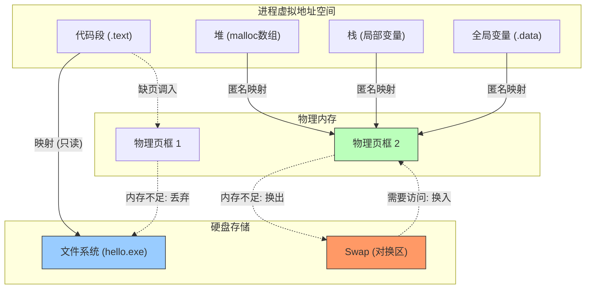
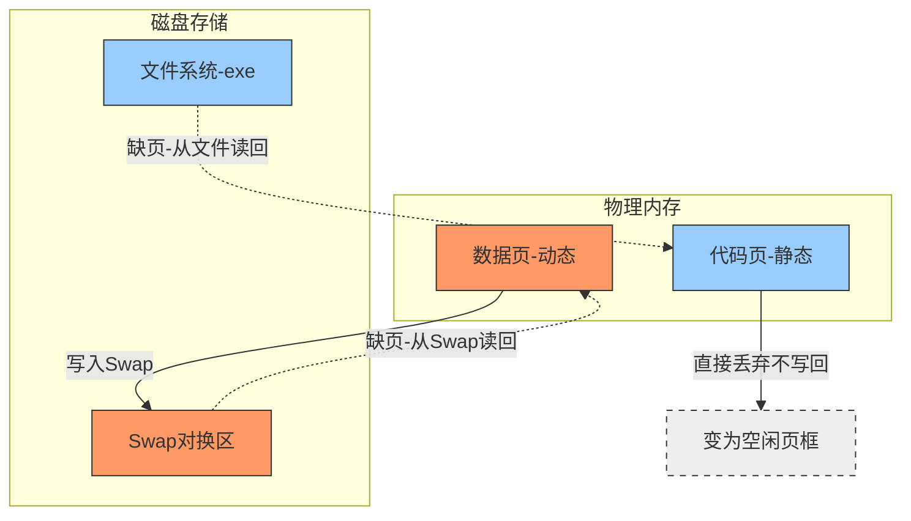

# Part 1: Swap (对换区) 到底是个什么鬼？

> [!TIP] 直觉比喻：内存是“办公桌”，硬盘是“仓库”，Swap 是“仓库门口的中转站”。

要实现内外存对换，要有一台IO速度较高的外存，容量也需足够大
改善内存利用率 
是连续分配方式。（教材应试都以此为准
尽管工程上都是离散分页的（不要管
### 1. Swap 的本质

**Swap** 是硬盘上的一块**专门区域**（可以是一个分区，也可以是一个大文件）。

- **身份**：它是**虚拟内存**的一部分。
    
- **作用**：它假装自己是 RAM。当物理内存（办公桌）不够用时，操作系统会把那些**很久没用的“脏数据”**（比如你之前打开但现在不看的网页、后台挂起的 Python 脚本的堆数据）打包写入 Swap。
    
- **目的**：为了腾出宝贵的物理 RAM 给当前活跃的进程用。
    

### 2. 谁会进 Swap？（关键区分）

并不是所有内存都会进 Swap！这是你之前疑惑的点。内存页主要分为两类：

- **1. 文件页 (File-backed Page)**：
    
    - **内容**：程序的代码（`.exe`）、打开的文本文件、动态库（`.so`）。
        
    - **去向**：**绝不进 Swap！**
        
    - **原因**：硬盘的文件系统里本来就有一份（比如 `python.exe`）。如果内存不够，OS 直接把这些页**扔掉 (Drop)**。下次要用，再去硬盘读文件就行了。
        
    - **无需备份，随用随弃。**
        
- **2. 匿名页 (Anonymous Page)**：
    
    - **内容**：**堆 (Heap)**、**栈 (Stack)**、**数据段 (Data)**。比如你 `malloc` 的数组、函数的局部变量。
        
    - **去向**：**必须进 Swap！**
        
    - **原因**：这些数据是程序运行中动态产生的，硬盘的文件系统里**没有备份**。如果 OS 把它扔了，数据就丢了！所以必须找个地方（Swap）把它们存下来，才能腾出 RAM。
        

---

# Part 2: 物理内存 + Swap < 申请内存，会发生什么？

这是一个分层的问题，取决于你是“只申请不使用”还是“真的去用”。

### 情况 A: 只申请 (malloc)，不使用 (Touch) —— “空头支票”

- **Linux 的策略 (Overcommit)**：Linux 内核默认允许 **Overcommit**（超售）。
    
- **现象**：
    
    - 物理内存 8GB，Swap 4GB。总共 12GB。
        
    - 你 `malloc(20GB)`。
        
    - **结果**：**成功！** 指针返回，程序不报错。
        
- **原因**：OS 只是在账本（VMA）上记了一笔“你欠我 20GB”，但没有真正分配物理页。只要你不去读写它，就不会穿帮。
    

### 情况 B: 真的去写数据 (Access) —— “银行挤兑”

- **现象**：你开始在那 20GB 的数组里疯狂写入数据。
    
- **过程**：
    
    1. 你写前 8GB -> 物理内存满了。
        
    2. OS 开始**置换** -> 把旧数据挤到 Swap (4GB)。
        
    3. 你继续写 -> Swap 也满了。
        
    4. 此时：**物理内存 (8G) + Swap (4G) 全部耗尽**。
        
- **结果**：**OOM (Out of Memory)！**
    
    - 操作系统发现实在没地儿了，触发 **OOM Killer**（内存杀手）。
        
    - OOM Killer 会像狙击手一样，根据算法（谁吃得多、谁不重要）选一个进程，**直接 Kill 掉**，释放内存。
        
    - 通常，你的那个 Python 进程会收到 `SIGKILL (9)` 信号，瞬间暴毙。
        

> [!FAILURE] 结论 如果 **物理内存 + Swap < 实际使用量 (Working Set)**，程序**一定会崩溃**（被系统杀掉）。

---

# Part 3: 堆、栈、数组……它们到底存在哪里？

让我们追踪一个数组的“一生”，看看它在**代码**、**虚拟内存**、**物理内存**、**磁盘**之间是如何流转的。

### 1. 代码里的数组：出生地决定命运

你在 C 语言里写下一行数组定义，它的“户口”就决定了它住哪里：

```c
int global_arr[1000];        // A. 全局数组

void main() {
    int stack_arr[1000];     // B. 局部数组
    int *heap_arr = malloc(1000 * sizeof(int)); // C. 动态数组
}
```

### 2. 虚拟内存视角 (VMA 账本)

程序刚运行，还没有任何数据进 RAM。OS 只是划分了虚拟地址空间：

- **A (global_arr)** -> 住在 **数据段 (.data/.bss)**。
    
- **B (stack_arr)** -> 住在 **栈区 (Stack)**。
    
- **C (heap_arr)** -> 住在 **堆区 (Heap)**。
    

### 3. 物理视角：数据的流浪之旅

让我们盯着 **C (堆数组)** 看，假设系统内存很紧张：

#### 阶段 1: 刚申请 (malloc)

- **位置**：**无**。
    
- **状态**：只有虚拟地址，页表里的“存在位”是 0。
    

#### 阶段 2: 刚写入 (Write)

- **动作**：`heap_arr[0] = 1;`
    
- **触发**：缺页中断。
    
- **OS 操作**：分配一个**物理页框 (RAM)**，建立映射。
    
- **位置**：**物理内存 (RAM)**。
    

#### 阶段 3: 内存紧张 (Memory Pressure)

- **场景**：你又打开了一个大型游戏，物理内存不够了。
    
- **OS 操作**：LRU 算法发现你很久没动 `heap_arr` 了。
    
- **动作**：
    
    1. 把 `heap_arr` 所在的物理页内容，写入 **磁盘 Swap 分区**。
        
    2. 修改页表：把物理页框号清空，标记“数据在 Swap 中”。
        
    3. 回收该物理页框给游戏用。
        
- **位置**：**磁盘 (Swap 对换区)**。
    

#### 阶段 4: 再次读取 (Read Again)

- **动作**：`print(heap_arr[0]);`
    
- **触发**：缺页中断。
    
- **OS 操作**：
    
    1. 发现页表标记说“我在 Swap 里”。
        
    2. 去磁盘 Swap 区把数据读回一个新的物理页框。
        
- **位置**：回到 **物理内存 (RAM)**。
    

---

### 🎨 全景图：一张图看懂数据存储


---

### 📝 终极总结

1. **Swap 是什么？**
    
    - 是硬盘上的“备用内存”。
        
    - 专门用来存 **匿名页**（堆、栈、全局变量），也就是程序动态生成的数据。
        
    - 代码段（文件页）不进 Swap，直接扔掉。
        
2. **容量限制**
    
    - **能运行吗？** 如果只申请不填满，能运行（Overcommit）。
        
    - **填满了怎么办？** 如果 `实际使用量 > RAM + Swap`，触发 **OOM Killer**，程序崩溃。
        
3. **数组在哪里？**
    
    - **名义上**：永远在虚拟内存的堆/栈里。
        
    - **实际上**：
        
        - 刚用时 -> 在 **RAM**。
            
        - 内存紧且久不用 -> 在 **Swap**。
            
        - 代码里的常量数组 -> 甚至可能在 **文件系统** 里（作为 mmap 的一部分）。

# 深度辨析：进程的“搬家”策略

> [!ABSTRACT] 核心结论 现代操作系统（Linux/Windows）在内存不足时，**即使是把整个进程“踢出”内存**，也不会把整个进程的所有数据都写入 Swap。
> 
> - **策略**：**分而治之**。
>     
> - **静态部分（代码）**：**直接丢弃**（Drop）。回家去读 `.exe`。
>     
> - **动态部分（堆栈）**：**写入 Swap**（Write Out）。因为这是“独一份”。
>     

## 1. 整体对换 vs 分页对换 (历史包袱)

你提到了这两个词，我们需要先正名一下，防止概念混淆。

1. **整体对换 (Swapping) —— 早期/嵌入式**
    
    - **定义**：以**整个进程**为单位。内存不够了，就把进程 A **连皮带肉**（代码+数据）全部写到磁盘对换区。
        
    - **缺点**：I/O 开销巨大！代码段本来硬盘就有，还要写一遍，太笨了。
        
    - **现状**：现代通用 OS（如 Linux）**几乎不再使用**纯粹的整体对换技术，除非是系统休眠（Hibernate）这种特殊场景。
        
2. **分页对换 (Paging) —— 现代主流**
    
    - **定义**：以**页 (4KB)** 为单位。
        
    - **现状**：当系统决定把一个进程“清出”内存时，它实际上是**循环处理该进程的每一个页面**。
        
    - 这就引出了你刚才推导出的那个 **“精分”** 策略。
        

---

## 2. 进程“被踢出”时的分裂行为 (The Split)

假设内存极度紧张，OS 决定把 **进程 P** 全部清出内存。

### 场景演示：进程 P 的解体

进程 P 拥有以下内存页：

- **Page 1~10**: 代码段（来自 `app.exe`）
    
- **Page 11~20**: 数据段（全局变量，堆，栈）
    

#### 动作 1：处理代码段 (Page 1~10)

- **OS 检查**：这些页是 **File-backed (文件背景)** 的，而且是只读的。
    
- **OS 动作**：**直接释放物理页框**。
    
- **磁盘操作**：**0 次写操作**。
    
- **页表状态**：标记为“不在内存”，地址指向文件系统中的 `app.exe` 偏移量。
    

#### 动作 2：处理数据段 (Page 11~20)

- **OS 检查**：这些页是 **Anonymous (匿名)** 的，也就是“脏数据”。
    
- **OS 动作**：将数据内容写入 **Swap 对换区**，然后释放物理页框。
    
- **磁盘操作**：**10 次写操作**。
    
- **页表状态**：标记为“不在内存”，地址指向 Swap 分区的偏移量。
    

---

## 3. 进程“回宫”时的重组 (The Restore)

当进程 P 再次被调度执行时，它是一张白纸（只有空的页表）。它不会一下子把所有东西都读回来，而是**按需 (On-Demand)** 恢复。

#### 动作 1：CPU 执行第一行代码

- **触发**：缺页中断（代码页）。
    
- **OS 识别**：页表说这页在 `app.exe` 里。
    
- **动作**：从**文件系统**读取代码到内存。
    

#### 动作 2：代码访问了一个全局变量

- **触发**：缺页中断（数据页）。
    
- **OS 识别**：页表说这页在 Swap 分区里。
    
- **动作**：从**Swap 对换区**读取数据到内存。
    

---

## 4. 视觉化流程图 (Obsidian Friendly)


---

## 5. 总结你的理解

你之前的推论是完全正确的：

1. **静态删掉？** -> 是的，准确说是**丢弃 (Discard)**，因为硬盘上有备份。
    
2. **动态 Swap？** -> 是的，必须写到 Swap，因为硬盘上没备份。
    
3. **回内存直接调外存的静态？** -> 是的，直接读 `.exe` 文件。
    

> [!TIP] 为什么这样设计？ 这个设计不仅节省了 Swap 空间，更重要的是**极大地减少了磁盘写操作**。 在服务器上，代码段可能几百 MB，如果每次内存紧张都要把这几百 MB 写到 Swap，磁盘早就累死了。现在只需要写那几十 MB 的堆栈数据，效率提升巨大。

### 1. 教材的语境：对换区 vs 文件区

当你教材上说“对换区采用连续分配”时，它通常是在**对比**磁盘上的两个区域：

1. **文件区 (File Area)**：
    
    - **存什么**：普通文件（Word文档、电影、源代码）。
        
    - **目标**：**空间利用率要高**。哪怕磁盘碎成渣，只要有空地，文件就能存进去。
        
    - **手段**：**离散分配**（如链接分配、索引分配/inode）。
        
2. **对换区 (Swap Space)**：
    
    - **存什么**：内存里换出来的进程数据。
        
    - **目标**：**速度要快！速度要快！速度要快！**（因为换入换出时 CPU 在等，很急）。
        
    - **手段**：**连续分配**。
        

> [!NOTE] 教材的逻辑 为了保证 I/O 速度，操作系统会在磁盘上专门划出一块**物理上连续的大地盘**作为 Swap 区。
> 
> - **连续分配**意味着：磁头移动距离最短，读写速度最快。
>     
> - 因此，教材将 Swap 区的**磁盘空间管理方式**定义为“连续分配”。
>     

**一句话总结教材的意思：** Swap 区在硬盘上是**一块连续的地皮**，而不是像普通文件那样东拼西凑的散装地皮。

---

### 2. 我的语境：内部数据的组织方式

我之前跟你讲的“分页”，是指**在这块连续的地皮内部，数据是怎么存放的**。

- **宏观上（教材视角）**：Swap 分区是硬盘上连续的 4GB 空间。—— **没毛病，连续分配。**
    
- **微观上（内核视角）**：这 4GB 连续空间被切成了 100 万个 4KB 的小格子（页槽）。进程 A 的堆在这个格子里，进程 B 的栈在那个格子里。—— **没毛病，分页管理。**
    

> [!TIP] 举个例子：大通铺
> 
> - **教材说**：为了管理方便，我们盖了一间**连续的**大通铺仓库（Swap），而不是分散的小单间（文件区）。
>     
> - **我刚才说**：虽然仓库是连续的，但里面的床位是按**编号（页）**分配给不同人的，张三睡床头，李四睡床尾（离散的页槽），并不是把张三整个人连体打包。
>     

---

### 3. 还有一个历史遗留问题：Swapping 的定义

在很多经典操作系统教材（如《恐龙书》或国内教材）中，为了教学方便，依然保留了**经典 Swapping（进程交换）** 的概念。

- **定义**：当内存严重不足时，把**整个进程**（Whole Process）写到对换区。
    
- **推论**：既然是写整个进程，为了快，最好在对换区里找一块连续的空间把这 10MB 一口气写进去。
    
- **考试点**：如果题目考的是“进程对换（Swapping）”，那么它隐含的意思就是连续分配。
    

虽然现代 Linux 实际上是**页面对换（Paging）**，也就是只换一部分页，但在**考试理论模型**中，往往会强调 Swap 区是为了“高频、高速的整体/页面读写”而设计的，因此强调其连续性。

---

### 4. 考研/考试 满分答题策略

为了你的 408 考研，请务必建立以下两套思维模型：

#### 模型 A：考试/做题模式（以此为准！）

- **Q：对换区（Swap）和文件区有什么区别？**
    
    - **A：**
        
        - **文件区**：追求空间利用率，采用**离散分配**（如成组链接法）。
            
        - **对换区**：追求 I/O 速度，采用**连续分配**。
            
- **Q：对换区存放什么？**
    
    - **A：** 存放被换出的进程（或进程的页/段）。
        

#### 模型 B：理解/面试模式（深层原理）

- **Q：现代 OS 真的还是连续分配吗？**
    
    - **A：** 物理空间是连续申请的（为了快），但内部数据管理是**离散的页槽（Page Slots）**。这避免了因为 Swap 区碎片化而导致无法换出页面的尴尬。
        
    - **补充**：现代 OS 会尝试**Cluster I/O**（一次读写多个连续的页），这其实是把“分页”和“连续”结合起来了。