# 操作系统：优先级反转 (Priority Inversion)

## 1. 核心定义

**优先级反转**是指在高优先级任务（Task H）需要等待低优先级任务（Task L）释放资源，而中等优先级任务（Task M）又抢占了低优先级任务，导致高优先级任务被间接阻塞，无法执行的现象。

> [!DANGER] 一句话总结
> 
> “本来应该是 H > M > L，结果变成了 M > H > L。”
> 
> 中等优先级的任务，无意中导致了高优先级任务的长时间延迟。

---

## 2. 发生过程详解 (情景剧)

假设系统中有三个任务，优先级顺序为：**$P_H > P_M > P_L$** (High, Medium, Low)。

### **场景演绎**

1. **阶段一：L 获得锁**
    
    - 任务 $L$ 开始运行，获得了一个互斥锁 (Mutex)，进入临界区。
        
2. **阶段二：H 抢占但被阻塞**
    
    - 任务 $H$ 到达。因为 $P_H > P_L$，系统发生抢占，$H$ 开始运行。
        
    - $H$ 运行到一半，也需要访问那个互斥锁。
        
    - 因为锁被 $L$ 拿着，$H$ 被迫进入**阻塞态 (Blocked)**，等待 $L$ 释放锁。
        
    - 系统切回 $L$ 继续运行（为了让它赶紧把锁放了）。
        
3. **阶段三：M 杀出来搅局 (关键点)**
    
    - 此时，任务 $M$ 到达。
        
    - 因为 $P_M > P_L$，**$M$ 抢占了 $L$**！
        
    - $M$ 不需要那个锁，它只是单纯地运行自己的代码。
        
4. **阶段四：悲剧发生**
    
    - **目前状态**：$M$ 在疯狂运行，$L$ 被挂起（没法运行，也就没法释放锁），$H$ 在傻等 $L$ 释放锁。
        
    - **结果**：虽然 $P_H > P_M$，但在实际执行时间轴上，$M$ 却排在了 $H$ 前面。$H$ 被无限期推迟，直到 $M$ 跑完。
        

### **Obsidian Mermaid 图解**

(你可以直接复制下面这段代码到 Obsidian 中，会自动渲染成甘特图)

```mermaid
gantt
    title 优先级反转示意图
    dateFormat s
    axisFormat %s
    
    section Task H (高)
    到达并运行         :active, h1, 2, 3
    阻塞等待锁 (被反转) :crit, h2, 3, 7
    拿到锁运行         :h3, 7, 9
    
    section Task M (中)
    抢占 L 运行        :active, m1, 4, 7
    
    section Task L (低)
    持有锁运行         :active, l1, 0, 2
    被 H 抢占          :l2, 2, 3
    被 H 唤醒继续运行   :l3, 3, 4
    被 M 抢占 (挂起)   :l4, 4, 7
    释放锁             :l5, 7, 7
```

---

## 3. 解决方案：优先级继承协议 (PIP)

为了解决这个问题，最常用的方法是 **优先级继承 (Priority Inheritance Protocol)**。

> [!SUCCESS] 核心思想
> 
> “既然你拿着我想要的东西，那我就把我的尚方宝剑借给你，让你赶紧做完。”

### **解决步骤**

1. **发生阻塞**：当高优先级任务 $H$ 试图请求由低优先级任务 $L$ 占有的资源时。
    
2. **继承优先级**：系统立刻**将 $L$ 的优先级提升至 $H$ 的水平** ($P_L \rightarrow P_H$)。
    
3. **抵抗抢占**：此时中等优先级任务 $M$ 到达。因为现在的 $L$ 拥有和 $H$ 一样的优先级 ($P_L(new) > P_M$)，所以 **$M$ 无法抢占 $L$**。
    
4. **释放恢复**：$L$ 顺利用完资源并释放。系统立即将 $L$ 的优先级**恢复**到原本的低水平。
    
5. **H 执行**：$H$ 获得资源，开始运行。
    

### **另一种方案：优先级天花板 (PCP)**

- **Priority Ceiling Protocol**：给每个资源分配一个“天花板优先级”（等于所有可能访问该资源的任务中的最高优先级）。任何任务只要访问该资源，优先级直接升到天花板。
    
- _区别_：PIP 是**被动**提升（有人等我才提升），PCP 是**主动**提升（拿到资源就提升）。
    

---

## 4. 经典案例：火星探路者号 (Mars Pathfinder)

这是一个在技术面试或论文中经常引用的真实案例，非常适合写在笔记的“备注”里。

> [!EXAMPLE] **1997年 火星探路者号故障**
> 
> - **背景**：Pathfinder 到达火星后，系统频繁发生意外重启。
>     
> - **原因**：
>     
>     - 有一个**低优先级**的数据收集任务（气象任务）占用了互斥锁。
>         
>     - 有一个**高优先级**的总线管理任务需要这个锁。
>         
>     - 有一个**中优先级**的通信任务长时间运行，抢占了气象任务。
>         
> - **结果**：高优先级的总线任务长时间等不到锁，导致系统“看门狗 (Watchdog)”超时，判定系统死锁，强制复位。
>     
> - **修复**：NASA 工程师在地球上远程修改了代码，开启了 VxWorks 操作系统中的 **“优先级继承”** 标志位，拯救了探测器。

## 5. 408 考研备考要点

1. **辨析**：优先级反转不是死锁 (Deadlock)。
    
    - **死锁**：互相等待，谁都动不了。
        
    - **反转**：只是高优先级被延迟了，如果 $M$ 跑完了，$L$ 还是会跑，$H$ 最后也能跑，只是**实时性**被破坏了。
        
2. **场景**：通常发生在**抢占式调度** + **临界资源互斥访问** 的系统中。
    
3. **计算题**：有时会结合甘特图，让你画出采用 PIP 协议后的运行图。重点在于 **L 在持有锁期间，优先级是最高的**。