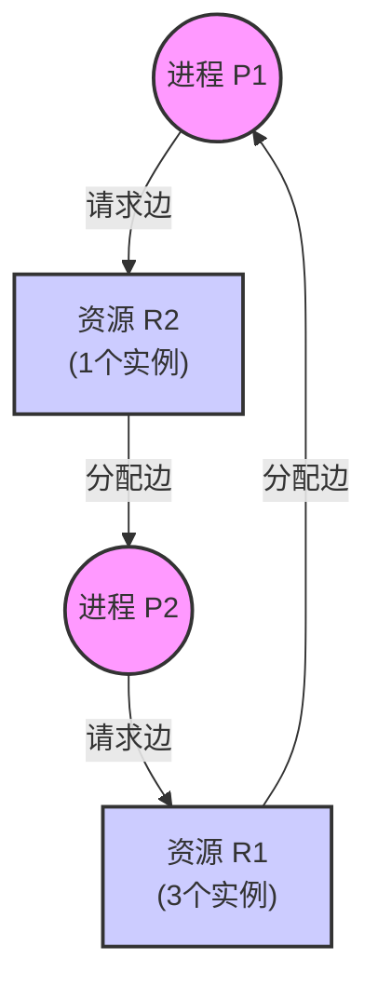
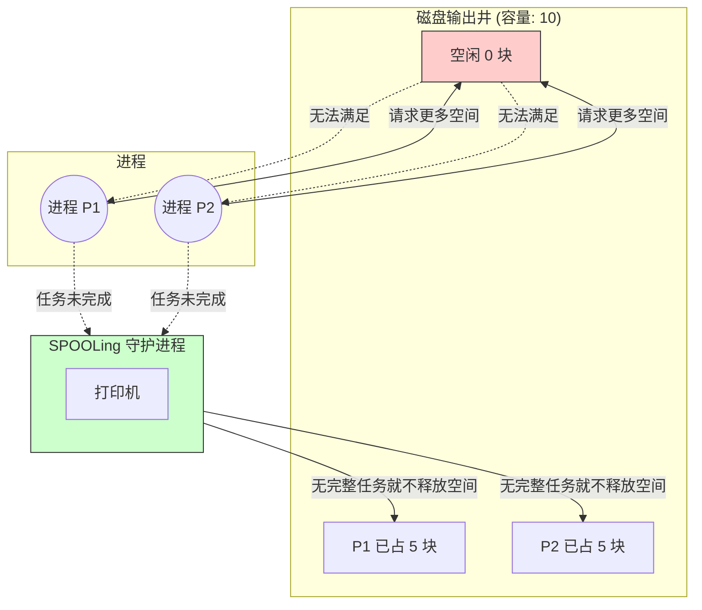
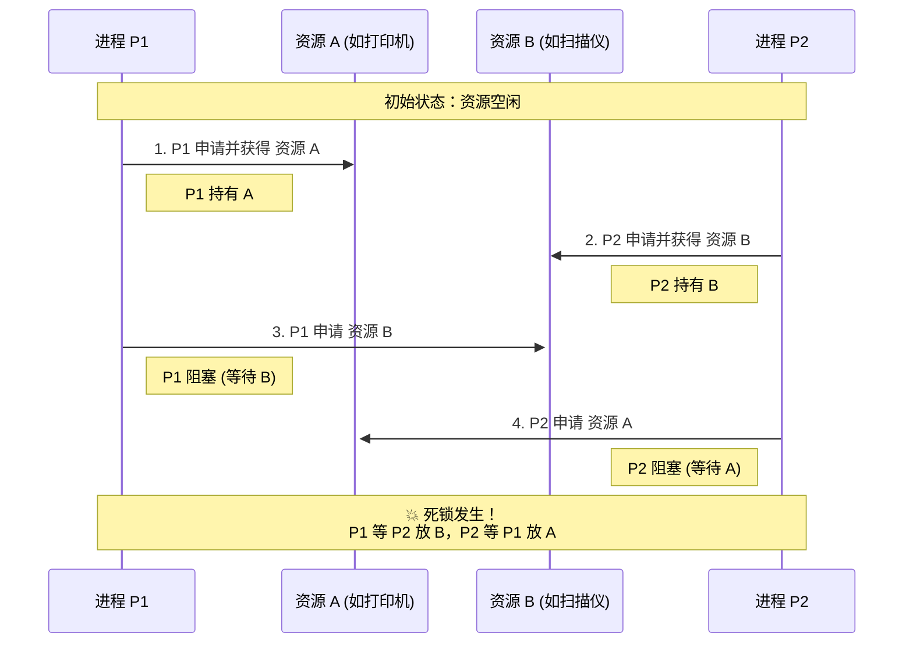
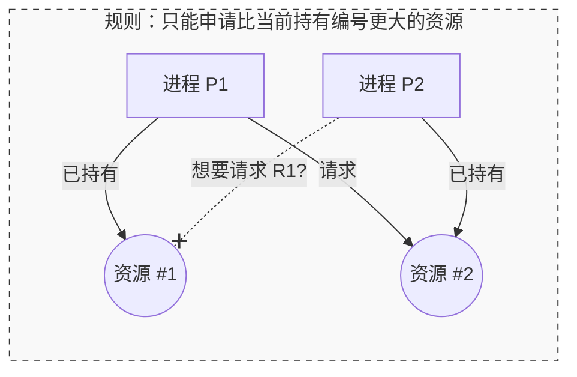
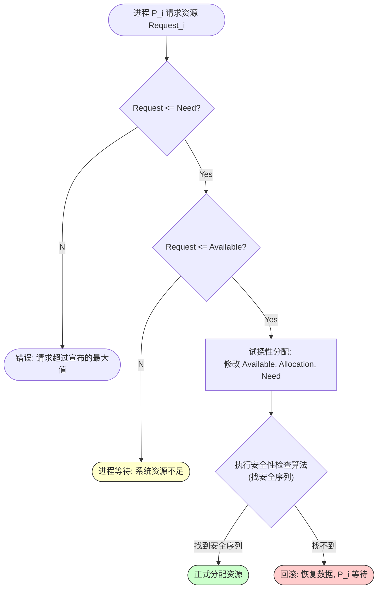

# 死锁中的资源问题详解

## 1. 资源的分类 (考点辨析)

在死锁问题中，我们讨论的“资源”远不止 CPU 和内存。理解分类有助于判断死锁发生的可能性。

### **(1) 可剥夺 vs 不可剥夺 (Preemptible vs Non-preemptible)**

这是死锁产生的**根本门槛**。

- **可剥夺资源 (Preemptible)**：
    
    - **定义**：资源分配给某进程后，可以被系统强行收回，且不会导致该进程失败。
        
    - **例子**：**CPU**（通过中断/上下文切换剥夺）、**主存**（通过页置换剥夺）。
        
    - **结论**：这类资源**不会**产生死锁。
        
- **不可剥夺资源 (Non-preemptible)**：
    
    - **定义**：一旦分配，必须由持有者自愿释放。若强行剥夺，会导致进程计算失败。
        
    - **例子**：**磁带机、打印机、互斥锁 (Mutex)、信号量**。
        
    - **结论**：**死锁通常发生在这类资源上**。
        

### **(2) 可重用 vs 消耗性 (Reusable vs Consumable)**

这个分类在高级题目（特别是涉及进程通信死锁）中会出现。

- **可重用资源 (Reusable)**：
    
    - **过程**：请求 $\to$ 使用 $\to$ 释放。
        
    - **特点**：数目固定，用完还回去。
        
    - **死锁原因**：竞争互斥锁、内存槽位等。
        
- **消耗性资源 (Consumable)**：
    
    - **过程**：生产 $\to$ 消耗。
        
    - **特点**：数目不固定，用完就没了（Destroy）。
        
    - **例子**：**中断请求、信号 (Signal)、消息 (Message)、缓冲区数据**。
        
    - **死锁原因**：进程 A 等 B 发消息，B 等 A 发消息（通信死锁）。
        

---

## 2. 资源分配图 (Resource Allocation Graph, RAG)

这是**死锁检测**的核心工具，也是考研大题中用来画图分析的基础。

### **(1) 图的构成元素**

- **节点 (Nodes)**：
    
    - **进程节点 ($P$)**：通常用**圆圈**表示。
        
    - **资源节点 ($R$)**：通常用**方框**表示。
        
    - **资源实例 (Instances)**：方框内的**黑点**。如果方框里有3个点，说明该资源有3个实例（如3台打印机）。
        
- **边 (Edges)**：
    
    - **请求边 (Request Edge)**：$P_i \to R_j$（进程指资源）。表示进程想申请一个资源，正在等待。
        
    - **分配边 (Assignment Edge)**：$R_j \to P_i$（资源指进程）。表示该资源的一个实例已经分配给了该进程。
        

### **(2) Mermaid 图解示例**



> [!TIP] **如何读图**
> 
> - 看上面的图：$P_1$ 拿着 $R_1$，想要 $R_2$；$P_2$ 拿着 $R_2$，想要 $R_1$。
>     
> - 这就构成了**环路**。
>     

---

## 3. 死锁判定定理 (重点：单实例 vs 多实例)

这是考研中最容易设陷阱的地方，请务必区分清楚！

### **情况 A：每种资源只有一个实例 (Single Instance)**

- **判定方法**：如果在资源分配图中找到了**环路 (Cycle)**。
    
- **结论**：**环路 $\iff$ 死锁**。
    
    - 只要有环，就是死锁；是充要条件。
        

### **情况 B：资源有多个实例 (Multiple Instances)**

- **判定方法**：图中存在环路。
    
- **结论**：**环路 $\nRightarrow$ 死锁**（有环未必死锁）。
    
    - **解释**：虽然 $P_1$ 和 $P_2$ 形成了环路，但如果资源 $R_1$ 还有第3个实例分配给了 $P_3$，而 $P_3$ 既不请求别的资源，很快就运行完把 $R_1$ 释放了。这时候 $P_1$ 或 $P_2$ 就能拿到资源解除环路。
        
    - **正确结论**：
        
        - 无环路 $\to$ 绝对无死锁。
            
        - 有环路 $\to$ **可能**死锁。
            

---

## 4. 资源图的化简 (S状态 / 死锁定理)

针对**多实例资源**的死锁检测，我们不能只看有没有环，而要使用**“化简法” (Graph Reduction)**。

> [!ABSTRACT] **化简步骤**
> 
> 1. **找孤立点/非阻塞点**：在图中找一个进程 $P_i$，它的请求边都能被满足（即：$Request \le Available$）。
>     
> 2. **消去**：假设让该进程运行完毕，释放它占有的所有资源。**消去该进程所有的连线**（请求边和分配边都删掉）。
>     
> 3. **循环**：重复步骤 1 和 2，直到没法再消去为止。
>     

### **判定结果**

- **完全简化 (Fully Reducible)**：如果最后图中所有的边都能被消去（所有点都成孤立点），说明系统是**安全**的，**无死锁**。
    
- **不可完全简化**：如果最后还剩下一些边消不掉，那么**这些剩下的进程就是死锁进程**。这就是著名的**死锁定理**。
    

---

## 5. 常见考题模型 (做题直觉)

### **模型一：哲学家进餐问题 (资源抢占)**

- **资源**：5 根筷子（5个互斥资源）。
    
- **进程**：5 个哲学家。
    
- **死锁场景**：每个人都拿起了左手的筷子（请求和保持），都在等右手的筷子（循环等待）。
    
- **解决资源问题**：
    
    - 限制人数（最多4人同时坐下）。
        
    - 破坏循环等待（奇数号先拿左，偶数号先拿右）。
        

### **模型二：内存不足的死锁**

- **资源**：内存页框。
    
- **场景**：
    
    - 系统内存 $M$，有 $N$ 个进程。
        
    - 每个进程需要 $K$ 个页框才能跑完。
        
    - 死锁临界点公式：
        
        $$M < N \times (K-1) + 1$$
        
    - _解释：最坏情况是每个进程都拿到了 $K-1$ 个资源，卡住了。只要再多 1 个资源，就能让其中一个进程跑完释放资源，死锁就解开了。_
        

---

> [!SUCCESS] **笔记总结**
> 
> 1. 死锁主要发生在**不可剥夺**、**可重用**的资源上。
>     
> 2. **RAG 图**中，圆圈是进程，方框是资源。
>     
> 3. **单实例**资源：有环 = 死锁。
>     
> 4. **多实例**资源：有环 $\ne$ 死锁，必须用**化简法**验证。
>     
> 5. 记住那个 $N \times (K-1) + 1$ 的公式，选择题常考。

# 死锁的产生与场景详解

## 1. 核心原理：死锁是怎么产生的？

一句话概括：**“僧多粥少，互不相让，乱抢一通。”**

从理论上讲，死锁的产生归结为两个根本原因：

### **(1) 系统资源不足 (根本原因)**

- **解释**：如果系统里的资源多到用不完（比如每个人都发一台打印机），那谁都不用抢，自然不会死锁。
    
- **现状**：资源（CPU、内存、I/O设备、带宽）总是有限的。当进程对资源的需求总和 > 系统现有的资源时，竞争就无法避免。
    

### **(2) 进程推进顺序非法 (直接原因)**

- **解释**：即使资源不够，如果大家排队有序地拿，也不会死锁。死锁往往是因为**拿资源的顺序不对**。
    
- **比喻**：
    
    - **正常情况**：A 吃完饭把碗给 B，B 吃完把碗给 C。（有序）
        
    - **死锁情况**：A 拿着筷子等碗，B 拿着碗等筷子。谁都不松手，谁都吃不上饭。
        

---

## 2. 直观模型：独木桥隐喻

> [!EXAMPLE] **独木桥模型**
> 
> - **场景**：一座窄桥，只能容纳一辆车通过。
>     
> - **死锁**：两辆车分别从两头上了桥，开到中间面对面碰上了。
>     
>     - **资源**：桥（不可剥夺资源）。
>         
>     - **僵局**：甲车想过桥，必须乙车倒退；乙车想过桥，必须甲车倒退。如果没人肯（或没办法）倒退，就死锁了。
>         

---

## 3. 具体场景：死锁有哪些可能？ (408 考点)

死锁不仅发生在硬件设备上，软件和数据也会导致死锁。以下是几种典型的死锁产生场景：

### **场景一：竞争不可剥夺资源 (硬件死锁)**

这是最经典的操作系统死锁。

- **资源**：打印机、磁带机、扫描仪。
    
- **过程**：
    
    - 进程 P1 占用了**打印机**，正在申请**扫描仪**。
        
    - 进程 P2 占用了**扫描仪**，正在申请**打印机**。
        
- **结果**：互相等待，死锁。
    

### **场景二：竞争临时资源 (通信死锁)**

发生在进程通信（IPC）时。

- **资源**：消息 (Message)、信号 (Signal)。
    
- **过程**：
    
    - 进程 P1 等待 P2 发消息才能继续执行。
        
    - 进程 P2 等待 P3 发消息。
        
    - 进程 P3 等待 P1 发消息。
        
- **结果**：形成了一个 P1 $\to$ P2 $\to$ P3 $\to$ P1 的等待环，所有人都卡住。
    

### **场景三：SPOOLing 系统的死锁 (磁盘死锁)**

这是一个容易被忽视的高级考点。

- **背景**：SPOOLing 技术用磁盘作为缓冲区，把对打印机的请求先写到磁盘上。
    
- **隐患**：磁盘空间也是有限的资源。
    
- **过程**：
    
    - 如果有太多的大作业同时请求打印，它们可能会把**磁盘缓冲区填满**。
        
    - 每个作业都只输出了一半的数据到磁盘，都在等待剩余的磁盘空间来写完剩下的数据。
        
    - 但是，只要作业没写完，打印机就不会开始打印（也就不会释放磁盘空间）。
        
- **结果**：**磁盘满了 $\leftrightarrow$ 没法释放**。死锁。
#### 深度解析：SPOOLing 系统的死锁问题

##### 1. 背景：SPOOLing 是来“救火”的

在讲死锁之前，先回顾一下 SPOOLing 的初衷：

- **旧问题**：打印机是**独占设备**。如果进程 A 占了打印机但没打印完，进程 B 就得干等。如果 A 和 B 互相占有对方需要的资源，就会死锁。
    
- **SPOOLing 的解法**：引入**磁盘**作为中间商。
    
    - 进程不需要直接跟打印机交互。
        
    - 进程把要打印的数据全写到**磁盘缓冲区（输出井）**里。
        
    - 写完后，进程就以为自己“打印完了”，继续干别的事。
        
    - 后台有一个**守护进程（SPOOLing 进程）**，慢慢从磁盘里把数据读出来发给打印机。
        

> [!SUCCESS] 原本的优势
> 
> 这样一来，逻辑上好像“每个进程都拥有一台打印机”，互斥条件被破坏了，原本关于打印机的死锁应该消失了。

---

##### 2. 新危机：SPOOLing 为什么会死锁？

SPOOLing 把对“打印机”的竞争，转移成了对**“磁盘缓冲区空间”**的竞争。

###### **核心机制（祸根）**

SPOOLing 系统通常有一个规则：**“整存整取”**。

- **输入阶段**：进程必须把**所有**要打印的数据都写到磁盘缓冲区（Output Well）后，生成一个完整的打印任务，SPOOLing 守护进程才会接单。
    
- **死锁点**：如果缓冲区满了，但里面装的都是**“写了一半的数据”**，守护进程就不会去打印（因为它只收完整的单）。
    

###### **死锁场景演示**

假设磁盘的输出井（缓冲区）总容量为 **10个块**。

1. **进程 P1** 想要打印，它申请了 **5个块**，写了一半数据。（还差 2 个块才能写完）
    
2. **进程 P2** 想要打印，它申请了 **5个块**，写了一半数据。（还差 2 个块才能写完）
    
3. **现状**：
    
    - **已用空间**：5 + 5 = 10 块（满了）。
        
    - **剩余空间**：0 块。
        
4. **僵局**：
    
    - **P1**：为了完成任务，请求再分配 2 个块。$\to$ **阻塞**（等空间）。
        
    - **P2**：为了完成任务，请求再分配 2 个块。$\to$ **阻塞**（等空间）。
        
    - **守护进程**：我看了一眼缓冲区，发现没有一个“完整”的任务，所以我**不打印**，也就**不释放空间**。
        

> [!DANGER] 死锁结论
> 
> 磁盘空间满了 $\leftrightarrow$ 没有任务完成（无法释放空间）
> 
> - 进程在等空闲块。
>     
> - 释放空闲块的前提是打印完成。
>     
> - 打印完成的前提是进程拿到空闲块把数据写完。
>     
> - **死循环（死锁）。**
>     

---

##### 3. 直观类比：餐厅的点单板

> [!EXAMPLE] **餐厅后厨类比**
> 
> - **SPOOLing 系统**：后厨的点单夹（挂票据的地方）。
>     
> - **磁盘空间**：点单夹上只能挂 **10 张纸**。
>     
> - **规则**：服务员（进程）必须把客人的菜全写在纸上，厨师（打印机）才会把纸拿走开始做菜。
>     
> 
> **死锁过程**：
> 
> 1. 服务员 A 写了半张单子，挂满了 5 个钩子，还在想客人剩下的菜。
>     
> 2. 服务员 B 写了半张单子，挂满了剩下 5 个钩子，也在想剩下的菜。
>     
> 3. **结果**：
>     
>     - 服务员 A：我要再挂一张纸才能写完！(没钩子了)
>         
>     - 服务员 B：我也要再挂一张纸！(没钩子了)
>         
>     - 厨师：你们谁写完了？没写完我不拿单子啊。(不释放钩子)
>         
>     - **全员卡死。**
>         

---

##### 4. 解决方案 (408 答题方向)

既然知道了是因为“空间不够”且“互不相让”导致的，解决思路就是**死锁预防/避免**。

###### **方法一：静态预分配 (预防)**

- **原理**：在进程开始打印之前，系统先计算它一共需要多少磁盘块。
    
- **规则**：如果**剩余空间 < 任务所需总量**，干脆**一个块都不分给它**，让它在外面等。
    
- **效果**：只要让你进来了，就保证你有足够的空间写完，绝对不会卡在半路。
    
- _缺点_：需要预知数据量，且利用率低。
    

###### **方法二：动态分配但保留安全余量 (避免)**

- **原理**：类似银行家算法的思想。
    
- **规则**：每次分配新的磁盘块时，检查分配后剩余的空间是否足够满足**至少一个**已经在忙的进程完成任务。如果不够，就不分配。
    

###### **方法三：不要求“整存整取” (破坏条件)**

- **原理**：允许守护进程打印“不完整”的文件，或者允许进程分段打印。但这可能会导致打印出来的纸张内容混杂（A打一行，B打一行），通常不可行，除非改用文件系统管理。
    

---

##### 5. 笔记总结与 Mermaid 资源图




> [!NOTE] **关键考点记忆**
> 
> - SPOOLing **解决了** 独占设备（如打印机）的死锁。
>     
> - SPOOLing **引入了** 磁盘缓冲区（Output Well）的死锁。
>     
> - **原因**：磁盘缓冲区有限 + 进程争夺缓冲区 + “整存整取”机制。
>

### **场景四：数据库中的死锁 (软件锁)**

在数据库并发事务中非常常见。

- **资源**：数据库里的“行锁”或“表锁”。
    
- **过程**：
    
    - 事务 T1 锁住了 **A 行**，想要修改 **B 行**。
        
    - 事务 T2 锁住了 **B 行**，想要修改 **A 行**。
        
- **结果**：数据库系统检测到死锁，通常会强制杀掉其中一个事务来解围。
    

---

## 4. 流程图解：死锁形成的动态过程

为了帮你更直观地理解“顺序非法”，我们用 Mermaid 演示一个典型的 P1 和 P2 互锁的过程。



---

## 5. 总结与记忆口诀

> [!TIP] **如何判断是否容易产生死锁？**
> 
> 1. **资源越少**，越容易死锁。
>     
> 2. **进程越多**，越容易死锁。
>     
> 3. **资源越“独占”**（不可剥夺），越容易死锁。

# 死锁预防策略详解

## 1. 核心思想

**死锁预防**是一种**静态**的策略。

- **时机**：在进程运行之前或资源分配之前就制定好规则。
    
- **手段**：通过设置严格的限制条件，**破坏**死锁产生的四个必要条件（互斥、不可剥夺、请求和保持、循环等待）中的至少一个。
    
- **代价**：往往会导致系统资源利用率降低，吞吐量下降。
    

---

## 2. 策略一：破坏“互斥条件”

**目标**：将只能独占使用的资源，改为可以让多进程共享使用。

- **实现技术**：**SPOOLing 技术**（假脱机）。
    
    - _原理_：操作系统在后台拦截进程对设备的请求，将其转化为对磁盘文件的操作。虽然物理设备（如打印机）还是独占的，但在逻辑上，所有进程都觉得自己在独占使用打印机。
        
- **缺点**：
    
    1. **适用性差**：很多设备或资源（如互斥锁、写操作的临界区）从根本性质上就是不能共享的，必须保持互斥。
        
    2. **新问题**：如前所述，SPOOLing 系统本身如果设计不当，也可能导致磁盘空间死锁。
        

> [!FAILURE] 考研结论
> 
> 破坏互斥条件通常被认为在现代操作系统中不太可行，因为互斥是某些资源的固有属性（为了保证数据安全）。

---

## 3. 策略二：破坏“不剥夺条件” (No Preemption)

**目标**：允许系统抢占资源。当一个进程无法获得新资源时，它已经持有的资源可以被强制收回。

- **实现方式**：
    
    1. **主动释放**：当一个进程申请某个资源得不到满足时，它必须立即释放手中**所有**已保持的资源，待以后需要时再重新申请。
        
    2. **被动抢占**：如果 A 进程需要的资源被 B 进程占有，操作系统可以协助 A 强行剥夺 B 的资源（通常仅当 B 的优先级较低时）。
        
- **缺点**：
    
    1. **实现复杂**：剥夺资源需要保存被剥夺进程的现场（Context），开销极大。
        
    2. **代价高昂**：导致前一阶段的工作失效（如打印机打了一半被抢走，纸张作废）。
        
    3. **饥饿现象**：反复申请、反复被剥夺，导致进程一直无法完成。
        
- **适用场景**：主要用于 **CPU**（上下文切换）和 **内存**（页面置换），不适用于打印机等外设。
    

---

## 4. 策略三：破坏“请求和保持条件” (Hold and Wait)

**目标**：杜绝“吃着碗里的，看着锅里的”。要么全拿，要么不拿。

- **实现方式**：**静态资源分配法**。
    
    - 进程在运行前，必须**一次性申请**它所需要的**全部**资源。
        
    - 如果系统能满足，就全部分配给它；否则，一个都不给，让它等待。
        
- **优点**：
    
    - 实现简单。
        
    - **完全解决了死锁**（因为进程在运行期间不会再请求新资源）。
        
- **缺点**：
    
    1. **资源浪费严重**：进程可能运行 1 小时，但打印机只在最后 1 秒用。采用此法，打印机就要被闲置占用 59 分 59 秒。
        
    2. **饥饿现象**：如果是“大进程”，需要很多资源，可能永远凑不齐所有资源，导致一直无法运行。
        

---

## 5. 策略四：破坏“循环等待条件” (Circular Wait)

**目标**：通过定义规则，让资源申请图中不可能出现环路。**（这是最实用的策略）**

- **实现方式**：**顺序资源分配法**。
    
    1. 系统给所有类型的资源进行**编号**（如：扫描仪=1, 打印机=2, 磁带机=3）。
        
    2. **规则**：进程必须按照**编号从小到大**的顺序申请资源。
        
        - 如果已持有 2 号资源，就不能回头去申请 1 号资源。
            
        - 如果要申请 1 号，必须先释放手里的大号资源。
            

### **Mermaid 原理解析**

为什么这样就没环了？看下图：



> [!SUCCESS] **原理解释**
> 
> - $P_1$ 拿了小号 (#1)，申请大号 (#2) $\to$ **允许**。
>     
> - $P_2$ 拿了大号 (#2)，想要申请小号 (#1) $\to$ **系统禁止**！
>     
> - 因此，不可能形成 $P_1 \to R_2 \to P_2 \to R_1$ 的回路。
>     

- **缺点**：
    
    1. **编程麻烦**：程序员必须严格按编号写代码，不灵活。
        
    2. **编号困难**：如果系统增加了新设备，可能需要重新编号。
        
    3. **资源浪费**：如果实际逻辑是先用打印机(#2)再用扫描仪(#1)，为了凑规则，进程必须一开始就申请扫描仪(#1)并闲置，或者申请完打印机释放后再申请扫描仪。
        

---

## 💡 408 考研对比总结表

|**破坏的条件**|**策略名称**|**关键缺点 (选择题常考)**|**实际应用频率**|
|---|---|---|---|
|**互斥**|SPOOLing|很多资源无法共享；可能引发新死锁|低 (特定设备)|
|**不可剥夺**|强行剥夺|实现复杂；开销大；工作丢失|中 (CPU/内存)|
|**请求和保持**|静态分配 (一次性)|**资源利用率极低**；可能饥饿|低|
|**循环等待**|顺序分配 (编号法)|限制新设备添加；编程不便|**高 (最常用)**|

> [!TIP] **做题口诀**
> 
> - 要效率低但绝对安全 $\to$ **破坏请求和保持** (一次性全拿)。
>     
> - 要实现可行且相对灵活 $\to$ **破坏循环等待** (按顺序拿)。
>     
> - 银行家算法不是预防，是**避免**！(千万别选错)

# 死锁避免 (Deadlock Avoidance)

## 1. 核心思想

与“死锁预防”不同，**死锁避免**不限制用户申请资源的自由（不破坏 4 个必要条件），而是在**资源分配的过程中**进行动态干预。

> [!ABSTRACT] 核心策略
> 
> “三思而后行”
> 
> 每当进程申请资源时，系统先算一卦：“如果我把资源给你，系统会不会变得不安全？”
> 
> - 如果会变得**不安全** $\to$ **拒绝/推迟**分配。
>     
> - 如果依然**安全** $\to$ **允许**分配。
>     

---

## 2. 安全状态 vs 不安全状态

这是死锁避免的理论基础。

### **(1) 安全状态 (Safe State)**

- **定义**：如果系统能找到一个**安全序列 (Safe Sequence)**，那么系统就是安全的。
    
- **安全序列**：指一个进程序列 $\{P_1, P_2, ..., P_n\}$，按照这个顺序，系统能依次满足每个进程对资源的最大需求，直到所有进程都执行完毕。
    
    - _通俗理解_：虽然我现在资源不够给所有人，但我手里的存货足够给 $P_1$ 让他跑完；$P_1$ 跑完还回来的资源，加上我原本的存货，足够给 $P_2$ 跑完……以此类推，大家都能毕业。
        

### **(2) 不安全状态 (Unsafe State)**

- **定义**：如果系统**找不到任何一个**安全序列，就进入了不安全状态。
    
- **后果**：**不安全状态 $\ne$ 死锁**，但**不安全状态是死锁的必经之路**。意味着“有可能”发生死锁。
    

> [!TIP] **考点逻辑链**
> 
> - **安全状态** $\to$ **一定无死锁**。
>     
> - **不安全状态** $\to$ **可能死锁**。
>     
> - **死锁** $\to$ **一定处于不安全状态**。
>     

---

## 3. 银行家算法 (Banker's Algorithm)

这是死锁避免算法中最具代表性的算法，由 Dijkstra 提出。

### **(1) 数据结构 (必须背)**

假设系统有 $n$ 个进程， $m$ 类资源。

1. **Max[n, m]**：**最大需求矩阵**。$P_i$ 需要各类资源的最大数量。
    
2. **Allocation[n, m]**：**分配矩阵**。$P_i$ 目前已经手里拿着多少资源。
    
3. **Need[n, m]**：**需求矩阵**。$P_i$ **还差多少**资源才能跑完。
    
    - $$Need[i, j] = Max[i, j] - Allocation[i, j]$$
        
    - _(做题第一步永远是先算出这个矩阵！)_
        
4. **Available[m]**：**可用资源向量**。系统手里目前还剩多少闲置资源。
    

### **(2) 算法流程 (Mermaid 图解)**

当进程 $P_i$ 发出资源请求 $Request_i$ 时：


### **(3) 安全性检查算法 (核心计算步骤)**

这是手动计算安全序列的步骤：

1. **Work 向量**：设置一个临时变量 `Work = Available`（表示当前可用的资源，模拟过程中资源会越变越多）。
    
2. **Finish 向量**：标记进程是否完成。初始全为 `False`。
    
3. **寻找**：在所有未完成（`Finish=False`）的进程中，找一个满足 `Need <= Work` 的进程 $P_k$。
    
    - _意思就是：看当前手里的闲钱够不够包养这个进程。_
        
4. **回收**：
    
    - 如果找到了 $P_k$：假设让它运行完，释放它占用的所有资源。
        
    - 更新：`Work = Work + Allocation[k]`。
        
    - 标记：`Finish[k] = True`。
        
    - 返回步骤 3，继续找下一个。
        
5. **结论**：
    
    - 如果所有进程都能变 `True` $\to$ **安全**。
        
    - 如果还有 `False` 且找不到满足条件的进程 $\to$ **不安全**。
        

---

## 4. 408 考研模拟题 (手把手教算)

题目：系统有资源 A, B, C。当前状态如下：

Available (系统剩余) = (3, 3, 2)

|**进程**|**Max (最大)**|**Allocation (已占)**|**Need (还需)**|
|---|---|---|---|
|P1|7, 5, 3|0, 1, 0|**7, 4, 3**|
|P2|3, 2, 2|2, 0, 0|**1, 2, 2**|
|P3|9, 0, 2|3, 0, 2|**6, 0, 0**|
|P4|2, 2, 2|2, 1, 1|**0, 1, 1**|
|P5|4, 3, 3|0, 0, 2|**4, 3, 1**|

_(注：考试时通常只给 Max 和 Allocation，**Need 需要你自己用减法算出**，如上表第 4 列)_

**问题：当前系统是否安全？**

解题过程：

当前可用 Work = (3, 3, 2)

1. **第一轮扫描**：
    
    - P1 需要 (7,4,3) $\to$ Work(3,3,2) 不够。
        
    - P2 需要 (1,2,2) $\to$ Work(3,3,2) **足够！** $\to$ 选中 **P2**。
        
    - **模拟运行 P2**：回收 P2 的 Allocation(2,0,0)。
        
    - 新 Work = (3,3,2) + (2,0,0) = **(5, 3, 2)**。
        
2. **第二轮扫描** (基于 Work=5,3,2)：
    
    - P1 需要 (7,4,3) $\to$ 5<7, 不够。
        
    - P3 需要 (6,0,0) $\to$ 5<6, 不够。
        
    - P4 需要 (0,1,1) $\to$ Work(5,3,2) **足够！** $\to$ 选中 **P4**。
        
    - **模拟运行 P4**：回收 P4 的 Allocation(2,1,1)。
        
    - 新 Work = (5,3,2) + (2,1,1) = **(7, 4, 3)**。
        
3. **第三轮扫描** (基于 Work=7,4,3)：
    
    - P1 需要 (7,4,3) $\to$ **足够！** (选中 P1)。
        
    - 回收 P1 Allocation(0,1,0) $\to$ Work = **(7, 5, 3)**。
        
    - _(注：此时也可以选 P3 或 P5，顺序不唯一)_
        
4. **后续**：
    
    - 资源此时非常富余，P3 和 P5 都能顺利满足。
        

**结论**：存在安全序列 **{P2, P4, P1, P3, P5}**，所以系统是**安全**的。

---

## 5. 优缺点总结

| **维度**    | **评价** | **说明**                                               |
| --------- | ------ | ---------------------------------------------------- |
| **安全性**   | ✅ 好    | 允许动态申请，不需要预先分配所有资源。                                  |
| **资源利用率** | ⚠️ 中   | 比“死锁预防”高，但比“死锁检测”低（因为有时候有些请求虽然会导致不安全，但不一定真死锁，却被拒绝了）。 |
| **实现难度**  | ❌ 难    | 需要进程预先声明 `Max`（实际上很难预估）；且计算开销大（每次请求都要跑一次算法）。         |

> [!NOTE] **Obsidian 笔记小贴士**
> 
> - 这部分内容的**表格**非常关键，复习时最好自己遮住 `Need` 列算一遍。
>     
> - **“试探性分配”**这个词要记住，因为银行家算法不是真的分，而是假装分出去算算看，不行就回滚。

# 死锁检测（Deadlock Detection）深度解析

> [!ABSTRACT] 核心定义
> 
> 死锁检测是指系统并不限制资源的请求，而是允许死锁发生，但系统会定期或在特定触发条件下运行检测算法，确定死锁是否已经发生，并识别出参与死锁的进程和资源。

---

## 1. 死锁检测的基础：资源分配图 (RAG)

死锁检测通常依赖于**资源分配图（Resource Allocation Graph, RAG）**。

### 1.1 图的组成

- **节点 ($V$):** * **进程节点 ($P$):** 通常用圆形表示，$P = \{P_1, P_2, \dots, P_n\}$。
    
    - **资源节点 ($R$):** 通常用矩形表示，$R = \{R_1, R_2, \dots, R_m\}$。矩形内的点数表示该类资源的实例个数。
        
- **有向边 ($E$):**
    
    - **请求边 (Request Edge):** $P_i \to R_j$，表示进程 $P_i$ 请求资源 $R_j$ 且尚未获得。
        
    - **分配边 (Assignment Edge):** $R_j \to P_i$，表示资源 $R_j$ 的一个实例已分配给进程 $P_i$。
        

### 1.2 死锁定理 (Deadlock Theorem)

- **必要条件：** 如果资源分配图中不存在环路，则系统一定没有死锁。
    
- **充分条件：** * 若每类资源只有**一个实例**，则环路是死锁的**充分必要条件**。
    
    - 若每类资源有**多个实例**，则环路是死锁的**必要不充分条件**（可能存在环路但通过其他进程释放资源来解开）。
        

---

## 2. 检测算法详解

根据资源实例的数量，检测算法分为两种主要情况：

### 2.1 每类资源只有一个实例：等待图 (Wait-for Graph)

在单实例环境下，可以将 RAG 简化为**等待图 (Wait-for Graph, WFG)**。

- **构造方法：** 如果 $P_i \to R_k$ 且 $R_k \to P_j$，则在等待图中画一条 $P_i \to P_j$ 的边。
    
- **检测逻辑：** 周期性运行**深度优先搜索 (DFS)** 或 **Tarjan 算法**来检测图中是否存在**环 (Cycle)**。
    
- **时间复杂度：** $O(n^2)$，其中 $n$ 是进程数量。
    

### 2.2 每类资源有多个实例：类似于银行家算法

当存在多个实例时，简单的环路检测不再适用。我们使用一种类似于“银行家算法”的归约算法。

#### 数据结构

- **Available[m]:** 长度为 $m$ 的向量，表示每种资源的可用实例数。
    
- **Allocation[n][m]:** $n \times m$ 矩阵，表示当前分配给每个进程的资源数。
    
- **Request[n][m]:** $n \times m$ 矩阵，表示每个进程当前请求的资源数。
    

#### 算法步骤（死锁检测算法）

1. **初始化 Work 和 Finish：**
    
    - $Work = Available$
        
    - 对于 $i=1, 2, \dots, n$：
        
        - 如果 $Allocation_i \neq 0$，则 $Finish[i] = false$；
            
        - 否则 $Finish[i] = true$（如果进程没拿资源，它不可能参与死锁）。
            
2. 查找可执行进程：
    
    找到一个下标 $i$，满足：
    
    - $Finish[i] == false$
        
    - $Request_i \le Work$
        
        如果找不到，转步骤 4。
        
3. **释放资源（假设归约）：**
    
    - $Work = Work + Allocation_i$
        
    - $Finish[i] = true$
        
    - 转步骤 2。
        
4. 判断死锁：
    
    如果存在某个 $Finish[i] == false$，则进程 $P_i$ 处于死锁状态。
    

> [!TIP] 408 考点：图的化简
> 
> 在考试中，这被称为“化简资源分配图”。如果能通过找“非阻塞进程”（请求能被满足的进程）并将其边全部删去，直到所有进程都变孤立点，则该图是可化简的，否则不可化简（即死锁）。

---

## 3. 何时运行检测算法？

检测算法需要消耗 CPU 资源，因此触发时机非常关键：

1. **每当有资源请求不能立即满足时：** 优点是能及时发现，且能定位是哪个进程引发的；缺点是开销巨大。
    
2. **固定时间间隔：** 比如每隔 10ms 运行一次。
    
3. **CPU 利用率下降时：** 当系统出现大量进程阻塞时，CPU 利用率会异常降低，这往往是死锁的信号。
    

---

## 4. 死锁恢复 (Recovery from Deadlock)

一旦检测到死锁，必须打破死锁状态。

### 4.1 进程终止 (Process Termination)

- **终止所有死锁进程：** 简单粗暴，但代价巨大，之前的计算成果全部丢失。
    
- **逐个终止进程：** 每终止一个进程，重新运行一次检测算法，直到死锁解除。
    
    - _选择顺序：_ 优先级低者、运行时间短者、占用资源多者、交互式进程（相对于批处理）。
        

### 4.2 资源抢占 (Resource Preemption)

- **选择牺牲者 (Selecting a victim)：** 确定抢占哪个进程的资源。
    
- **回滚 (Rollback)：** 将被抢占资源的进程回滚到某个“安全状态”或干脆重启。
    
- **饥饿问题 (Starvation)：** 必须确保同一个进程不会总是被选为牺牲者（引入回滚次数作为权重）。
    

---

## 5. 死锁检测 vs. 死锁避免

| **特性**    | **死锁避免 (Avoidance)** | **死锁检测 (Detection)** |
| --------- | -------------------- | -------------------- |
| **策略**    | 动态判断，不安全状态就不分配       | 允许进入死锁，事后发现          |
| **代表算法**  | 银行家算法                | 资源剥离、图化简             |
| **前提**    | 需预知最大资源需求 (Max)      | 无需预知，只看当前 Request    |
| **开销**    | 每次请求都要计算，实时性强        | 周期性运行，可按需调节          |
| **资源利用率** | 较保守，利用率稍低            | 较激进，利用率高             |
# 死锁进阶：易混概念与高频陷阱补充

## 1. 第五种策略：鸵鸟策略 (The Ostrich Algorithm)

你在笔记中提到了预防、避免、检测与恢复，但漏掉了操作系统最常用的 **“摆烂”** 策略。

- **定义**：完全忽略死锁问题，假装它根本不会发生。
    
- **逻辑**：
    
    - 死锁发生的概率很低。
        
    - 预防和避免死锁的代价（代码复杂、性能降低）很高。
        
    - **结论**：为了极低概率的事件付出极高的代价是不划算的。出了问题直接重启（Reboot）就行。
        
- **考点**：**UNIX、Linux、Windows** 等现代主流操作系统，默认采用的都是**鸵鸟策略**。它们不会在内核里跑银行家算法（太慢了）。
    

---

## 2. 概念辨析：死锁 vs 饥饿 vs 活锁 (选择题必杀)

这是死锁章节最容易丢分的概念辨析题。

|**维度**|**死锁 (Deadlock)**|**饥饿 (Starvation)**|**活锁 (Livelock)**|
|---|---|---|---|
|**状态**|**不动** (Blocked)|**不动** (Blocked/Ready)|**在动** (Running)|
|**原因**|循环等待，互不相让|调度策略不公，长期得不到资源|为了避让，互相谦让|
|**涉及进程**|**至少 2 个**|**至少 1 个**|**至少 2 个**|
|**举例**|两人过独木桥，面对面顶住，谁也不退。|只有短作业优先，长作业永远在排队。|两人在走廊相遇，你想往左让，我也往左让；你往右，我也往右。**一直在动，但谁也过不去。**|
|**CPU 状态**|进程都阻塞，CPU 可能空闲。|忙于处理其他进程。|**CPU 占用率很高** (忙等)，但做的是无用功。|

> [!WARNING] 408 挖坑点
> 
> 题目：系统发生了死锁，是否所有进程都处于阻塞态？
> 
> 答案：不一定。只有参与死锁的那几个进程是阻塞的，其他无关进程可能依然在跑得很欢。

---

## 3. 银行家算法的“逻辑漏洞” (深度理解)

你在笔记中写了“不安全状态 $\ne$ 死锁”，这一点非常重要。为了彻底搞懂，我们需要从集合论的角度来看。

### **(1) 状态集合关系**

- **安全状态 (Safe)**：一定能找到一条路，让大家顺利毕业。**绝对无死锁**。
    
- **不安全状态 (Unsafe)**：**找不到**安全序列。但注意，这只是“理论上的危险”。
    
    - 银行家算法是**保守**的：它假设进程每次都会申请它声明的 `Max` 资源。
        
    - **现实中**：进程可能声明了 `Max=10`，但实际运行中只申请了 5 就释放了。
        
    - **结论**：进入不安全状态 $\to$ **可能**死锁（如果进程真的按 Max 要资源），也**可能**不死锁（如果进程没那么贪婪）。
        
- **死锁状态 (Deadlock)**：已经发生了循环等待。
    

公式记忆：

$$安全状态 \subset 非死锁状态$$

$$死锁状态 \subset 不安全状态$$

### **(2) 安全序列的非唯一性**

- **考点**：一个系统的安全序列**不是唯一**的。
    
- **推论**：如果你算出来是 `{P1, P2, P3}`，同桌算出来是 `{P2, P1, P3}`，你们两个**都对**。只要能找到**任意一条**，系统就是安全的。
    

---

## 4. 资源分配的数学极值 (选择题计算技巧)

你笔记里提到了 $M < N(K-1) + 1$ 这个公式，这里补充一个**更通用的多资源版本**。

题目模型：

系统有 $m$ 个进程，每个进程需要 $k$ 类资源，每类资源需要 $w$ 个才能运行。求发生死锁的临界资源数。

**解题思维（抽屉原理/鸽巢原理）**：

1. **最坏情况**：让每个进程都拿到“差 1 个就能跑”的资源量。
    
2. **死锁临界**：所有资源分配完了，但所有进程都卡在“差 1 个”。
    
3. **破局**：只要再多 1 个资源，就能让其中某个人凑齐。
    

公式扩展：

如果题目变态一点，说不同进程对资源需求量不同（$P_1$需3个，$P_2$需4个，$P_3$需5个）：

$$最坏分配量 = \sum_{i=1}^{N} (Need_i - 1)$$

$$不发生死锁的最小资源总数 = \text{最坏分配量} + 1$$

> **例题**：3个进程，分别需要 3, 4, 5 个磁带机。系统至少要有几台磁带机才**不可能**死锁？
> 
> - $P_1$ 拿 2 个（卡住）
>     
> - $P_2$ 拿 3 个（卡住）
>     
> - $P_3$ 拿 4 个（卡住）
>     
> - 总共占了 $2+3+4=9$ 个。此时是死锁边缘。
>     
> - **答案**：$9 + 1 = 10$ 台。
>     

---

## 5. 补充：死锁与 PV 操作的综合 (大题视角)

在生产者-消费者等大题中，如何用 PV 操作体现死锁？

经典模型：

$A$ 拿了 $R1$，请求 $R2$；$B$ 拿了 $R2$，请求 $R1$。

```c
// 进程 A
P(mutex_1); // 拿左筷子
P(mutex_2); // 拿右筷子 (若此时被切走，B执行，就死锁)
// 吃
V(mutex_2);
V(mutex_1);

// 进程 B
P(mutex_2); // 拿右筷子
P(mutex_1); // 拿左筷子
// 吃
V(mutex_1);
V(mutex_2);
```

如何用 PV 操作“预防”死锁？

对应你笔记中的“有序资源分配法”。

代码修正：

强制要求所有人先拿小编号锁，再拿大编号锁。

如果 $R1$ 编号 < $R2$ 编号。那么进程 B 的代码必须改为：

```c
// 进程 B (修正版)
P(mutex_1); // 哪怕我先想拿右边的，我也必须先申请编号小的锁 R1
P(mutex_2);
...
```

这样 A 和 B 都会先争抢 `mutex_1`，抢不到的那个在第一步就阻塞了，根本没机会去拿 `mutex_2`，从而破坏了环路。

---

> [!SUCCESS] **笔记最终自检清单**
> 
> 1. RAG 图看懂了吗？（圆圈方框、箭头方向）
>     
> 2. 死锁定理的单/多实例分清了吗？（化简法）
>     
> 3. 四个必要条件能背出来吗？（互斥、不剥夺、请求保持、循环等待）
>     
> 4. 银行家算法会手算吗？（Allocation, Need, Available）
>     
> 5. $M < N(K-1)+1$ 记住了吗？
>     
> 6. **死锁、饥饿、活锁区分了吗？** (进阶点)
>     
> 7. **不安全状态不等于死锁** 理解了吗？ (进阶点)
