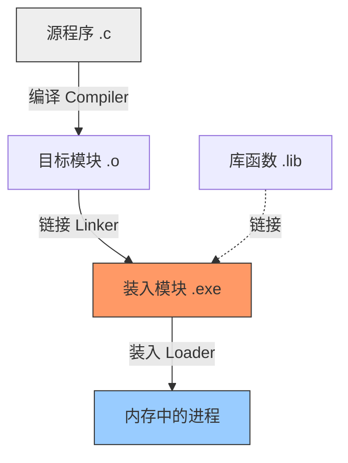

# Special Phase: 从代码到进程 —— 链接与装入 (Linking & Loading)

> [!ABSTRACT] 核心目标
> 
> 你的 C 代码 (.c) 是如何变成硬盘上的可执行文件 (.exe), 又是如何变成内存中运行的进程的？
> 
> - **链接 (Linking)**：解决模块间的拼装和地址引用。
>     
> - **装入 (Loading)**：把程序搬进内存，并搞定物理地址映射。
>     

## S.1 宏观流程图

首先建立全局视角。

---

## S.2 链接 (Linking)：拼积木的艺术

链接的核心任务是：**把一堆 `.o` 文件和库函数拼成一个完整的逻辑地址空间**。在这个阶段，我们只谈**逻辑地址**。

### 1. 静态链接 (Static Linking)

- **原理**：在程序运行前，把所有依赖的库（如 `printf` 的实现代码）全部**拷贝**到你的 exe 文件里。
    
- **结果**：生成一个庞大、独立的 exe。
    
- **优点**：运行快，不依赖环境。
    
- **缺点**：
    
    - **浪费磁盘**：每个程序都存一份 `printf`。
        
    - **浪费内存**：100 个程序运行，内存里就有 100 份 `printf` 的副本。
        
    - **升级难**：库更新了，所有程序都要重新编译。
        

### 2. 动态链接 (Dynamic Linking) —— 现代主流

- **原理**：在链接时，只在 exe 里留一个“[[存根]]” (Stub)，记录“我需要 `libc.so` 里的 `printf`”。真正运行时，OS 才把库加载进来。
    
- **优点**：
    
    - **节省内存**：所有进程共享同一份动态库 (`.dll` 或 `.so`) 的物理内存页（只读部分）。
        
    - **易升级**：换掉 dll，所有程序自动用新版。
        
- **缺点**：加载时稍微慢一点，且容易出现“DLL Hell”（版本依赖地狱）。
    

> [!TIP] 链接的核心动作：重定位 (Relocation)
> 
> 注意，这里是链接时重定位，不是运行时。
> 
> - `main.c` 编译成 `main.o`，它认为自己的代码从 0 开始。
>     
> - `func.c` 编译成 `func.o`，它也认为自己从 0 开始。
>     
> - **链接器**把它们拼起来：`main` 放在 0，`func` 挪到 1000。
>     
> - 同时修改 `main` 里调用 `func` 的指令地址，指向 1000。
>     

---

## S.3 装入 (Loading)：从硬盘到内存

现在你手里有了一个 `.exe`（逻辑地址已经确定，比如从 0 到 1000）。如何把它放到物理内存里跑起来？

### 1. 绝对装入 (Absolute Loading) —— 远古技术

- **做法**：编译时就决定了“这个程序必须放在物理地址 2000”。
    
- **缺点**：完全没有灵活性。如果 2000 被占了，程序就跑不了。只用于单片机或无 OS 环境。
    

### 2. 静态重定位 (Static Relocation) —— 早期多道批处理
可重定位装入
- **做法**：
    
    - 程序逻辑地址是 0~1000。
        
    - 装入器发现物理内存 5000 处有空。
        
    - **在装入的那一瞬间**，把程序里所有指令的地址都加上 5000。
        
    - 入内存后，指令变成了 `JMP 5100`。
        
- **致命缺点**：
    
    - **程序无法移动**：一旦放进去，地址就写死了，不能在内存里搬家（这就没法做内存紧缩了）。
        

### 3. 动态重定位 (Dynamic Relocation) —— 现代 OS 标准

- **做法**：
    
    - **装入时不修改任何指令**！程序里依然写着 `JMP 100`。
        
    - 把程序原封不动放到物理地址 5000。
        
    - 设置 **重定位寄存器 (Relocation Register / Base Register)** = 5000。
        
- **运行时**：
    
    - CPU 执行 `JMP 100`。
        
    - [[MMU]] 硬件自动计算：$100 + 5000 = 5100$。
        
    - 访问物理地址 5100。
        

> [!NOTE] 为什么动态重定位是虚拟内存的前提？
> 
> 只有采用动态重定位，推迟物理地址的计算时间（推迟到执行每一条指令的那一刻），我们才能实现：
> 
> 1. **进程移动**：随时把进程挪到磁盘（Swap），再挪回内存的不同位置。
>     
> 2. **虚拟内存**：让逻辑地址空间大于物理空间。
>     

---

## S.4 总结：地址的演变之路

我们可以用一条清晰的链条串起整个过程：

|**阶段**|**地址名称**|**谁负责**|**特点**|
|---|---|---|---|
|**编写代码**|符号地址|程序员|变量名 `x`, 函数名 `func`|
|**编译**|相对地址|编译器|相对于本模块开头的偏移量|
|**链接**|**逻辑地址**|链接器|整个 exe 的统一编址 (0 ~ N)|
|**装入(动态)**|**物理地址**|**硬件(MMU)**|运行时动态转换 (逻辑 + 基址)|

---

## 🛑 检验思考题 (Linking & Loading)

> [!QUESTION] 场景分析
> 
> 假设你写了一个 C 程序，调用了 printf。
> 
> 1. 如果采用 **静态链接**，生成的可执行文件大小是 1MB。
>     
> 2. 如果采用 **动态链接**，生成的可执行文件大小是 10KB。
>     
> 
> 问题 1：为什么大小差距这么大？那 990KB 去哪了？
> 
> 问题 2：在 运行时动态链接 (Run-time Dynamic Linking) 的模式下，当程序刚开始运行时，printf 的代码在内存里吗？什么时候才会被加载进内存？
> 
> 问题 3：如果系统采用了 静态重定位 装入方式，当内存不足需要把该进程换出到磁盘，然后再换回来时，必须满足什么苛刻的条件？

# 深度专题：地址的“前世今生”与操作系统的“谎言”

> [!ABSTRACT] 核心逻辑
> 
> 1. **链接 (Linking)**：软件层面的“预演”。链接器假设自己拥有整个世界，按照标准规范（如 ELF 格式）给每行代码分配好了**逻辑地址**。这就是“写死”。
>     
> 2. **装入 (Loading)**：内核层面的“登记”。OS 并不把程序读入内存，只是记账（建立映射）。
>     
> 3. **分页模式 (Paging Mode)**：硬件层面的“魔法开关”。开启后，CPU 发出的所有地址都被视为**虚拟地址**，强制经过 MMU 转换。
>     

---

## Part 1: “地址写死”与链接 (The Static Contract)

你问：“地址写死是链接时装入吗？”

回答：不，这叫 链接时定址 (Link-time Relocation)。

### 1. 什么是“地址写死”？

这就好比你在写剧本（源代码）。

- **编译前**：你说“男主角走向女主角”。（这是符号：`call function`）
    
- **链接后**：剧本印出来了，第 10 页第 5 行写着：“男主角走到 **舞台坐标 (100, 200)**”。
    

**在硬盘上的 .exe 文件里，指令已经是这样了：**

> [!CODE] 机器码视角 (x86 示例)
> 
> 假设 main 函数想调用 0x08048300 处的函数。
> 
> 硬盘里的二进制数据可能是： E8 25 00 00 00
> 
> - `E8`：汇编指令 `CALL`。
>     
> - `25 00 00 00`：偏移量。
>     
> - **解释**：这行代码**固化**在硬盘里。它明确告诉 CPU：“跳到这个**逻辑地址**去执行”。这就是所谓的“写死”。
>     

### 2. 链接 (Linking) 的深度操作

链接器的核心任务是 **符号解析 (Symbol Resolution)** 和 **重定位 (Relocation)**。

- **输入**：一堆 `.o` 文件（也就是一堆拼图碎片）。
    
    - `a.o` 说：我定义了变量 `Global_A`，但我不知道 `printf` 在哪。
        
    - `b.o` 说：我引用了 `Global_A`。
        
- **操作**：
    
    1. **合并段**：把所有 `.o` 的代码段拼成一个大代码段，数据段拼成大数据段。
        
    2. **计算地址**：链接器假设程序将从 `0x08048000` (Linux 标准基址) 开始运行。于是它算出 `Global_A` 的逻辑地址是 `0x08049100`。
        
    3. **填空 (Patching)**：链接器回到 `b.o` 的代码里，把所有引用 `Global_A` 的地方，直接替换成 `0x08049100` 这个数字。
        

> [!NOTE] 目的
> 
> 链接的目的是生成一个自洽的逻辑地址空间。在这个文件内部，所有的函数调用、变量访问都已经变成了具体的数字地址（逻辑地址），不再是模糊的符号。

---

## Part 2: “分页模式”与硬件 (The Hardware Switch)

你问：“开启了分页模式是什么？”

回答：这是 CPU 的一个控制寄存器开关，决定了 CPU 怎么“看”地址。

### 1. 实模式 (Real Mode) —— 关掉分页

在电脑刚开机（BIOS 阶段）或早期的 DOS 系统中，分页是关掉的。

- **行为**：CPU 执行 `MOV EAX, [0x1000]`。
    
- **结果**：CPU 直接把电压发到内存条的第 `0x1000` 号单元。**逻辑地址 = 物理地址**。
    
- **危险**：程序可以直接修改 BIOS 数据，或者弄死别的程序。
    

### 2. 保护模式与分页 (Protected Mode with Paging) —— 开启分页

现代 OS 启动时（例如 Windows 的转圈圈界面，或 Linux 的 Boot 阶段），会执行一条特权指令，修改 CPU 的 **CR0 寄存器**，把 **PG (Paging) 位** 置为 1。

- **开启后**：
    
    - CPU 里的 **MMU (内存管理单元)** 激活。
        
    - **所有**指令中的地址（包括刚才那个写死的 `0x08048300`）都被 CPU 视为 **“虚拟地址”**。
        
    - **强制转换**：CPU **绝对禁止**直接访问物理内存。每一条指令都必须经过 `查页表 -> 算物理地址` 的过程。
        

> [!TIP] 为什么这很重要？
> 
> 因为有了这个开关，链接器才敢大胆地把地址“写死”。
> 
> - 链接器想：“反正我生成的地址（逻辑地址）是假的，将来 MMU 会把它映射到任何物理内存去。所以我写死也无所谓！”
>     

---

## Part 3: 装入 (Loading) 的深度操作

你问：“详细讲讲装入……进程的内存映像。”

回答：装入是将“硬盘上的静态契约”转化为“内核里的动态记账”的过程。

### 1. 传统装入 vs 现代装入 (Memory Mapping)

- **教科书里的装入**：把 `.exe` 从硬盘拷贝到内存。 (现代 OS **不** 这么干！)
    
- **现实中的装入 (Linux `execve`)**：
    
    - 操作系统查看 `.exe` 文件的头部信息（ELF Header）。
        
    - OS 发现：代码段长 4KB，逻辑地址起点是 `0x08048000`。
        
    - OS **并不读文件**，而是做了一个 **映射 (Mapping)**：
        
        > “我宣布，当前进程的虚拟地址 `0x08048000` ~ `0x08049000`，对应硬盘文件 `/usr/bin/app` 的第 0 ~ 4096 字节。”
        
    - 这个映射关系被保存在内核的 `vm_area_struct` 链表中。
        

### 2. 进程的“分身”：VMA (Virtual Memory Area)

这是理解进程内存映像的核心。一个进程在内核里就是一堆 **VMA**。

|**VMA 区域**|**对应内容**|**权限**|**来源**|
|---|---|---|---|
|**TEXT**|代码指令|r-x (读/执行)|映射自 `.exe` 文件|
|**DATA**|全局变量|rw- (读/写)|映射自 `.exe` 文件|
|**BSS**|未初始化变量|rw-|匿名映射 (全0)|
|**HEAP**|堆|rw-|`brk/sbrk` 系统调用扩展|
|**STACK**|栈|rw-|自动增长|
|**LIBS**|动态库|r-x|映射自 `libc.so` 文件|

### 3. 直观感受：程序跑起来的那一刻

让我们用慢动作回放 **双击运行** 的全过程：

1. **Shell**: 调用 `fork()` 创建新进程，然后调用 `execve("./app")`。
    
2. **OS (装入)**:
    
    - 清空旧进程的页表。
        
    - 读取 `./app` 的文件头。
        
    - 建立 VMA 映射（代码段、数据段）。
        
    - 设置 CPU 的 PC (Program Counter) 指针 = `0x08048000` (逻辑入口)。
        
3. **CPU (执行)**:
    
    - 试图抓取 `0x08048000` 处的指令。
        
    - **MMU 介入**：查页表。
        
    - **页表状态**：空白！(OS 只是记了账，还没分配物理内存)。
        
    - **结果**：MMU 抛出 **缺页异常 (Page Fault)**。
        
4. **OS (缺页处理)**:
    
    - 捕获异常。查 VMA 账本：“哦，这个地址对应硬盘上的 app 文件”。
        
    - **分配**一个物理页框 (例如 Frame #55)。
        
    - **磁盘 I/O**：把 app 文件的前 4KB 读入 Frame #55。
        
    - **更新页表**：记录 `0x08048 -> Frame #55`。
        
5. **CPU (重试)**:
    
    - 再次执行抓取指令。
        
    - MMU 查表 -> 命中 Frame #55 -> 拿到物理地址 -> 执行成功！
        

---

## 🛑 总结与关联

我们把整个链条串起来：

1. **编译器 & 链接器**：在一个**虚拟**的世界里，把所有指令的跳转地址都**写死**（逻辑地址）。它们假设自己拥有 `0x00000000` 到 `0xFFFFFFFF` 的全部空间。
    
2. **装入器 (Loader)**：不搬运数据，只建立**映射关系**（虚拟地址 -> 硬盘文件）。
    
3. **CPU (开启分页)**：一旦通电运行，CPU 就戴上了“有色眼镜”（MMU），再也看不到真实的物理地址，只能看到逻辑地址。
    
4. **运行时 (缺页)**：只有当 CPU 真正要去读写某行代码时，OS 才会像这就救火队员一样，把数据从硬盘搬到物理内存，并更新 MMU 的地图（页表）。
    

**这就像是一个巨大的“空手套白狼”骗局：**

- **程序**以为自己有连续的内存（链接器给的假象）。
    
- **OS** 直到最后一刻才真正分配物理内存（缺页中断）。
    
- **MMU** 负责在毫秒级的时间里维持这个谎言不被拆穿。

