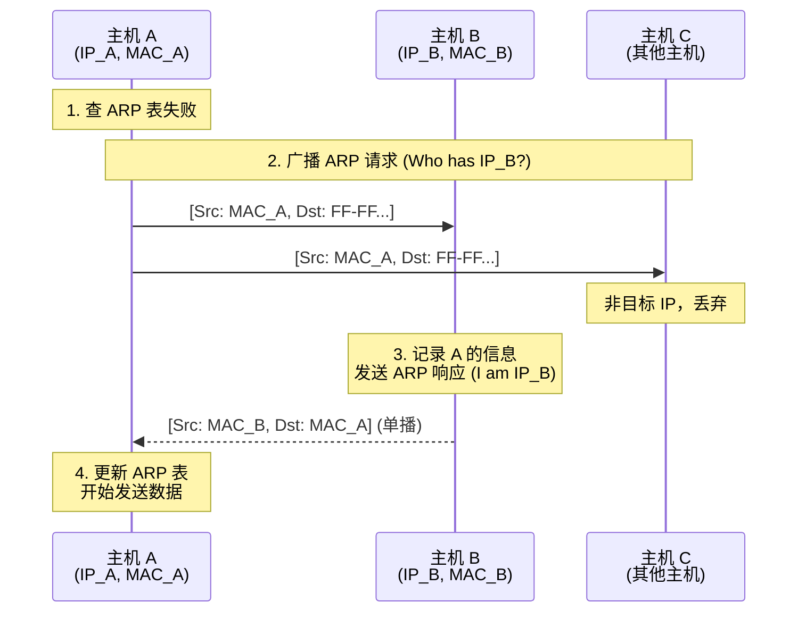

#### 1. ARP 的边界

- ARP 是**二层协议**（虽然为了解析三层地址，但它工作在链路层，包头是 Type 0x0806）。
    
- ARP 请求是**广播** (Broadcast)，ARP 响应是**单播** (Unicast)。
    
- **ARP 绝不跨越路由器**。跨网段通信时，ARP 解析的是**下一跳 (Next Hop)** 的 MAC。
    

#### 2. 免费 ARP (Gratuitous ARP)

- **特征**：Sender IP 和 Target IP 都是它自己。
    
- **作用**：
    
    1. 检测 IP 冲突 (DAD)。
        
    2. 通知邻居更新 MAC 地址表（用于双机热备切换、更换网卡等场景）。
        

#### 3. ARP 安全问题 (必问)

- **漏洞**：ARP 协议没有验证机制，接受非请求的响应。
    
- **攻击**：ARP 欺骗（中间人攻击 MITM）。
    
- **防御**：
    
    - **静态绑定**：在交换机上手动写死 `IP-MAC` 绑定关系（累死管理员）。
        
    - **DAI (Dynamic ARP Inspection)**：企业级交换机的功能，自动检查 ARP 包是不是合法的。
### 详解
#### 1. 为什么需要 ARP？(核心痛点)

- **问题**: 在网络层（Layer 3），我们使用 IP 地址来逻辑寻址（例如 `192.168.1.5`）。但在数据链路层（Layer 2），网卡（NIC）根本不认识 IP 地址，它只认 **MAC 地址**（例如 `AA-BB-CC-11-22-33`）。
    
- **矛盾**: 此时，网络层已经把 IP 数据报组装好了，准备交给链路层发出去。但是链路层说：“大哥，你得告诉我目的 MAC 是谁，我才能封装成帧啊！”
    
- **解决**: **ARP (Address Resolution Protocol)** 就是负责回答这个问题的翻译官——**“已知对方 IP，求对方 MAC”**。
    

> **⚠️ 考研定性**: 虽然 ARP 主要是为了解决链路层封装问题，但它在协议栈中通常被划归为 **网络层** 协议（因为它工作在 IP 层之下，链路层之上，且服务于 IP）。
注：由于ARP“看到了”ip地址，所以工作在网络层，NAT路由器“看到了”端口，所以工作在传输层。

#### 2. ARP 的工作原理 (四步走)

ARP 的工作依赖于 **ARP 缓存 (ARP Cache)** 和 **广播 (Broadcast)**。

假设：**主机 A** (`192.168.1.2`) 想发送数据给 **主机 B** (`192.168.1.3`)。

##### 第一步：查表 (Check Cache)

主机 A 先检查自己的 **ARP 高速缓存表**。

- **如果命中**: 表里有 `192.168.1.3 <-> BB-BB...` 的记录，直接使用该 MAC 封装帧发送。
    
- **如果未命中**: 进入第二步。
    

##### 第二步：广播请求 (Broadcast Request)

主机 A 发送一个 **ARP 请求报文**。

- **内容**: “我的 IP 是 `192.168.1.2`，MAC 是 `AA-AA...`。谁的 IP 是 `192.168.1.3`？请告诉我你的 MAC！”
    
- **封装**:
    
    - **源 MAC**: `AA-AA...` (A 的 MAC)
        
    - **目的 MAC**: `FF-FF-FF-FF-FF-FF` (**全 1 的广播地址**)
        
- **范围**: 本局域网内的**所有主机**都能收到这个广播帧。
    

##### 第三步：单播响应 (Unicast Reply)

局域网内的所有主机都收到了请求，进行处理：

- **其他主机**: 发现问的不是自己，**丢弃**不理。
    
- **主机 B**: 发现问的是自己！
    
    - **动作 1**: 先把 A 的 `IP-MAC` 映射关系存入自己的 ARP 缓存（“既然他找我，我以后肯定也要回他”）。
        
    - **动作 2**: 发送 **ARP 响应报文**。
        
        - **内容**: “我是 `192.168.1.3`，我的 MAC 是 `BB-BB...`。”
            
        - **封装**:
            
            - **源 MAC**: `BB-BB...` (B 的 MAC)
                
            - **目的 MAC**: `AA-AA...` (**单播** 给 A)
                

##### 第四步：更新缓存 (Update Cache)

主机 A 收到 B 的单播响应。

- 将 B 的 `IP-MAC` 映射写入 ARP 缓存表。
    
- 以后发给 B 的数据，直接查表即可。
    

#### 3. 流程图解 

## 4. 考研地狱级考点：跨网段通信 (必背!)

这是 ARP 最容易出错的地方。 **ARP 请求是广播，广播不能穿过路由器！**

如果 **主机 A** (`192.168.1.2`) 要给外网的 **百度服务器** (`202.108.22.5`) 发包：

1. **A 发现**: 目标 IP `202.108.22.5` 和自己不在同一个网段。
    
2. **A 决定**: 必须把包交给 **默认网关** (`192.168.1.1`)。
    
3. **ARP 请求谁？**:
    
    - **错误想法**: 请求百度的 MAC。
        
    - **正确动作**: **请求默认网关的 MAC！**
        
    - A 喊：“谁是 `192.168.1.1`？”（而不是“谁是 `202.108.22.5`？”）
        
4. **封装**:
    
    - **IP 首部**: 目的 IP 依然是 **百度**。
        
    - **MAC 首部**: 目的 MAC 是 **网关**。
        

> **结论**: ARP 永远只解析**本局域网内**直连设备的 MAC（要么是目的主机，要么是下一跳路由器）。

## 5. ARP 报文格式 (了解即可)

ARP 报文是直接封装在 **以太网帧** 里的（不经过 IP 封装）。

|字段|说明|
|---|---|
|**硬件类型**|指明物理网络类型（以太网 = 1）|
|**协议类型**|指明上层协议（IPv4 = 0x0800）|
|**操作代码 (Opcode)**|**1 = 请求 (Request)**, **2 = 响应 (Reply)**|
|**发送方 MAC**|6 字节|
|**发送方 IP**|4 字节|
|**目标 MAC**|6 字节 (请求时全 0)|
|**目标 IP**|4 字节|

## 6. 特殊应用：免费 ARP (Gratuitous ARP)

有时候，主机刚开机或者刚改了 IP，会主动发一个 ARP 请求，问：“谁是 192.168.1.2？”（**问在这个局域网里，谁用了我自己的 IP？**）。

**作用**:

1. **检测 IP 冲突**: 如果有人回应了，说明 IP 被占用了，系统报错。
    
2. **通告更新**: 告诉全网“我的 MAC 换了/我上线了”，让大家更新 ARP 缓存。
    

## 7. 常见攻击：ARP 欺骗 (ARP Spoofing)

由于 ARP 协议是**无状态、无验证**的（别人没问，你也可以发响应；你发什么，别人就信什么）。

- **攻击者 C**: 疯狂给 A 发送伪造的 ARP 响应：“我是网关，我的 MAC 是 `CC-CC...`”。
    
- **后果**: A 把原本发给网关的数据，全部发给了攻击者 C。C 可以窃听、篡改或断网。
    

## 8. 考研自测 Checklist

1. **ARP 请求是广播还是单播？** $\to$ **广播**。
    
2. **ARP 响应是广播还是单播？** $\to$ **单播**。
    
3. **主机 A 想给外网 B 发数据，ARP 解析的是谁的 MAC？** $\to$ **默认网关的 MAC**。
    
4. **ARP 表里的条目会永久保存吗？** $\to$ **不会**，有 TTL（老化时间），通常几分钟后删除。