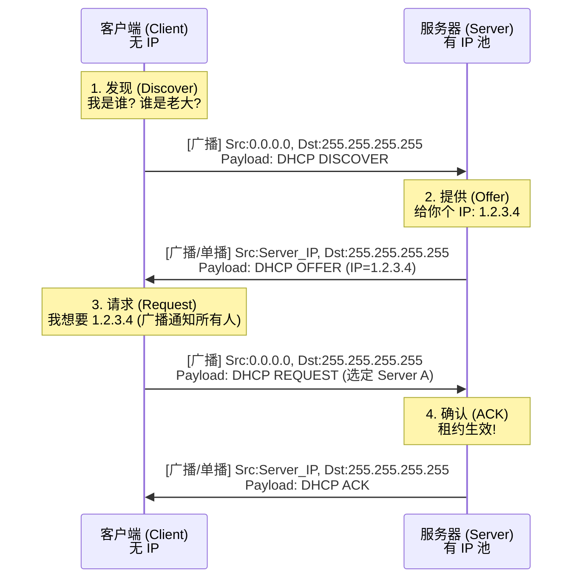

## 1. DHCP 是什么？(即插即用)

- **全称:** Dynamic Host Configuration Protocol。
    
- **作用:** 自动为网络中的主机分配 IP 地址、子网掩码、默认网关、DNS 服务器等网络参数。
    
- **模式:** **C/S 模型** (客户端/服务器)。
    
    - **Client:** 你的手机、电脑 (端口 **68**)。
        
    - **Server:** 路由器或专用服务器 (端口 **67**)。
        
- **底层协议:** **UDP**。
    
    - _为什么用 UDP？_ 此时客户端还没有 IP，TCP 三次握手根本建立不起来；而且广播只能用 UDP。
        

## 2. 核心流程：DORA 四步走 (考研必背)

当你的主机刚连上网络（或者刚开机）时，它没有 IP 地址（只有 MAC 地址）。获取 IP 的过程被称为 **DORA**：

### 第一步：发现 (Discover) —— "有人吗？"

- **动作:** 客户机在局域网上**广播**发送 `DHCP Discover` 报文。
    
- **心态:** “我是新来的，我没有 IP (0.0.0.0)，谁能给我分一个？”
    
- **报文细节 (必考):**
    
    - **源 IP:** `0.0.0.0` (因为自己还没有)
        
    - **目的 IP:** `255.255.255.255` (广播，因为不知道服务器在哪)
        
    - **事务 ID:** 生成一个随机数 (比如 x)，用于标识这次请求。
        

### 第二步：提供 (Offer) —— "我有！"

- **动作:** 局域网内的 DHCP 服务器收到请求后，从地址池里选一个未被占用的 IP (例如 `192.168.1.10`)，**广播**（或单播）发送 `DHCP Offer` 报文。
    
- **心态:** “我这有个 `192.168.1.10`，你要吗？”
    
- **注意:** 如果局域网内有多个 DHCP 服务器，客户机可能会收到多个 Offer。
    

### 第三步：请求 (Request) —— "我要那个！"

- **动作:** 客户机选择其中一个 Offer (通常是先到的那个)，**广播**发送 `DHCP Request` 报文。
    
- **心态:** “我决定用 Server A 给我的 `192.168.1.10` 了！其他的 Server B、C 你们可以把你们预留的 IP 收回去了。”
    
- **关键考点:** **为什么这步还是广播？**
    
    - 为了**通知所有的 DHCP 服务器**。告诉被选中的那个“我选你了”，同时告诉没被选中的那些“我不选你，你们把 IP 释放给别人吧”。
        

### 第三步：确认 (ACK) —— "成交！"

- **动作:** 被选中的服务器发送 `DHCP ACK` 报文。
     
- **心态:** “好，`192.168.1.10` 正式租给你了。租期 24 小时，自带 DNS 和 网关信息。”
    
- **结果:** 客户机收到  ACK 后，正式配置 IP，开始上网。
    
    - _注: 客户机通常还会发一个 **免费 ARP** 来检测这个 IP 是否真的没人用，防止冲突。_
        

## 3. 流程图解  

## 4. 难点：DHCP 中继代理 (Relay Agent)

**场景:** 公司很大，划分子网了。服务器在 **1 楼机房**，你在 **2 楼办公室**。中间隔着一个**路由器**。 **问题:** DHCP Discover 是**广播**，路由器默认**隔离广播**。你在 2 楼喊破喉咙，1 楼的服务器也听不见。

**解决方案:** 在路由器的每个接口上开启 **DHCP 中继功能**。

1. **截获:** 路由器收到广播的 Discover 报文。
    
2. **单播:** 路由器把这个报文**单播**发给 1 楼的 DHCP 服务器（路由器知道服务器 IP）。
    
3. **转发:** 服务器回包给路由器，路由器再回给客户端。
    
转发时已经不是广播，而是单播
> **考研结论:** 也就是通过中继代理，DHCP 服务器可以跨网段服务！

## 5. 租约更新 (Rebinding)

DHCP 分配的 IP 是有**租期 (Lease)** 的（比如 8 小时）。你不能永久占有。

- **T1 (50% 时间):** 租期过去一半时，客户端会**单播**向服务器请求续约。
    
- **T2 (87.5% 时间):** 如果 T1 续约失败（比如服务器挂了），客户端会重新**广播**请求（看有没有别的服务器能续命）。
    
- **过期:** 如果到期还没续上，必须立即停止使用该 IP。
    

## 6. 考研易错点 Checklist

1. **DHCP 是哪一层的？**
    
    - **应用层**。尽管它搞的是 IP 地址（网络层参数），但它通过报文交互，使用的是 UDP 封装。
        
2. **源 IP 为什么是 0.0.0.0？**
    
    - 因为在 DORA 完成之前，客户端自己没有合法的 IP。
        
3. **目的 IP 为什么是 255.255.255.255？**
    
    - 因为客户端不知道服务器在哪，只能全网喊（广播）。
        
4. **服务器端口和客户端端口？**
    
    - 服务器监听 **67**，客户端监听 **68**。（记忆：Server 在前 67，Client 在后 68）。