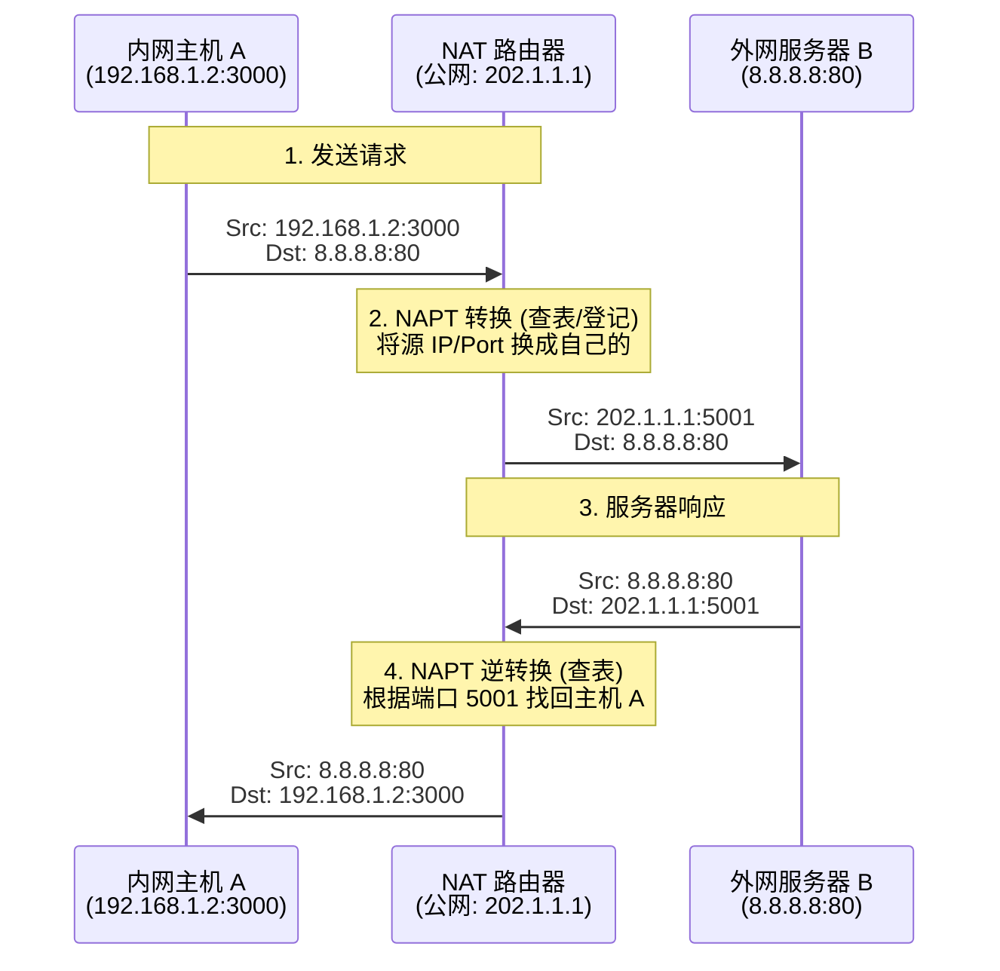

[[局域网与NAT]]
## 1. 为什么需要 NAT？(背景)

在 IPv4 地址耗尽的背景下，为了让全球成千上万的设备都能上网，我们想出了一个“缓兵之计”： **让局域网内部使用私有 IP，只有在连接互联网时，才临时借用一个全球公网 IP。**

- **核心作用:** 将**专用网络地址**（私有 IP）转换为**公用网络地址**（公网 IP）。
    
- **部署位置:** 通常部署在连接内网和外网的**路由器**（或防火墙）上。
    

## 2. 预备知识：私有 IP 地址 (Private IP)

RFC 1918 规定了以下三个网段的 IP 地址仅用于内部网络，**互联网上的路由器对这些地址不进行转发**（直接丢弃）。

|类别|CIDR 地址块|IP 范围 (考研必背)|可容纳主机数|常见场景|
|---|---|---|---|---|
|**A 类**|`10.0.0.0/8`|`10.0.0.0` ~ `10.255.255.255`|1677 万|大型企业/校园网|
|**B 类**|`172.16.0.0/12`|`172.16.0.0` ~ `172.31.255.255`|104 万|中型企业/云服务|
|**C 类**|`192.168.0.0/16`|`192.168.0.0` ~ `192.168.255.255`|6.5 万|家庭/小型办公|

> **⚠️ 注意:** 考研中经常会给出一个拓扑图，如果里面的 IP 是 `192.168.x.x` 或 `10.x.x.x`，你就要立刻反应过来：**这是一个内网，出口一定用了 NAT。**

## 3. NAT 的三种实现方式

### (1) 静态 NAT (Static NAT)

- **机制:** 1 个私有 IP **固定映射** 到 1 个公网 IP。
    
- **关系:** 一对一。
    
- **缺点:** 不节省公网 IP（你有多少内网主机上网，就需要多少公网 IP）。基本被淘汰。
    

### (2) 动态 NAT (Dynamic NAT)

- **机制:** 有一个公网 IP 池。内网主机上网时，从池子里**借**一个 IP，用完归还。
    
- **关系:** 多对多。
    
- **缺点:** 还是没彻底解决 IP 短缺问题（同时上网人数受限于公网 IP 数量）。
    

### (3) NAPT (网络地址端口转换) —— **考研重点！**

- **别名:** PAT (Port Address Translation)。
    
- **机制:** **利用传输层的端口号**来区分不同的内网主机。
    
- **关系:** **多对一** (这是目前最主流的方式)。
    
- **原理:** 所有内网主机共用 **1 个** 公网 IP，但路由器通过修改 **TCP/UDP 端口号** 来区分数据包是回给谁的。
    

## 4. NAPT 工作原理详解 (全流程推导)

假设场景：

- **内网主机 A:** IP `192.168.1.2`, 端口 `3000`
    
- **NAT 路由器:** WAN 口公网 IP `202.1.1.1`
    
- **外网服务器 B:** IP `8.8.8.8`, 端口 `80`
    

### 步骤一：数据发出 (Outbound)

主机 A 想访问服务器 B。

1. **A 发出报文:** `源: 192.168.1.2:3000`, `目: 8.8.8.8:80`
    
2. **到达路由器:** 路由器查 NAT 表，发现这是出网数据。
    
3. **地址转换 (替换源):**
    
    - 将源 IP `192.168.1.2` 替换为公网 IP `202.1.1.1`。
        
    - 将源端口 `3000` 替换为路由器分配的一个空闲端口（例如 `5001`）。
        
    - **登记 NAT 表:** 记录 `192.168.1.2:3000 <--> 202.1.1.1:5001`。
        
4. **发往互联网:** `源: 202.1.1.1:5001`, `目: 8.8.8.8:80`
    

### 步骤二：数据返回 (Inbound)

服务器 B 收到请求后回复。

1. **B 发出报文:** `源: 8.8.8.8:80`, `目: 202.1.1.1:5001` (发给路由器)
    
2. **到达路由器:** 路由器收到数据，查看**目的端口**是 `5001`。
    
3. **查表转发:**
    
    - 查找 NAT 表：谁对应 `5001`？找到是 `192.168.1.2:3000`。
        
4. **地址转换 (替换目的):**
    
    - 将目的 IP `202.1.1.1` 替换回私有 IP `192.168.1.2`。
        
    - 将目的端口 `5001` 替换回原始端口 `3000`。
        
5. **发给主机:** `源: 8.8.8.8:80`, `目: 192.168.1.2:3000`
    

## 5. NAT 的特点与优缺点

### 优点

1. **节省公网 IP:** 这是最主要的目的。
    
2. **安全 (隐蔽性):** 外网只能看到路由器的公网 IP，看不到内网的具体拓扑结构，内网主机对外界不可见。
    
3. **灵活:** 更换 ISP（网络服务商）时，只需要改变路由器的公网 IP，内网 IP 无需改动。
    

### 缺点 (考研选择题考点)

1. **违背了“端到端”设计原则:** 路由器本来只应该看 Layer 3 (IP)，现在 NAT 路由器被迫要拆开看 Layer 4 (端口)，增加了处理负担和时延。
    
2. **P2P 应用受限:** 如果两台主机都在不同的 NAT 后面（比如都在宿舍里），它们很难直接建立连接（需要内网穿透技术）。
    
3. **有些应用层协议会失效:** 比如 FTP 协议，它会在数据载荷里携带 IP 地址，NAT 如果只改包头不改载荷，FTP 就会断连（需要 NAT 应用层网关 ALG 支持）。
    

## 6. 考研常考陷阱 (必看)

1. **NAT 转换表里有什么？**
    
    - 一定要有：**{私有 IP : 私有端口}** 和 **{公网 IP : 公网端口}** 的映射关系。
        
    - 如果有题目让你画 NAT 表，千万别忘了**端口号**。
        
2. **NAT 路由器换了什么？**
    
    - **出去时:** 换 **源 IP** 和 **源端口**。
        
    - **回来时:** 换 **目的 IP** 和 **目的端口**。
        
3. **NAT 能看见端口号吗？**
    
    - **能。** 虽然路由器是网络层设备，但运行 NAT 功能的路由器**必须**查看传输层的端口号。
        
4. **私有地址能不能直接上互联网？**
    
    - **不能。** 互联网上的路由器没有私有地址的路由信息，收到目的地址是私有 IP 的包会直接丢弃。

## 关于使用NAT策略原来的路由冗余技术就不能工作了
### 详细原理解析

要理解为什么不能正常工作，需要先理解 NAT 路由器在转发数据包时做了什么。

#### 1. NAT 是“有状态”的 (Stateful)

NAT 路由器不仅仅是转发数据包，它还在内存中维护了一张 **NAT 映射表（Translation Table）**。

- 当内部主机向外发送数据时，路由器会生成一条记录：`{内部IP:内部端口} <-> {外部IP:外部端口}`。
    
- 当外部数据返回时，路由器必须查这张表，才能知道把数据包转发给内部的哪台主机。
    

#### 2. 故障切换场景模拟

假设公司通过 **路由器 A** 和 **路由器 B** 连接互联网，并且都在运行 NAT。

1. **正常状态：**
    
    - 你的电脑通过 **路由器 A** 访问百度。
        
    - **路由器 A** 在它的内存里记录了一条映射：`你的电脑:12345 <-> 路由器A_公网IP:5678`。
        
    - 百度服务器回复数据给 `路由器A_公网IP:5678`，路由器 A 查表后转发给你。
        
2. **故障发生：**
    
    - **路由器 A** 突然停机（Crash）。
        
    - 网络冗余机制生效，你的流量自动切换到 **路由器 B**。
        
3. **为何失败：**
    
    - **映射丢失**：**路由器 B** 的内存里**没有**刚才那条映射记录（因为它之前是在路由器 A 上创建的）。
        
    - **连接中断**：
        
        - 如果你继续发送数据，数据包经过路由器 B 出去，源 IP 变成了 `路由器B_公网IP`。百度服务器会认为这是一个全新的连接请求（或者非法的 TCP 包），从而拒绝连接（发送 RST 包）。
            
        - 如果百度服务器发送回包（针对之前的请求），它发往的是 `路由器A` 的 IP，或者即使发到了路由器 B，路由器 B 查不到映射表，只能将包丢弃。
### 去掉就可以？
### 1. 为什么去掉 NAT 就可以？

根本原因在于：**普通的 IP 路由是“无状态”（Stateless）的。**

- **有 NAT 时（有状态）：** 路由器必须“记住”每一个连接的对应关系（例如：内网 192.168.1.5 的 TCP 端口 1000 对应 公网 IP 的端口 2000）。如果路由器坏了，这个记忆（状态）就没了。
    
- **无 NAT 时（无状态）：** 路由器变成了一个单纯的“搬运工”。它不需要记住之前发过什么包，也不需要修改数据包的源 IP 地址。它只需要看一眼数据包的目的地，然后查路由表转发出去。
    

### 2. 故障切换过程演示（无 NAT 场景）

假设你的公司拥有合法的公网 IP 地址段（例如 `202.10.1.0/24`），不再需要 NAT。

1. **正常情况：**
    
    - 你的电脑（IP: `202.10.1.5`）发送 TCP 数据包给百度。
        
    - 数据包经过 **路由器 A**。路由器 A 只是单纯转发，不修改 IP。
        
    - 百度收到的包，源 IP 是 `202.10.1.5`。
        
2. **发生故障：**
    
    - **路由器 A** 突然停机。
        
    - 内网的网关协议（如 VRRP）检测到故障，将默认网关指向 **路由器 B**。
        
3. **切换后：**
    
    - 你的电脑继续发送下一个 TCP 数据包。
        
    - 这次数据包经过 **路由器 B**。路由器 B 同样只是单纯转发，不修改 IP。
        
    - 百度收到的包，源 IP 依然是 `202.10.1.5`。
        
4. **结果：**
    
    - 对于百度服务器来说，它根本不知道（也不关心）你中间经过了哪个路由器。它只知道源 IP 没变，TCP 的**五元组**（源IP、源端口、目的IP、目的端口、协议）没有变。
        
    - **连接保持存活，用户无感知。**
        

### 3. 既然这样，为什么我们还要用 NAT？

既然去掉 NAT 就能实现完美的冗余，为什么大多数公司（题目背景）还是用 NAT 呢？这回到了现实的制约：

1. **IPv4 地址枯竭**：公司内部可能有 1000 台电脑，但申请不到 1000 个公网 IP 地址。只能让大家共用几个公网 IP（这就是 NAT 的由来）。
    
2. **安全性**：NAT 在一定程度上隐藏了内部网络结构，起到了简单的防火墙作用。
    

### 4. 总结对比表（考研重点）

| **特性**      | **有 NAT 的网络**              | **无 NAT 的网络 (纯路由)**          |
| ----------- | -------------------------- | ---------------------------- |
| **路由器的角色**  | 既是转发者，又是**翻译官**            | 纯粹的转发者                       |
| **状态维护**    | **有状态 (Stateful)**：必须维护映射表 | **无状态 (Stateless)**：无需维护连接信息 |
| **路由器故障影响** | **连接中断** (因为“翻译记录”丢了)      | **连接保持** (只要有备用路径)           |
| **冗余难度**    | 高 (需要昂贵的设备同步状态)            | 低 (普通的动态路由协议即可)              |