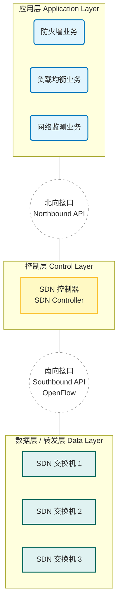

### 1. 直观类比：出租车 vs. 网约车导航

#### 传统网络（分布式控制） = 传统的出租车司机

- **场景**：每个出租车司机（路由器）脑子里都有一张地图（路由表）。
    
- **决策**：当遇到堵车时，司机A决定走胡同，司机B决定绕高架。每个司机**自己独立决策**。
    
- **缺点**：如果全城大堵车，因为司机之间不沟通，大家可能都堵在同一条绕行路线上。很难从全局调度。
    

#### SDN 网络（集中式控制） = 网约车（滴滴/Uber）+ 司机

- **场景**：司机（转发设备）变成了“工具人”，不需要记路。所有的决策都由**云端的服务器（SDN 控制器）**来做。
    
- **决策**：服务器拥有**上帝视角**，看到哪堵了，直接给所有司机下指令：“你左转，他右转”。
    
- **核心**：**控制权**从司机脑子里，转移到了中央服务器。
    

---

### 2. 核心定义：控制层面与数据层面的分离

这是 SDN 最本质的特征，也是考研**必背**的定义：

**SDN 实现了“控制层面（Control Plane）”和“数据层面（Data Plane）”的物理分离。**

1. **数据层面（Data Plane）**：
    
    - **负责干活**。由简单的网络设备（SDN 交换机）组成。
        
    - 它们不再运行复杂的路由算法（如 OSPF），只负责根据“大脑”发下来的指令表（流表）进行简单的**转发**。
        
    - **特点**：通用化、哑巴化（Dumb）、硬件化。
        
2. **控制层面（Control Plane）**：
    
    - **负责指挥**。由逻辑上集中的**SDN 控制器**组成。
        
    - 它掌握全网的拓扑状态，运行路由算法，计算出最佳路径，然后把“流表”下发给下面的设备。
        
    - **特点**：集中化、软件化、可编程。
        

---

### 3. SDN 的三层架构（考研重点）

408 考试经常考查这三层架构以及它们之间的**接口（Interface）**。

#### A. 两个关键接口（必考！）

1. **南向接口 (Southbound API)**：
    
    - **位置**：控制层 $\leftrightarrow$ 数据层（控制器与交换机之间）。
        
    - **作用**：控制器通过这个接口，把“指令”下发给交换机。
        
    - **典型协议**：**OpenFlow**（这是目前最主流的协议，考试默认考这个）。
        
2. **北向接口 (Northbound API)**：
    
    - **位置**：应用层 $\leftrightarrow$ 控制层。
        
    - **作用**：让上层的应用程序（比如你需要写一个自动防御病毒的程序）能够调用网络能力。通常是 RESTful API。
        
    - **特点**：让网络像开发 APP 一样可编程。
        

---

### 4. OpenFlow 与“流表” (Flow Table)

在传统网络中，路由器查的是“路由表”（只看 IP）。

在 SDN 中，交换机查的是**“流表” (Flow Table)**。这是 OpenFlow 协议的核心。

流表的特点（Match-Action 机制）：

它不再仅仅看 IP 地址，它可以看数据包里的任何特征（从二层到四层）。

每一行流表包含三个部分：

1. **匹配域 (Match Fields)**：
    
    - 你是一层层剥开数据包看的。
        
    - 入端口、源 MAC、目的 MAC、VLAN ID、源 IP、目的 IP、TCP 端口号...
        
    - _例子：_ “如果收到的包，源 IP 是 A，且 TCP 端口是 80。”
        
2. **计数器 (Counters)**：
    
    - 统计有多少个包匹配了这一行（用于计费、监控）。
        
3. **动作 (Actions)**：
    
    - 转发（Forward）：送到某个端口。
        
    - 丢弃 (Drop)：防火墙功能。
        
    - 修改 (Modify)：修改包头（比如 NAT）。
        
    - 泛洪 (Flood)。
        

> **区别点**：传统路由器只能根据 **IP** 转发；SDN 交换机可以根据 **IP、MAC、端口号等任意组合** 进行转发。

---

### 5. 传统网络 vs. SDN (对比总结)

|**维度**|**传统网络 (Traditional)**|**SDN 网络**|
|---|---|---|
|**控制方式**|**分布式** (每个路由器自己算)|**集中式** (控制器统一算)|
|**核心机制**|垂直集成 (控制和转发在一个盒子里)|**控制与转发分离**|
|**设备类型**|专用硬件 (Cisco/Huawei 路由器)|通用硬件 (白盒交换机)|
|**转发依据**|路由表 (主要看目的 IP)|**流表** (多字段匹配 Match-Action)|
|**接口协议**|各种私有协议|标准接口 (**OpenFlow**)|
|**灵活性**|差 (改配置要一台台登录)|高 (软件编程，秒级下发)|

---

### 6. 考研会怎么考？

1. **概念题**：问你 SDN 的核心思想是什么？
    
    - 答：**控制层面与数据层面的分离**。
        
2. **接口题**：问你 OpenFlow 协议运行在哪里？
    
    - 答：**控制层和数据层之间（南向接口）**。
        
3. **流表题**：问你 OpenFlow 流表能不能匹配 TCP 端口号？
    
    - 答：**可以**。它可以匹配网络层、链路层、传输层的信息。
        
4. **对比题**：问你 SDN 控制器是分布式的还是集中式的？
    
    - 答：**逻辑上是集中的**（虽然物理上可能是个服务器集群，但逻辑上是一个大脑）。
 