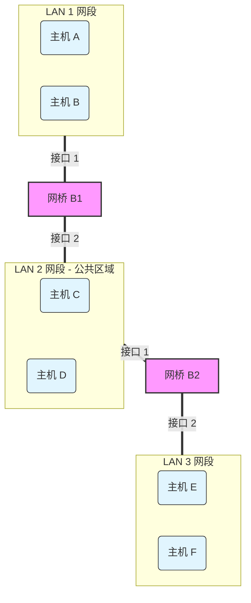

## 交换机详解（链路层方面）
### 1. 核心逻辑（一句话总结）

交换机像一个“聪明的观察者”：

- **向源学习**：看到数据帧从哪个端口**进来**，就记下“**源 MAC** 在这个端口”。
    
- **按目的转发**：根据数据帧要去哪个**目的 MAC**，去查表决定从哪个端口**出去**。
    

> **口诀：** 进端口看源（学习），出端口看目的（转发）。

---

### 2. 交换机里面有什么？

交换机维护着一张 MAC 地址表 (Switching Table)。

刚通电时，这张表是空的。

表里的每一行包含三个关键信息：

1. **MAC 地址**（某台主机的物理地址）
    
2. **接口/端口号**（该主机连接在交换机的哪个口上）
    
3. **有效时间**（TTL，用于老化删除）
    

---

### 3. 详细过程演练（考研常考大题模型）

假设有一个交换机，连接了 A、B、C 三台主机：

- 主机 A 接在 **接口 1**
    
- 主机 B 接在 **接口 2**
    
- 主机 C 接在 **接口 3**
    

场景一：A 发送数据帧给 B

A 发出一个帧：[源MAC: A, 目的MAC: B]

1. **收到帧**：交换机从 **接口 1** 收到这个帧。
    
2. **查找/学习 (关键步骤)**：
    
    - 交换机看帧的**源 MAC** 是 **A**。
        
    - 交换机想：“哦，原来 A 在接口 1。”
        
    - **动作**：在 MAC 表中**登记**（或更新）：`MAC: A -> 接口: 1`。
        
3. **转发**：
    
    - 交换机看帧的**目的 MAC** 是 **B**。
        
    - 交换机查表：找得到 B 吗？**找不到**（因为刚开机，表里只有刚才记下的 A）。
        
    - **动作**：**盲目泛洪 (Flooding)**。交换机把这个帧从**除了接收端口（接口1）以外的所有端口**转发出去（发给 接口 2 和 接口 3）。
        

场景二：B 收到数据后，回复给 A

B 回复一个帧：[源MAC: B, 目的MAC: A]

1. **收到帧**：交换机从 **接口 2** 收到这个帧。
    
2. **查找/学习**：
    
    - 交换机看帧的**源 MAC** 是 **B**。
        
    - 交换机想：“哦，原来 B 在接口 2。”
        
    - **动作**：在 MAC 表中**登记**：`MAC: B -> 接口: 2`。
        
3. **转发**：
    
    - 交换机看帧的**目的 MAC** 是 **A**。
        
    - 交换机查表：找得到 A 吗？**找得到！**（刚才场景一里记下了）。
        
    - **动作**：**明确转发 (Forwarding)**。根据表项，直接把帧**只**发给 **接口 1**。
        
    - _注意：此时 C 不会收到这个帧，这叫“隔离冲突域”。_
        

---

### 4. 三种处理方式总结

当交换机收到一个帧时，根据查表结果，只有三种下场：

|**查表情况**|**动作名称**|**描述**|
|---|---|---|
|**表中无此目的 MAC**|**泛洪 (Flood)**|向除入口外的**所有**接口转发。|
|**表中有此目的 MAC**|**转发 (Forward)**|按照表里的记录，向**特定**的一个接口转发。|
|**目的 MAC = 入口 MAC**|**丢弃/过滤 (Drop)**|如果表里记录的目的地就在接收这个帧的同一个接口（例如该接口接了个集线器），说明不需要转发，直接丢弃。|

---

### 5. 考研易错点 & 必知细节

#### 1. 老化机制 (Aging)

- **问题**：如果拔掉网线，把 A 电脑搬到 接口 3 去了，交换机怎么知道？
    
- **机制**：表项是有**生存时间（TTL）**的。如果一段时间（通常是几分钟）内没有收到 A 发来的数据，交换机会**自动删除** A 的记录。等到 A 在新端口再次发送数据时，交换机重新学习。
    

#### 2. 交换机 vs 集线器 (Hub)

- **Hub**：是个“瞎子”，它不记任何 MAC，收到什么都无脑广播（泛洪）。
    
- **Switch**：是“智能”的，它能**隔离冲突域**（Collision Domain）。A 和 B 通信时，C 的线路是空闲的，C 可以同时和别人通信。
    

#### 3. 广播帧的处理

- 如果目的 MAC 是全 1 的**广播地址** (`FF-FF-FF-FF-FF-FF`)，交换机直接**泛洪**，不查表（也查不到）。
    

#### 4. 固定考点：表的大小

- 交换机的转发表容量是有限的。如果攻击者疯狂伪造不同的源 MAC 发包（MAC泛洪攻击），会把表填满，导致交换机退化成集线器（因为查不到目的MAC只能泛洪），这是网络安全的一个考点。
    

---

### 6. 总结

现在你应该清楚了：

- **路由器 (Layer 3)**：运行 OSPF/RIP 算法，交换的是 **IP 网段**信息，构建**路由表**。
    
- **交换机 (Layer 2)**：运行自学习算法，观察数据帧的 **源 MAC**，构建 **MAC 地址表**。
### 网桥传播例题
#经典例题
如图所示，有三个局域网（LAN1, LAN2, LAN3）通过两个透明网桥（B1, B2）连接。

- **B1** 的接口 1 连接 LAN1，接口 2 连接 LAN2。
    
- **B2** 的接口 1 连接 LAN2，接口 2 连接 LAN3。
    
- 假设 B1 和 B2 的**转发表（自学习表）初始均为空**。

**拓扑图：**

### 问题序列

请按顺序分析以下三个传输过程，并回答：**B1 和 B2 的转发表会如何变化？网桥会如何处理该帧（转发、泛洪还是丢弃）？**

1. **主机 A 发送数据给 主机 D**
    
2. **主机 E 发送数据给 主机 A**
    
3. **主机 B 发送数据给 主机 A**

#### 答案详解
##### 第一步：主机 A $\to$ 主机 D

- **现状**：B1 和 B2 表都是空的。
    
- **数据流向**：A 发出帧 `[源:A, 目:D]`。
    

**1. 网桥 B1 的处理：**

- **收到帧**：从 **P1** 收到。
    
- **自学习（看源）**：表里没 A，**登记 `A -> P1`**。
    
- **转发（查目的）**：查 D？**查不到**。
    
- **动作**：**泛洪 (Flood)** $\to$ 从 P2 发往 LAN2。
    

**2. 网桥 B2 的处理：**

- **收到帧**：B1 泛洪过来的帧传到了 LAN2，B2 从 **P1** 收到。
    
- **自学习（看源）**：表里没 A，**登记 `A -> P1`** (注意：对 B2 来说，A 是从左边 P1 来的)。
    
- **转发（查目的）**：查 D？**查不到**。
    
- **动作**：**泛洪 (Flood)** $\to$ 从 P2 发往 LAN3。
    

> **结果**：D 收到了帧。E 和 F 也收到了（但丢弃了）。此时 B1、B2 都记住了 A 的位置。

---

##### 第二步：主机 E $\to$ 主机 A

- **现状**：
    
    - B1 表：`A -> P1`
        
    - B2 表：`A -> P1`
        
- **数据流向**：E 发出帧 `[源:E, 目:A]`。
    

**1. 网桥 B2 的处理：**

- **收到帧**：从 **P2** 收到（LAN3）。
    
- **自学习（看源）**：表里没 E，**登记 `E -> P2`**。
    
- **转发（查目的）**：查 A？**查到了！** 表里写着 `A -> P1`。
    
- **动作**：**明确转发 (Forward)** $\to$ 从 P1 发往 LAN2。
    

**2. 网桥 B1 的处理：**

- **收到帧**：B2 转发过来的帧传到了 LAN2，B1 从 **P2** 收到。
    
- **自学习（看源）**：表里没 E，**登记 `E -> P2`** (注意：对 B1 来说，E 是从右边 P2 来的)。
    
- **转发（查目的）**：查 A？**查到了！** 表里写着 `A -> P1`。
    
- **动作**：**明确转发 (Forward)** $\to$ 从 P1 发往 LAN1。
    

> **结果**：A 收到了帧。此时 B1、B2 都记住了 E 的位置。

---

##### 第三步：主机 B $\to$ 主机 A （考研最爱考的“过滤”陷阱）

- **现状**：
    
    - B1 表：`A -> P1`, `E -> P2`
        
    - B2 表：`A -> P1`, `E -> P2`
        
- **数据流向**：B 发出帧 `[源:B, 目:A]`。由于 A 和 B 都在 LAN1，它们直接通过物理线路（或集线器）通信，但帧也会传到 B1 的 P1 接口。
    

**1. 网桥 B1 的处理：**

- **收到帧**：从 **P1** 收到。
    
- **自学习（看源）**：表里没 B，**登记 `B -> P1`**。
    
- **转发（查目的）**：查 A？**查到了！** 表里写着 `A -> P1`。
    
- **判断**：目的端口 (P1) **等于** 源端口 (P1)。
    
    - _解释：你要去的地方和你来的地方在同一个房间，没必要经过大门出去。_
        
- **动作**：**丢弃/过滤 (Drop)**。不转发到 LAN2。
    

**2. 网桥 B2 的处理：**

- **收到帧**：由于 B1 选择了丢弃，这个帧根本没有到达 LAN2。
    
- **动作**：**B2 根本收不到这个帧**，无任何动作，表也不更新。
    

---

##### 最终转发表状态总结

|**设备**|**转发表内容**|**解释**|
|---|---|---|
|**B1**|`A -> P1`      `E -> P2`      `B -> P1`|A和B都在左边，E在右边|
|**B2**|`A -> P1`      `E -> P2`|A在左边，E在右边。**注意：B2 没学到 B！**|

##### 考研必记结论 (做题技巧)

1. **B2 为什么没学到 B？**
    
    - 这是考研的大坑。**“本网段内的通信，不会穿过网桥传到另一个网段。”** 因为 B1 发现 B 和 A 在同一个口，直接就把帧拦截（过滤）了，B2 根本听不到 B 的声音，自然学不到 B 的 MAC。
        
2. **方向的相对性**：
    
    - A 对 B1 来说在 P1，对 B2 来说也在 P1（都是左边）。
        
    - 但是如果有一个中间的主机 C，它在 B1 的 P2，但在 B2 的 P1。**每个网桥只关心“对于我来说，他在哪个口”。**
### 生成树协议（[[STP]]）
#### 1. 为什么会有“环路”？（危机来源）

在现实网络工程中，为了防止一根网线断了全网瘫痪，我们通常会**故意**设计**冗余链路**。

**场景**：

- 交换机 A 和 交换机 B 之间，为了保险，为了防止断线，你连了两根网线（或者它们在一个更大的环状拓扑里）。
    

**灾难发生了（广播风暴）：** 还记得我们刚才讲的“泛洪”吗？

1. 主机发了一个**广播帧**（例如 ARP 请求，目的 MAC 是 FF-FF...）。
    
2. 交换机 A 收到后，按照规则，要从所有端口（包括连向 B 的两根线）泛洪出去。
    
3. 交换机 B 从第一根线收到了，为了泛洪，它又把这个帧从第二根线发回给 A。
    
4. 交换机 A 从第二根线收到了，又泛洪回第一根线……
    

**结果**：数据帧在两台交换机之间**无限转圈**，通过量呈指数级增长，瞬间占满带宽，CPU 飙升至 100%，导致网络瘫痪。这就是恐怖的**广播风暴**。

---

#### 2. 救世主：STP (Spanning Tree Protocol)

**STP 的核心思想**： 在**物理上**保留环路（为了备份，网线不用拔），但在**逻辑上**切断环路。

它通过算法，把一个有环的图（Graph）剪裁成一棵无环的**树（Tree）**。

- 树的特点是从根到叶子只有唯一的路径，绝对没有圈。
    
- 如果主线路断了，STP 会感觉到，然后自动把之前“切断”的备份线路恢复通畅。
    

---

#### 3. STP 的工作流程（考研必考逻辑）

STP 是如何“剪断”网线的？它是通过交换特殊的控制报文——**BPDU (Bridge Protocol Data Unit)** 来进行“选举”的。

就像一群人选带头大哥一样，所有交换机通过 4 步选出谁工作、谁休息：

##### 第一步：选“根网桥” (Root Bridge) —— 选老大

全网必须选出一个“老大”（根交换机）。

- **规则**：比较 **BID (Bridge ID)**。
    
    - BID = **优先级** (2字节) + **MAC地址** (6字节)。
        
    - **越小越优先！**（先比优先级，优先级默认都是 32768；如果一样，就比 MAC 地址，谁的 MAC 小谁是老大）。
        
- **结果**：全网只有一个根网桥。
    

##### 第二步：选“根端口” (Root Port, RP) —— 找老大的路

老大选出来了，剩下的非根交换机（小弟），每人要选出一个**离老大最近**的接口，作为“根端口”。

- **规则**：比较到达根网桥的**路径开销 (Cost)**。
    
    - 带宽越大，Cost 越小（路越好走）。
        
- **结果**：每个非根交换机**有且仅有一个**根端口。
    

##### 第三步：选“指定端口” (Designated Port, DP) —— 分派任务

在每一条连线上（网段上），要选一个端口负责发数据。

- **规则**：离根网桥更近的那个交换机的接口当选。
    
- **结果**：根网桥的所有接口通常都是指定端口。
    

##### 第四步：剩下的端口全部“阻塞” (Blocking)

- 既不是根端口，也不是指定端口的接口，就是多余的“备份接口”。
    
- **动作**：逻辑上**阻塞**（Block）。它不转发用户数据，只监听 BPDU（随时准备替补上位）。
    

---

#### 4. 直观图解演练

假设有两台交换机 S1 和 S2 连在一起形成环路：

- **S1 MAC**: 11-11-11...
    
- **S2 MAC**: 22-22-22...
    
- 优先级默认相同。
    

**选举过程：**

1. **选老大**：S1 的 MAC 小，S1 当选**根网桥**。
    
2. **S1 的状态**：老大不需要去别人的路，S1 的所有端口都是**指定端口 (DP)**，处于**转发**状态。
    
3. **S2 的状态**：S2 是小弟。
    
    - 它要选一个离 S1 最近的口做**根端口 (RP)**（假设端口 1 近）。
        
    - 那 S2 的端口 2 呢？它发现这条路去往根网桥不如 S1 直接发过来好，且这条线路上 S1 的口已经是 DP 了。
        
    - 所以，S2 的端口 2 被**阻塞 (Block)**。
        

**最终效果**：S2 的端口 2 变成了红色灯（逻辑断开），环路消失。

---

#### 5. 考研易错点总结

1. **比较原则**：永远是 **“越小越好”**（ID越小越优先，Cost越小越近）。
    
2. **根网桥**：根网桥上**没有**根端口（RP），全是指定端口（DP）。
    
3. **故障恢复**：STP 最大的缺点是**慢**。
    
    - 如果网络拓扑变了（线断了），STP 需要 30-50 秒的时间来重新计算（收敛）。这期间网络是断的。
        
    - **RSTP (Rapid STP)**：快速生成树协议，把这个时间缩短到了几秒甚至毫秒级。（考研如果问改进版，就是它）。
        
4. **层次**：STP 是**数据链路层**的协议，但它需要交换机有处理能力。
    

---

#### 6. 总结

- **没有 STP**：交换机环路 = 广播风暴 = 网络瘫痪。
    
- **有了 STP**：自动把有环的物理网络，计算成无环的逻辑树状网络。
    
- **代价**：部分端口被闲置（阻塞），只有主链路断了它们才会启用。

## 关于交换机与路由器
#混淆 
### 1. 为什么二层交换机不能做网关？

回想一下我们刚才的“快递”比喻：

- **网关（Gateway）** 的定义是“通往其他网络的关口”。要做到这一点，设备必须能看懂**IP地址**（收件人城市），才能决定是发给北京还是上海。
    
- **二层交换机** 只能看懂**MAC地址**（收件人脸）。
    

如果你在电脑上强制把“默认网关”填成一台**普通二层交换机**的IP地址（假设它有一个管理IP），会发生什么？

1. 你的电脑想上百度（外网），发现百度IP不在本地。
    
2. 电脑把数据包发给“网关”（那台交换机）。
    
3. 交换机收到了数据帧。它拆开看了一眼 MAC，心里想：“我是交换机，我只负责在局域网里找人。你给我的这个数据包是要去外网的，但我没有‘路由表’，我不知道往哪送。”
    
4. **结果**：数据包被丢弃，你上不了网。
    

**结论**：在408考试的标准定义中，**交换机（二层）不能做网关，只有路由器（或三层设备）才能做网关。**

---

### 2. 必须厘清的“特例”：三层交换机 (Layer 3 Switch)

你在实验室或者现实中，可能会看到一种叫“交换机”的设备被配成了网关。这会让很多学生产生自我怀疑。

其实，那是**三层交换机**。

- **外表**：长得像交换机，接口多。
    
- **内核**：它里面塞进了一个“路由器引擎”。
    
- **能力**：它既能看MAC（二层交换），也能看IP（三层路由）。
    

**考研防坑指南：**

- 如果题目只说“**交换机 (Switch)**”，默认指**二层交换机** —— **不能**做网关，**不看**IP。
    
- 如果题目明确说“**三层交换机**”或“**路由交换机**”，它才具备路由功能。
    

---

### 3. 实战演练：数数题（冲突域 vs 广播域）

既然你已经理解了交换机和路由器的核心区别，我们就来做这道经典的408真题变形。这道题能一次性检验你对**物理层（Hub）、链路层（Switch）、网络层（Router）**的理解。

#### **题目描述**

假设有一个网络拓扑结构如下：

1. **路由器 R1** 的一个接口（假设为 E0）连接到了 **交换机 S1**。
    
2. **交换机 S1** 上连接了 **3台电脑**（PC1, PC2, PC3）。
    
3. **交换机 S1** 还连接了一个 **集线器 (Hub)**。
    
4. **集线器 (Hub)** 上连接了 **2台电脑**（PC4, PC5）。
    

**请问：这个局域网中，一共有多少个冲突域？多少个广播域？**