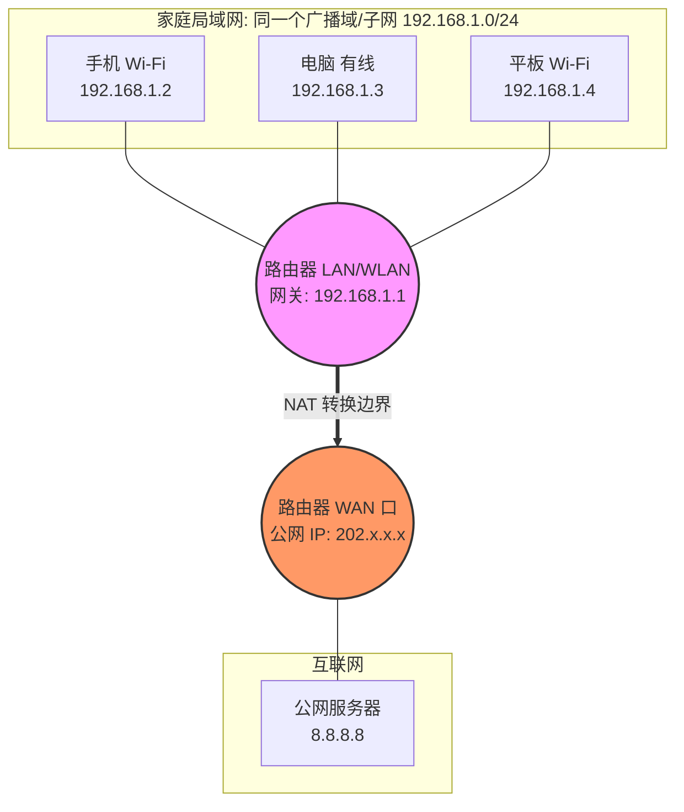

## 1. 连同一个 Wi-Fi 就是同一个局域网吗？

**结论：是的，通常情况下是这样。**

### 原理解析

在家庭或小型办公室网络中，无线路由器其实是一个 **“三合一”** 设备：

1. **无线接入点 (AP):** 提供 Wi-Fi 信号，相当于把有线网线变成了无线电波（工作在物理层/链路层）。
    
2. **以太网交换机 (Switch):** 提供那几个 LAN 口，用于连接有线设备。
    
3. **路由器 (Router):** 负责 NAT、DHCP 和路由转发（连接 WAN 口和 LAN 口）。
    

**为什么是同一个 LAN？**

- 当你连接 Wi-Fi 时，你的手机相当于通过“无线网线”插到了路由器的**虚拟交换机**上。
    
- 家里的台式机插在 LAN 口，也插在同一个**交换机**上。
    
- **Layer 2 视角:** 手机和台式机在同一个**广播域 (Broadcast Domain)**。
    
- **Layer 3 视角:** 路由器内置的 **DHCP 服务器** 会给你们分配**同一个网段**的 IP 地址（例如都是 `192.168.1.x/24`）。
    

**特例 (考研扩展):**

- **访客网络 (Guest Wi-Fi):** 很多路由器支持“访客模式”。此时路由器利用 **VLAN (虚拟局域网)** 技术，把访客 Wi-Fi 和主 Wi-Fi 在逻辑上隔离了。虽然物理上是一个盒子，但逻辑上是**两个不同的局域网**，互不通通信。
    

## 2. 可以在这个局域网里划分子网吗？

**结论：理论上完全可以，但普通家用很少这么做。**

### 理论操作 (考研视角)

假设你连上 Wi-Fi 得到的 IP 是 `192.168.1.0/24`。 你完全可以在这个物理网络中，通过**修改子网掩码**，逻辑上把它切分为两个子网（例如 `/25`）：

- **子网 A:** `192.168.1.0/25` (IP 范围 .1 ~ .126)
    
- **子网 B:** `192.168.1.128/25` (IP 范围 .129 ~ .254)
    

### 实际限制

1. **通信障碍:** 如果你把手机设为子网 A，电脑设为子网 B。虽然它们连着同一个 Wi-Fi（物理二层连通），但因为 **IP不在同一网段**（逻辑三层隔离），它们无法直接通过 ARP 发现对方，也就无法通信（除非路由器配置了这两个子网间的路由转发）。
    
2. **DHCP 限制:** 普通家用路由器的 DHCP 通常只能配置一个“地址池”，默认把大家都塞进一个 `/24` 的大子网里。
    

> **408 考点:** 划分子网是**逻辑上**的操作，跟物理连接（是否在一个 Wi-Fi 下）无关。只要你改变了掩码，网段就变了。

## 3. 和外界交流一定要用 NAT 吗？

**结论：在 IPv4 环境下，是的，必须用 NAT。**

### 核心原因 (IP 属性)

你连接 Wi-Fi 后，获得的 IP（如 `192.168.1.5`）是 **RFC 1918 私有地址**。

- **私有地址的特点:** 仅在局域网内有效，**互联网上的核心路由器看到私有目的地址会直接丢弃**。
    
- **必须“穿马甲”:** 当你的数据包要发给百度（公网）时，必须在路由器的 WAN 口被 **NAT (NAPT)** 转换，把源 IP 替换成运营商分给你的那个**全球唯一的公网 IP**。
    

### 场景推演

1. **手机 (192.168.1.5)** 想刷抖音。
    
2. 数据包到达路由器，路由器发现要去外网。
    
3. 路由器执行 **NAT**: 把 `192.168.1.5:随机端口` 替换为 `公网IP:新端口`。
    
4. 数据包进入互联网。
    

**例外 (IPv6):** 如果是 **IPv6** 网络，因为地址足够多，你的手机可能会获得一个**全球单播 IPv6 地址**。理论上可以直接通信，不需要 NAT（虽然为了安全，通常还是会有防火墙阻挡入站连接，但这不再是地址转换的问题了）。

## 4. 总结图解 

**一句话总结:** 一个 Wi-Fi 通常就是一个局域网（子网）；在这个圈子里大家是**邻居**（直接交付）；要出圈去互联网，必须经过路由器这个**传达室**进行 NAT 伪装（间接交付）。 