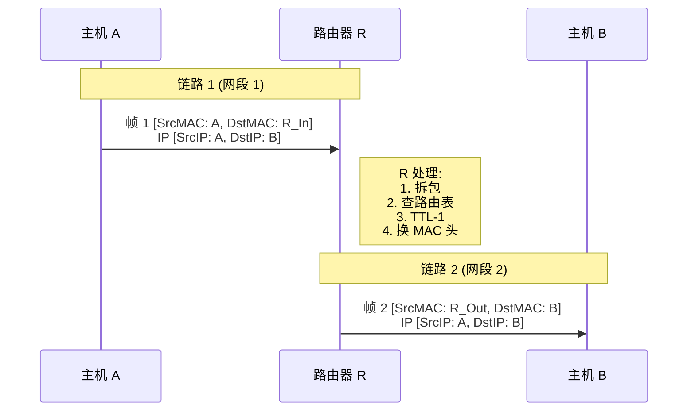

## 路由器转发分组
### 1. 核心结论（一句话总结）

- **路由器转发分组的依据**：主要是网络层首部中的**目的 IP 地址**（Destination IP）。路由器通过查找**路由表**（Routing Table）来决定从哪个接口送出。
    
- **MAC 的作用**：负责**逐跳（Hop-by-Hop）传输**。MAC 地址用于在**局域网（链路层）内部**定位下一跳设备的物理接口。没有 MAC，数据无法在物理线路上实际移动。
    
---
### 2. 详细解析：路由器是如何工作的？

当一个数据包到达路由器时，路由器主要完成以下动作：

#### A. 查表转发 (基于 IP)

路由器收到数据包后，会提取报文首部的**目的 IP 地址**，然后在自己的**路由表**中进行匹配。

- **路由表包含什么？**
    
    - **目的网络（Destination Network）：** 也就是 IP 地址的网络前缀。
        
    - **下一跳（Next Hop）：** 下一个接收者的 IP 地址。
        
    - **接口（Interface）：** 路由器自身的哪个物理端口用于发送。
        
- **匹配原则：最长前缀匹配 (Longest Prefix Match)**
    
    - 如果路由表中有多个条目都能匹配目的 IP，路由器会选择掩码最长（网络位最精确）的那一条。
        

#### B. 封装帧 (MAC 的作用)

一旦路由器决定了“下一跳”是谁，它无法直接把 IP 包扔到线路上。它必须将 IP 包**封装**成数据链路层的**帧（Frame）**。

这时 MAC 地址闪亮登场：

1. **确定下一跳的 MAC：** 路由器知道下一跳的 IP，但需要知道下一跳的 MAC 地址才能物理传输。它会查找 **ARP 缓存表**（如果找不到，就发送 ARP 请求广播）。
    
2. **重写帧头：** 路由器会剥离掉旧的帧头（也就是上一跳发过来的帧头），**封装一个新的帧头**。
    
    - **源 MAC (Source MAC)：** 变成路由器**出接口**的 MAC 地址。
        
    - **目的 MAC (Destination MAC)：** 变成**下一跳设备**（可能是下一个路由器，也可能是目标主机）的 MAC 地址。
        

---

### 3. 直观类比：跨国旅行

为了让你在考研复习中记忆深刻，我们用“坐飞机/火车跨国旅行”来类比：

- **IP 分组 = 旅客**
    
- **数据（Payload） = 行李**
    
- **目的 IP 地址 = 最终目的地的门牌号（例如：美国纽约xx街xx号）**
    
    - _特点：_ 在整个旅途中，你的最终目的地（目的 IP）通常是**不会变**的。
        
- **路由器 = 中转站（机场/火车站）**
    
- **MAC 地址 = 区间票据（登机牌/车票）**
    
    - _特点：_ 每一段旅程票据都不同。
        
    - 从北京到东京，你需要一张写着“北京->东京”的机票（MAC A -> MAC B）。
        
    - 到了东京换乘去纽约，旧机票作废，你需要一张新的“东京->纽约”的机票（MAC C -> MAC D）。
        

> **总结：** IP 负责指引**最终方向**（全球寻址），MAC 负责搞定**这一段路怎么走**（局部寻址）。

---

### 4. 考研重点与易错点 (High Yield Points)

在备战考研时，请务必关注以下几个细节，这是出题人最喜欢挖坑的地方：

#### 1. 地址的变化规律（必考）

在数据包经过路由器转发的过程中：

- **源 IP 和 目的 IP：** 通常**保持不变**（除非使用了 NAT 网络地址转换）。
    
- **源 MAC 和 目的 MAC：** **每一跳都会改变**。每经过一个路由器，帧头都会被剥去，换上新的源 MAC（当前路由器的出接口）和新的目的 MAC（下一跳接口）。
    

#### 2. TTL 的变化

- 路由器每转发一次，IP 首部中的 **TTL (Time To Live)** 字段必须 **减 1**。
    
- 如果 TTL 减为 0，路由器丢弃该包，并向源主机发送 ICMP 超时报文（这是 Traceroute 的原理）。
    

#### 3. 校验和（Checksum）

- 因为 TTL 变了，IP 首部发生了变化，所以路由器必须**重新计算 IP 首部校验和**。
    

#### 4. MTU 与 分片

- 如果输出接口的 MTU（最大传输单元）小于 IP 分组的长度，路由器负责进行**分片（Fragmentation）**。
    

---

### 5. 总结对比表

| **特性**   | **IP 地址 (网络层)**       | **MAC 地址 (数据链路层)**       |
| -------- | --------------------- | ------------------------ |
| **作用范围** | 全局有效，端到端 (End-to-End) | 仅在本地链路有效，逐跳 (Hop-by-Hop) |
| **转发依据** | 路由器根据 IP 查路由表         | 交换机根据 MAC 查转发表           |
| **在转发中** | **基本不变**              | **每一跳都变**                |
| **层级**   | 逻辑地址 (软件配置)           | 物理地址 (硬件烧录)              |
## 关于路由交换了什么
#混淆
### 1. 路由算法（RIP/OSPF/BGP）交换的是什么？

路由协议的目标是**“绘制地图”**，告诉路由器去往某个**IP子网**该怎么走。

**路由更新报文（Routing Update）里主要包含：**

- **目的网络（Destination Network）：** 例如 `192.168.1.0`
    
- **子网掩码（Mask）：** 例如 `/24`
    
- **度量值（Metric）：** 距离有多远（跳数、带宽、Cost等）。
    
- **下一跳 IP（Next Hop IP）：** 告诉邻居，要把包发给谁。
    

**为什么不交换 MAC？**

- **MAC 是“本地”的**：MAC 地址只在两个直接相连的设备（链路）之间有效。一旦跨过路由器，源和目的 MAC 就会全部变掉。
    
- **路由是“全局”的**：北京的路由器需要知道如何到达纽约的 **IP 网段**，但根本不需要（也不可能）知道纽约某台服务器网卡的 MAC 地址。
    

---

### 2. 你可能混淆的“MAC 记录者”

你印象中“会记 MAC”的场景，应该是以下两种情况之一，请对比一下：

#### 情况 A：ARP 表 (Address Resolution Protocol)

- **场景**：路由器算出了下一跳是 IP地址 X，但要真正把包发给 X，必须知道 X 的 MAC。
    
- **动作**：路由器查自己的 **ARP 缓存表**。
    
- **内容**：`IP 地址 <--> MAC 地址` 的映射。
    
- **来源**：这不是通过路由算法（OSPF/RIP）学来的，而是通过 **ARP 广播** 在**局域网内部**问出来的（“谁是 192.168.1.1？请把你的 MAC 告诉我”）。
    

#### 情况 B：交换机 (Switch) 的转发表

- **场景**：二层交换机在局域网内工作。
    
- **动作**：交换机通过“自学习算法”。
    
- **内容**：`MAC 地址 <--> 端口号`。
    
- **来源**：交换机监听流经端口的数据帧的**源 MAC 地址**来学习。
    

---

### 3. 唯一的“特例” (为了严谨，如果你考研遇到这种深题)

虽然路由算法本身**不传递**目的主机的 MAC，但在**链路状态协议（如 OSPF）**的**Hello 包建立邻居**阶段，或者在**以太网链路**上传输路由更新包时：

1. **载体本身有 MAC**：路由器 A 发送 OSPF 更新包给路由器 B，这个**包的外层帧头**里肯定有 A 的源 MAC 和 B 的目的 MAC（或组播 MAC）。路由器 B 收到包时，底层驱动会看到 MAC，但**路由协议（OSPF 进程）处理的是包里的 IP 信息**。
    
2. **IPv6 的下一跳**：在 IPv6 环境下，OSPFv3 交换的下一跳地址通常是 **Link-Local Address (链路本地地址)**，虽然它长得像 IP，但它的生成通常是基于 MAC 地址（EUI-64）变换来的。但这依然属于网络层地址，不是直接交换 MAC。
    

---

### 4. 总结 (考研怎么答)

如果考试问你：**“路由器之间运行 OSPF/RIP 协议时，交换的路由表中包含 MAC 地址吗？”**

- **答案**：**不包含。**
    
- **包含内容**：目的网络地址、子网掩码、下一跳 IP 地址、度量值等。
    
- **MAC 的作用**：MAC 地址仅用于在每一跳的**物理传输过程中**，通过 ARP 协议解析下一跳 IP 得到，用于封装数据帧。
    

**一句话记忆：**

- **路由表（控制层面）**：全是 **IP**，负责指路。
    
- **ARP 表（数据层面）**：才有 **MAC**，负责铺路。
## 网络层分组转发流程
### 1. 宏观图景：从主机到路由器

网络层转发分组的核心任务是：**将数据报从源主机通过一个个路由器，最终送达目的主机。**

这个过程可以分为两个基本阶段：

1. **直接交付 (Direct Delivery):** 目的主机就在同一个局域网内，不需要经过路由器转发。
    
2. **间接交付 (Indirect Delivery):** 目的主机在外网，需要通过默认网关（路由器）一步步转发。
    

### 2. 核心机制：转发算法 (The Algorithm)

无论是主机发送数据，还是路由器转发数据，都遵循以下统一的逻辑判断流程。

#### 第一步：提取目的 IP

拿到一个 IP 数据报，首先提取首部中的 **目的 IP 地址 (D)**。

#### 第二步：判断是否为“直接交付”

用**当前接口的子网掩码**与 **D** 进行按位与 (`AND`) 运算。

- **若结果 == 本网络地址**: 说明 D 就在本局域网上。
    
    - **动作**: 查找 ARP 表解析 D 的 MAC 地址，封装成帧，**直接发送**给 D。任务结束。
        
- **若结果 != 本网络地址**: 说明 D 在外网，需要**间接交付**（找下一跳）。
    

#### 第三步：查找路由表 (特定主机路由)

检查路由表中是否有**特定主机路由**（掩码为 `/32`，精确匹配 D）。

- 如果有，按照指明的下一跳转发。
    

#### 第四步：查找路由表 (网络路由 - 最长前缀匹配)

这是最关键的一步。路由器会将路由表中的每一行（网络前缀）与 D 进行匹配。

- **匹配规则**: `(D) AND (该行掩码) == (该行网络号)` ?
    
- **多重匹配**: 如果有多行都能匹配（例如 D 同时匹配上了 `10.0.0.0/8` 和 `10.1.0.0/16`），**选择掩码最长（前缀最长）的那一行**。
    
    - _原因_: 掩码越长，网络划分越细，路由越精准。
        

#### 第五步：查找默认路由

如果以上所有条目都不匹配，查找是否有 **[[默认网关]] (0.0.0.0/0)**。

- 如果有，传给默认路由指定的下一跳。
    
- 如果没有，**丢弃分组**，并向源主机发送 **[[ICMP]] 目的不可达** 报文。
    

### 3. 微观视角：路由器内部处理流程

当一个数据帧到达路由器的输入端口时，物理层、链路层和网络层协同工作。

1. **解封装 (链路层)**:
    
    - 路由器检查帧的 **FCS (校验和)**。如果出错，直接丢弃。
        
    - 剥去帧头和帧尾，提取出 **IP 数据报**。
        
    - _注意: 此时旧的源 MAC 和目的 MAC 被丢弃。_
        
2. **预处理 (网络层)**:
    
    - 检查 IP 首部校验和。
        
    - **TTL 减 1**: 如果 TTL 减为 0，丢弃分组，发 ICMP 超时报文。
        
    - _注意: 这一步导致 IP 首部发生了变化（TTL变了，校验和也得重算）。_
        
3. **查表转发 (Forwarding)**:
    
    - 根据目的 IP，利用上述“转发算法”找到 **下一跳 IP (Next Hop)** 和 **出接口 (Interface)**。
        
4. **重封装 (链路层)**:
    
    - 路由器作为新的发送者，需要构建新的 MAC 帧。
        
    - **ARP 解析**: 路由器检查 ARP 缓存，找到 **下一跳 IP** 对应的 **MAC 地址**。
        
    - **封装**:
        
        - **新源 MAC**: 路由器 **出接口** 的 MAC。
            
        - **新目的 MAC**: **下一跳** 的 MAC。
            
    - 发送数据帧。
        

### 4. 经典图解：数据包的变化 (考研必背)

假设数据包从 Host A 经过 Router R 转发给 Host B。

**⚠️ 铁律总结:**

1. **IP 地址 (源/目):** 全程**不变**（除非遇到 [[NAT]]）。
    
2. **MAC 地址 (源/目):** **每一跳都变**。
    
    - 源 MAC 总是当前发送设备的 MAC。
        
    - 目的 MAC 总是下一跳接收设备的 MAC。
        

## 5. 特殊情况：分组分片

如果路由器发现出接口的 MTU (最大传输单元) 小于 IP 数据报的长度：

1. 检查 **DF (Don't Fragment)** 标志位。
    
    - 若 DF=1，丢弃并报错（ICMP）。
        
    - 若 DF=0，进行 **分片 (Fragmentation)**。
        
2. 将数据报切开，复制 IP 首部，修改 **总长度**、**标识**、**MF** 和 **片偏移** 字段。
    
3. **注意**: 路由器只管分，不管组。重组工作由**目的主机**完成。
    

## 6. 自测问题 (Checklist)

1. **路由表中包含目的主机的 MAC 地址吗？**
    
    - **不包含**。路由表只有 IP 信息（网络号、掩码、下一跳 IP）。MAC 地址是在封装环节查 ARP 表得到的。
        
2. **下一跳 (Next Hop) 到底是给谁的？**
    
    - 下一跳 IP 是链路层封装时，ARP 请求的目标。它决定了数据帧被扔给谁。
        
3. **为什么 TTL 要在路由器减？**
    
    - 防止路由环路导致数据包无限循环。