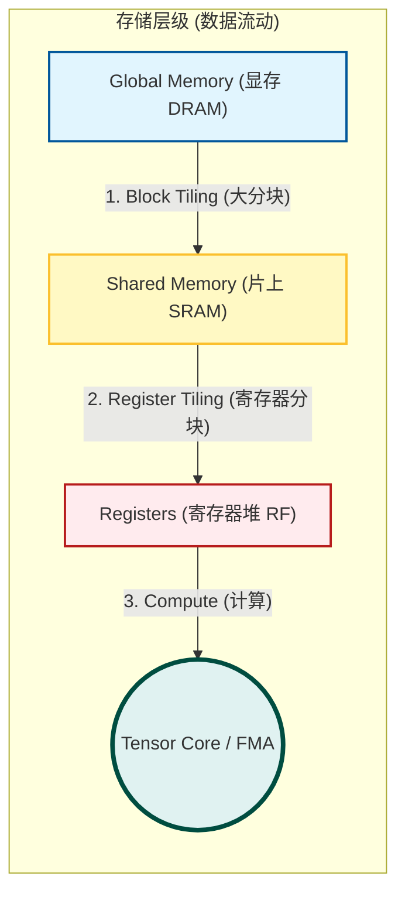

#### 5. CUDA 程序执行流程

**题目：** 使用GPU CUDA编写并行程序可以总结为以下几个步骤，但下述步骤是乱序的，请按照先后顺序正确排序 ______

- **正确答案：** **D. (2) (5) (1) (3) (4)**
    

**深度解析：** 这是标准的 CUDA Host-Device 交互流程（The CUDA Processing Flow）：

1. **Host 端准备 (2)：** CPU 初始化，准备输入数据 (`Host Memory Allocation`)。
    
2. **Device 端申请内存 (5)：** 使用 `cudaMalloc` 在 GPU 显存上开辟空间。
    
3. **数据传输 H2D (1)：** 使用 `cudaMemcpy` 将数据从 CPU 复制到 GPU (`Host to Device`)。
    
4. **内核执行 (3)：** 调用 Kernel 函数 (`kernel<<<...>>>`)，GPU 开始并行计算。
    
5. **数据回传 D2H (4)：** 计算完成后，使用 `cudaMemcpy` 将结果从 GPU 复制回 CPU (`Device to Host`)。
    

---

#### 6. Kernel 函数定义

**题目：** 下列哪个前缀定义的函数称为GPU的内核函数或核函数，该函数只能从CPU端调用，且运行在GPU上 ______

- **正确答案：** **B. `__global__`**
    

**深度解析（CUDA 函数修饰符辨析）：**

- **`__global__`**：**核函数 (Kernel)**。运行在 **Device (GPU)** 上，由 **Host (CPU)** 调用（或者在动态并行中由 GPU 调用）。它的返回值必须是 `void`。
    
- `__host__`：运行在 **Host (CPU)** 上，由 **Host (CPU)** 调用。这是默认的 C++ 函数行为。
    
- `__device__`：运行在 **Device (GPU)** 上，只能由 **Device (GPU)** 上的其他函数调用。通常用于辅助函数。
    
- `__host__ __device__`：同时编译两个版本，既能在 CPU 跑也能在 GPU 跑，方便代码复用。
    

---

#### 7. 访存竞态问题 (Race Condition)

**题目：** 下列代码中存在哪种访存竞争问题 ______

- **正确答案：** **A. RAW (读后写)**
    

**深度解析（这是并行编程中最经典的错误）：**

**代码逻辑分析：**

1. **Write 阶段：** 线程首先将全局内存 `in` 中的数据读取并**写入**到共享内存 `temp` 中 (`temp[lindex] = ...`)。
    
2. **Read 阶段：** 紧接着，线程进入 `for` 循环，从共享内存 `temp` 中**读取**邻居的数据来计算 `result` (`result += temp[lindex + offset]`)。
    

**问题所在：**

- 这是一个并行环境。线程 A 负责写入 `temp[A]`，线程 B 在计算时需要读取 `temp[A]`。
    
- 代码在 "Write 阶段" 和 "Read 阶段" 之间**缺少了 `__syncthreads();` (同步栅栏)**。
    
- **后果：** 线程 B 可能执行得很快，在线程 A 还没有来得及把数据**写入** `temp[A]` 之前，线程 B 就已经尝试去**读取** `temp[A]` 了。
    
- **判定类型：**
    
    - 我们需要的是：先写 (Write)，再读 (Read)。即数据依赖是 **Read-After-Write (RAW)**。
        
    - 竞态导致的问题是：**读操作发生在写操作完成之前**。在计算机体系结构和并行计算中，这种由于某种指令序列（或线程执行顺序）导致后续的“读”操作未能获取到前序“写”操作更新的最新值的情况，属于 **RAW Hazard (读后写冲突)** 的范畴（也常被称为“真数据依赖”冲突）。
        

**如何修复：** 必须在 `// Apply the stencil` 这行注释之前，插入一行代码：

```cpp
__syncthreads(); // 确保 Block 内所有线程都完成了 Shared Memory 的写入
```

## 🖥️ GPU 架构与 CUDA 优化核心

### 1. 硬件互联与架构特征
* **互联总线:** **PCI-E** (通用标准) vs NVLink (高性能/专用)。
* **核心特征 (GPU vs CPU):**
    * **GPU:** 大量弱核心 (Throughput Oriented)，硬件级上下文切换 (掩盖延迟)，SIMT。
    * **CPU:** 少量强核心 (Latency Oriented)，复杂分支预测，软件级上下文切换。

### 2. 内存合并访问 (Memory Coalescing)
> [!IMPORTANT] 性能优化的第一原则
> GPU 显存是昂贵的资源，必须减少“内存事务 (Transactions)”的数量。

* **事务单位:** 通常为 **128 Bytes** (L1 Cache Line)。
* **判据:** 一个 Warp (32线程) 请求的数据是否落在**同一个 128B 对齐段**内？
    * ✅ **Aligned Sequential:** 完美合并 (1 Transaction)。
    * ✅ **Permuted (乱序但块内):** 现代 GPU 可合并 (1 Transaction)。
    * ❌ **Misaligned (错位):** 跨越边界，需要多次事务 (e.g., 2 Transactions)。

### 3. CUDA 编程常见错误
* **RAW Hazard (读后写冲突):**
    * *场景:* `Write Shared Mem` -> `Read Shared Mem`。
    * *错误:* 忘记在 Write 和 Read 之间加 `__syncthreads()`。
    * *后果:* Read 读到旧数据。
* **MPI Rsend (Ready Send):**
    * *风险:* 接收方未 Ready 就发送会导致崩溃。
    * *解决:* 使用 Send/Recv 握手信号确保同步。



```cpp
/**
 * 🚀 CUDA 编程标准流程 (Standard Flow)
 * 1. Malloc: 在 GPU 上开房间 (cudaMalloc)
 * 2. H2D:    把数据搬进去 (cudaMemcpyHostToDevice)
 * 3. Kernel: GPU 疯狂计算 (<<<grid, block>>>)
 * 4. D2H:    把结果搬出来 (cudaMemcpyDeviceToHost)
 * 5. Free:   退房 (cudaFree)
 */

// --- 1. Kernel: 并在 GPU 上执行的逻辑 ---
__global__ void vectorAdd(int *a, int *b, int *c, int n) {
    // 🔥 考点：计算全局唯一索引
    int tid = threadIdx.x + blockIdx.x * blockDim.x;
    
    // 边界检查 (防止越界访问内存)
    if (tid < n) {
        c[tid] = a[tid] + b[tid];
    }
}

// --- 2. Host: CPU 主控逻辑 ---
int main() {
    // ... 变量声明与 CPU 内存分配 ...

    // Step 1: GPU 显存分配
    cudaMalloc((void**)&d_a, size);
    cudaMalloc((void**)&d_b, size);
    cudaMalloc((void**)&d_c, size);

    // Step 2: H2D 数据传输 (CPU -> GPU)
    // 🚩 填空考点
    cudaMemcpy(d_a, h_a, size, cudaMemcpyHostToDevice);
    cudaMemcpy(d_b, h_b, size, cudaMemcpyHostToDevice);

    // Step 3: 启动核函数
    // Grid Size = (N + BlockSize - 1) / BlockSize (向上取整)
    int threadsPerBlock = 512;
    int blocksPerGrid = (N + threadsPerBlock - 1) / threadsPerBlock;
    vectorAdd<<<blocksPerGrid, threadsPerBlock>>>(d_a, d_b, d_c, N);

    // Step 4: D2H 数据回传 (GPU -> CPU)
    // 🚩 填空考点
    cudaMemcpy(h_c, d_c, size, cudaMemcpyDeviceToHost);

    // Step 5: 释放显存
    cudaFree(d_a); cudaFree(d_b); cudaFree(d_c);
    
    return 0;
}
```
## ⚡ CUDA 进阶优化：执行与访存

### 1. Warp Divergence (线程束分歧)
> [!WARNING] 性能杀手
> **定义:** 同一个 Warp 内的线程走入了不同的分支路径 (If-Else)。
> **后果:** 硬件只能串行执行所有路径，Warp 的执行效率下降 (SIMT $\rightarrow$ Serial)。
> **解决:** > * 避免在 Warp 内写复杂分支。
> * 使用 `__ballot` 等指令进行优化。
> * 尽量让分支条件与 `threadIdx / 32` 相关（即整个 Warp 走同一条路）。

### 2. Bank Conflict (存储体冲突)
**场景:** Shared Memory 访问。
**机制:** 32 个 Banks，就像 32 个银行窗口。
* ✅ **并行访问:** 32 个线程同时访问 32 个不同的 Bank (耗时 1 周期)。
* ✅ **广播 (Broadcast):** 32 个线程同时访问 **同一个地址** (耗时 1 周期，硬件优化)。
* ❌ **冲突 (Conflict):** 多个线程同时访问 **同一个 Bank 的不同地址**。
    * *后果:* 访问串行化。n 路冲突导致耗时变为 n 倍。
    * *典型案例:* 步长为 2 的访问 (Stride-2)，会导致一半 Bank 空闲，一半 Bank 发生 2 路冲突。

**冲突识别图解:**
看连线图，如果多个线程(Threads)的线连到了同一个 Bank，且不是访问同一行数据(Broadcast)，那就是 Conflict。