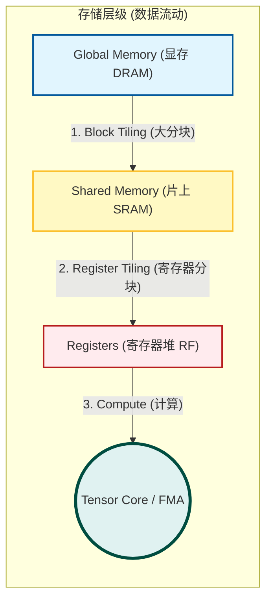

# 第一部分：GPU 概述与 CPU/GPU 核心差异 (Part 1)

> 复习范围：Slides 1 - 16
> 
> 核心主题：为什么需要 GPU？CPU 和 GPU 在设计哲学上本质的区别是什么？

## 1. 什么是 GPU？ (基本概念)

- **全称**：Graphics Processing Unit (图形处理器)。
    
- **起源**：最初是专门为图形渲染（Graphics）设计的。
    
- **现状**：现在已发展为**通用计算 (GPGPU)** 设备，专门处理**可并行化 (Parallelizable)** 的问题。
    
- **特点**：
    
    - 计算能力极强 (Very fast and powerful)。
        
    - 功耗较高 (Uses lots of electrical power)。
        

## 2. 为什么要用 GPU？ (Motivation)

- **案例：光线追踪 (Raytracing)**
    
    - PPT举了光线追踪的例子：计算图像中每个像素的光照颜色。
        
    - **关键点**：图像中 `(0,0)` 的像素和 `(100,100)` 的像素计算互不干扰。
        
    - **结论**：只要有足够的并行能力，所有像素可以**同时 (Simultaneously)** 计算。这就是 GPU 存在的意义——**大规模并行计算**。
        

---

## 3. 🔥[重点] CPU vs GPU 架构对比

这是本章最核心的考点。请务必背诵并理解两者的**设计哲学差异**。

### 3.1 物理结构差异 (从芯片面积看)

PPT 第12-13页展示了经典的对比图（这也是考试常考的绘图或分析题）：

|**组件**|**CPU (Central Processing Unit)**|**GPU (Graphics Processing Unit)**|
|---|---|---|
|**Control (控制单元)**|**很大**。逻辑控制能力强，擅长复杂的流控制（如分支预测）。|**很小**。简单单一的逻辑控制。|
|**Cache (缓存)**|**很大**。为了降低延迟。|**很小**。|
|**ALU (算术逻辑单元)**|**少**。占据芯片面积小。|**极多**。占据了芯片绝大部分面积。|

> **🎓 助教通俗解读**：
> 
> - **CPU** 像是一个**数学教授**。他很聪明（Control强），能处理复杂的微积分和逻辑陷阱，但他只有两只手（ALU少），一次只能算一道题。
>     
> - **GPU** 像是一个**由几千名小学生组成的方阵**。每个人只能算简单的加减乘除（Control弱），但人多力量大（ALU多），一声令下可以同时算几千道题。
>     

### 3.2 核心特性对比 (Core Differences)

|**特性**|**CPU**|**GPU**|
|---|---|---|
|**内核数量**|少量的强大内核 (Few, powerful cores)|大量的弱内核 (Many, weak cores)|
|**设计目标**|**低延迟 (Low Latency)**|**高吞吐量 (High Throughput)**|
|**任务类型**|串行处理，复杂的逻辑控制|并行处理，计算密集型任务|
|**上下文切换**|**软件**完成 (开销大)|**硬件**完成 (开销极小，几乎免费)|

> **❓ 难点解析：延迟 (Latency) vs 吞吐量 (Throughput)**
> 
> - **延迟 (Latency)**：做**一件**事情需要多长时间。
>     
>     - _CPU 追求这个_。比如你点开一个网页，你希望它瞬间打开，不想等。
>         
> - **吞吐量 (Throughput)**：单位时间内能做**多少**事情。
>     
>     - _GPU 追求这个_。GPU 不在乎算好一个像素需要 0.001秒还是 0.01秒，它在乎的是能不能在 0.01秒内把屏幕上 200万个像素全算完。
>         

### 3.3 发展趋势

- **CPU**: 发展主要依靠提升单核频率和指令级并行（现在已放缓）。
    
- **GPU**: 性能随年份呈指数级增长（PPT Slide 14 展示了 GPU 性能增长远超 CPU）。
    
- **显存**: 使用高带宽内存（如 **HBM2**），拥有超宽的总线（Very wide bus），远超 CPU 内存带宽（Slide 16）。
    

---

## ✍️ 期末考题预测 (Prediction)

根据这一节的内容，我为你预测了以下考题。请尝试自测：

**1. [简答题/辨析题] ★★★**

> 题目：请简述 CPU 和 GPU 在设计目标上的核心区别，并解释“低延迟”和“高吞吐量”的含义。
> 
> 参考答案：
> 
> CPU 的设计目标是低延迟 (Low Latency)，旨在以最快速度完成单个任务，适用于处理复杂的串行逻辑；
> 
> GPU 的设计目标是高吞吐量 (High Throughput)，旨在单位时间内处理尽可能多的数据，适用于大规模并行计算。
> 
> - **低延迟**：指从发出指令到收到结果的时间间隔尽可能短。
>     
> - **高吞吐量**：指单位时间内完成的任务总量尽可能大。
>     

**2. [填空题] ★★**

> 题目：在 GPU 中，上下文切换（Context Switch）通常由 \____ 完成，而在 CPU 中通常由 \____ 完成。
> 
> 答案：硬件；软件。

**3. [选择题] ★★** 

> 题目：以下关于 GPU 架构特点的描述，错误的是？
> 
> A. 拥有大量的 ALU (计算单元)
> 
> B. 控制单元 (Control Unit) 占用的芯片面积比 CPU 大
> 
> C. 适合处理 SIMD (单指令多数据) 类型的任务
>  
> D. 使用较小的 Cache
> 
> 答案：B。(GPU 的控制单元很简单，占用面积很小，为了给 ALU 腾地方)


# 第二部分：GPU 内存架构 (Memory Architecture)

> 复习范围：Slides 17 - 31
> 
> 核心主题：GPU 的“短板”在于内存访问速度远慢于计算速度。如何利用不同的内存层次（特别是 Shared Memory 和 Global Memory）来掩盖延迟，是高性能的关键。

## 1. GPU 内存层次全景图 (Hierarchy)

请在笔记中画出这个金字塔，或者直接复制下表。考试常考**速度排序**和**作用域**。

|**内存类型 (Memory)**|**物理位置**|**速度 (Speed)**|**作用域 (Scope)**|**关键特性**|
|---|---|---|---|---|
|**寄存器 (Registers)**|片上 (On-chip)|**最快 (Fastest)**|单个线程 (Thread)|编译器自动分配，极快，但数量有限。|
|**共享内存 (Shared Memory)**|片上 (On-chip)|**极快 (Very Fast)**|线程块 (Block)|**[考点]** 用户手动管理 (Manual)，用于块内线程通信，类似“手动管理的L1缓存”。|
|**局部内存 (Local Memory)**|**DRAM (Global)**|**慢 (Slow)**|单个线程 (Thread)|**注意**：名字叫Local，其实存在Global Memory里！只有当寄存器放不下时（Spilling），才会用到它。|
|**常量/纹理 (Constant/Texture)**|片上缓存|快 (Cached)|全局 (Global)|只读缓存，适合所有线程读取相同数据。|
|**全局内存 (Global Memory)**|**DRAM (Off-chip)**|**最慢 (Slowest)**|全局 (Grid)|容量最大，但延迟极高 (~300-600ns)。|

---

## 2. 🔥[难点] 共享内存与 Bank Conflict (存储体冲突)

这是 PPT 第 24-26 页的重点，也是**必考**内容。

### 2.1 什么是 Bank (存储体)？

想象 Shared Memory 不是一大块完整的内存，而是被切成了 **32 个竖条**，每个竖条叫一个 **Bank**。

- **宽度**：每个 Bank 宽度为 4 字节 (32-bit)。
    
- **映射规则**：地址 `0` 在 Bank 0，地址 `1` 在 Bank 1 ... 地址 `31` 在 Bank 31，地址 `32` 又回到 Bank 0。
    
    - **公式**：`Bank Index = (Address / 4bytes) % 32`
        

### 2.2 什么是 Bank Conflict？

GPU 的 Warp (32个线程) 是一起执行指令的。

- **理想情况**：如果这 32 个线程，每个人访问的地址都在**不同**的 Bank 里，那么 32 个请求可以**同时**被服务。这叫 **并行访问 (Parallel Access)**。
    
- **冲突情况**：如果 **2 个或更多** 的线程，同时请求访问 **同一个 Bank** 中的 **不同地址**，硬件就必须把它们拆开，排队执行。这就叫 **Bank Conflict**。
    
    - **后果**：排队导致内存带宽下降，速度变慢。
        

> 🎓 助教图解：
> 
> 想象有 32 个售票窗口 (Banks)。
> 
> - **无冲突**：32 个人分别去 32 个不同的窗口，瞬间全部买完。
>     
> - **2-way 冲突**：32 个人里，有 2 个人非要挤到 1 号窗口，另外 2 个非要挤到 2 号窗口... 结果就是只有 16 个窗口在工作，每个人要排队等 1 个人。吞吐量减半。
>     
> - **广播 (Broadcast) [特殊情况]**：如果 32 个线程都要读**同一个地址** (比如都读 `A[0]`)，这**不是**冲突。硬件有一种广播机制，一次就把数据发给所有人。✅
>     

### 2.3 典型案例与解决方案 (Slide 26)

- **案例**：假设你要访问一个二维数组的列。如果是按列访问，可能会导致所有线程都访问 Bank 0（比如 stride=32 时）。
    
- **解决方案：Padding (填充)**
    
    - **原理**：在每行数据的末尾强行插入一个没用的数据（dummy word）。
        
    - **效果**：原本对齐到 Bank 0 的数据，因为错了一位，跑到了 Bank 1，从而把访问错开，消除了冲突。
        

---

## 3. 🔥[难点] 全局内存与 Coalesced Access (合并访问)

这是 PPT 第 27-31 页的重点。Global Memory 很慢，所以我们必须“一次拿多点”。

### 3.1 什么是合并访问 (Coalescing)？

当 Warp 中的 32 个线程发射读取指令时，GPU 内存控制器会检查这些线程请求的地址。

- **合并访问**：如果这 32 个线程请求的地址是 **连续的 (Consecutive)** 且 **对齐的 (Aligned)**，控制器就会把它们打包成 **1 个** 内存事务 (Transaction)。
    
    - _就像 32 个人去坐大巴，大家排好队，一辆车就把大家拉走了。_
        
- **非合并访问**：如果地址是 **乱序的 (Random)** 或 **大跨度的 (Strided)**，控制器就不得不发射 **很多个** 内存事务。
    
    - _就像 32 个人去坐大巴，一个人在城东，一个人在城西，大巴车得跑 32 趟才能把人接齐。效率极低。_
        

### 3.2 三种情况图解 (PPT 29-31)

1. **Sequential & Aligned (顺序且对齐)**：
    
    - Thread 0 读 Address 0, Thread 1 读 Address 1...
        
    - **结果**：1 个事务。**完美 (Coalesced)**。
        
2. **Not Sequential but Aligned (乱序但集中)**：
    
    - 线程读的地址虽然不是 0, 1, 2... 但都落在同一个 128字节 的块里。
        
    - **结果**：现代 GPU (Fermi 之后) 依然可以合并成 1 个事务。**从宽处理**。
        
3. **Sequential but Misaligned (顺序但未对齐)**：
    
    - Thread 0 读 Address 1 (而不是0), Thread 1 读 Address 2... 整体偏移了。
        
    - **结果**：数据横跨了两个 Cache Line。需要 **2 个** 事务才能把数据拿全。浪费了带宽。
        

---

## ✍️ 期末考题预测 (Prediction)

**1. [计算/分析题] ★★★★★ (必考)**

> **题目**：假设 Shared Memory 有 32 个 Bank，每个 Bank 宽 4 字节。现有数组 `__shared__ float A[1024];`。一个 Warp 中的 32 个线程 `tid (0~31)` 执行以下访问，请判断是否存在 Bank Conflict，如果有，是几路冲突 (N-way)？
> 
> 1. `val = A[tid];`
>     
> 2. `val = A[tid * 2];`
>     
> 3. `val = A[tid * 32];`
>     
> 
> **参考答案**：
> 
> 4. **无冲突**。Thread 0 访 Bank 0，Thread 1 访 Bank 1... 一一对应。
>     
> 5. **2路冲突 (2-way Conflict)**。Thread 0 访 Bank 0 (`0*2=0`)，Thread 16 访 Bank 0 (`16*2=32`, `32%32=0`)。两个线程争抢 Bank 0。
>     
> 6. **32路冲突 (32-way Conflict)**。所有线程访问的地址都是 32 的倍数（`0, 32, 64...`），它们全部映射到 Bank 0。这是最坏的情况，串行执行。
>     

**2. [简答题] ★★★★**

> 题目：解释 Global Memory 的“合并访问 (Coalesced Access)”，并说明为什么它对性能至关重要。
> 
> 参考答案：
> 
> 合并访问是指 GPU 硬件检测到 Warp 中一组线程访问连续且对齐的全局内存地址时，将多个细碎的内存请求合并为极少数（通常是 1 个）内存事务的过程。
> 
> 重要性：Global Memory 的延迟极高且带宽有限。如果未合并（如跨步访问），会导致有效带宽极低（比如读取 128 字节只用了 4 字节），严重拖慢程序运行。

**3. [填空题] ★★★**

> 题目：为了解决 Shared Memory 的 Bank Conflict，常用的编程技巧是 ______。
> 
> 答案：Padding (填充数组维度)。

# 第四部分：CUDA 编程模型与计算 (Part 4) 🔥🔥🔥

> **复习范围**：Slides 39 - 53 **核心主题**：如何指挥 GPU 干活？Grid, Block, Thread 的三级架构，以及**核心坐标计算**。

## 1. 核心概念：Host 与 Device

- **Host (主机)**：指 **CPU** 及其内存。
    
- **Device (设备)**：指 **GPU** 及其内存。
    
- **流程 (Slide 46)**：
    
    1. **CPU** 分配显存 (`cudaMalloc`)。
        
    2. **CPU** 把数据拷贝给 GPU (`cudaMemcpy` HostToDevice)。
        
    3. **CPU** 启动内核函数 (**Kernel**)，**GPU** 开始并行计算。
        
    4. **CPU** 把结果拷回来 (`cudaMemcpy` DeviceToHost)。
        

## 2. 线程层次结构 (Thread Hierarchy) —— 🌟 必考

PPT 第 42, 50-51 页展示了 GPU 线程的组织方式，这是逻辑上的概念，必须烂熟于心。

请在笔记中画出这个包含关系： **Grid (网格) > Block (线程块) > Thread (线程)**

1. **Grid (网格)**：
    
    - 对应**整个 Kernel** 的启动。
        
    - Grid 里面包含很多个 Block。
        
2. **Block (线程块)**：
    
    - Block 里面包含很多个 Thread (通常是 32 的倍数，如 128, 256, 512)。
        
    - **关键特性**：**同一个 Block 内**的线程可以通过 Shared Memory 通信，也可以同步 (`__syncthreads()`)。**不同 Block 间** 无法直接通信！
        
3. **Thread (线程)**：
    
    - 最小的执行单元，每个线程处理一个数据元素（比如一个像素）。
        

## 3. 编写 Kernel (内核函数)

- **关键词**：`__global__`
    
    - 在函数前加上 `__global__`，表示这个函数在 **GPU** 上运行，但由 **CPU** 调用。
        
- **启动语法**：
    ```c
    // 启动 1 个 Grid，里面有 N 个线程
    VecAdd<<<1, N>>>(A, B, C);
    // 启动 M 个 Block，每个 Block 有 N 个线程
    VecAdd<<<M, N>>>(A, B, C);
    ```
    

## 4. 🔥[最重要考点] 线程索引计算 (Indexing)

这是 PPT Slide 53 的内容，也是**期末考试计算题/代码填空题的绝对核心**。你必须学会：**如何让每个线程知道自己是谁，该处理数组里的哪一个数？**

### 4.1 四大内置变量

在 Kernel 函数里，你可以直接读取这四个变量：

- **`threadIdx`**：线程在 Block 内的 ID (我是第几个兵)。
    
- **`blockIdx`**：Block 在 Grid 内的 ID (我是第几个班)。
    
- **`blockDim`**：Block 的维度 (一个班有多少人)。
    
- **`gridDim`**：Grid 的维度 (一个排有多少个班)。 _(注：它们都有 .x, .y, .z 三个分量，考试通常考 1D 或 2D)_
    

### 4.2 全局 ID 计算公式 (1D Grid of 1D Blocks)

假设我们把线程排成一排长队。

- **公式**：
    ```c
    int i = blockIdx.x * blockDim.x + threadIdx.x;
    ```
    
- **解释**：
    
    - `blockIdx.x * blockDim.x`：我前面有多少个完整的班（跳过前面所有班的人数）。
        
    - `+ threadIdx.x`：加上我在我自己班里的排号。
        

> **🎓 助教举例**： 每个班（Block）有 32 人（blockDim=32）。 你是第 2 个班（blockIdx=2）的第 5 号（threadIdx=5）。 你是全校第几个人？ `2 * 32 + 5 = 69`。所以你去处理数组中索引为 `A[69]` 的数据。

### 4.3 2D 索引计算 (Slide 53)

如果处理图像，通常用 2D。

- **行坐标 (Row/y)**：`int row = blockIdx.y * blockDim.y + threadIdx.y;`
    
- **列坐标 (Col/x)**：`int col = blockIdx.x * blockDim.x + threadIdx.x;`
    
- **对应的线性地址** (如果把图存成一维数组)：
    ```c
    int id = row * width + col;
    ```
    

---

## ✍️ 期末考题预测 (Prediction)

**1. [代码填空题] ★★★★★ (必考)**

> **题目**：完成以下向量加法 (`C = A + B`) 的 CUDA Kernel 代码。假设 Block 是 1D 的，Grid 也是 1D 的。
> 
> 
> ```c
> __global__ void VecAdd(float* A, float* B, float* C, int N)
> {
>     // 1. 计算全局索引 i
>     int i = ______________________________;
> ```
> ```
> // 2. 边界检查 (防止越界)
> if (i < N)
> {
>     C[i] = A[i] + B[i];
> }
> ```
> 
> }
> 
> ```
> 
> **答案**：`blockIdx.x * blockDim.x + threadIdx.x`
> ```

**2. [计算题] ★★★★**

> **题目**：假设 `blockDim.x = 128`。 线程 A 的 `blockIdx.x = 2`, `threadIdx.x = 10`。 线程 A 计算得到的全局 ID 是多少？ **答案**：`2 * 128 + 10 = 266`。

**3. [简答题] ★★★**

> **题目**：简述 Grid, Block, Thread 的关系，并说明 `__syncthreads()` 的作用范围。 **答案**：
> 
> - Thread 是最小执行单元；
>     
> - 多个 Thread 组成一个 Block；
>     
> - 多个 Block 组成一个 Grid。
>     
> - `__syncthreads()` 用于**同一个 Block 内**的所有线程同步。它不能同步不同 Block 之间的线程。

```c
__global__ void myKernel(float* d_input, float* d_output) {
    // 1. 【声明】这是放在 Shared Memory 里的，所有线程共享
    // 这里的 256 是编译时确定的，或者动态分配
    __shared__ float s_data[256]; 

    // 2. 【搬运】计算全局索引和局部索引
    int tid = threadIdx.x; // 局部 ID
    int global_id = blockIdx.x * blockDim.x + threadIdx.x;

    // 每个线程负责搬运一个数据：从 Global (慢) -> Shared (快)
    // 这一步是你“手动”写的！
    s_data[tid] = d_input[global_id];

    // 3. 【同步】关键点！
    // 必须等所有线程都搬运完了，才能进行下一步计算。
    // 否则有的线程跑得快，去读 s_data 时，别人的数据还没搬进来，读到的就是垃圾值。
    __syncthreads(); 

    // 4. 【计算】现在大家都可以从快速的 s_data 里读取数据进行计算了
    // 比如做个简单的平滑处理
    float val = s_data[tid] * 2.0f; 
    
    // ... 后续写入 d_output
}
```

# 第五部分：硬件执行模型 (上) —— Warp 与 SIMT

> **复习范围**：Slides 54 - 56 **核心主题**：GPU 到底是怎么同时指挥成千上万个线程的？答案就是“打包管理”。 **对应考点**：Warp (线程束)、SIMT (单指令多线程)、Warp Divergence (分支分歧)。

## 1. 核心概念：Warp (线程束)

我们在写代码时，看到的是 Grid 和 Block。但在硬件真正执行时，GPU 不认识 Block，它只认识 **Warp**。

- **定义**：Warp 是 SM (流多处理器) 中**最小的调度和执行单元**。
    
- **大小**：在 NVIDIA GPU 中，**1 个 Warp = 32 个线程**。
    
- **分组规则**：
    
    - 当你启动一个 Block（比如有 128 个线程）时，硬件会自动按顺序把它切分成 4 个 Warp (0-31, 32-63, 64-95, 96-127)。
        
    - 这 32 个线程是“同生共死”的搭档。
        

## 2. 什么是 SIMT？ (Single Instruction, Multiple Threads)

这是 GPU 架构的灵魂，和 CPU 的 SIMD (单指令多数据) 很像，但更灵活。

- **原理**：
    
    - GPU 的发射单元 (Dispatcher) 每一次只发射 **1 条指令**。
        
    - Warp 里的 **32 个线程** 同时接收到这条指令。
        
    - 大家一起执行**同样的操作**，但是作用在**不同的数据**上。
        

> **🎓 助教通俗解读**： 想象 **Warp** 是一个 32 人的**广播体操方阵**。
> 
> - **SIMT**：领操员（控制单元）喊口令：“伸左手！”
>     
> - **执行**：方阵里 32 个人同时伸出左手。
>     
> - **效率**：领操员喊一次，32 个人都动了。这比领操员挨个对 32 个人说“你伸左手”要快 32 倍。
>     

---

## 3. 🔥[难点] Warp Divergence (分支分歧)

这是期末考试关于**性能分析**的必考题。

### 3.1 什么是分歧？

既然 Warp 里的 32 个线程必须听同一个口令，那如果你在代码里写了 `if-else` 语句，会发生什么？
```cpp
if (threadIdx.x < 16) {
    Do_A(); // 只有前16人要做
} else {
    Do_B(); // 只有后16人要做
}
```

- **问题**：领操员没法同时喊“做A”和“做B”。Warp 硬件不支持同时执行两条不同的指令路径。
    
- **后果**：硬件必须**串行化 (Serialize)** 执行。这就叫 **Warp Divergence**。
    

### 3.2 硬件是如何处理的？

它会把这个 `if-else` 拆成两步走：

1. **第一步**：领操员喊“做 A！”。
    
    - 前 16 个线程 (符合条件) **活跃 (Active)**，执行 `Do_A()`。
        
    - 后 16 个线程 (不符合条件) **被屏蔽 (Masked out)**。它们虽然也在听，但什么都不做（空转，sleep）。
        
2. **第二步**：领操员喊“做 B！”。
    
    - 前 16 个线程 **被屏蔽**，休息。
        
    - 后 16 个线程 **活跃**，执行 `Do_B()`。
        
3. **第三步**：大家重新汇合 (Reconvergence)，继续一起往下走。
    

### 3.3 性能损失计算

- **总耗时** = `Time(A) + Time(B)`。
    
- 本来如果大家做一样的动作，只需要 1 个单位时间。现在因为分歧，变成了 2 个单位时间。
    
- **最坏情况**：如果 Switch 语句里有 32 个分支，每个线程走一条路，那这个 Warp 就彻底变成了**串行**执行，性能只有 1/32。
    

---

## ✍️ 期末考题预测 (Prediction)

**1. [分析/计算题] ★★★★★ (必考)**

> **题目**：假设一个 Warp 有 32 个线程。代码逻辑如下：
>
> ```cpp
> if (threadIdx.x % 2 == 0) {
>     funcA(); // 耗时 100 周期
> } else {
>     funcB(); // 耗时 200 周期
> }
> ```
> 
> 请问这个 Warp 执行完这段代码，**总共**需要多少个周期？
> 
> **参考答案**：**300 个周期**。 **解析**：
> 
> - 这是典型的 Warp Divergence。
>     
> - Warp 包含偶数号线程 (0, 2, ...) 和奇数号线程 (1, 3, ...)。
>     
> - Warp 必须先让偶数号线程执行 `funcA` (奇数号等待)，耗时 100。
>     
> - 然后让奇数号线程执行 `funcB` (偶数号等待)，耗时 200。
>     
> - 总时间 = 100 + 200 = 300。无法并行。
>     

**2. [判断题] ★★★**

> **题目**：Warp Divergence 只会发生在同一个 Warp 内部。如果 Block 1 的所有线程都走 `if` 分支，Block 2 的所有线程都走 `else` 分支，会发生 Divergence 吗？
>  **参考答案**：**不会**。 **解析**：Divergence 的惩罚是因为同一个 Warp 里的线程步调不一致。Block 1 和 Block 2 属于不同的 Warp，它们也是独立调度的，互不影响。这被称为“分支粒度问题”。

**3. [简答题] ★★★★**

> **题目**：为了避免 Warp Divergence 导致的性能下降，我们在编程时应该尽量保证什么？ 
> **参考答案**：应尽量保证**同一个 Warp 内**的线程（通常是相邻的 32 个线程）走向相同的控制流路径。即控制流条件最好是基于 `threadIdx / 32` 这种区域性的，而不是基于 `threadIdx % 2` 这种交错性的。

# 第五部分：硬件执行模型 (下) —— 占用率与延迟掩盖

> 复习范围：Slides 57 - 62
> 
> 核心主题：GPU 的内存很慢，但 GPU 很聪明，它不“等”数据，而是直接“换人”干活。
> 
> 对应考点：Latency Hiding (延迟掩盖)、Context Switching (上下文切换)、Occupancy (占用率)。

## 1. 核心机制：延迟掩盖 (Latency Hiding)

- **问题**：访问 Global Memory 需要 300~600 个时钟周期。如果 GPU 像 CPU 一样傻等数据回来，那 99% 的时间都在空转。
    
- **解决方案**：
    
    - 当 **Warp A** 执行到一句 `x = A[i]` (读取内存) 时，它会被**卡住 (Stall)**。
        
    - 硬件调度器 (Scheduler) **立即**（0开销）把 Warp A 挂起。
        
    - **瞬间切换**到准备好的 **Warp B** 去执行计算指令。
        
    - 等到内存数据回来了，再把 Warp A 唤醒。
        
- **结论**：只要你有**足够多**的 Warp (线程束)，你就可以一直填满流水线，让 GPU 永远不闲着。这就是“用**吞吐量**来掩盖**延迟**”。
    

> 🎓 助教神比喻：
> 
> 想象一个快餐店收银员 (GPU 核心)。
> 
> - 顾客 A 点完餐在掏钱 (内存读取，很慢)。
>     
> - **CPU 做法**：收银员盯着顾客 A，直到他掏出钱，后面的人都等着。
>     
> - **GPU 做法**：顾客 A 一低头掏钱，收银员立刻转头问顾客 B：“你要点什么？”顾客 B 也在掏钱？立刻问顾客 C！
>     
> - 只要队伍排得**足够长** (线程够多)，收银员的手就永远停不下来。
>     

---

## 2. 上下文切换 (Context Switching)

- **CPU**：切换线程很贵。要保存寄存器、栈指针等到内存里，由**操作系统**软件完成，耗时几千个周期。
    
- **GPU**：切换是**免费**的。
    
    - **硬件支持**：GPU 给每个线程都预留了专属的寄存器空间。
        
    - **原理**：Warp A 的状态一直都在那里，Warp B 的状态也在那里。调度器只需要把“指针”从 A 指向 B，**不需要**数据的搬进搬出。
        

---

## 3. 🔥[难点] Occupancy (占用率) —— 必考计算与分析

这是 PPT 第 62 页左右的重点，也是优化的核心指标。

### 3.1 定义

$$\text{Occupancy} = \frac{\text{当前 SM 上实际运行的 Warp 数量}}{\text{该 SM 支持的最大 Warp 数量}}$$

- **SM (流多处理器)**：GPU 里的一个计算核心大块头。
    
- **意义**：占用率越高，说明你准备的“后备队”越多，越容易掩盖延迟。
    

### 3.2 谁限制了占用率？ (Limiting Factors)

既然线程越多越好，为什么我不直接启动 100 万个线程？因为 **SM 的资源是有限的**。

**三大瓶颈 (必须背诵)：**

1. **寄存器 (Registers)**：每个 SM 总共有多少个寄存器文件 (Register File)。
    
2. **共享内存 (Shared Memory)**：每个 SM 总共有多少 KB 的 Shared Memory。
    
3. **Block 数量限制**：每个 SM 最多能同时处理多少个 Block。
    

### 3.3 经典计算逻辑 (考试怎么考？)

假设一个 SM 的硬件参数如下：

- 最大寄存器数：64K (65536 个)
    
- 最大 Shared Memory：48KB
    
- 最大 Warp 数：64
    

你的 Kernel 代码如下：

- 每个线程用 64 个寄存器。
    
- 每个 Block 用 8KB Shared Memory。
    
- Block 大小：256 个线程 (即 8 个 Warp)。
    

**请问：这个 SM 上最多能同时跑几个 Block？占用率是多少？**

**计算步骤：**

1. **按寄存器算**：
    
    - 1 个 Block 需要：$256 \text{ threads} \times 64 \text{ regs} = 16,384 \text{ regs}$。
        
    - SM 能装下：$65536 / 16384 = \mathbf{4}$ **个 Block**。
        
2. **按 Shared Memory 算**：
    
    - SM 能装下：$48\text{KB} / 8\text{KB} = \mathbf{6}$ **个 Block**。
        
3. **取最小值 (短板效应)**：
    
    - 最多能跑 $\min(4, 6) = \mathbf{4}$ **个 Block**。
        
4. **算占用率**：
    
    - 实际 Warp 数 = $4 \text{ Blocks} \times 8 \text{ Warps/Block} = 32 \text{ Warps}$。
        
    - 最大 Warp 数 = 64。
        
    - **Occupancy** = $32 / 64 = \mathbf{50\%}$。
        

> **结论**：在这个例子中，**寄存器**用得太多了，导致占用率上不去。如果你能把每个线程的寄存器用量降到 32 个，占用率可能就翻倍了。

---

## ✍️ 期末考题预测 (Prediction)

**1. [计算题] ★★★★★ (必考)**

> **题目**：某 GPU 的 SM 拥有 32KB 的共享内存。你的 Kernel 每个 Block 需要使用 8KB 的共享内存。
> 
> 1. 单从共享内存角度看，一个 SM 最多能驻留几个 Block？
>     
> 2. 如果你修改了代码，每个 Block 需要 9KB 共享内存，现在能驻留几个 Block？这对性能有什么潜在影响？
>     
> 
> **参考答案**：
> 
> 1. $32 / 8 = 4$ 个 Block。
>     
> 2. $32 / 9 = 3.55 \rightarrow 3$ 个 Block (必须向下取整)。
>     
>     - **影响**：驻留的 Block 变少了，总线程数变少了，导致 Occupancy (占用率) 下降，掩盖延迟的能力变弱，性能可能会下降。
>         

**2. [简答题] ★★★★**

> 题目：为什么说 GPU 的上下文切换 (Context Switch) 是“免费”的？这与 CPU 有什么不同？
> 
> 参考答案：
> 
> GPU 的上下文切换是硬件支持的。每个活跃的 Warp 都在芯片上拥有自己专属的寄存器空间，状态是被持久保存的。调度器切换时只需改变指令指针，无需像 CPU 那样将寄存器内容保存到内存再恢复（CPU 切换是软件/系统级的，开销昂贵）。

**3. [分析题] ★★★**

> 题目：为了提高程序的并行度，我把 Kernel 里的线程数设置得无限大，是否一定能提高性能？为什么？
> 
> 参考答案：不一定。
> 
> 1. 受 SM 硬件资源 (寄存器、Shared Memory) 限制，同时驻留的 Block 数量是有上限的。
>     
> 2. 如果线程过多导致资源争抢，可能会导致寄存器溢出 (Spilling) 到慢速的 Local Memory，反而严重降低性能。

# 第六部分：主流架构演进 (Mainstream Architectures)

> 复习范围：Slides 63 - 93
> 
> 核心主题：从 Pascal 到 Hopper，NVIDIA 到底改了什么？
> 
> 必考概念：SP vs SM、Tensor Core、INT32/FP32 并发。

## 0. 基础概念辨析：SP 与 SM (补充考点)

在看具体架构前，必须分清这两个概念（很多同学容易混）：

- **SP (Streaming Processor)**：
    
    - 也叫 **CUDA Core**。
        
    - 这是最基本的**运算单元** (ALU)，负责算加减乘除。
        
    - _比喻：一个小学生。_
        
- **SM (Streaming Multiprocessor)**：
    
    - **流式多处理器**。它是 GPU 的**核心构建模块**。
        
    - 一个 SM 里面包含几十个 SP (CUDA Cores)，还有共享内存 (Shared Mem)、寄存器文件 (Register File)、调度器 (Scheduler)。
        
    - _比喻：一个班级（包含很多小学生、教室、黑板、老师）。_
        
    - **考试重点**：Grid/Block 也是映射到 SM 上执行的。
        

---

## 1. Pascal 架构 (GP100) —— 现代 GPU 的基石

> **范围**：Slides 65-70

- **SM 结构**：
    
    - 被切分为 2 个处理块 (Processing Blocks)。
        
    - **FP32 (单精度)**：主要计算力。
        
    - **FP64 (双精度)**：Pascal 的 FP64 能力很强 (1:2 的比例)，专门为科学计算（气象、物理模拟）设计。
        
- **HBM2**：引入了高带宽内存，带宽达到 732 GB/s。
    

---

## 2. 🔥 Volta 架构 (GV100) —— AI 时代的黎明

> 范围：Slides 71-78
> 
> 考点星级：★★★★★ (Tensor Core 的诞生地)

### 2.1 引入 Tensor Core (张量核心)

这是期末考试**必考**的名词解释。

- **CUDA Core (传统)**：
    
    - 一次算一个数：$A \times B + C$ (标量运算)。
        
    - SIMT 线程里的 1 个线程用 1 个 CUDA Core。
        
- **Tensor Core (新物种)**：
    
    - 一次算**一个矩阵**：$D = A \times B + C$。
        
    - **4x4x4 矩阵乘法**：Volta 的 Tensor Core 可以在一个时钟周期内，完成 4x4 矩阵的乘加运算。
        
    - **混合精度**：输入是 FP16 (半精度)，累加是 FP32 (单精度)。
        
    - **性能**：比传统 FP32 快 **8倍** 以上。
        

### 2.2 独立线程调度 (Independent Thread Scheduling)

- **以前**：一个 Warp 里的线程共用一个程序计数器 (PC)。如果发生 Divergence，没跑的线程就完全卡死。
    
- **Volta**：每个线程都有自己的 PC 和栈。虽然还是 SIMT，但硬件处理分歧的能力更强了。
    

---

## 3. Turing 架构 (TU102) —— 并发与光追

> **范围**：Slides 79-82

### 3.1 🔥 INT32 与 FP32 并发执行

这是一个非常巧妙的优化点（Slide 80）。

- **背景**：在执行浮点运算 (FP32) 时，往往还需要计算数组地址、循环计数，这些都是整数运算 (INT)。
    
- **以前 (Pascal)**：FP32 和 INT 共享算术单元。算地址时，浮点单元闲着；算浮点时，整数单元闲着。
    
- **Turing**：给 INT32 单独修了一条路。
    
    - **结果**：FP32 (计算物理) 和 INT32 (计算地址) 可以**同时跑**。
        
    - **性能提升**：整体效率提升 36%。
        

### 3.2 RT Cores (光线追踪核心)

- 专门硬件加速光线与三角形的求交计算 (Ray-Triangle Intersection)。虽然本课侧重计算，但知道这个是为了“图形渲染”即可。
    

---

## 4. Ampere 架构 (A100) —— 稀疏性与 TF32

> **范围**：Slides 83-90

### 4.1 第三代 Tensor Core 与 TF32

- **TF32 (Tensor Float 32)**：
    
    - 为了解决 FP16 精度不够、FP32 速度太慢的矛盾。
        
    - **特点**：保持 FP32 的范围 (Range)，使用 FP16 的精度 (Precision)。
        
    - **好处**：用户不用改代码 (Drop-in replacement)，深度学习训练直接加速。
        

### 4.2 结构化稀疏 (Structural Sparsity)

- **概念**：神经网络里有很多权重接近 0。
    
- **2:4 稀疏**：每 4 个数里，如果有 2 个是 0，Ampere 硬件可以直接跳过计算。
    
- **效果**：速度翻倍 (2x Performance)。
    

---

## 5. Hopper 架构 (H100) —— 这里的黎明静悄悄 (最新)

> **范围**：Slides 91-93

- **FP8 支持**：进一步降低精度以换取极致速度 (用于大模型推理)。
    
- **Thread Block Clusters (线程块集群)**：
    
    - **新层级**：在 Grid 和 Block 之间加了一层 **Cluster**。
        
    - **目的**：让几个 Block 之间可以快速通信 (通过 Distributed Shared Memory)，打破了“Block 之间老死不相往来”的限制。
        

---

## ✍️ 期末考题预测 (Part 6)

**1. [名词解释] ★★★★★**

> 题目：请解释 Tensor Core 及其主要作用。
> 
> 参考答案：
> 
> Tensor Core 是 NVIDIA 在 Volta 架构引入的专用计算单元。与传统的 CUDA Core 进行标量 (Scalar) 运算不同，Tensor Core 专门用于加速矩阵乘法 (Matrix Multiply-Accumulate, $D=A \times B+C$)。它使用混合精度计算，极大地提升了深度学习训练和推理的吞吐量。

**2. [简答题] ★★★★**

> 题目：Turing 架构引入了“INT32 与 FP32 并发执行”，请说明这样设计的理由。
> 
> 参考答案：
> 
> 在实际应用程序中，浮点计算指令 (FP32) 往往伴随着大量的整数指令 (INT32) 用于地址寻址和循环控制。在旧架构中，两者争抢同一条流水线。Turing 架构通过提供独立的 INT32 数据通路，使得地址计算和浮点计算可以并行执行，从而大幅提升了流水线的利用率和整体性能。

**3. [填空题] ★★★**

> 题目：Ampere 架构引入了 ______ 技术，利用神经网络权重的稀疏性，实现了 2 倍的性能提升。
> 
> 答案：结构化稀疏 (Structural Sparsity) 或 2:4 稀疏。

# CUDA
## CUDA 基础：硬件与编程模型

### 1. CPU vs GPU 架构差异
| 特性         | CPU (Host)                              | GPU (Device)          |
| :--------- | :-------------------------------------- | :-------------------- |
| **核心设计目标** | **低延迟 (Latency)**                       | **高吞吐量 (Throughput)** |
| **资源分配**   | 大量的 **Control** (逻辑控制) 和 **Cache** (缓存) | 大量的 **ALU** (计算单元)    |
| **擅长任务**   | 复杂的串行逻辑、分支跳转、OS管理                       | **数据并行**计算 (如矩阵/图像处理) |
| **比喻**     | 一个精明的数学教授                               | 一千个会做简单题的小学生          |

### 2. CUDA 异构计算流程
CUDA 程序是 Host (CPU) 与 Device (GPU) 的协同工作 ：
1.  **串行部分**：在 **CPU** 上运行 。
2.  **并行部分**：在 **GPU** 上运行，通过 **Kernel** (核函数) 启动。
3.  **Kernel 调用语法**：
    ```c
    KernelName<<< nBlk, nTid >>>(args);
    ```
    - `nBlk`: Grid 中的 Block 数量（后续详解）。
    - `nTid`: Block 中的 Thread 数量（后续详解）。

# 模块二：CUDA 编程模型与线程组织 (核心考点)

这一部分对应 PPT 第 15-18 页。这是 CUDA 最核心的概念，也是写代码和做计算题的基石。

## 1. 核心概念：线程层次结构 (Hierarchy)

CUDA 采用了一种**三层**的组织结构来管理成千上万个线程。你可以把它想象成**学校的组织架构**：

### A. Thread (线程) —— "学生"

- **定义**：并行计算的**基本单位**。
    
- **特点**：
    
    - 非常**轻量级**（Lightweight）。
        
    - GPU 线程切换极快（约 1 个时钟周期），而 CPU 线程切换很慢（约 1000 个时钟周期）。
        
    - 每个线程执行相同的代码（Kernel），但是处理不同的数据。
        

### B. Block (线程块) —— "班级"

- **定义**：由一组互相合作的 Thread 组成。
    
- **特点**：
    
    - **资源共享**：同一个 Block 内的线程可以共享一块快速内存（**Shared Memory**，共享内存）。
        
    - **同步协作**：同一个 Block 内的线程可以通过 `__syncthreads()` 等待彼此（比如等全班同学都做完第一题，再一起做第二题）。
        
    - **独立性**：Block 之间是相互独立的，你不能让 Block 1 等 Block 2（除非结束整个核函数）。
        
    - **限制**：一个 Block 最多包含 **1024** 个线程（旧架构可能是 512，考试时一般以 1024 或题目给定为准）。
        

### C. Grid (网格) —— "学校"

- **定义**：由一组 Block 组成。
    
- **对应关系**：当你启动一个 Kernel（核函数）时，你就启动了一个 Grid。
    
    - **One Kernel <-> One Grid**（一次核函数调用对应一个网格）。
        
- **共享**：Grid 内的所有线程都可以访问全局内存（Global Memory）。
    

---

## 2. 坐标系：我是谁？(内置变量)

在 CUDA 代码中，每个线程执行的代码都是一模一样的。那线程怎么知道自己该处理数组里的第几个数据呢？

这就需要依靠 内置变量 来计算自己的“身份证号”（索引）。

### 四大内置变量 (必背)

这四个变量在 Kernel 函数中直接使用，无需声明：

1. **`threadIdx`** (Thread Index)：
    
    - **含义**：我在班级（Block）里的座位号。
        
    - **维度**：可以是 1维(.x)、2维(.x, .y)、3维(.x, .y, .z)。
        
2. **`blockIdx`** (Block Index)：
    
    - **含义**：我的班级（Block）在学校（Grid）里的编号。
        
    - **维度**：可以是 1维、2维、3维。
        
3. **`blockDim`** (Block Dimension)：
    
    - **含义**：一个班级（Block）有多少个座位（线程）。
        
    - **作用**：用于计算步长或偏移量。
        
4. **`gridDim`** (Grid Dimension)：
    
    - **含义**：一个学校（Grid）有多少个班级（Block）。
        

---

## 3. 全局索引计算公式 (考试必考!)

这是期末考试计算题的**重灾区**。通常题目会给你一维的数组，但用多个 Block 和 Thread 去处理，问你某个线程处理的是数组中的哪一个元素。

**场景**：一维 Grid，一维 Block（最常见的情况）。

- 公式推导：
    
    全局索引 (Global ID) = (前面的班级数 × 每个班级的人数) + 我在班里的座位号
    
- **代码公式**：
    ```c
    int index = blockIdx.x * blockDim.x + threadIdx.x;
    ```
    
- **举例**：
    
    - 每个 Block 有 8 个线程 (`blockDim.x = 8`)。
        
    - 你是第 2 号 Block (`blockIdx.x = 2`) 的第 5 号线程 (`threadIdx.x = 5`)。
        
    - 你的全局索引 = `2 * 8 + 5 = 21`。
        
    - 你负责处理数组 `Array[21]`。
        

---

## 4. 硬件映射 (Hardware Mapping)

理解代码是如何跑在硬件上的（PPT 第 18 页）：

1. **Grid -> GPU**：整个 Grid（核函数任务）跑在整个 GPU 上。
    
2. **Block -> SM**：**这是重点**。
    
    - 一个 **Block** 会被分配给一个 **SM (Streaming Multiprocessor，流多处理器)** 执行。
        
    - **关键特性**：一旦 Block 被分配给某个 SM，它就会一直驻留在那里直到执行完毕。SM 就像一个独立的 CPU 核心，拥有自己的资源。
        
    - 如果 Block 太多，SM 一次处理不完，剩下的 Block 会排队等待。
        
3. **Thread -> SP/Core**：线程也就是在具体的计算核心（CUDA Core）上跑。
    

---

## 5. 考题预测 (Block/Thread 篇)

### 题型一：索引计算 (填空/简答)

题目：假设我们启动一个 Kernel，配置为 <<<32, 128>>> (即 Grid 有 32 个 Block，每个 Block 有 128 个线程)。

请问：

1. 总共启动了多少个线程？
    
2. `blockIdx.x = 10` 且 `threadIdx.x = 5` 的线程，其计算出的全局索引（Global Index）是多少？
    

**解析**：

1. 总线程数 = Block 数量 × 每个 Block 的线程数 = $32 \times 128 = 4096$。
    
2. 全局索引 = blockIdx.x * blockDim.x + threadIdx.x
    
    = $10 \times 128 + 5$
    
    = $1280 + 5$
    
    = $1285$。
    

### 题型二：概念辨析 (选择/判断)

题目：关于 CUDA 线程模型，以下说法错误的是？

A. 一个 Grid 对应一次 Kernel 函数的启动。

B. 不同 Block 之间的线程可以通过 Shared Memory（共享内存）直接通信。

C. 一个 Block 内的线程可以通过 __syncthreads() 进行同步。

D. threadIdx 标识线程在 Block 内的位置。

答案：B

解析：

- **B 错**：Shared Memory 的生命周期和作用域仅限于**同一个 Block**。Block A 看不到 Block B 的共享内存。Block 之间通信只能通过慢速的 Global Memory（全局内存）。
    
- A、C、D 都是正确的定义。
    

### 题型三：硬件映射 (判断)

题目：一个 Block 在执行过程中，可以从一个 SM (流多处理器) 迁移到另一个 SM 上执行吗？

答案：不可以。

解析：Block 一旦被调度到某个 SM 上，就会一直驻留在该 SM 上直到执行结束。

# 模块三：内存模型与管理 API (必考操作)

如果说线程模型决定了谁来干活，那内存模型就决定了数据存在哪以及拿数据的速度有多快。这也是性能优化的核心。

---

## 1. CUDA 存储器层次结构 (Memory Hierarchy)

GPU 里的内存不是平等的，它们有严格的等级制度。你可以用**距离 CPU/GPU 核心的远近**来理解：

### A. 寄存器 (Registers) —— "口袋"

- **位置**：最贴近计算核心。
    
- **速度**：**极快** (1个时钟周期延迟)。
    
- **范围 (Scope)**：**Thread 私有**。每个线程只能访问自己的寄存器，别人的看不到。
    
- **生命周期**：与线程同生共死。
    
- **用途**：存放核函数里的局部变量（如 `int i`, `float temp`）。
    

### B. 共享内存 (Shared Memory) —— "教室黑板"

- **位置**：片上 (On-chip)，就在 SM 里面。
    
- **速度**：**很快** (1个时钟周期延迟)，但可能因为“Bank Conflict”（存储体冲突）变慢。
    
- **范围**：**Block 内共享**。同一个 Block 里的所有线程都能读写这块内存。
    
- **用途**：
    
    - 线程间通信（互相交换数据）。
        
    - 用户可管理的缓存（把全局内存的常用数据搬运到这里，大家一起用，省去反复去全局内存读的时间）。
        
- **关键字**：代码中用 `__shared__` 声明。
    

### C. 全局内存 (Global Memory) —— "学校图书馆"

- **位置**：片外 (Off-chip)，显存 (DRAM)。
    
- **速度**：**很慢** (~500个时钟周期延迟)。
    
- **范围**：**Grid 全局共享**。所有 Block、所有线程、甚至 Host (CPU) 都可以访问。
    
- **用途**：存放海量数据（数组、矩阵）。
    
- **特点**：容量最大，但速度最慢。优化的关键是**合并访问 (Coalescing)**，即大家一起读连续的地址，像坐大巴一样一次拉完，不要零零散散地读。
    

### D. 局部内存 (Local Memory) —— "陷阱！"

- **注意**：这个名字极具欺骗性！
    
- **实质**：它**物理上存储在 Global Memory (显存)** 中。
    
- **速度**：**很慢** (和 Global Memory 一样慢)。
    
- **用途**：当寄存器不够用时（Register Spilling），编译器会把多出来的变量硬塞到这里。
    
- **范围**：虽然慢，但它逻辑上依然是 **Thread 私有**的。
    

### E. 常量/纹理内存 (Constant / Texture Memory)

- **特点**：**只读**。
    
- **优势**：有专门的缓存 (Cache)，如果所有线程都读取同一个地址（比如读取一个物理常数 $\pi$），速度极快。
    

---

## 2. 内存管理 API (编程必背)

在 Host (CPU) 代码中，我们需要通过这些函数来操控 GPU 的内存。

### A. 分配内存：`cudaMalloc`

在 GPU 的 Global Memory 上挖一块地。

- **原型**：`cudaError_t cudaMalloc(void** devPtr, size_t size);`
    
- **参数**：
    
    1. **`devPtr`**：指向指针的指针。为什么要两个星号？因为我们需要修改指针的值，让它指向 GPU 上的地址。
        
    2. **`size`**：要分配的字节数 (通常是 `N * sizeof(int)` )。
        
- **例子**：
    ```c
    int *d_a;
    cudaMalloc((void**)&d_a, N * sizeof(int)); // 注意取地址符 &
    ```
    

### B. 释放内存：`cudaFree`

用完必须还，防止显存泄漏。

- **原型**：`cudaError_t cudaFree(void* devPtr);`
    
- **例子**：
    ```c
    cudaFree(d_a);
    ```
    

### C. 数据搬运：`cudaMemcpy`

最常用的搬运工，连接 CPU 和 GPU 的桥梁。

- **原型**：`cudaError_t cudaMemcpy(void* dst, const void* src, size_t count, cudaMemcpyKind kind);`
    
- **参数**：
    
    1. **`dst`**：目标地址 (Destination)。
        
    2. **`src`**：源地址 (Source)。
        
    3. **`count`**：拷贝的字节数。
        
    4. **`kind`**：搬运方向 (枚举值，**考题常考填空**)。
        
        - `cudaMemcpyHostToDevice`: CPU -> GPU
            
        - `cudaMemcpyDeviceToHost`: GPU -> CPU
            
        - `cudaMemcpyDeviceToDevice`: GPU -> GPU
            
        - `cudaMemcpyHostToHost`: CPU -> CPU (很少用)
            
- **同步性**：这个函数是**同步**的（Blocking），拷贝没完成，CPU 就会卡在这里等。

## CUDA 内存模型与 API

### 1. 存储器速度与范围对比
| 存储器类型 | 物理位置 | 访问速度 | 可见范围 (Scope) | 生命周期 |
| :--- | :--- | :--- | :--- | :--- |
| **Registers** (寄存器) | 片上 (On-chip) | **最快** (1 cycle) | **Thread** 私有 | Thread |
| **Shared Memory** (共享内存) | 片上 (On-chip) | **很快** (1 cycle*) | **Block** 共享 | Block |
| **Local Memory** (局部内存) | 片外 (Off-chip) | **慢** (DRAM) | **Thread** 私有 | Thread |
| **Global Memory** (全局内存) | 片外 (Off-chip) | **慢** (~500 cycles) | **Grid** + Host 全局 | Application |
| **Constant Memory** (常量内存) | 片外 (但有缓存) | 快 (Cached) | **Grid** + Host (只读) | Application |

> **易错点**：Local Memory 名字叫“局部”，但实际上存在显存里，速度很慢！

### 2. 核心 API 速查
* **分配**: `cudaMalloc((void**)&ptr, size)`
    * 注意：第一个参数要传**指针的地址** `&ptr`。
* **释放**: `cudaFree(ptr)`
* **拷贝**: `cudaMemcpy(dst, src, size, kind)`
    * `cudaMemcpyHostToDevice`
    * `cudaMemcpyDeviceToHost`
    * 此函数默认会阻塞 CPU (Synchronous)。
## 🎯 考题预测 (内存与API篇)

### 题型一：内存特性辨析 (选择题)

**题目**：以下关于 CUDA 内存的描述中，**错误**的是？ A. Shared Memory（共享内存）位于片上，访问速度接近寄存器。 B. Global Memory（全局内存）容量最大，但访问延迟较高。 C. Local Memory（局部内存）位于片上，因此访问速度非常快。 D. Constant Memory（常量内存）是只读的，并且具有缓存机制。

**答案**：**C** **解析**：Local Memory 只是为了存放寄存器放不下的私有变量，它在物理上是存在 Global Memory (DRAM) 中的，所以**速度很慢**。这是最经典的陷阱题。

### 题型二：API 填空 (代码填空)

**题目**：请补充代码，将 CPU 数组 `h_a` 的数据拷贝到 GPU 数组 `d_a` 中，数组大小为 `size` 字节。
```c
cudaMemcpy(________, ________, size, ____________________);
```

**答案**：

1. `d_a` (目标在前面)
    
2. `h_a` (源在后面)
    
3. `cudaMemcpyHostToDevice` (方向)
    

### 题型三：作用域判断 (简答)

**题目**：如果在 Kernel 函数中声明了一个 `__shared__ int temp[256];` 变量，这就意味着 Grid 中的所有线程都能访问同一个 `temp` 数组吗？
**答案**：**不是**。 **解析**：`__shared__` 声明的是共享内存，其作用域仅限于**同一个 Block**。每个 Block 都有自己独立的一份 `temp` 数组，Block A 无法看到 Block B 的 `temp` 数据。

# 模块四：CUDA 语法扩展 (必背修饰符)
C语言原本是为 CPU 设计的，为了让它能在 GPU 上跑，CUDA 增加了一些特殊的修饰符 (Qualifiers)。编译器就是靠这些关键词来判断：这段代码是给 CPU 看的，还是给 GPU 看的？这也决定了变量究竟存放在哪。

---

## 1. 函数修饰符 (Function Qualifiers)

这部分定义了**“代码在哪里执行”**以及**“谁可以调用它”**。请看下表（对应 PPT 第 22 页）：

|**修饰符**|**执行位置 (Execute on)**|**调用方 (Callable from)**|**备注 (考点)**|
|---|---|---|---|
|**`__global__`**|**Device (GPU)**|**Host (CPU)**|1. 这就是**核函数 (Kernel)**。<br><br>  <br><br>2. **必须返回 void** (因为 CPU 调完就走了，没法直接收返回值)。<br><br>  <br><br>3. 它是并行计算的入口。|
|**`__device__`**|**Device (GPU)**|**Device (GPU)**|1. 这是 GPU 的**辅助函数**。<br><br>  <br><br>2. 只能被核函数或其他 device 函数调用。<br><br>  <br><br>3. CPU 无法直接访问它。|
|**`__host__`**|**Host (CPU)**|**Host (CPU)**|1. 这就是普通的 C++ 函数。<br><br>  <br><br>2. 默认情况下，没有修饰符就是 `__host__`。<br><br>  <br><br>3. `main()` 函数必须是 Host。|

> 进阶技巧：__host__ 和 __device__ 可以同时使用。
> 
> 比如：\__host\__ \__device\__ float square(float x) { return x\*x; }
> 
> 这样编译器会编译两份代码，一份给 CPU 用，一份给 GPU 用，方便代码复用。

---

## 2. 变量修饰符 (Variable Qualifiers)

这部分决定了变量**存放在哪一块内存**（对应 PPT 第 23 页）。如果不理解这个，写出来的程序可能会因为访问越界或者数据不同步而出错。

### A. `__device__`

- **内存位置**：**Global Memory** (全局显存)。
    
- **生命周期**：与应用程序一致 (Application Lifetime)。程序不关，它一直在。
    
- **可见性**：整个 Grid 的所有线程都能访问，CPU 也可以通过 API 访问。
    
- **注意**：如果不加其他修饰符，单独写 `__device__`，通常指代存放在显存中的全局变量。
    

### B. `__constant__`

- **内存位置**：**Constant Memory** (常量内存)。
    
- **特点**：**只读**，且有缓存。
    
- **生命周期**：与应用程序一致。
    
- **适用场景**：所有线程都读取同一个不变的数值（如数学常数、卷积核权重）。
    

### C. `__shared__` (核心考点)

- **内存位置**：**Shared Memory** (片上共享内存)。
    
- **生命周期**：**Block Lifetime**。Block 开始执行时分配，Block 结束时销毁。
    
- **可见性**：**仅限同一个 Block 内的线程**。
    
- **警告**：千万不要以为用 `__shared__` 声明的变量是全局可见的！
    

### D. 无修饰符 (局部变量)

- **例子**：在核函数里写 `int i = 0;`
    
- **内存位置**：**寄存器 (Register)** 或 Local Memory。
    
- **生命周期**：**Thread Lifetime**。线程结束就没了。
    
- **可见性**：只有该线程自己能看。

## 🎯 考题预测 (语法篇)

### 题型一：函数定义 (改错题)

**题目**：以下 Kernel 函数的定义中，哪一个或哪几个是**错误**的？为什么？

```c
// A
__global__ int add(int a, int b) { return a + b; }

// B
__device__ void helper() { ... }

// C
__global__ void myKernel() {
    helper(); // 调用上面的 helper
}
```

**答案**：**A 是错误的**。 **解析**：`__global__` 函数（Kernel）的返回值类型**必须是 `void`**。如果需要返回计算结果，必须通过指针参数写入到 Global Memory 中，不能直接 `return` 值。

### 题型二：变量生命周期 (选择题)

**题目**：我们在 Kernel 函数中声明了 `__shared__ int s_data[256];`。当 Block 0 执行完毕被销毁，而 Block 1 刚刚开始执行时，Block 1 能读取到 Block 0 在 `s_data` 中留下的数据吗？ A. 能，因为它们在同一个 Grid 里。 B. 能，只要没掉电数据就在。 C. 不能，因为 `__shared__` 变量的生命周期仅限于 Block 的执行期间。 D. 不能，因为 Block 1 必须等待 Block 0 结束后才能分配 Shared Memory。

**答案**：**C**。 **解析**：Shared Memory 是随 Block 生灭的。Block 0 结束，它的 `s_data` 就立即失效/释放了。Block 1 会得到一块全新的、未初始化的 Shared Memory（或者覆盖了之前的脏数据，但逻辑上不能依赖它）。

# 模块五：实战演练——向量加法 (从入门到精通)

我们现在的任务是：让 GPU 把两个大数组 $A$ 和 $B$ 加起来，结果放到 $C$ 里。即 $C[i] = A[i] + B[i]$。

## 第一阶段：热身动作 (PPT 27-31)

**"用 GPU 写串行代码"**

这一阶段主要教你如何“把数据搬上搬下”。核心流程如下（考试代码题必写）：

1. **Host 端申请内存** (`malloc`) 并初始化数据 $A, B$。
    
2. **Device 端申请内存** (`cudaMalloc`) 得到指针 `d_a`, `d_b`, `d_c` 1。
    
3. **搬运数据**：把 $A, B$ 从 Host 拷到 Device (`cudaMemcpyHostToDevice`) 2。
    
4. **启动 Kernel**：`add<<<1, 1>>>(d_a, d_b, d_c)` 3。
    
    - 注意：这里只启动了 **1个 Block**，里面只有 **1个 Thread**。这完全没有利用 GPU 的并行能力，只是为了跑通流程。
        
5. **拷回结果**：把 $C$ 从 Device 拷回 Host (`cudaMemcpyDeviceToHost`) 4。
    
6. **清理**：`cudaFree` 5。
    

---

## 第二阶段：试错——只用 Blocks (PPT 33-37)

**"人多力量大，但只有班长干活"**

如果数组有 $N$ 个元素，我们能不能启动 $N$ 个 Block？

- **Kernel 启动**：`add<<<N, 1>>>(...)` 6。Grid 里有 $N$ 个 Block，每个 Block 只有 1 个 Thread。
    
- **索引计算**：每个 Block 负责一个元素。
    ```c
    // 这里的 index 就是当前的 Block 编号
    int index = blockIdx.x; 
    c[index] = a[index] + b[index];
    ```
    
- **问题**：虽然并行了，但 Block 的数量是有硬件上限的（比如 Grid 维度限制），而且线程切换开销没被摊薄。
    

---

## 第三阶段：试错——只用 Threads (PPT 40-42)

**"一个超级大班级"**

如果我们只开 1 个 Block，里面塞 $N$ 个 Thread 呢？

- **Kernel 启动**：`add<<<1, N>>>(...)` 7。
    
- **索引计算**：
    ```c
    // 这里的 index 就是当前的 Thread 编号
    int index = threadIdx.x;
    c[index] = a[index] + b[index];
    ```
    
- 致命缺陷：这是考试大坑！
    
    PPT 第240-251页提到过，一个 Block 最多只能包含 512 或 1024 个线程 8。如果你的数组有 100 万个元素，这种写法直接报错崩溃。
    

---

## 第四阶段：终极形态——结合 Blocks 和 Threads (PPT 44-50)

**"考研必考版本"**

这是工业界和考试的标准写法：我们将数组分成很多段，每段用一个 Block 处理，Block 里有一堆 Thread 并行。

1. 核心索引计算 (PPT 47) 9

这是**全PPT最重要的公式**，请刻在脑子里：

$$\text{Global Index} = \text{Thread的局部索引} + (\text{Block的索引} \times \text{Block的大小})$$

代码实现：
```c
__global__ void add(int *a, int *b, int *c) {
    // 1. 计算我是全世界第几个线程
    int index = threadIdx.x + blockIdx.x * blockDim.x;
    // ...
}
```

2. 边界检查 (Boundary Check) (PPT 50) 10

**细节考点**：如果数组长度 $N = 1000$，而我们配置 Block 大小为 512。

- 我们需要 2 个 Block (512 * 2 = 1024 线程) 才能覆盖 $N$。
    
- **问题**：第 1001 到 1024 号线程也会运行 Kernel，但数组里没它们的数据！如果它们去访问 `a[1001]`，就会发生**越界错误**。
    

**解决方案**：在 Kernel 里加一行 `if` 判断。
```c
__global__ void add(int *a, int *b, int *c, int n) { // 多传一个参数 n
    int index = threadIdx.x + blockIdx.x * blockDim.x;
    if (index < n) { // 只有索引在合法范围内的线程才干活
        c[index] = a[index] + b[index];
    }
}
```

3. Grid 尺寸计算公式 (PPT 50) 11

在 main 函数里，我们需要根据数组大小 $N$ 和 Block 大小 $M$ 来算出需要多少个 Block。

直接用 N / M 是不对的，因为整数除法会向下取整（例如 1000/512 = 1，剩下 488 个元素没人管）。

通用公式 (向上取整)：

$$\text{GridSize} = (N + M - 1) / M$$

**代码必背**：
```c
#define N 2048*2048
#define THREADS_PER_BLOCK 512

// 计算需要多少个 Block
int numBlocks = (N + THREADS_PER_BLOCK - 1) / THREADS_PER_BLOCK;

// 启动 Kernel
add<<<numBlocks, THREADS_PER_BLOCK>>>(d_a, d_b, d_c, N);
```

## 🎯 考题预测 (计算与代码填空)

### 题型一：计算 Grid 大小 (选择题)
**题目**：你需要处理一个长度为 $N = 10,000$ 的整型数组。你设置每个 Block 包含 256 个线程 (`blockDim.x = 256`)。请问你应该启动多少个 Block (`gridDim.x`) 才能保证处理完所有数据且浪费最少？
A. 39
B. 40
C. 10000 / 256
D. 39.0625

**答案**：**B**
**解析**：套用公式 $(10000 + 256 - 1) / 256 = 10255 / 256 = 40$。
验证：$39 \times 256 = 9984$ (不够)，$40 \times 256 = 10240$ (够了)。所以需要 40 个。

### 题型二：代码找茬 (改错题)
**题目**：以下 Kernel 代码在处理非 2 的整数次幂大小的数组时会崩溃，请指出原因。
```c
__global__ void vectorAdd(int *A, int *B, int *C) {
    int i = blockIdx.x * blockDim.x + threadIdx.x;
    C[i] = A[i] + B[i];
}
````

答案：缺少边界检查。

解析：当总线程数大于数组长度 $N$ 时，索引 $i$ 会超过 $N-1$，导致内存非法访问 (Segmentation Fault)。应改为：
```c
if (i < N) {
    C[i] = A[i] + B[i];
}
```

# 模块六：线程协作与共享内存 (核心难点)

## 1. 什么是 Stencil (模版) 计算？ (Page 53-54)

为了演示共享内存的威力，PPT 举了一个 **1D Stencil**（一维卷积/平滑）的例子 1。

- **计算逻辑**：数组中每一个元素的新值，等于它自己加上它左右两边 **Radius (半径)** 范围内元素的加权和 2。
    
    - **举例**：如果 Radius = 3，那么计算第 $i$ 个元素需要用到 $[i-3, i+3]$ 范围内的共 7 个数据。
        
- **痛点**：如果你直接用 Global Memory 做这个事，会发现每个输入元素被周围的好多线程重复读取了很多次 3。Global Memory 又慢又远，这非常浪费带宽。
    
- **解决**：大家把需要的数据一次性搬到 **Block 的 Shared Memory (共享内存)** 里，大家在这一块“公共黑板”上读数据，速度就能飞起来。
    

---

## 2. 共享内存的数据搬运策略 (Page 55-56)

这是一个典型的 **"Tiling" (分块)** 处理流程。

### 核心挑战：Halo (光环/边界) 元素

一个 Block 有 blockDim.x 个线程，负责计算 blockDim.x 个结果。

但是！为了计算边缘的元素，我们需要多读一些数据 4。

- 比如计算 Block 最左边的元素，需要它左边的 Radius 个元素（属于上一个 Block 的范围）。
    
- 这些额外的边界数据叫做 **Halo** 5。
    

### 数据量计算

- **计算输出**：`blockDim.x` 个元素。
    
- **需要输入**：`blockDim.x + 2 * Radius` 个元素（本体 + 左 Halo + 右 Halo）6。
    

---

## 3. 代码实现与静态共享内存 (Page 57-58)

PPT 展示了**静态分配**共享内存的写法。

### 关键代码解析
```c
__global__ void stencil_1d(int *in, int *out) {
    // 1. 静态声明共享内存
    // 大小是编译时确定的：Block大小 + 左右两边的半径
    __shared__ int temp[BLOCK_SIZE + 2 * RADIUS]; 

    int gindex = threadIdx.x + blockIdx.x * blockDim.x; // 全局索引
    int lindex = threadIdx.x + RADIUS; // 共享内存中的索引（向右偏移RADIUS，留出左边Halo的位置）

    // 2. 搬运数据：每个线程搬运一个核心元素
    temp[lindex] = in[gindex]; 

    // 3. 搬运 Halo 数据：只有部分线程干这活
    // 比如前 RADIUS 个线程，负责把左边和右边的 Halo 也搬进来
    if (threadIdx.x < RADIUS) { 
        temp[lindex - RADIUS] = in[gindex - RADIUS]; // 搬左边 
        temp[lindex + BLOCK_SIZE] = in[gindex + BLOCK_SIZE]; // 搬右边 
    }
    
    // ... 这里缺了一行最关键的代码，导致了错误 ...

    // 4. 计算结果
    int result = 0;
    for (int offset = -RADIUS; offset <= RADIUS; offset++) {
        result += temp[lindex + offset]; 
    }
    out[gindex] = result; 
}
```

---

## 4. 灾难现场：数据竞争 (Data Race) (Page 59)

PPT 第 59 页特意展示了一个**错误**的执行流程。

- **场景**：线程 0 负责搬运左边的 Halo 数据，线程 18 负责计算。
    
- **问题**：GPU 线程是并行但**异步**的。
    
    - 可能**线程 18** 跑得飞快，已经开始执行第 4 步（计算）了，去读取 `temp[index]`。
        
    - 但是！**线程 0** 比较慢，还没来得及把 Halo 数据写进 `temp` 里 7。
        
- **结果**：线程 18 读到了内存里的垃圾数据（旧值或未初始化的值）。这就是 **RAW (Read-After-Write)** 数据竞争 8。
    

---

## 5. 救世主：线程同步 (Page 60-61)

为了解决上面的问题，必须引入同步机制。

### `__syncthreads()`

- **作用**：这是一个**路障 (Barrier)**。
    
- **规则**：同一个 Block 里的**所有线程**都必须执行到这行代码，才能一起往下走 9。
    
    - 快线程到了这里会被阻塞，等待慢线程。
        
    - 一旦所有人都到了，大家再一起继续执行。
        
- **适用范围**：仅限 **同一个 Block** 内部 10。Block A 无法通过这个函数等 Block B。
    
- **禁忌**：千万不要把它放在 `if-else` 分支里导致有的线程进去了、有的没进去，那样会导致**死锁 (Deadlock)** 11。
    

### 修正后的代码 (Page 61)

在搬运完数据之后、开始计算之前，**必须**加一行：
```c
    // ... 搬运代码 ...
    
    // 等待所有线程把数据都搬进 Shared Memory，确保数据就绪
    __syncthreads(); 
    
    // ... 计算代码 ...
```

---

## 6. 补充考点：静态 vs 动态共享内存

虽然 PPT 里只写了静态分配，但你的考纲里有“静态和动态分配”，考试很可能考两者的区别。

### A. 静态分配 (Static Allocation)

- **写法**：`__shared__ int temp[128];`
    
- **特点**：
    
    - 在编译时 (Compile-time) 必须知道数组大小。
        
    - 代码简单。
        
    - PPT 里的 `BLOCK_SIZE + 2 * RADIUS` 就是静态确定的常量。
        

### B. 动态分配 (Dynamic Allocation)

- **场景**：编译时不知道数组多大，需要根据传入的参数 `n` 决定。
    
- **写法**：
    
    1. **Kernel 中**：声明 `extern __shared__ int temp[];` (注意 `extern` 和空的 `[]`)。
        
    2. Host 调用时：必须在 <<<...>>> 第三个参数里指定大小（字节数）。
        
        kernel<<<grid, block, shared_mem_size_in_bytes>>>(...);
        
- **注意**：如果有多个动态数组，需要手动用指针计算偏移量。

## 🎯 考题预测 (同步与内存)

### 题型一：代码改错 (必考)

**题目**：以下 Kernel 代码用于计算数组前缀和，请指出其中的严重错误。
```c
__global__ void scan(int *input, int *output) {
    __shared__ int temp[256];
    int tid = threadIdx.x;
    temp[tid] = input[tid];
    
    // 错误点在这里：直接开始读取别人的数据
    if (tid > 0) {
        int val = temp[tid-1]; 
        output[tid] = val + temp[tid];
    }
}
```

**答案**：缺少 `__syncthreads()`。 **解析**：`temp[tid] = input[tid]` 是写操作，`val = temp[tid-1]` 是读操作。如果不加同步，`tid` 线程去读 `tid-1` 位置时，`tid-1` 线程可能还没把数据写进去。应在读写之间插入 `__syncthreads();`。

### 题型二：同步范围 (选择题)

**题目**：关于 `__syncthreads()`，以下说法正确的是？ A. 它可以同步整个 GPU 上的所有线程。 B. 它消耗极其巨大，应该尽量避免使用。 C. 它可以同步同一个 Block 内的所有线程，确保大家都在同一步调。 D. 可以在 `if (threadIdx.x < 16)` 这样的分支内部调用它，只同步部分线程。

**答案**：**C**。 **解析**：

- A 错：只能同步 Block。
    
- D 错：**绝对禁止**。如果部分线程进了 `if` 遇到同步点，而其他线程没进，程序会挂起（死锁）。
    

### 题型三：动态共享内存 (填空题)

**题目**：如果 Kernel 声明了 `extern __shared__ float s[];`，我们需要在 Kernel 启动时分配 1024 字节的共享内存，启动参数应该怎么写？ `myKernel<<<grid, block, _________>>>(...);`

**答案**：`1024` **解析**：第三个参数（Shared Memory Size）单位是 **字节 (Bytes)**。如果是 256 个 float，则需要填 `256 * sizeof(float)`。

# 模块七：设备管理与调试 (管理与纠错)

这一部分对应 PPT 第 **64-77** 页。

## 1. 异步执行与同步 (Page 64)

这是 CUDA 编程的一个核心特性：**CPU 和 GPU 是异步工作的**。

- **Kernel 调用是异步的**：
    
    - 当你写下 `myKernel<<<...>>>();` 时，CPU 只是把任务丢给了 GPU 驱动程序，然后**立刻**继续执行下一行代码，根本不等待 GPU 算完。
        
    - **后果**：如果你在 Kernel 后面紧接着写 `printf("Done!");`，屏幕上可能还没算出结果就打印了 Done。
        
- **如何让 CPU 等待 GPU？ (同步方法)**
    
    1. **`cudaMemcpy()`**：这是一个**同步 (Blocking)** 函数。CPU 只有等到拷贝完成才会往下走。因为它要从 GPU 拿数据，所以它天然隐含了“等待之前所有 GPU 任务做完”的逻辑。
        
    2. **`cudaDeviceSynchronize()`**：显式地命令 CPU：“停下来，等 GPU 把手头所有活儿干完再走”。
        
        - **用途**：通常用于测试性能计时，或者调试时确保出错能被捕获。
            
- **异步拷贝**：
    
    - `cudaMemcpyAsync()`：异步版本。CPU 发起拷贝后立刻返回，不等待。
        

---

## 2. 错误处理 (Page 65)

因为 Kernel 函数返回 `void`，而且又是异步执行的，所以它**无法直接返回值告诉 CPU 出错了**。

- **标准查错套路 (必背)**： CUDA API 调用通常会返回一个错误代码 `cudaError_t`。
    
    1. **获取错误码**：`cudaError_t err = cudaGetLastError();`
        
    2. **翻译错误码**：`cudaGetErrorString(err)` 把晦涩的数字代码转换成人类能看懂的字符串（如 "Invalid Configuration"）。
        
    3. **常用写法**：
        ```c
        // 放在 Kernel 调用之后
        cudaError_t err = cudaGetLastError();
        if (err != cudaSuccess) {
            printf("Error: %s\n", cudaGetErrorString(err));
        }
        ```
        

---

## 3. 调试“四大金刚” (Page 69-74)

这是你考纲里明确要求的 **CUDA-MEMCHECK (Compute Sanitizer)** 工具集。考试一定会问你：**出了XX错，应该用哪个工具查？**

请务必分清这四个工具的功能：

### A. Memcheck (内存检查)

- **功能**：检查**内存访问错误**。
    
- **查什么**：
    
    - **越界访问 (Out of bounds)**：读写了不该读写的数组位置。
        
    - **未对齐访问 (Misaligned access)**。
        
- **命令**：`cuda-memcheck --tool memcheck`
    

### B. Racecheck (竞争检查)

- **功能**：检查 **Shared Memory (共享内存)** 的数据竞争。
    
- **查什么**：
    
    - **数据竞争 (Data Race)**：多个线程同时读写同一个 Shared Memory 地址，且没有同步。
        
    - **RAW / WAR / WAW** 错误。
        
- **注意**：它主要盯着共享内存，Global Memory 的竞争它不管（或者说那是逻辑错误）。
    
- **命令**：`cuda-memcheck --tool racecheck`
    

### C. Initcheck (初始化检查)

- **功能**：检查**未初始化**的内存访问。
    
- **查什么**：
    
    - 你申请了 **Global Memory**，没赋值直接就去读。
        
    - 就像 C++ 里的“使用野指针指向的垃圾值”。
        
- **命令**：`cuda-memcheck --tool initcheck`
    

### D. Synccheck (同步检查)

- **功能**：检查 `__syncthreads()` 等同步指令的非法使用。
    
- **查什么**：
    
    - **分支发散 (Divergence)**：你在 `if` 分支里写了同步，导致同一个 Block 的线程有的到了、有的没到，发生了死锁或未定义行为。
        
- **命令**：`cuda-memcheck --tool synccheck`
    

---

## 4. 性能分析 (Page 75-77)

PPT 提到了 **Nsight** 系列工具，只需了解名字和用途即可，不太可能考具体操作。

- **Nsight Systems**：看整体流程，CPU/GPU 谁在等谁，时间轴分析。
    
- **Nsight Compute**：看单个 Kernel 的详细性能（带宽利用率、计算利用率）。

## 🎯 考题预测 (调试与管理)

### 题型一：工具选择 (选择题)

**题目**：你的 CUDA 程序运行结果不稳定，每次跑出来的数都不一样。你怀疑是多个线程在没有同步的情况下同时读写了 Shared Memory。请问应该使用哪个工具进行检测？ A. memcheck B. racecheck C. initcheck D. synccheck

**答案**：**B** **解析**：关键词是“Shared Memory”和“同时读写”，这是典型的**数据竞争 (Data Race)**，对应 `racecheck`。

### 题型二：同步机制 (判断题)

**题目**：在 Host 端调用 Kernel 函数后，如果不调用 `cudaDeviceSynchronize()`，CPU 可能会在 GPU 计算尚未完成时就开始读取 GPU 的内存数据（假设使用指针直接访问统一内存或通过某些非阻塞方式）。 **答案**：**正确**。 **解析**：因为 Kernel 调用是异步的，CPU 会继续往下跑。如果不用同步函数拦住它，它确实会去读数据，导致读到旧值或错误值。

### 题型三：简答题

**题目**：简述 `cudaMemcpy` 和 `cudaMemcpyAsync` 的区别。 **答案**： `cudaMemcpy` 是同步函数，它会阻塞 CPU 的执行，直到数据拷贝操作彻底完成，CPU 才会执行下一条指令； `cudaMemcpyAsync` 是异步函数，它发起拷贝请求后 CPU 立即返回继续执行，拷贝操作在后台进行，通常需要配合 CUDA Stream 使用。


#### 5. CUDA 程序执行流程

**题目：** 使用GPU CUDA编写并行程序可以总结为以下几个步骤，但下述步骤是乱序的，请按照先后顺序正确排序 ______

- **正确答案：** **D. (2) (5) (1) (3) (4)**
    

**深度解析：** 这是标准的 CUDA Host-Device 交互流程（The CUDA Processing Flow）：

1. **Host 端准备 (2)：** CPU 初始化，准备输入数据 (`Host Memory Allocation`)。
    
2. **Device 端申请内存 (5)：** 使用 `cudaMalloc` 在 GPU 显存上开辟空间。
    
3. **数据传输 H2D (1)：** 使用 `cudaMemcpy` 将数据从 CPU 复制到 GPU (`Host to Device`)。
    
4. **内核执行 (3)：** 调用 Kernel 函数 (`kernel<<<...>>>`)，GPU 开始并行计算。
    
5. **数据回传 D2H (4)：** 计算完成后，使用 `cudaMemcpy` 将结果从 GPU 复制回 CPU (`Device to Host`)。
    

---

#### 6. Kernel 函数定义

**题目：** 下列哪个前缀定义的函数称为GPU的内核函数或核函数，该函数只能从CPU端调用，且运行在GPU上 ______

- **正确答案：** **B. `__global__`**
    

**深度解析（CUDA 函数修饰符辨析）：**

- **`__global__`**：**核函数 (Kernel)**。运行在 **Device (GPU)** 上，由 **Host (CPU)** 调用（或者在动态并行中由 GPU 调用）。它的返回值必须是 `void`。
    
- `__host__`：运行在 **Host (CPU)** 上，由 **Host (CPU)** 调用。这是默认的 C++ 函数行为。
    
- `__device__`：运行在 **Device (GPU)** 上，只能由 **Device (GPU)** 上的其他函数调用。通常用于辅助函数。
    
- `__host__ __device__`：同时编译两个版本，既能在 CPU 跑也能在 GPU 跑，方便代码复用。
    

---

#### 7. 访存竞态问题 (Race Condition)

**题目：** 下列代码中存在哪种访存竞争问题 ______

- **正确答案：** **A. RAW (读后写)**
    

**深度解析（这是并行编程中最经典的错误）：**

**代码逻辑分析：**

1. **Write 阶段：** 线程首先将全局内存 `in` 中的数据读取并**写入**到共享内存 `temp` 中 (`temp[lindex] = ...`)。
    
2. **Read 阶段：** 紧接着，线程进入 `for` 循环，从共享内存 `temp` 中**读取**邻居的数据来计算 `result` (`result += temp[lindex + offset]`)。
    

**问题所在：**

- 这是一个并行环境。线程 A 负责写入 `temp[A]`，线程 B 在计算时需要读取 `temp[A]`。
    
- 代码在 "Write 阶段" 和 "Read 阶段" 之间**缺少了 `__syncthreads();` (同步栅栏)**。
    
- **后果：** 线程 B 可能执行得很快，在线程 A 还没有来得及把数据**写入** `temp[A]` 之前，线程 B 就已经尝试去**读取** `temp[A]` 了。
    
- **判定类型：**
    
    - 我们需要的是：先写 (Write)，再读 (Read)。即数据依赖是 **Read-After-Write (RAW)**。
        
    - 竞态导致的问题是：**读操作发生在写操作完成之前**。在计算机体系结构和并行计算中，这种由于某种指令序列（或线程执行顺序）导致后续的“读”操作未能获取到前序“写”操作更新的最新值的情况，属于 **RAW Hazard (读后写冲突)** 的范畴（也常被称为“真数据依赖”冲突）。
        

**如何修复：** 必须在 `// Apply the stencil` 这行注释之前，插入一行代码：

```cpp
__syncthreads(); // 确保 Block 内所有线程都完成了 Shared Memory 的写入
```

## 🖥️ GPU 架构与 CUDA 优化核心

### 1. 硬件互联与架构特征
* **互联总线:** **PCI-E** (通用标准) vs NVLink (高性能/专用)。
* **核心特征 (GPU vs CPU):**
    * **GPU:** 大量弱核心 (Throughput Oriented)，硬件级上下文切换 (掩盖延迟)，SIMT。
    * **CPU:** 少量强核心 (Latency Oriented)，复杂分支预测，软件级上下文切换。

### 2. 内存合并访问 (Memory Coalescing)
> [!IMPORTANT] 性能优化的第一原则
> GPU 显存是昂贵的资源，必须减少“内存事务 (Transactions)”的数量。

* **事务单位:** 通常为 **128 Bytes** (L1 Cache Line)。
* **判据:** 一个 Warp (32线程) 请求的数据是否落在**同一个 128B 对齐段**内？
    * ✅ **Aligned Sequential:** 完美合并 (1 Transaction)。
    * ✅ **Permuted (乱序但块内):** 现代 GPU 可合并 (1 Transaction)。
    * ❌ **Misaligned (错位):** 跨越边界，需要多次事务 (e.g., 2 Transactions)。

### 3. CUDA 编程常见错误
* **RAW Hazard (读后写冲突):**
    * *场景:* `Write Shared Mem` -> `Read Shared Mem`。
    * *错误:* 忘记在 Write 和 Read 之间加 `__syncthreads()`。
    * *后果:* Read 读到旧数据。
* **MPI Rsend (Ready Send):**
    * *风险:* 接收方未 Ready 就发送会导致崩溃。
    * *解决:* 使用 Send/Recv 握手信号确保同步。



```cpp
/**
 * 🚀 CUDA 编程标准流程 (Standard Flow)
 * 1. Malloc: 在 GPU 上开房间 (cudaMalloc)
 * 2. H2D:    把数据搬进去 (cudaMemcpyHostToDevice)
 * 3. Kernel: GPU 疯狂计算 (<<<grid, block>>>)
 * 4. D2H:    把结果搬出来 (cudaMemcpyDeviceToHost)
 * 5. Free:   退房 (cudaFree)
 */

// --- 1. Kernel: 并在 GPU 上执行的逻辑 ---
__global__ void vectorAdd(int *a, int *b, int *c, int n) {
    // 🔥 考点：计算全局唯一索引
    int tid = threadIdx.x + blockIdx.x * blockDim.x;
    
    // 边界检查 (防止越界访问内存)
    if (tid < n) {
        c[tid] = a[tid] + b[tid];
    }
}

// --- 2. Host: CPU 主控逻辑 ---
int main() {
    // ... 变量声明与 CPU 内存分配 ...

    // Step 1: GPU 显存分配
    cudaMalloc((void**)&d_a, size);
    cudaMalloc((void**)&d_b, size);
    cudaMalloc((void**)&d_c, size);

    // Step 2: H2D 数据传输 (CPU -> GPU)
    // 🚩 填空考点
    cudaMemcpy(d_a, h_a, size, cudaMemcpyHostToDevice);
    cudaMemcpy(d_b, h_b, size, cudaMemcpyHostToDevice);

    // Step 3: 启动核函数
    // Grid Size = (N + BlockSize - 1) / BlockSize (向上取整)
    int threadsPerBlock = 512;
    int blocksPerGrid = (N + threadsPerBlock - 1) / threadsPerBlock;
    vectorAdd<<<blocksPerGrid, threadsPerBlock>>>(d_a, d_b, d_c, N);

    // Step 4: D2H 数据回传 (GPU -> CPU)
    // 🚩 填空考点
    cudaMemcpy(h_c, d_c, size, cudaMemcpyDeviceToHost);

    // Step 5: 释放显存
    cudaFree(d_a); cudaFree(d_b); cudaFree(d_c);
    
    return 0;
}
```
## ⚡ CUDA 进阶优化：执行与访存

### 1. Warp Divergence (线程束分歧)
> [!WARNING] 性能杀手
> **定义:** 同一个 Warp 内的线程走入了不同的分支路径 (If-Else)。
> **后果:** 硬件只能串行执行所有路径，Warp 的执行效率下降 (SIMT $\rightarrow$ Serial)。
> **解决:** > * 避免在 Warp 内写复杂分支。
> * 使用 `__ballot` 等指令进行优化。
> * 尽量让分支条件与 `threadIdx / 32` 相关（即整个 Warp 走同一条路）。

### 2. Bank Conflict (存储体冲突)
**场景:** Shared Memory 访问。
**机制:** 32 个 Banks，就像 32 个银行窗口。
* ✅ **并行访问:** 32 个线程同时访问 32 个不同的 Bank (耗时 1 周期)。
* ✅ **广播 (Broadcast):** 32 个线程同时访问 **同一个地址** (耗时 1 周期，硬件优化)。
* ❌ **冲突 (Conflict):** 多个线程同时访问 **同一个 Bank 的不同地址**。
    * *后果:* 访问串行化。n 路冲突导致耗时变为 n 倍。
    * *典型案例:* 步长为 2 的访问 (Stride-2)，会导致一半 Bank 空闲，一半 Bank 发生 2 路冲突。

**冲突识别图解:**
看连线图，如果多个线程(Threads)的线连到了同一个 Bank，且不是访问同一行数据(Broadcast)，那就是 Conflict。