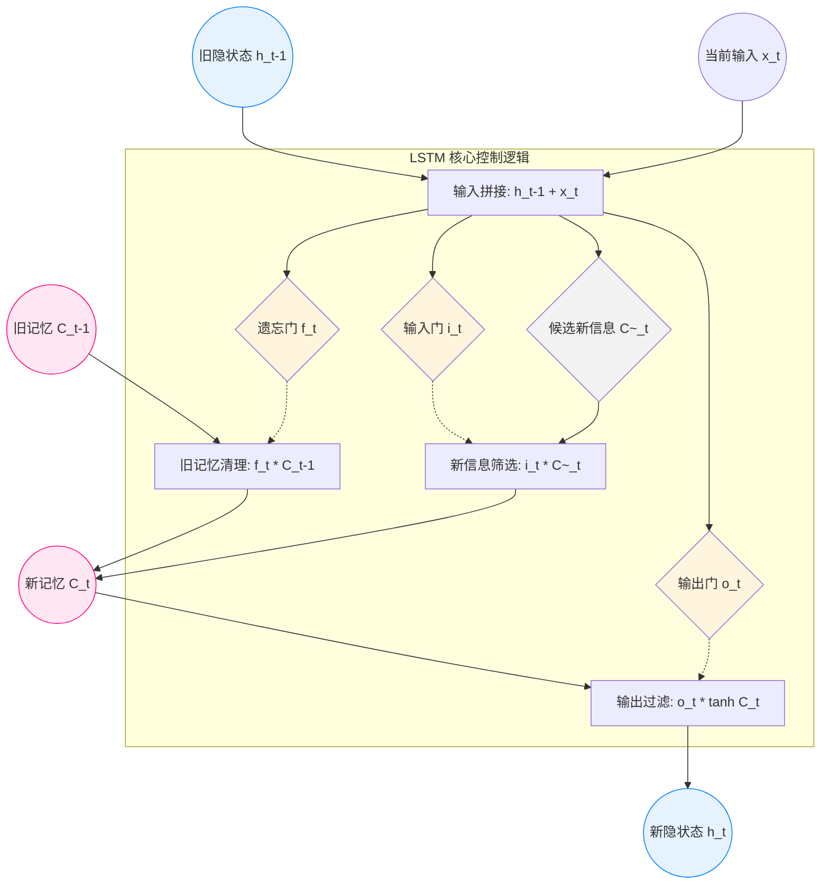

### **12.1 引言 - AI/ML/DL 的层级关系**

#### **1. 知识图谱：层级包含关系 (The Venn Diagram)**

这张 PPT 核心展示了一个**同心圆（包含关系）**，从外到内依次是：

- **人工智能 (Artificial Intelligence, AI)**
    
    - 包含 -> **机器学习 (Machine Learning, ML)**
        
        - 包含 -> **表示学习 (Representation Learning)**
            
            - 包含 -> **深度学习 (Deep Learning, DL)**
                
                - 核心算法 -> **神经网络 (Neural Networks)**
                    

> 💡 **一句话理解**：深度学习是机器学习的一种，而且是专门用来“自动学习特征”（表示学习）的一种，它的主要工具是“多层神经网络”。

#### **2. 概念拆解 (Definitions)**

我们需要由大到小精准理解每个概念的定义，这些定义往往就是**名词解释题**的标准答案：

- **🤖 人工智能 (AI)**
    
    - **定义**：研究理解和模拟人类智能、智能行为及其规律的一门学科 。
        
    - **通俗讲**：让机器像人一样思考和做事的大概念。
        
- **📈 机器学习 (ML)**
    
    - **定义**：研究如何通过计算的手段，利用**经验**来改善计算机系统自身的性能 。
        
    - **通俗讲**：不是让机器死记硬背规则，而是给它一堆数据（经验），让它自己学会怎么做。
        
- **✨ 表示学习 (Representation Learning) —— 关键考点**
    
    - **定义**：可**自动学习出有效特征**的算法 。
        
    - **通俗讲**：在传统机器学习里，我们需要人工告诉机器“什么是特征”（比如教机器认猫，要告诉它猫有尖耳朵、胡须）。而在表示学习里，算法能**自己**从数据里总结出“猫有尖耳朵”这个特征。
        
- **🧠 深度学习 (DL)**
    
    - **定义**：一种机器学习方法，是表示学习方法中的经典代表 。
        
    - **本质**：一般指具有**多层神经网络**模型的机器学习方法 。
        
    - **历史小知识**（可能考选择题）：
        
        - **1986年**：Rina Dechter 首次提出这个词 。
            
        - **2000年**：I. Aizenberg 将其引入神经网络研究 。
            

---

### **🎯 期末考题预测 (Exam Prediction)**

这一页的内容通常考察概念辨析和包含关系，难度不大，但容易混淆。

#### **【题型1：选择题】（必考题型）**

> **题目**：以下关于人工智能、机器学习、深度学习之间关系的描述，正确的是？ A. 机器学习包含人工智能 B. 深度学习是机器学习的一个子集，属于表示学习 C. 神经网络包含深度学习 D. 表示学习包含机器学习
> 
> **答案**：**B**
> 
> **解析**：根据PPT的同心圆图，关系是 AI > ML > 表示学习 > DL 。

#### **【题型2：填空题】**

> **题目**：深度学习本质上是一类____算法的总称，它通常指具有____模型的机器学习方法。
> 
> **答案**：机器学习；多层神经网络 。

#### **【题型3：简答题/辨析题】**

> **题目**：请解释“表示学习”的含义，并说明它与深度学习的关系。
> 
> **参考答案**： 1. **表示学习**是指一类能够自动从数据中学习出有效特征的算法 。 2. **关系**：深度学习是表示学习的一种经典代表方法 。它通过多层神经网络结构，逐层自动提取数据的特征，因此属于表示学习的范畴。

### **12.1 引言 - 传统机器学习 vs. 深度学习**

#### **1. 核心差异一句话总结**

> **传统机器学习**依赖 **“人工特征工程”**（手工喂饭），而**深度学习**实现了**“端到端（End-to-End）的特征自动学习”**（自己找饭吃）。

#### **2. 深度解析：传统机器学习 (Traditional Machine Learning)**

- **工作流**：`输入数据` -> `人工设计特征` -> `分类器/模型` -> `输出`
    
- **核心痛点 —— “特征工程” (Feature Engineering)**：
    
    - **依赖专家**：你需要非常懂这个领域，才能设计出好特征。比如识别猫，你得手动写代码去提取“边缘”、“纹理”、“圆圆的眼睛”。
        
    - **费时费力**：针对每个新任务，都得重新设计特征。
        
    - **通用性差**：用来识别猫的特征代码，拿去识别语音完全没用。
        
    - **天花板低**：对于某些复杂任务（如人脸识别），由于我们自己都不知道该看什么特征，所以根本写不出有效的特征提取代码。
        

#### **3. 深度解析：深度学习 (Deep Learning)**

- **工作流**：`输入数据` -> `[底层特征 -> 高层抽象特征]` (全自动) -> `输出`
    
- **核心优势 —— “端到端” & “层次化抽象”**：
    
    - **端到端 (End-to-End)**：你只管给原始数据（如像素点）和标签（如“这是猫”），中间怎么提取特征，网络自己算，不需要人干预。
        
    - **层层递进 (Hierarchical)**：
        
        - **底层**：网络自动学会识别简单的“线条”、“边缘”。
            
        - **中层**：把线条组合成“眼睛”、“耳朵”。
            
        - **高层**：把五官组合成“猫脸”的语义概念。
            
        - _注：PPT图中的阴影部分表示这些模块都是算法直接从数据中**自学习**得到的，没人教它。_
            

---

### **🆚 核心对比表 (Exam Cheat Sheet)**

|**维度**|**传统机器学习**|**深度学习**|
|---|---|---|
|**特征提取方式**|**人工设计** (Hand-crafted)|**自动学习** (Learned from data)|
|**核心难点**|特征工程 (Feature Engineering)|网络架构设计、调参、训练时间|
|**通用性/迁移性**|差 (任务特定)|强 (可迁移到不同任务)|
|**数据需求量**|相对较小|**巨大** (数据越多效果越好)|
|**工作机制**|分步进行 (先提特征，再训练)|**端到端** (End-to-End) 一体化|

---

### **🎯 期末考题预测 (Exam Prediction)**

这一页极高概率出大题，请务必背熟对比点。

#### **【题型1：简答题/论述题】（五星级重点）**

> **题目**：请结合PPT内容，阐述传统机器学习与深度学习在**特征处理**上的本质区别，并说明为什么深度学习在图像处理等复杂任务上表现更好。
> 
> **参考答案要点**：
> 
> 1. **区别**：
>     
>     - 传统机器学习依赖**人工特征工程**，需要领域专家根据经验手工设计特征，费时费力且难以迁移。
>         
>     - 深度学习采用**表示学习（自动特征提取）**，通过多层神经网络从数据中自动学习由浅入深（从简单到抽象）的特征表示，实现了**端到端**的学习。
>         
> 2. **为什么更好**：
>     
>     - 图像等复杂数据的特征很难用人工规则描述（如“猫的样子”），深度学习能通过层次化结构捕捉到数据内部的高级语义特征，因此表达能力更强。
>         

#### **【题型2：辨析题】**

> **题目**：有人说“深度学习就是层数更多的神经网络”，这种说法准确吗？为什么？
> 
> 参考答案：
> 
> 不完全准确。虽然形式上是多层神经网络，但其核心变革在于表示学习。它改变了以往依赖人工设计特征的模式，能够自动从原始数据中学习出层次化的、更加抽象的特征表示，解决了传统机器学习中特征工程的瓶颈问题。

#### **【题型3：填空题】**

> **题目**：深度学习受到神经系统层次化结构的启发，采用“层层递进，逐层____”的机制，通过____的机制构建多层神经网络。
> 
> **答案**：抽象；端到端。

### **12.1 引言 - 深度学习发展简史**

#### **1. 萌芽期：神经网络的诞生**

- **1943年 [鼻祖]**：神经科学家 **McCulloch** 和逻辑学家 **Pitts** 提出了 **MP模型** 。
    
    - **考点**：它是**最早的神经网络雏形**。
        
    - **原理**：简单模仿大脑，对输入信号进行“线性加权求和”，再通过一个“符号函数”输出（像开关一样，要么0要么1）。
        
- **1949年 [生理学基础]**：心理学家 **Donald Hebb** 提出 **赫布理论 (Hebbian Theory)** 。
    
    - **核心思想**：**“用进废退”**。如果两个神经元经常一起兴奋，它们之间的连接就会变强。这是神经网络“学习”和“记忆”的生理学基础。
        

#### **2. 启发期：视觉机制的发现**

- **1958年 [CNN的灵感来源]**：**Hubel** 和 **Wiesel** 在猫的后脑皮层实验中发现了 **“视觉系统信息分层处理”** 机制 。
    
    - **考点**：他们发现了“方向选择性细胞”，证明了视觉不是一眼看全图，而是**分层**处理的（边缘 -> 形状 -> 物体）。这对后来卷积神经网络（CNN）的设计产生了深远影响。
        

#### **3. 起伏期：感知机与寒冬**

- **1950s [第一次高潮]**：**Frank Rosenblatt** 提出 **感知机 (Perceptron)** 。
    
    - **局限性（常考）**：因为它没有隐藏层，所以包含非线性变换操作能力弱，**无法解决“异或 (XOR)”问题**（即线性不可分问题）。这导致了后来神经网络进入了第一个“寒冬”。
        

#### **4. 复兴期：反向传播 (BP) 的出现**

- **1974年/1986年 [关键转折]**：由 Werbos 提出，后由 **Rumelhart** 和 **Hinton** 等人完善了 **误差反向传播算法 (BP算法)** 。
    
    - **考点**：BP算法解决了**多层感知机 (MLP)** 中参数如何优化的难题，让多层网络训练成为可能。
        

#### **5. 爆发期：深度学习的诞生**

- **2006年 [深度学习元年]**：**Hinton** 在《Science》发表论文，提出了 **深度信念网络 (Deep Belief Network, DBN)** 。
    
    - **意义**：首次提出了“深度学习”这个概念，证明了深层架构可以通过“逐层预训练”达到很好的效果，性能超过了当时流行的支持向量机（SVM），标志着深度学习时代的正式开启。
        

---

### **🎯 期末考题预测 (Exam Prediction)**

这一页主要考察**人物与贡献的对应**，以及**关键模型的局限性**。

#### **【题型1：选择题/连线题】（送分题，必须拿住）**

> **题目**：以下关于神经网络发展史的描述，错误的是？ A. MP模型是最早的神经网络雏形 B. Rosenblatt提出的感知机可以解决异或（XOR）问题 C. Hubel和Wiesel的实验揭示了视觉信息的层级处理机制 D. Hinton在2006年提出了深度信念网络，开启了深度学习的热潮
> 
> **答案**：**B**
> 
> **解析**：感知机因为没有隐藏层，无法解决线性不可分问题（如异或问题）。

#### **【题型2：填空题】**

> **题目**：1986年，Rumelhart和Hinton等人完善了____算法，成功解决了多层感知机中参数优化的难题，推动了神经网络的第二次兴起。
> 
> **答案**：误差反向传播（或BP）。

#### **【题型3：简答题】**

> **题目**：简述1958年Hubel和Wiesel在猫视觉皮层实验中的发现及其对深度学习的启发。
> 
> **参考答案**： 他们发现了视觉神经元对特定方向刺激有反应，揭示了视觉系统是**分层处理**信息的（从简单的边缘检测到复杂的形状感知）。这一机制启发了后来**卷积神经网络（CNN）**的“局部连接”和“层次化特征提取”的设计思想。

**💡 总结**： 记住几个关键词：**MP模型（鼻祖）** -> **感知机（搞不定异或）** -> **BP算法（救星）** -> **Hinton（深度学习之父，2006年）**。

### **12.2 人工神经网络回顾 - 生物学基础**

#### **1. 大脑的惊人算力**

- **规模**：我们的大脑由超过 **800亿** (80 billion) 个神经元组成 。
    
- **连接**：这些神经元并不是孤立的，它们像互联网一样大量连接在一起。正是这种复杂的连接网络，让我们能完成看、听、思考等复杂功能 。
    
- **学习的本质**：神经元之间的**连接是可学习的**（Connection is learnable）。
    
    - _通俗理解_：当你练习骑自行车时，你大脑中控制平衡的那几个神经元之间的连接变强了。这就是“技能习得”的生物学原理 。
        

#### **2. 神经元的构造 (The Structure)**

PPT上的图展示了一个典型的生物神经元，你需要记住三个关键部位，因为它们对应了下一页人工神经元的三个数学部件：

- **🌿 树突 (Dendrites) —— [接收器]**
    
    - **位置**：细胞体周围像树根一样的触须 。
        
    - **功能**：负责**接收**来自其他神经元传递过来的信号（Message）。
        
    - **对应AI**：对应人工神经网络中的**输入 (Input, $x$ )**。
        
- **⚡️ 轴突 (Axon) —— [发射器]**
    
    - **位置**：一条长长的尾巴 5。
        
    - **功能**：负责将处理后的信号**发送**给下一个神经元的树突 。
        
    - **对应AI**：对应人工神经网络中的**输出 (Output, $y$ )**。
        
- **细胞体 (Cell Body) —— [处理器]** (图中虽未标注文字但为核心部分)
    
    - **功能**：决定是否产生电脉冲（Action Potential）。如果树突传来的信号够强，我就兴奋（Fire），通过轴突把信号传出去。
        
    - **对应AI**：对应**激活函数 (Activation Function)**。
        

---

### **🆚 生物 vs. 人工 (类比记忆卡)**

> [!TIP] 考试记忆口诀
> 
> 树突收信，轴突发信，突触调权重。

|**生物神经元**|**人工神经元 (AI)**|**功能**|
|---|---|---|
|**树突 (Dendrites)**|**输入 ($x$)**|接收数据|
|**突触 (Synapse)**|**权重 ($w$)**|连接强弱，决定信号影响力|
|**细胞体 (Cell Body)**|**加权求和 ($\sum$)**|汇总所有输入信号|
|**激活阈值**|**激活函数 ($f$)**|决定是否“兴奋”并输出|
|**轴突 (Axon)**|**输出 ($y$)**|将结果传给下一层|

---

### **🎯 期末考题预测 (Exam Prediction)**

这一页主要考察**生物结构与数学模型的对应关系**，通常出现在选择题或填空题的前几道。

#### **【题型1：连线/选择题】（必考类比）**

> 题目：在人工神经网络的生物学原型中，生物神经元的树突 (Dendrites) 对应于人工神经元的哪一部分？
> 
> A. 激活函数
> 
> B. 权重
> 
> C. 输入
> 
> D. 输出
> 
> 答案：C
> 
> 解析：树突负责接收信号，相当于输入。

#### **【题型2：填空题】**

> **题目**：赫布理论指出，神经元之间的____是可学习的，这构成了人工神经网络中____更新的生物学基础。
> 
> **答案**：连接（或突触连接）；权重（或参数）。

### **12.2 人工神经元模型 (The Artificial Neuron)**

#### **1. 神经元的“三步走”工作流**

这一页的图示像一个胶囊，清晰地展示了数据是如何流过一个神经元的。请务必记住这三个步骤，这是所有计算题的基础：

- **第一步：加权求和 (Linear Aggregation)**
    
    - **操作**：将所有输入信号 ($x$) 乘以它们对应的权重 ($w$)，然后全部加起来。
        
    - **公式**：
        
        $$In = \sum_{i=1}^{d} w_i x_i$$
        
    - **通俗理解**：就像考研算总分。$x$ 是你各科的分数，$w$ 是各科的学分。权重 $w$ 越大，说明这门课（这个输入特征）越重要。
        
- **第二步：非线性激活 (Non-linear Activation)**
    
    - **操作**：把刚才算出来的总分 $In$，扔进一个函数 $f(\cdot)$ 里处理一下。这个函数叫做**激活函数 (Activation Function)**。
        
    - **公式**：
        
        $$Out = f(In)$$
        
    - **通俗理解**：就像考研划线。虽然你总分算出来了，但能不能“过线”（输出），或者转化成什么等级，需要一个规则。比如“大于300分算过(1)，否则算不过(0)”，这就是一个简单的激活函数。
        
- **第三步：输出 (Output)**
    
    - **结果**：处理后的结果 $Out$ 会被传送给下一层神经元，作为它们的输入。
        

#### **2. 关键公式汇总**

如果考试让你写出一个神经元的数学表达式，请写这个通用公式：

$$y = f(\sum_{i=1}^{d} w_i x_i + b)$$

(注：虽然这一页PPT暂时省略了偏置项 $b$，但在实际考试和代码中，$b$ 是必不可少的，它是“阈值”的数学表达)

#### **3. 为什么要有“激活函数”？（核心考点）**

PPT右下角有一行小字：“神经元越多、非线性映射越复杂”。

- **如果不加激活函数**：无论你有多少层神经元，哪怕一万层，它们的计算本质上还是线性的（加权求和的叠加还是加权求和）。
    
- **加入非线性激活函数**：神经网络才具备了**“非线性映射能力”**，才能去拟合复杂的曲线（比如区分猫和狗，分界线肯定不是一条直线）。**这是神经网络强大的灵魂。**
    

---

### **🎯 期末考题预测 (Exam Prediction)**

这一页是**计算题**和**概念辨析题**的源头。

#### **【题型1：填空题/选择题】**

> 题目：在人工神经元模型中，输入信号首先进行____运算，然后通过____函数得到最终输出。
> 
> 答案：线性加权求和；非线性激活（或激活）。

#### **【题型2：简答题】（五星高频）**

> 题目：为什么在神经网络中必须引入非线性激活函数？如果去掉激活函数，多层神经网络会变成什么？
> 
> 参考答案：
> 
> 1. 引入非线性激活函数是为了让神经网络具有**非线性表达能力**，从而能解决复杂的问题（如线性不可分问题）。
>     
> 2. 如果去掉激活函数，无论网络有多少层，其本质都等价于一个**单层线性网络**，无法处理复杂任务。
>     

#### **【题型3：基础计算题】**

> 题目：某神经元有两个输入 $x_1=0.5, x_2=1.0$，对应权重为 $w_1=2.0, w_2=-1.0$，激活函数为 ReLU（$f(x) = \max(0, x)$）。请计算该神经元的输出。
> 
> 计算过程：
> 
> 1. **加权求和**：$In = 0.5 \times 2.0 + 1.0 \times (-1.0) = 1.0 - 1.0 = 0$
>     
> 2. 激活：$Out = \text{ReLU}(0) = 0$
>     
>     答案：0

### **12.2 MP模型 (The Grandfather Neuron)**

#### **1. 历史地位**

- **提出者**：McCulloch 和 Pitts（神经科学家 & 逻辑学家）。
    
- **时间**：1943年。
    
- **本质**：它是对生物神经元最简单的**数学抽象**。它把复杂的生物反应简化成了一个**“开关逻辑”**。
    

#### **2. MP模型的三大铁律 (考点)**

MP模型和现代神经元有点不一样，它非常“死板”，有以下三个硬性规定（填空题考点）：

1. **输入是二值的**：输入信号 $x$ 只能是 **0** 或 **1**。（0代表没信号，1代表有信号）。
    
2. **输出是二值的**：输出 $y$ 也只能是 **0** 或 **1**。（兴奋或抑制）。
    
3. **权重是预先设定的**：在最早的MP模型中，权重 $w$ 通常不是训练出来的，而是**人工设计**好的。
    

#### **3. 工作流程：阈值逻辑**

它的工作方式非常像一个**门槛（Threshold）**判断：

- 第一步：算总分
    
    计算所有输入的加权和：
    
    $$Sum = \sum_{i=1}^{d} w_i x_i$$
    
- 第二步：过门槛
    
    拿这个总分 $Sum$ 和一个预设的阈值 $\theta$ (Theta) 进行比较：
    
    - 如果 **总分 > 阈值** ($\theta$) $\rightarrow$ 输出 **1** (兴奋/Fire)
        
    - 如果 **总分 < 阈值** ($\theta$) $\rightarrow$ 输出 **0** (抑制/Silent)
        

> 💡 通俗例子：
> 
> 假设你想决定周末去不去玩（去=1，不去=0）。
> 
> - 输入因素：天气好不好 ($x_1$, 权重$w_1=2$)，朋友去不去 ($x_2$, 权重$w_2=1$)。
>     
> - 设定阈值 $\theta = 2$。
>     
> - **情况A**：天气好(1)，朋友不去(0)。总分 = $1\times2 + 0\times1 = 2$。如果不严格大于2，就不去。
>     
> - **情况B**：天气好(1)，朋友也去(1)。总分 = $1\times2 + 1\times1 = 3 > 2$。**决定去玩(1)**。
>     

---

### **🎯 期末考题预测 (Exam Prediction)**

这一页是**计算题**（尤其是逻辑门电路实现）的绝对核心。老师非常喜欢让你设计权重来实现“与门”、“或门”。

#### **【题型1：设计/计算题】（五星必考）**

> **题目**：请使用MP神经元模型实现逻辑**“与 (AND)”**运算。假设有两个输入 $x_1, x_2 \in \{0, 1\}$，请设计权重 $w_1, w_2$ 和阈值 $\theta$。
> 
> **解题思路**：
> 
> - 逻辑“与”的要求：只有当 $x_1=1$ 且 $x_2=1$ 时，输出才为1；否则输出0。
>     
> - **列方程**：
>     
>     1. $x_1=1, x_2=1 \rightarrow w_1 + w_2 > \theta$
>         
>     2. $x_1=1, x_2=0 \rightarrow w_1 < \theta$
>         
>     3. $x_1=0, x_2=1 \rightarrow w_2 < \theta$
>         
>     4. $x_1=0, x_2=0 \rightarrow 0 < \theta$
>         
> - **凑数**：设 $w_1=1, w_2=1$。
>     
>     - 两数之和为2，单个为1。
>         
>     - 我们需要阈值 $\theta$ 卡在1和2之间。
>         
>     - 比如取 $\theta = 1.5$。
>         
> 
> 参考答案：
> 
> 取 $w_1=1, w_2=1$，阈值 $\theta=1.5$（或1.2等任意1到2之间的数）。
> 
> - 验证：$1+1=2 > 1.5$ (输出1)，$1+0=1 < 1.5$ (输出0)，符合要求。
>     

#### **【题型2：填空题】**

> **题目**：MP模型也是由**线性加权求和**和**非线性激活**两部分组成，其中它的激活函数通常是一个____函数（Step Function），通过与预设的\____ 进行比较来决定输出。
> 
> **答案**：阶跃（或符号）；阈值。

### **12.2 感知机 (The Perceptron)**

#### **1. 历史身份 (必背)**

- **提出者**：Rosenblatt (1957年)。
    
- **地位**：它是**第一个具有学习能力**的神经网络模型。
    
- **别名**：因为它只有输入层和输出层，中间没有隐藏层，所以也常被称为**“单层感知机”**。
    

#### **2. 结构拆解 (Structure)**

PPT上的图展示了感知机的标准工作流，它比MP模型进化了一点点：

- **输入层 (Input Layer)**：
    
    - 接收输入向量 $X = (x_1, x_2, ..., x_d)$。注意，这里的输入可以是**实数值**（比如身高1.75米），不再局限于0和1。
        
- **权重 (Weights)**：
    
    - 每个输入都有一个对应的权重 $w_i$。
        
    - **关键点**：这里多了一个 $w_0$ (或者叫 $b$)，这就是**偏置项 (Bias)**。它的作用是调整激活的门槛，让决策边界可以平移，而不仅仅是穿过原点。
        
- **激活函数 (Activation Function)**：
    
    - PPT中使用的符号函数（Sign Function）：
        
        - 如果 加权和 $\ge 0 \rightarrow$ 输出 **1**
            
        - 如果 加权和 $< 0 \rightarrow$ 输出 **-1** (注意这里是-1，MP模型通常是0，这取决于具体的设定，考试以题目为准)。
            

#### **3. 核心公式 (计算题依据)**

$$y = f(\sum_{i=1}^{d} w_i x_i + w_0)$$

- $\sum w_i x_i$：线性加权求和。
    
- $w_0$：偏置项。
    
- $f(\cdot)$：激活函数。
    

#### **4. 灵魂所在：它是怎么“学习”的？**

PPT中提到：“连接权重通过迭代训练得到”。

这是它和MP模型最大的区别。

- **原理**：一开始随机给一组权重 $W$（瞎猜）。然后把数据丢进去算，如果算错了（比如把猫认成了狗），就根据错误的大小反过来调整 $W$。
    
- **目标**：**最小化损失函数**（让犯错的次数最少）。
    

---

### **🆚 MP模型 vs. 感知机 (避坑指南)**

| **特性**   | **MP模型**         | **感知机 (Perceptron)** |
| -------- | ---------------- | -------------------- |
| **权重来源** | **人工设定** (死板)    | **数据训练** (智能)        |
| **输入数据** | 通常是二值 (0/1)      | 可以是实数值               |
| **偏置项**  | 隐含在阈值 $\theta$ 中 | 显式作为参数 $w_0$ 学习      |
| **核心能力** | 逻辑运算             | 线性分类 (学习能力)          |

---

### **🎯 期末考题预测 (Exam Prediction)**

这一页是考察**基本概念**和**简单计算**的重点。

#### **【题型1：填空题】（高频）**

> 题目：1957年，Rosenblatt提出了____ 模型，它由输入层和输出层构成，被认为是第一个具有 \____  能力的机器。
> 
> 答案：感知机（或Perceptron）；学习。

#### **【题型2：计算/判断题】**

> 题目：给定一个感知机，权重向量 $W = [2, -1]$，偏置 $w_0 = -3$。
> 
> 请判断输入向量 $X = [2, 2]$ 的输出类别（使用符号函数：$\ge 0$输出1，$<0$输出-1）。
> 
> **计算过程**：
> 
> 1. 公式：$Sum = w_1 x_1 + w_2 x_2 + w_0$
>     
> 2. 代入：$Sum = 2 \times 2 + (-1) \times 2 + (-3)$
>     
> 3. 计算：$4 - 2 - 3 = -1$
>     
> 4. 激活：因为 $-1 < 0$，所以输出 **-1**。
>     
> 
> **答案**：-1

#### **【题型3：简答题】（经典坑点）**

> 题目：单层感知机能解决所有的分类问题吗？如果不能，请举例说明。
> 
> 参考答案：
> 
> 不能。单层感知机是一个线性分类器，它只能解决线性可分的问题（即能用一条直线把两类分开）。它无法解决线性不可分的问题，最著名的例子就是异或 (XOR) 问题。

### **12.2 多层感知机 (MLP)**

#### **1. 核心变革：引入“隐含层” (Hidden Layer)**

- **定义**：夹在输入层和输出层中间的那些层。
    
- **为什么叫“隐含”？**：因为你作为用户，只能看到输入（数据）和输出（结果），中间这些层在干什么你是看不见的，像个黑盒子。
    
- **作用（关键考点）**：
    
    - 单层只能做线性变换。
        
    - **多层 + 非线性激活函数** = 能够对输入空间进行**扭曲和折叠**，从而实现复杂的非线性分类。
        
    - **搞定XOR**：正是因为有了隐含层，神经网络终于能解决“异或”这种线性不可分问题了。
        

#### **2. 网络结构：三层架构**

请看PPT中间的图，标准的MLP包含三部分：

1. **输入层 (Input Layer)**：只负责接收数据，不做计算。
    
2. **隐含层 (Hidden Layers)**：负责提取特征（可以有一层，也可以有很多层）。
    
    - _注：深度学习的“深”，指的就是这里隐含层很多。_
        
3. **输出层 (Output Layer)**：负责输出最终结果（分类或回归）。
    

#### **3. 训练神器：反向传播算法 (Backpropagation, BP)**

多层网络虽然厉害，但参数怎么训练是个大难题（因为不知道中间层的误差是多少）。

PPT提到了BP算法，这是训练MLP的唯一法宝。

- **口诀**：**信号正向走，误差反向传**。
    
    1. **前向传播 (Forward)**：数据从输入 $\rightarrow$ 隐含 $\rightarrow$ 输出，算出预测值。
        
    2. **计算误差 (Loss)**：看看预测值和真实标签差多少。
        
    3. **反向传播 (Backward)**：把误差像“甩锅”一样，从后往前推，算出每一层权重的责任（梯度）。
        
    4. **更新权重 (Update)**：根据梯度调整权重，让误差变小。
        

---

### **🧠 知识点微操 (Obsidian Card)**

> [!NOTE] 为什么多层就能解决XOR？
> 
> 你可以把隐含层想象成**“特征重组器”**。
> 
> - **XOR问题**：(0,0)->0, (1,1)->0, (0,1)->1, (1,0)->1。
>     
> - **隐含层的作用**：它可以把原始坐标空间映射到一个新的空间，在这个新空间里，(0,1)和(1,0)这两个点会被拉到一起，或者被非线性地隔开，从而变得线性可分。
>     

---

### **🎯 期末考题预测 (Exam Prediction)**

这一页是考察**BP算法原理**和**多层网络意义**的根据地。

#### **【题型1：简答题】（五星级必考）**

> 题目：请简述多层感知机（MLP）相较于单层感知机的主要改进，并说明它是如何解决“异或 (XOR)”问题的。
> 
> 参考答案：
> 
> 1. **改进**：MLP在输入层和输出层之间引入了**隐含层**，并且使用了**非线性激活函数**。
>     
> 2. **解决XOR**：单层感知机只能划分线性边界，无法解决异或等线性不可分问题。MLP通过隐含层的非线性映射，将原始数据映射到高维空间或进行空间变换，使得原本线性不可分的数据变得线性可分，从而解决了异或问题。
>     

#### **【题型2：填空题】**

> 题目：多层前馈神经网络通常使用____算法进行训练，该算法的核心思想是将输出层的误差通过网络____传播，从而计算出各层权重的梯度。
> 
> 答案：误差反向传播（或BP）；反向。

#### **【题型3：辨析题】**

> 题目：如果一个多层神经网络的所有层都使用线性激活函数（如 $f(x)=x$），它还能解决非线性问题吗？为什么？
> 
> 答案：
> 
> 不能。如果激活函数是线性的，多层网络的数学本质等价于一个单层线性网络（矩阵乘法的结合律），它将失去非线性表达能力，退化为普通的线性分类器。

### **12.2 神经网络回顾 - 发展与训练机制**

#### **1. 历史的波浪 (Page 16 图示)**

第16页是一张波浪图，直观展示了我们之前讲过的三次浪潮。

- **考点提示**：注意波峰和波谷的对应年份。
    
    - **1958**：感知机兴起。
        
    - **1969**：Minsky 泼冷水（XOR问题），进入第一低谷。
        
    - **1986**：BP算法让多层网络复兴。
        
    - **1995**：SVM（支持向量机）流行，神经网络进入第二低谷。
        
    - **2012**：AlexNet 爆发，深度学习第三次高潮至今。
        

#### **2. 神经网络的“三板斧” (Page 17 核心理论)**

这一页非常重要，它总结了神经网络到底是怎么运作的。

- **第一斧：前向传播 (Forward Propagation) —— “算结果”**
    
    - **流程**：数据从输入层出发，经过一层层的“线性加权 ($wx+b$)”和“非线性变换 ($f(\cdot)$)”，最后得到预测结果。
        
    - **本质**：这其实就是一个**“特征学习” (Representation Learning)** 的过程。把原始数据（比如像素）一步步变成抽象特征（比如“有尾巴”）。
        
- **第二斧：反向传播 (Backward Propagation) —— “找原因”**
    
    - **算法**：**BP算法** (Backpropagation)。
        
    - **原理**：**误差梯度下降**。
        
    - **通俗理解**：如果考试考砸了（误差大），老师会帮你分析是哪门课没考好（计算梯度），然后针对性地让你多复习那门课（更新权重）。
        
- **第三斧：分类输出 (Output Layer) —— “定结论” [五星级考点]**
    
    - 网络最后一层怎么输出结果？取决于你的任务类型：
        
    - **二分类任务**（是/否）：
        
        - 使用 **Logistic (Sigmoid)** 函数。
            
    - **多分类任务**（猫/狗/鸟）：
        
        - **编码方式**：使用 **独热编码 (One-hot Encoding)**。
            
            - 比如：猫=[1, 0, 0]，狗=[0, 1, 0]，鸟=[0, 0, 1]。
                
        - **激活函数**：**Softmax 函数**（软最大函数）。
            
            - **公式**：
                
                $$o_j = \frac{e^{w_j^T x}}{\sum_{k=1}^{K} e^{w_k^T x}}$$
                
            - **作用**：把输出的一堆杂乱数字（logits），变成**概率分布**（所有概率加起来等于1）。
                
            - _例如：输出 [2.0, 1.0, 0.1] $\rightarrow$ Softmax $\rightarrow$ [0.7, 0.2, 0.1]（代表70%是猫）。_
                

---

### **🧠 知识点微操 (Obsidian Card)**

> [!IMPORTANT] Softmax 必背公式
> 
> 期末考试常考：给你神经网络最后一层的三个输出值，让你手算 Softmax 后的概率。
> 
> 步骤：
> 
> 1. **指数化**：算出每个数的 $e^x$。
>     
> 2. **求和**：把所有 $e^x$ 加起来得到分母。
>     
> 3. **归一化**：用每个 $e^x$ 除以总和。
>     

---

### **🎯 期末考题预测 (Exam Prediction)**

这一页是**计算题**的高发区。

#### **【题型1：计算题】（Softmax 手算）**

> **题目**：假设一个神经网络用于三分类任务（类别A、B、C），输出层的线性输出值（Logits）为 $z = [2, 1, 0]$。请计算经过 **Softmax** 函数处理后的输出概率分布。（已知 $e^2 \approx 7.4, e^1 \approx 2.7, e^0 = 1$）。
> 
> **计算过程**：
> 
> 1. **指数化**：
>     
>     - $e^2 \approx 7.4$
>         
>     - $e^1 \approx 2.7$
>         
>     - $e^0 = 1$
>         
> 2. **求和**：$Sum = 7.4 + 2.7 + 1 = 11.1$
>     
> 3. **归一化**：
>     
>     - $P(A) = 7.4 / 11.1 \approx 0.667$
>         
>     - $P(B) = 2.7 / 11.1 \approx 0.243$
>         
>     - $P(C) = 1 / 11.1 \approx 0.090$
>         
> 
> **答案**：类别A: 0.667, 类别B: 0.243, 类别C: 0.090。

#### **【题型2：填空题】**

> 题目：在处理多分类问题时，神经网络的输出层通常采用____编码来表示类别标签，并使用____函数将输出转换为概率分布，保证所有输出节点的概率之和为____。
> 
> 答案：独热 (One-hot)；Softmax；1。

#### **【题型3：简答题】**

> 题目：简述BP算法在神经网络训练中的核心作用。
> 
> 答案：BP算法（误差反向传播算法）通过计算输出层误差对各层参数的梯度，将误差从后向前传播，从而指导网络参数（权重和偏置）沿着梯度下降的方向进行更新，以最小化损失函数。

### **案例快览：全连接网络是如何“硬做”图像识别的？ (Pages 18-23)**

#### **1. 原始方法：模版匹配 (Page 18-19)**

- **做法**：把数字“3”的图像拉平成一个长向量，然后和标准“3”的模板（权重）做点积。
    
- **逻辑**：像素重合度越高，得分越高。
    
- **问题**：太死板！如果你的“3”写得稍微歪一点、偏一点，或者笔画粗一点，它就完全对不上了。
    

#### **2. 补救措施：堆神经元 (Page 20-21)**

- **横向扩展**：既然一个“3”的模板不够，那我用100个神经元存100种不同写法的“3”的模板行不行？
    
- **结果**：参数量爆炸，而且还是笨。
    

#### **3. 致命缺陷：无法复用特征 (Page 22 - 核心图示)**

请看 **第22页** 的红圈和绿圈。

- **现象**：图像左上角有一个“垂直笔画”，右下角也有一个“垂直笔画”。
    
- **MLP的做法**：对于全连接网络来说，**左上角的像素**和**右下角的像素**是完全独立的两个输入（$x_1$ 和 $x_{n}$）。这意味着，网络必须**重新学习**一遍“什么是垂直笔画”。它不知道这两个东西其实是同一个特征，只是位置不同。
    
- **后果**：**并没有实现“特征共享”**。这就像让你背单词，出现在第一行的 `apple` 你背一次，出现在第十行的 `apple` 你又当成生词背一次，效率极低。
    
![[{9AB27A6B-B5D2-4623-A934-648250843AB6}.png]]

---

### **🛑 理论总结：MLP 的死穴 (Page 25)**

现在请翻到 **第25页**。这一页正式宣告了 MLP 在图像领域的“死刑”，也是引入 CNN 的**最高频考点**。

#### **📝 核心笔记：12.3 CNN - 为什么要抛弃 MLP？**

这一页列出了多层感知机（MLP）处理图像的三大罪状（**简答题必背**）：

1. **参数数量爆炸 (Parameter Explosion)**
    
    - **算一算**：假设输入一张 $1000 \times 1000$ 像素的普通照片（还不算高清），输入层就有 100万 ($10^6$) 个节点。
        
    - 如果隐藏层也是 100万 个神经元（为了保持信息量），那么仅第一层的权重参数数量就是：
        
        $$10^6 \times 10^6 = 10^{12} \text{ (一万亿个参数!)}$$
        
    - **后果**：内存直接爆掉，根本训练不动，而且极易**过拟合 (Overfitting)**。
        
2. **丢失空间信息 (Spatial Structure Ignored)**
    
    - **操作**：MLP 强行把二维图像 ($1000 \times 1000$) 拉平成一维向量 ($1 \times 1000000$)。
        
    - **后果**：像素之间的**邻域关系**（比如眼睛的像素一定在鼻子上面）被破坏了。网络不知道像素A和像素B在原图中是挨在一起的。
        
3. **缺乏平移不变性 (No Translation Invariance)**
    
    - 这就是刚才第22页说的问题。猫在图片左边是猫，移到右边还是猫，但 MLP 把它当成两张完全不同的图来学。
        

---

### **🎯 期末考题预测 (Exam Prediction)**

这一部分是 **“CNN引入背景”** 的必考题。

#### **【题型1：简答题/计算题】（五星重点）**

> 题目：为什么全连接神经网络（MLP）不适合处理高分辨率图像数据？请从参数量的角度举例说明。
> 
> 参考答案：
> 
> 1. **参数量巨大**：对于高维图像数据，全连接层的参数量会呈平方级增长。
>     
> 2. **举例**：若图像大小为 $1000 \times 1000$（即$10^6$维输入），且隐藏层有 $10^6$ 个神经元，则仅该层的权重参数就高达 $10^{12}$ 个。
>     
> 3. **后果**：这会导致计算资源耗尽，且模型极易过拟合，难以训练。
>     

#### **【题型2：填空题】**

> 题目：卷积神经网络（CNN）主要是为了解决全连接网络在图像处理中____ 丢失和____ 过多的问题而设计的。
> 
> 答案：空间结构（或空间关联）；参数。

### **12.3 CNN - 生物学灵感与发展史**

#### **1. 灵感来源：猫的视皮层实验 (Page 26)**

- **生物学发现**：1959年，**Hubel** 和 **Wiesel**（这两个名字必背）在研究猫的后脑皮层时发现：
    
    - **分级处理**：大脑不是一下子看清整个物体的。
        
    - **V1区 (Edge Detectors)**：先看到简单的线条、边缘。
        
    - **V2区 (Shape Detectors)**：把线条拼成简单的形状（如圆形、方形）。
        
    - **V4区 (Higher Level)**：把形状拼成复杂的物体部件（如眼睛、轮胎）。
        
    - **IT区 (Object Models)**：最后拼成完整的物体概念（人脸、车）。
        
- **CNN 的核心哲学**：**“从像素到语义，层层递进”**。
    
    - 输入是乱七八糟的像素点，第一层卷积提取边缘，第二层提取形状，最后一层提取语义。这就是**“端到端 (End-to-End)”**学习。
        

#### **2. 发展里程碑 (Page 27)**

这一页的时间线需要理清，考试喜欢考**连线题**：

- **1959年 [生物学基础]**：**Hubel & Wiesel** 发现视觉系统信息分级处理机制（获诺贝尔奖）。
    
- **1980年 [雏形]**：**福岛邦彦 (Kunihiko Fukushima)** 提出 **神经感知机 (Neocognitron)**。
    
    - **考点**：这是第一个模仿视觉皮层的计算机模型，引入了“级联”和“局部滤波”的思想，是 CNN 的直接前身。
        
- **1990s [奠基]**：**LeCun** (Yann LeCun) 提出 **LeNet-5**。
    
    - **考点**：用于手写数字识别（银行支票读取），确立了**卷积层+池化层**的现代 CNN 基本结构。
        

---

### **🧠 知识点微操 (Obsidian Card)**

> [!NOTE] **为什么叫“端到端 (End-to-End)”？** 在 CNN 出现之前，识别一张图分两步：
> 
> 1. 人工设计特征（找专家写代码提取边缘）。
>     
> 2. 分类器分类。
>     
> 
> CNN 把这两步合二为一了：**输入图片 -> [特征提取 + 分类] -> 输出结果**。 中间完全不用人插手，网络自己学特征。Page 26 底部的那句话“深度学习所得模型可视为一个复杂函数”指的就是这个。

---

### **🎯 期末考题预测 (Exam Prediction)**

这一部分主要考察**历史常识**和**基本设计思想**。

#### **【题型1：选择题】（必考历史）**

> **题目**：卷积神经网络（CNN）的设计灵感主要来源于哪项生物学发现？ A. 巴甫洛夫的条件反射实验 B. Hubel和Wiesel对猫视觉皮层感受野的研究 C. 达尔文的进化论 D. 明斯基对感知机的研究
> 
> **答案**：**B**

#### **【题型2：填空题】**

> **题目**：1980年，福岛邦彦提出了____ 模型，这是卷积神经网络的前身。而现代CNN的基本结构（卷积+池化）则是由____  在LeNet-5模型中确立的。 **答案**：神经感知机 (Neocognitron)；LeCun (或杨·立昆)。

#### **【题型3：简答题】**

> **题目**：简述卷积神经网络“层层递进”的特征提取过程。 **参考答案**： CNN 模拟生物视觉系统，从低层到高层逐步抽象特征。
> 
> - **底层网络**：从像素中提取简单的几何特征（如边缘、线条）。
>     
> - **中层网络**：将简单特征组合成局部部件（如眼睛、轮胎）。
>     
> - **高层网络**：将部件组合成完整的语义对象（如人脸、汽车），实现从“像素点”到“语义”的映射。
>

### **12.3.1 卷积层 - 核心概念拆解**

这一页密密麻麻的文字其实就讲了三个核心概念，我用通俗的语言帮你翻译一下：

#### **1. 感受野与局部连接 (Receptive Field & Local Connection)**

- **PPT原文**：“处理局部图像模式的感受器……只与图像中的局部像素进行连接”。
    
- **通俗理解**：
    
    - 想象你在看书。你不会一眼就把整页书每一个字都看进去（全连接），而是目光聚焦在**一个词、一行字**上（局部连接）。
        
    - 这个目光聚焦的小窗口，在 CNN 里就叫**卷积核**。
        
    - 这个窗口覆盖的图像区域，就叫**感受野**。
        

#### **2. 卷积核 (Convolution Kernel)**

- **定义**：一个小的二维矩阵（比如 $3\times3$ 或 $5\times5$）。
    
- **本质**：它就是一个**“特征探测器”**。
    
    - PPT上说它“代表某种模式”。意思是，每一个卷积核都长得不一样，有的专门找“横线”，有的专门找“竖线”，有的专门找“圆弧”。
        
- **数据驱动**：这些卷积核里的数字（权重）不是人填写的，而是网络自己**训练**出来的（还记得之前说的“端到端”学习吗？）。
    

#### **3. 特征图 (Feature Map)**

- **定义**：卷积核在原图上扫一圈，算出来的结果矩阵。
    
- **关系**：
    
    - **1个卷积核** $\rightarrow$ 扫描全图 $\rightarrow$ 得到 **1张特征图**。
        
    - **多个卷积核**（比如10个） $\rightarrow$ 得到 **多个通道**（10张特征图）。
        
    - _注：这就是为什么CNN中间层会有几十甚至几百个通道，因为它在同时找几十、几百种不同的特征。_
        

---

### **🧮 卷积操作动态演示 (Imagination)**

> [!TIP] 考试核心：卷积是怎么算的？
> 
> 想象卷积核是一个手电筒。
> 
> 1. 手电筒照在图像左上角（局部区域）。
>     
> 2. **点积求和**：手电筒里的数字（权重）和照到的图像像素值，对应位置相乘，然后全部加起来。得到的这个**标量（一个数）**，就是特征图上的一个点。
>     
> 3. **滑动**：手电筒向右挪一步，重复第2步。
>     
> 4. 扫完一行扫下一行，直到整张图扫完。
>     

---

### **🎯 期末考题预测 (Exam Prediction)**

这一页主要考察**定义**和**基本对应关系**。

#### **【题型1：填空题/选择题】（必考概念）**

> 题目：在卷积神经网络中，卷积层通过____机制来处理图像的局部模式。每一个卷积核扫描整个图像后，生成一个____。
> 
> 答案：局部连接（或卷积）；特征图 (Feature Map)。

#### **【题型2：简答题】**

> 题目：请解释“卷积核”在CNN中的作用，并说明为什么通常需要多个卷积核。
> 
> 参考答案：
> 
> 1. **作用**：卷积核相当于一个**特征提取器**（或滤波器）。它通过在图像上滑动并进行卷积运算，来检测和提取图像中的特定局部特征（如边缘、纹理等）。
>     
> 2. **为什么需要多个**：因为一幅图像包含多种不同的特征（如横线、竖线、圆角等）。一个卷积核只能提取一种特征，使用多个卷积核可以提取多种不同的特征，从而形成丰富的特征表示（多通道特征图）。

### **12.3.1 卷积层 - 核心计算参数**

#### **1. 步幅 (Stride)**

- **定义**：卷积核每次滑动的格数。
    
    - **Stride = 1**：一步一格，扫描得最细，得到的特征图较大。
        
    - **Stride = 2**：一步两格（跳着扫），得到的特征图会变小（尺寸减半）。
        
- **作用**：控制输出特征图的**分辨率/尺寸** 1。
    

#### **2. 边衬/填充 (Padding)**

- **定义**：在输入图像的周围**补一圈 0**。
    
- **为什么需要它？**
    
    - **防止图像变小**：如果不补0，每做一次卷积，图像就会缩水一圈（5x5 -> 3x3）。做几次图像就没了。补0可以保持输入输出大小一致（Same Padding）。
        
    - **照顾边缘像素**：不补0的话，边缘的像素只会被扫到一次，而中间的像素会被扫到很多次。补0可以让边缘像素也能被公平对待 2222。
        

#### **3. 黄金计算公式（必背）**
#重点
期末考试如果让你算“输出特征图的尺寸”，直接套这个公式：

$$\text{Output} = \lfloor \frac{n + 2p - k}{s} + 1 \rfloor$$

- **$n$**：输入图片的大小（比如 5）。
    
- **$p$**：Padding 补0的层数（比如 1）。
    
- **$k$**：卷积核的大小（比如 3）。
    
- **$s$**：步幅 Stride（比如 1）。
    

---

### **📝 案例详解 (PPT Page 29 Example)**

PPT上的图展示了一个具体的计算过程：

- **输入**：$5 \times 5$ 的灰色矩阵（代表灰度图像） 3。
    
- **卷积核**：$3 \times 3$ 的黄色区域（权重矩阵）。
    
- **参数设定**：
    
    - PPT图中显示的计算是：**无填充 (Pad=0)**，**步幅 (Stride=1)**。
        
    - _注：虽然PPT左边文字写了“边衬1”，但右边那个 $3 \times 3$ 的输出结果其实是对应 Pad=0 的情况。_
        
- **计算验证**：
    
    - 套用公式：$(5 + 0 - 3) / 1 + 1 = 3$。
        
    - 所以输出是一个 **$3 \times 3$** 的特征图（Feature Map） 4。
        

> 💡 第一个格子的 12.0 是怎么来的？
> 
> 你看左边矩阵左上角的 $3 \times 3$ 区域，和卷积核做点积：
> 
> $(0 \times w_{11}) + (2 \times w_{12}) + \dots$ 对应位置相乘再相加。
> 
> 最终算出来 12.0，填入输出矩阵的左上角。

---

### **🎯 期末考题预测 (Exam Prediction)**

这一页绝对是**计算大题**的热门考点。

#### **【题型1：计算题】（五星级必考）**

> **题目**：输入图像尺寸为 $32 \times 32$，使用 $5 \times 5$ 的卷积核进行卷积。
> 
> 1. 如果步幅 $s=1$，不使用填充 ($p=0$)，输出特征图的尺寸是多少？
>     
> 2. 如果步幅 $s=1$，为了保证输出尺寸与输入一致（即 $32 \times 32$），需要设置多大的填充 $p$？
>     
> 
> **计算过程**：
> 
> 1. **第一问**：
>     
>     - 公式：$(n - k)/s + 1$
>         
>     - 计算：$(32 - 5)/1 + 1 = 27 + 1 = 28$
>         
>     - 答案：**$28 \times 28$**
>         
> 2. **第二问**：
>     
>     - 我们要让输出等于 32。
>         
>     - 方程：$(32 + 2p - 5)/1 + 1 = 32$
>         
>     - 解方程：$32 + 2p - 5 + 1 = 32 \Rightarrow 2p = 4 \Rightarrow p = 2$
>         
>     - 答案：**$p=2$**（即周围补2圈0）。
>         

#### **【题型2：选择题】**

> 题目：以下哪个操作可以减小输出特征图的尺寸？
> 
> A. 增加填充 (Padding)
> 
> B. 减小步幅 (Stride)
> 
> C. 增大步幅 (Stride)
> 
> D. 使用更小的卷积核
> 
> 答案：C
> 
> 解析：步幅越大，跳得越快，采样的点越少，图就越小。

### **1. 怎么在图上“扫”？（卷积的微观操作）**

请看 第29页 的那个数字矩阵图。

你可以把卷积核（Kernel）想象成一个**“放大镜”或“手电筒”**。

- **第一步：对准（Overlay）**
    
    - 假设你的输入图片是一个 $5 \times 5$ 的方格（图中的灰度图像）。
        
    - 你的卷积核是一个 $3 \times 3$ 的方格（图中的黄色区域）。
        
    - **扫的动作**：先把卷积核盖在图片的**左上角**。
        
- **第二步：点积求和（Calculate）**
    
    - **怎么算**：卷积核里的数字（权重）和它盖住的图片上的数字（像素值），**对应位置相乘**，然后把这9个乘积**全部加起来**。
        
    - **结果**：加出来的这个**总和**（标量），就是输出图（Feature Map）上**第一个格子**的值 1。
        
    - 比如 PPT 第30页的计算示例：$1 \times 0 + 0 \times 0 + \dots + (-1) \times 5 = -4$ 2。
        
- **第三步：滑动（Slide & Stride）**
    
    - **步幅 (Stride)**：这是个关键词。
        
    - 如果你设定 **Stride=1**，那个“放大镜”就向右挪 **1** 个格子，再算一次，得到输出图的第2个值。
        
    - 扫完第一行，再回到最左边，向下挪 1 个格子，继续扫。
        
    - _就像你看书一样，逐字逐句（Stride=1）地看，直到看完整个页面。_
        

---

### **2. “通道” (Channel) 是怎么得到的？**

这个问题要分**输入**和**输出**两头看，请参考 **第30页**。

#### **情况 A：输入的通道是从哪来的？**

- **黑白图**：只有一个图层，所以输入通道数 = 1。
    
- **彩色图**：我们平时看的照片是 RGB 格式，它由**红、绿、蓝**三层叠在一起。所以输入通道数 = 3。
    
    - **关键点**：如果输入是 3 通道（RGB），你的卷积核**必须**也是“三层厚”的立方体（比如 $3 \times 3 \times 3$）。
        
    - **怎么算**：卷积核的第1层扫红图，第2层扫绿图，第3层扫蓝图。三层算出来的结果**加在一起**，最终变成输出图上的**一个点** 3。
        

#### **情况 B：输出的通道（Feature Maps）是怎么变出来的？**

这是困扰很多人的地方：**为什么进去是一张图，出来变成了几十张图（几十个通道）？**

- **核心逻辑**：**一个卷积核 = 提取一种特征 = 生成一个通道** 4。
    
- **举个例子**：
    
    - 你现在想识别一张人脸。
        
    - 你需要找“横线”（眼睛），所以你派出了 **1号卷积核**（专门找横线）。它扫完一遍，生成了一张 **“横线特征图”** （这是第1个输出通道）。
        
    - 你还需要找“竖线”（鼻子），所以你派出了 **2号卷积核**（专门找竖线）。它扫完一遍，生成了一张 **“竖线特征图”**（这是第2个输出通道）。
        
    - ...
        
    - 如果你设计了 **64个卷积核**，每个核找不同的特征，那你最后就会得到 **64张特征图**。
        
    - **结论**：**输出通道数 = 卷积核的个数**。
        

---

### **📝 总结图解 (Obsidian Card)**

> [!TIP] **口诀记忆**
> 
> - **怎么扫**：左上对齐 -> 乘加求和 -> 挪动一步 -> 重复直到结束。
>     
> - **通道数**：
>     
>     - **输入通道**：看图片是黑白(1)还是彩色(3)，或者上一层的厚度。
>         
>     - **输出通道**：看你有几个卷积核（有多少个“手电筒”）。**核越多，学到的特征越丰富。**

### **12.3.1 CNN 的两大核心特性**

#### **1. 视觉直觉：鸟嘴检测器 (Page 31)**

这一页非常生动。

- **左上图**：鸟嘴在图像的左上角。
    
- **左下图**：鸟嘴在图像的中间。
    
- **CNN 的处理方式**：
    
    - 我们只需要**一个**专门识别“鸟嘴”的卷积核（Filter）。
        
    - 不管鸟嘴在左上角还是中间，这个卷积核扫到那里时，都会“兴奋”（输出高数值）。
        
    - **结论**：这就是 **“权值共享 (Weight Sharing)”** 的直观含义。我们不需要为图像的每一个位置都设计一个单独的“鸟嘴检测器”，**同一个检测器（权重）可以到处通用**。
        

#### **2. 数学证明：参数量的降维打击 (Page 32) —— [五星级考点]**

这一页的数字对比非常震撼，请务必看懂这个账是怎么算的：

假设输入图像是 **$200 \times 200$**（即4万个像素），我们要提取特征。

- **选手 A：全连接网络 (Fully Connected)**
    
    - **原理**：每一个输入像素都要连接到每一个隐藏层神经元。
        
    - **假设**：隐藏层也有4万个神经元。
        
    - **参数量**：$40,000 \text{ (输入)} \times 40,000 \text{ (输出)} = 16 \text{ 亿 (} 1.6 \times 10^9 \text{)}$。
        
    - **后果**：训练这张图需要几十GB显存，电脑直接死机。
        
- **选手 B：局部连接但** **不共享** **权重 (Local Conv without Sharing)**
    
    - **原理**：每个神经元只看 $5 \times 5$ 的小窗口，但每个位置的窗口参数都不一样。
        
    - **假设**：输出也是 $200 \times 200$ 的特征图。
        
    - **参数量**：$200 \times 200 \text{ (位置数)} \times 25 \text{ (每个位置的参数)} \approx 100 \text{ 万}$。
        
    - **评价**：虽然少了很多，但还是很浪费。
        
- **选手 C：卷积神经网络 (CNN - Local + Sharing)**
    
    - **原理**：**局部连接 + 权值共享**。拿着**同一个** $5 \times 5$ 的卷积核扫全图。
        
    - **参数量**：**25 个** ($5 \times 5$)。
        
    - **后果**：从 **16亿** 降到 **25**！这是指数级的压缩！即使我们用100个卷积核，参数量也才2500个，完全可以忽略不计。
        

---

### **🧠 知识点微操 (Obsidian Card)**

> [!IMPORTANT] **CNN 省参数的秘诀**
> 
> 1. **局部连接**：我不看全图，我只看 $5 \times 5$ 的小窗口（减少了单次连接数）。
>     
> 2. **权值共享**：我在所有位置都用同一个“放大镜”（减少了放大镜的个数）。
>     

---

### **🎯 期末考题预测 (Exam Prediction)**

这一页是**计算题**和**简答题**的必考点，尤其是参数量的对比计算。

#### **【题型1：计算题】（送分大题）**

> **题目**：假设输入图像大小为 $1000 \times 1000$，隐藏层神经元数量也为 $10^6$。
> 
> 1. 若使用全连接网络，权重参数数量是多少？
>     
> 2. 若使用卷积网络，卷积核大小为 $10 \times 10$，且使用权值共享，权重参数数量是多少？（忽略偏置项）
>     
> 
> **计算过程**：
> 
> 1. **全连接**：$10^6 \text{ (输入)} \times 10^6 \text{ (输出)} = 10^{12}$ （一万亿）。
>     
> 2. **卷积**：$10 \times 10 = 100$。
>     
> 
> 答案：$10^{12}$；$100$。
> 
> 解析：通过这个对比，体现CNN在处理高维图像数据时的巨大优势。

#### **【题型2：简答题】**

> 题目：请解释卷积神经网络中的“权值共享”机制，并说明它有什么好处。
> 
> 参考答案：
> 
> 1. **机制**：指在卷积层中，使用同一个卷积核（权重矩阵）去遍历扫描整张图像的每一个位置。无论在图像的哪个位置进行计算，使用的都是同一组权重参数。
>     
> 2. **好处**：
>     
>     - **极大地减少了模型参数量**，防止过拟合，提高训练效率。
>         
>     - 赋予了网络**平移不变性**（即无论物体在图像的哪个位置，都能被同一个特征检测器识别出来）。

### **12.3.1 激活函数 - ReLU 的崛起**

这一页展示了三种经典的激活函数，考试中经常考它们的**优缺点对比**。

#### **1. 老一代：Sigmoid 和 Tanh**

- **Sigmoid (S型函数)**
    
    - **样子**：像一个 S 形，把输入压缩到 $(0, 1)$ 之间。
        
    - **缺点（致命）**：**梯度消失 (Gradient Vanishing)**。
        
        - 看图你会发现，当输入很大（比如10）或者很小（比如-10）的时候，曲线变得非常平（导数接近0）。
            
        - **后果**：BP算法反向传播时，误差传不回去，深层网络根本训练不动。
            
- **Tanh (双曲正切)**
    
    - **样子**：也是 S 形，把输入压缩到 $(-1, 1)$ 之间。
        
    - **缺点**：和 Sigmoid 一样，两头也容易梯度消失。
        

#### **2. 新一代王者：ReLU (Rectified Linear Unit)**

- **中文名**：线性整流单元（修正线性单元）。
    
- 公式（必背）：
    
    $$f(x) = \max(0, x)$$
    
    - **翻译**：如果是正数，保持不变；如果是负数，直接归零。
        
- **图像**：
    
    - 左边全是0（死区），右边是一条斜率为1的直线。
        

#### **3. 为什么 ReLU 更好？（五星级考点）**

PPT虽然没写详细文字，但这是深度学习的核心常识，**简答题必考**：

1. **解决梯度消失**：在 $x > 0$ 的区域，导数永远是 1。这意味着无论网络多深，误差都能原封不动地传回去，不会越来越小。
    
2. **计算速度快**：Sigmoid 还要算指数 ($e^x$)，ReLU 只需要判断是不是大于0，计算量极小。
    
3. **稀疏性**：让一部分神经元输出为0（不被激活），让网络更稀疏，有助于提取关键特征。
    

---

### **🎯 期末考题预测 (Exam Prediction)**

这一页是**简答题**和**选择题**的高发区。

#### **【题型1：简答题】（五星重点）**

> 题目：请写出 ReLU 激活函数的数学表达式，并简述相比于 Sigmoid 函数，为什么 ReLU 更适合用于深层卷积神经网络？
> 
> 参考答案：
> 
> 1. **表达式**：$f(x) = \max(0, x)$。
>     
> 2. **优势**：
>     
>     - **缓解梯度消失**：ReLU 在正区间的导数恒为 1，有效缓解了 Sigmoid 函数在深层网络中容易出现的梯度消失问题，使得深层网络更容易训练。
>         
>     - **计算效率高**：ReLU 只涉及简单的阈值比较，不需要像 Sigmoid 那样进行复杂的指数运算，收敛速度更快。
>         
>     - **稀疏激活性**：ReLU 会使部分神经元输出为 0，增加了网络的稀疏性，有助于特征提取和防止过拟合。
>         

#### **【题型2：选择题】**

> 题目：以下关于激活函数的描述，错误的是？
> 
> A. Sigmoid 函数容易导致梯度消失问题
> 
> B. ReLU 函数在输入小于 0 时导数为 0
> 
> C. Tanh 函数的输出范围是 (0, 1)
> 
> D. 引入激活函数是为了增加网络的非线性表达能力
> 
> 答案：C
> 
> 解析：Tanh 的输出范围是 $(-1, 1)$，Sigmoid 才是 $(0, 1)$。

### **12.3.1 汇集层/池化层 (Pooling Layer)**

#### **1. 核心作用（简答题必背）**

- **下采样 (Downsampling)**：把大的特征图变小（比如从 $4 \times 4$ 变成 $2 \times 2$），从而**减少参数量和计算量**。
    
- **防止过拟合**：数据少了，模型就不容易死记硬背。
    
- **平移不变性 (Translation Invariance)**：这是池化层的一个神奇特性。
    
    - _解释_：假设你在画面左边有一个最亮的点（最大值）。如果图像稍微向右移了一点点，只要这个点还在池化窗口内，取出来的最大值还是它。这对识别物体非常有用（你不需要物体死死固定在某个坐标上）。
        

#### **2. 两种主流操作**

PPT 上提到了两种最常用的池化方式：

- **最大汇集 (Max Pooling) —— [最常用]**
    
    - **操作**：在窗口内（比如 $2 \times 2$）选出**最大**的那个数，其他的扔掉。
        
    - **逻辑**：只保留**最强**的特征。比如“这里有没有鸟嘴？有（数值大）！”那就把这个“有”的信息留下来，不管它具体在窗口的哪个角落。
        
    - **应用**：主要用于**特征提取**（纹理、边缘）。
        
- **平均汇集 (Average Pooling)**
    
    - **操作**：计算窗口内所有数值的**平均值**。
        
    - **逻辑**：把这一块的信息融合一下，保留背景信息。
        
    - **应用**：早期网络（如 LeNet）用得多，现在除了最后一层，中间层很少用了。
        

---

### **🧮 计算图解 (必会的手算)**

> [!TIP] Max Pooling 怎么算？
> 
> 想象一个 $2 \times 2$ 的窗口，步幅 (Stride) 通常设为 2（这意着窗口互不重叠，跳着走）。
> 
> **输入矩阵**：
> 
> $$\begin{bmatrix} 1 & 3 & 2 & 4 \\ 5 & 6 & 1 & 2 \\ 8 & 7 & 0 & 1 \\ 2 & 1 & 5 & 3 \end{bmatrix}$$
> 
> **计算过程（Stride=2）**：
> 
> 1. **左上角区域** $\begin{bmatrix} 1 & 3 \\ 5 & 6 \end{bmatrix}$ $\rightarrow$ 最大值是 **6**。
>     
> 2. **右上角区域** $\begin{bmatrix} 2 & 4 \\ 1 & 2 \end{bmatrix}$ $\rightarrow$ 最大值是 **4**。
>     
> 3. **左下角区域** $\begin{bmatrix} 8 & 7 \\ 2 & 1 \end{bmatrix}$ $\rightarrow$ 最大值是 **8**。
>     
> 4. **右下角区域** $\begin{bmatrix} 0 & 1 \\ 5 & 3 \end{bmatrix}$ $\rightarrow$ 最大值是 **5**。
>     
> 
> **输出结果**：
> 
> $$\begin{bmatrix} 6 & 4 \\ 8 & 5 \end{bmatrix}$$
> 
> **结果**：尺寸从 $4 \times 4$ 变成了 $2 \times 2$，数据量减少了 75%！

---

### **🎯 期末考题预测 (Exam Prediction)**

这一页主要考察**计算**和**概念**。

#### **【题型1：计算题】（五星级必考）**

> 题目：给定一个 $4 \times 4$ 的特征图（矩阵如下），请计算使用 $2 \times 2$ 窗口、步幅 $Stride=2$ 进行 Max Pooling（最大池化） 后的输出矩阵。
> 
> （矩阵数值见上方例子）
> 
> 答案：见上方输出结果。

#### **【题型2：选择题】**

> 题目：以下关于池化层（Pooling Layer）的说法，错误的是？
> 
> A. 池化层可以减少特征图的尺寸，降低计算复杂度
> 
> B. 最大池化（Max Pooling）倾向于保留特征图中最显著的特征
> 
> C. 池化层通常包含需要训练的权重参数
> 
> D. 池化层有助于增强网络对微小平移的容错能力
> 
> 答案：C
> 
> 解析（大坑）：池化层没有参数！ 它只是取最大值或平均值，不需要像卷积层那样去训练权重。这是它和卷积层最大的区别。

### **12.3.2 典型 CNN 架构 (LeNet-5)**

请顺着 PPT 上那个长长的管道图，从左往右看，整个流程可以分为三个阶段：

#### **第一阶段：特征提取 (Feature Extraction)**

这是 CNN 的躯干，负责把图片变成特征。

- **Input (输入层)**：一张 $32 \times 32$ 的手写数字图片。
    
- **C1 (卷积层)**：
    
    - 用 6 个 $5 \times 5$ 的卷积核去扫。
        
    - **结果**：得到 6 张 $28 \times 28$ 的特征图（Feature Maps）。
        
    - _计算验证_：$(32-5)/1 + 1 = 28$。
        
- **S2 (池化/下采样层)**：
    
    - 用 $2 \times 2$ 的窗口做下采样（Subsampling）。
        
    - **结果**：尺寸减半，变成 6 张 $14 \times 14$ 的图。
        
- **C3 (卷积层)**：
    
    - 继续卷！用 16 个卷积核。
        
    - **结果**：变成 16 张 $10 \times 10$ 的图。
        
- **S4 (池化层)**：
    
    - 再缩一半。
        
    - **结果**：变成 16 张 $5 \times 5$ 的图。
        

#### **第二阶段：压扁 (Flattening)**

这是从“图”到“向量”的关键一步。

- **操作**：把 S4 层那 16 张 $5 \times 5$ 的小图，全部拆散，首尾相连排成一列。
    
- **计算**：$16 \times 5 \times 5 = 400$。
    
- **结果**：变成了一个长度为 400 的**一维向量**。
    
- _注：这就相当于从“看图模式”切换回了“全连接模式”。_
    

#### **第三阶段：分类 (Classification)**

这是 CNN 的头部，用传统的全连接网络来做决断。

- **C5 / F6 (全连接层)**：
    
    - 也就是图中的 Full Connection。让网络根据那 400 个特征，综合判断这是什么数字。
        
- **Output (输出层)**：
    
    - 这是一个 10 维的向量（因为数字是 0-9，共 10 类）。
        
    - 这里会用到我们之前学的 **Softmax**，输出属于每个数字的概率。
        

---

### **🧠 知识点微操 (Obsidian Card)**

> [!NOTE] 为什么叫 LeNet-5？
> 
> 因为它有 5 层 包含可训练参数的网络层（不包括输入层和池化层，因为早期的池化层通常没有参数或参数固定）。
> 
> 这里的层数计算通常指：3个卷积层 (C1, C3, C5) + 2个全连接层 (F6, Output)。
> 
> (注：不同教材对层数定义略有不同，但 LeNet-5 的名字确实来源于此)

---

### **🎯 期末考题预测 (Exam Prediction)**

这一页是**综合计算题**的最高频考点。老师会给你一个类似的图，让你填每一层的尺寸。

#### **【题型1：综合计算题】（必考大题）**

> **题目**：参考 LeNet-5 结构，假设输入图像为 $32 \times 32$ (单通道)。
> 
> 1. **C1层**：使用 6 个 $5 \times 5$ 卷积核，步幅 $s=1$，无填充 $p=0$。输出尺寸是多少？参数量是多少？
>     
> 2. **S2层**：使用 $2 \times 2$ 最大池化，步幅 $s=2$。输出尺寸是多少？
>     
> 3. **F6层**（展平后连接）：如果 S4 层的输出是 $16 \times 5 \times 5$，全连接层 F6 有 120 个神经元，那么 S4 到 F6 这一步的权重参数有多少个？
>     
> 
> **计算过程**：
> 
> 4. **C1 尺寸**：$(32-5)/1 + 1 = 28$。输出为 $28 \times 28 \times 6$。
>     
>     - **C1 参数**：(卷积核大小 $\times$ 输入通道 + 偏置) $\times$ 卷积核个数 = $(5 \times 5 \times 1 + 1) \times 6 = 26 \times 6 = 156$。
>         
> 5. **S2 尺寸**：$28 / 2 = 14$。输出为 $14 \times 14 \times 6$。
>     
> 6. **F6 参数**：
>     
>     - 输入节点数 = $16 \times 5 \times 5 = 400$。
>         
>     - 输出节点数 = $120$。
>         
>     - 参数量 = $(400 + 1) \times 120 = 48,120$。（$+1$是偏置项，有时候考试忽略偏置，那就是 $48,000$）。
>         

#### **【题型2：填空题】**

> 题目：在 LeNet-5 模型中，随着网络深度的增加（从前向后），特征图的尺寸（空间分辨率）逐渐____ ，而特征图的通道数（深度）逐渐____ 。
> 
> 答案：减小；增加。
> 
> 解析：这是 CNN 的典型规律——图越来越小，但越来越厚（提取的特征越来越抽象丰富）。

### **12.3.2 AlexNet (2012) —— 深度学习爆发的原点**

#### **1. 历史地位 (必背)**

- **时间**：2012年。
    
- **作者**：Alex Krizhevsky (Hinton的学生)。
    
- **成就**：将 ImageNet 图像分类的错误率从 26% 瞬间降到了 15.3%，震惊了全世界。
    
- **意义**：证明了**“深层网络 + 大数据 + 强算力”**这条路是走得通的。
    

#### **2. 相比 LeNet 的三大关键改进 (高频考点)**

这一页虽然只画了结构图，但考试通常问的是：“AlexNet 做对了什么？”

- **(1) 更深的网络**
    
    - LeNet 只有 5 层，而 AlexNet 有 **8 层**（5个卷积层 + 3个全连接层）。
        
    - _潜台词_：网络越深，能提取的特征越高级、越抽象。
        
- **(2) 使用 ReLU 激活函数**
    
    - 这是 ReLU 的**首秀**。AlexNet 抛弃了 Sigmoid，证明了 ReLU 能极大加速训练，并且解决了深层网络的梯度消失问题。
        
- **(3) 使用 Dropout 防止过拟合**
    
    - **问题**：参数太多（6千万个），容易死记硬背。
        
    - **对策**：引入 **Dropout** 技术。
        
    - **原理**：在训练时，随机“关掉”一半神经元（让它们不工作）。这样强迫网络不依赖某个特定的神经元，增强了鲁棒性。
        
- **(4) GPU 加速训练**
    
    - 它是历史上第一个大规模使用 **GPU (显卡)** 来训练的神经网络。如果没有 GPU，这个模型可能要跑好几年。
        

#### **3. 结构图解 (Page 36 图示)**

你看图中的形状像两个管道并行，这是因为当年显存不够大，Alex 把网络切开放在**两块 GTX 580 显卡**上跑。现在显卡显存大了，我们通常不再需要这种切分。

---

### **🎯 期末考题预测 (Exam Prediction)**

这一页主要考察**AlexNet的技术贡献**。

#### **【题型1：简答题】（五星级重点）**

> **题目**：AlexNet 在 2012 年 ImageNet 竞赛中取得了巨大成功，请简述它相比于传统的卷积神经网络（如 LeNet）引入了哪些关键的新技术或改进？（至少列举三点） **参考答案**：
> 
> 1. **激活函数**：首次在深层网络中成功使用 **ReLU** 替代 Sigmoid，解决了梯度消失问题并加速了收敛。
>     
> 2. **防止过拟合**：引入了 **Dropout** 技术，通过随机丢弃神经元来防止模型过拟合。
>     
> 3. **硬件加速**：利用 **GPU** 进行并行计算，极大缩短了训练时间。
>     
> 4. **数据增强**：使用了图像翻转、裁剪等数据增强技术来扩大训练集。
>     

#### **【题型2：填空题】**

> **题目**：为了解决深层神经网络参数过多导致的过拟合问题，AlexNet 引入了____ 技术，在训练过程中随机“冻结”一部分神经元。 **答案**：Dropout（或丢弃法）。

### **12.3.2 VGGNet - 小卷积核的胜利**

#### **1. 核心特点：强迫症式的统一**

- **全部使用 $3 \times 3$ 卷积核**：
    
    - AlexNet 用了 $11 \times 11$, $5 \times 5$ 等大核。
        
    - VGGNet 说：不，我只用 $3 \times 3$。这是能捕捉上下左右中心信息的最小尺寸。
        
- **更深的网络**：
    
    - VGGNet-16 有 16 层，VGGNet-19 有 19 层。相比 AlexNet 的 8 层翻了一倍。
        

#### **2. 灵魂考点：为什么 $3 \times 3$ 比 $5 \times 5$ 好？（五星级重点）**

这是 VGG 最伟大的贡献，考试必考！

PPT 上可能没写细，但我把逻辑拆给你，这是简答题满分的关键：

- **理由一：感受野 (Receptive Field) 一样**
    
    - 堆叠 **2个** $3 \times 3$ 的卷积层，它们的视野范围（感受野）等于 **1个** $5 \times 5$ 的卷积层。
        
    - 堆叠 **3个** $3 \times 3$ 的卷积层，视野范围等于 **1个** $7 \times 7$ 的卷积层。
        
    - _结论：小核堆起来，看的一样远。_
        
- **理由二：参数更少 (Parameter Efficiency)**
    
    - 假设输入输出通道都是 $C$。
        
    - **1个 $5 \times 5$**：参数量 = $25 C^2$。
        
    - **2个 $3 \times 3$**：参数量 = $2 \times (9 C^2) = 18 C^2$。
        
    - _结论：用小核堆叠，参数量减少了 28%！_
        
- **理由三：非线性更强 (More Non-linearity)**
    
    - 用 1 个 $5 \times 5$ 层，你只能通过一次 ReLU 激活函数。
        
    - 用 2 个 $3 \times 3$ 层，你可以通过 **两次** ReLU。
        
    - _结论：层数多了，激活函数多了，网络的非线性表达能力更强了。_
        

---

### **🧠 知识点微操 (Obsidian Card)**

> [!NOTE] VGG 的遗产
> 
> VGG 的结构（堆叠 $3 \times 3$ 卷积 + $2 \times 2$ 池化）实在太好用了，现在做计算机视觉任务，如果不想重新设计网络，大家的第一反应往往是：“先拿个 VGG 跑跑看作为基准（Baseline）。”

---

### **🎯 期末考题预测 (Exam Prediction)**

这一页是**计算与理论结合**的考点。

#### **【题型1：简答题/计算题】（必背真题）**

> **题目**：VGGNet 提出使用连续堆叠的 $3 \times 3$ 小卷积核来替代大卷积核（如 $5 \times 5$ 或 $7 \times 7$）。请从**参数量**和**非线性能力**两个角度分析这样做的好处。
> 
> **参考答案**：
> 
> 1. **参数量减少**：堆叠 2 个 $3 \times 3$ 卷积层的感受野与 1 个 $5 \times 5$ 卷积层相同，但参数量前者为 $2 \times 3^2 = 18$，后者为 $1 \times 5^2 = 25$。使用小卷积核堆叠可以有效降低模型参数量。
>     
> 2. **增强非线性**：堆叠多个卷积层意味着可以使用多次非线性激活函数（ReLU），相比于单层大卷积核，增强了网络的非线性特征提取能力，使模型能学习更复杂的特征。
>     

#### **【题型2：选择题】**

> 题目：以下关于 VGGNet 的描述，正确的是？
> 
> A. VGGNet 使用了 $1 \times 1, 3 \times 3, 5 \times 5$ 多种尺寸的卷积核
> 
> B. VGGNet 证明了增加网络深度可以有效提升性能
> 
> C. VGGNet 的参数量比 AlexNet 少很多
> 
> D. VGGNet 使用了 Sigmoid 激活函数
> 
> 答案：B
> 
> 解析：A错（全用$3 \times 3$）；C错（VGG的全连接层参数巨大，整体参数量其实比AlexNet还大）；D错（用ReLU）。

### **12.3.2 GoogLeNet & Inception 模块**

#### **1. 核心痛点：选择困难症**

在设计网络时，很难确定哪个尺寸的卷积核最好。

- 小核（3x3）适合看细节（鸟嘴）。
    
- 大核（5x5）适合看轮廓（鸟的形状）。
    
- **GoogLeNet 的回答**：**小孩子才做选择，我全都要！**
    

#### **2. 解决方案：Inception 模块 (Inception Module)**

请看 PPT 里的那个方块结构图，这就是 Inception 模块。它的工作方式非常独特：

- 并行计算 (Parallelism)：
    
    它不再是一层一层串行地走，而是在这一层里同时派出了 4 支队伍：
    
    1. **$1 \times 1$ 卷积**：提取最微小的特征。
        
    2. **$3 \times 3$ 卷积**：提取中等特征。
        
    3. **$5 \times 5$ 卷积**：提取大特征。
        
    4. **$3 \times 3$ 最大池化**：提取最显著特征。
        
- 拼接 (Concatenate)：
    
    最后把这 4 支队伍算出来的结果（特征图）在通道维度上拼起来，传给下一层。
    
- **效果**：网络既能看到细节，又能看到轮廓，**多尺度特征**一把抓。
    

#### **3. 秘密武器：$1 \times 1$ 卷积 (The Bottleneck)**

这是期末考试中**最刁钻**的考点。你可能会问：_“图里那些黄色的 $1 \times 1$ 卷积是干嘛的？在那儿乘个 1 有什么意义？”_

- **作用**：**降维 (Dimensionality Reduction)**，也就是**减少通道数**。
    
- **比喻**：它就像一个 **“压缩阀”** 。
    
    - 假设上一层传来了 256 个通道的厚重特征图。
        
    - 如果直接做 $5 \times 5$ 卷积，计算量会爆炸。
        
    - 先经过 $1 \times 1$ 卷积（比如设 64 个核），把 256 个通道压缩成 64 个通道。
        
    - 然后再做 $5 \times 5$ 卷积，计算量就只有原来的 1/4 甚至更少。
        
    - **结论**：它在不损失太多信息的情况下，极大地**节省了计算量**，让网络可以做得更宽、更深。
        

---

### **🎯 期末考题预测 (Exam Prediction)**

这一页是考察**网络结构创新**的重点。

#### **【题型1：简答题】（五星级必考）**

> **题目**：GoogLeNet 提出的 Inception 模块主要解决了什么问题？模块中大量使用的 $1 \times 1$ 卷积核有什么关键作用？
> 
> **参考答案**：
> 
> 1. **解决问题**：解决了单一尺寸卷积核难以同时捕捉不同尺度特征的问题。Inception 模块通过并行使用多种尺寸（$1 \times 1, 3 \times 3, 5 \times 5$）的卷积核，实现了**多尺度特征提取**，增加了网络的宽度。
>     
> 2. **$1 \times 1$ 卷积的作用**：主要用于**降维**（减少特征图的通道数）。在进行大尺寸卷积（如 $3 \times 3, 5 \times 5$）运算之前，先使用 $1 \times 1$ 卷积压缩通道数，可以显著**降低计算复杂度**和参数量，同时增加非线性变换。
>     

#### **【题型2：选择题】**

> 题目：以下哪种网络结构引入了“并行卷积”的思想，即在同一层中使用不同大小的卷积核提取特征？
> 
> A. AlexNet
> 
> B. VGGNet
> 
> C. GoogLeNet (Inception)
> 
> D. ResNet
> 
> **答案**：**C**

### **12.3.4 ResNet (残差网络) —— 深度学习的救世主**

#### **1. 核心痛点：深度网络的“退化” (Degradation)**

- **现象**：大家原以为网络越深越好，结果发现当网络加到20层以上时，训练误差反而**变大**了！
    
- **原因**：不是因为过拟合，而是因为**梯度消失**和**优化困难**。信号传了太多层，传丢了；或者原本这就好好的（恒等映射），强行再过几层非线性变换，反而把好的特征搞乱了。
    

#### **2. 解决方案：残差模块 (Residual Block)**

请看 PPT 上那个带有弯弯曲曲箭头的图，这就是 ResNet 的灵魂——**跳跃连接 (Skip Connection)**，也叫**短路连接 (Shortcut)**。

- **公式推导（必背）**：
    
    - **传统网络**：试图直接学习目标映射 $H(x)$。
        
    - **ResNet**：试图学习**残差** $F(x) = H(x) - x$。
        
    - 最终输出：
        
        $$y = F(x, w) + x$$
        
    - **通俗理解**：
        
        - $x$ 是输入（比如“本来就不错的特征”）。
            
        - $F(x, w)$ 是**修补量**（残差）。
            
        - $y$ 是输出（“原来的特征” + “修补一下”）。
            
        - 如果网络觉得这层没必要修补（$F(x)=0$），那就直接把 $x$ 原封不动传过去（$y=x$，即恒等映射）。这比让网络去学“怎么保持不变”要容易得多！
            

#### **3. 核心优势：梯度的“高速公路”**

PPT 下方写着：“**训练时的误差信号可通过残差连接直接回传到网络低层**”。

- **比喻**：以前的梯度像走盘山公路，绕来绕去最后没劲了（梯度消失）。现在的跳跃连接就像**直达电梯**，误差可以瞬间传回底层，怎么深都能训练！
    
- **战绩**：直接把网络深度从 VGG 的 19 层干到了 **152 层**，且错误率比人类还低！
    

---

### **🧠 知识点微操 (Obsidian Card)**

> [!IMPORTANT] ResNet 的核心思想
> 
> “多一事不如少一事”。
> 
> 如果深层网络学不会新的东西，至少不要把浅层学好的东西给丢了。通过 $y = F(x) + x$，它保证了最差的情况也是保留原样（恒等映射），所以加深网络绝对不会变差，只会变好。

---

### **🎯 期末考题预测 (Exam Prediction)**

这一页是**简答题**和**综合分析题**的压轴题。

#### **【题型1：简答题】（五星级必考）**

> **题目**：ResNet（残差网络）的核心创新是什么？它是如何解决深层网络中的**梯度消失**和**退化问题**的？
> 
> **参考答案**：
> 
> 1. **核心创新**：引入了 **残差模块（Residual Block）** 和 **跳跃连接（Skip Connection）**。将目标映射转化为学习 **残差函数** $F(x) = H(x) - x$，最终输出为 $y = F(x) + x$。
>     
> 2. **解决问题**：
>     
>     - **退化问题**：通过引入恒等映射项 $x$，如果深层特征已经足够好，网络可以将残差 $F(x)$ 训练为 0，从而实现恒等映射，保证深层网络性能至少不低于浅层网络。
>         
>     - **梯度消失**：跳跃连接为梯度反向传播提供了一条 **“高速通道”**（梯度可以为1），使得误差信号可以直接传导至低层，有效缓解了深层网络训练困难的问题。
>         

#### **【题型2：填空题】**

> 题目：2015年提出的ResNet通过引入____连接，允许数据跨层直接传递，其核心公式为 $y = F(x) +$  \____ 。
> 
> 答案：跳跃（或短路/残差）；$x$ 。

### **12.3.4 DenseNet (密集网络)**

#### **1. 核心理念：极致的“特征复用” (Feature Reuse)**

- **ResNet 的做法**：$y = H(x) + x$。通过**相加 (Add)**，把前一层的特征传到后一层。
    
- **DenseNet 的做法**：**拼接 (Concatenate)**。
    
    - 在一个“密集区块 (Dense Block)”里，**每一层都与后面所有层直接相连**。
        
    - 第 $\ell$ 层的输入，包含了之前 **所有层** $0, 1, ..., \ell-1$ 的输出特征图。
        
    - **比喻**：就像大家在一个群里聊天。ResNet 是传声筒，A传给B，B传给C。DenseNet 是**群聊**，A发的消息，B、C、D...所有人都能直接看到，谁需要谁就拿去用。
        

#### **2. 结构特点**

- **密集连接 (Dense Connection)**：看 PPT 上的图，那些密密麻麻的弧线就是连接。每一层都能直接“看到”前面所有层的特征。
    
- **参数更少**：
    
    - 这听起来反直觉（连接多了，参数怎么会少？）。
        
    - **原因**：因为特征被极致复用了（前面提取过的特征，后面直接拿来用，不用重新学），所以每一层只需要很少的卷积核（比如每层只学 12 个新特征，称为**增长率 Growth Rate**），网络可以做得非常“窄”。
        
- **1x1 卷积的妙用**：在图中的“Dense Block”里，为了不让特征图太厚（通道数爆炸），大量使用了 **$1\times1$ 卷积**来降维（这一招是从 GoogLeNet 那里学来的）。
    

---

### **🆚 ResNet vs. DenseNet (一句话辨析)**

> [!TIP] **考试必考区别**
> 
> - **ResNet**：特征是**相加 (Summation)**。$x + f(x)$。
>     
> - **DenseNet**：特征是**拼接 (Concatenate)**。$[x, f(x)]$。
>     

---

### **🎯 期末考题预测 (Exam Prediction)**

这一页通常考察与 ResNet 的对比。

#### **【题型1：选择题】**

> 题目：以下关于 DenseNet（密集连接网络）的描述，错误的是？
> 
> A. 每一层都直接连接到后续所有层（在同一个 Dense Block 内）
> 
> B. 相比于 ResNet，DenseNet 通过特征复用通常能以更少的参数量达到相当的精度
> 
> C. DenseNet 使用逐元素相加（Element-wise Addition）来融合特征
> 
> D. DenseNet 有效缓解了梯度消失问题
> 
> 答案：C
> 
> 解析：DenseNet使用的是通道拼接 (Concatenation)，ResNet才是相加。

#### **【题型2：简答题】**

> 题目：简述 DenseNet 的核心思想及其相对于 ResNet 的主要区别。
> 
> 参考答案：
> 
> 1. **核心思想**：通过建立**密集连接**（每一层都与后续所有层相连），实现了特征的极致**复用**。这不仅减少了参数量（不需要重复学习冗余特征），还加强了梯度的传递（缓解梯度消失）。
>     
> 2. **区别**：ResNet 通过**跳跃连接**将特征进行**逐元素相加** ($y = x + F(x)$)，而 DenseNet 则是将特征在**通道维度上进行拼接** ($y = [x, F(x)]$)。

### **12.4.1 Hopfield 神经网络 (The Nobel-Winning Model)**

#### **1. 历史档案 (必背)**

- **提出者**：**John J. Hopfield**（物理学家）。
    
- **时间**：1982年。
    
- **地位**：它不是普通的神经网络，它是用 **物理学能量（Energy）** 的概念来解释大脑记忆原理的模型。它直接促成了 2024 年诺贝尔物理学奖颁给 AI 领域 。
    

#### **2. 核心能力：联想记忆 (Associative Memory)**

- **定义**：Hopfield 网络最神奇的功能是 **“根据内容检索记忆”**。
    
- **通俗理解**：
    
    - **存入**：你给它看一张“蒙娜丽莎”的图片，它会调整神经元之间的连接权重，把这张图“印”在网络里（作为能量最低点）。
        
    - **取出（联想）**：你给它看一张**被泼了墨水、模糊不清**的蒙娜丽莎，或者只给它看**一半**的脸。
        
    - **结果**：网络会自动演化，把缺失的部分**补全**，最后输出一张清晰完整的蒙娜丽莎。
        
    - _比喻：就像你听到一段旋律（残缺输入），脑子里立刻自动补全了整首歌（完整输出）。_ 
        

#### **3. 结构特点：单层反馈网络 (Recurrent Network)**

- **全连接反馈**：这和我们之前学的 CNN 完全不同。
    
    - CNN 是单向的（输入 $\rightarrow$ 输出）。
        
    - Hopfield 网络是**每个人都认识每个人**。网络中每一个神经元都和其他所有神经元相连。
        
    - **输入=输出**：每个神经元既接收信号，也发出信号。信号在网络里像回声一样来回激荡，直到网络“平静”下来（达到稳定状态） 3。
        

#### **4. 诺奖专题：为什么是物理学奖？**

- **原理**：Hopfield 借用了物理学中**“自旋玻璃 (Spin Glass)”**的概念。
    
- **能量函数**：他为神经网络设计了一个“能量函数”。网络运行的过程，就是**能量不断降低**的过程，就像一个球在坑坑洼洼的地面上滚动，最后一定会停在某个坑底（局部极小值）。
    
- **意义**：这个“坑底”，就是我们存进去的“记忆”。
    

---

### **🧠 知识点微操 (Obsidian Card)**

> [!IMPORTANT] **Hopfield vs. 现在的深度学习**
> 
> - Hopfield 网络本身现在用得不多（存储容量有限）。
>     
> - 但它是RNN (循环神经网络) 的老祖宗，也是 Attention (注意力机制) 的数学源头。
>     
>     * Geoffrey Hinton（另一位诺奖得主）正是在 Hopfield 网络的基础上，引入了概率统计，发明了 Boltzmann 机 (玻尔兹曼机)，才有了后来的深度学习大爆发 4。
>     

---

### **🎯 期末考题预测 (Exam Prediction)**

这一页是今年绝对的**“押题王”**，请务必关注诺奖相关背景。

#### **【题型1：选择题/时事题】（必考）**

> 题目：2024年诺贝尔物理学奖授予了 John Hopfield 和 Geoffrey Hinton，以表彰他们在____方面的基础性发现和发明。
> 
> A. 量子计算
> 
> B. 人工神经网络与机器学习
> 
> C. 发现希格斯玻色子
> 
> D. 引力波探测
> 
> **答案**：**B** 5

#### **【题型2：填空题】**

> 题目：Hopfield 神经网络是一种____（单层/多层）反馈网络，其主要功能是实现____记忆，即能够根据残缺或带噪声的输入还原出完整的存储模式。
> 
> **答案**：单层；联想（或内容索引）。 6

#### **【题型3：简答题】**

> 题目：简述 Hopfield 神经网络的结构特点及其“联想记忆”功能的含义。
> 
> 参考答案：
> 
> 1. **结构特点**：Hopfield 网络是一种**单层全连接反馈网络**。网络中每个神经元都与除自身外的其他所有神经元相互连接，每个神经元既是输入节点也是输出节点。
>     
> 2. **联想记忆**：指网络具有从**不完整**或**含噪声**的输入中恢复出原始完整模式的能力。就像人脑能根据部分线索回忆起完整事件一样，网络能自动演化到预先存储的稳定状态（记忆模式）。

### **循环神经网络 (RNN) - 起源与定义**

#### **1. 为什么要发明 RNN？（痛点）**

PPT 开头对比了前馈神经网络（FFNN）和卷积神经网络（CNN）的局限性：

- **局限一：输入是“死”的**。
    
    - 它们要求输入数据必须是一次性给定的固定大小（比如一张 $224 \times 224$ 的图片）。
        
    - 但生活中的很多数据是**长短不一**的（比如一句话可能有5个字，也可能有100个字）。
        
- **局限二：没有“时间”概念**。
    
    - 它们处理输入时，认为数据之间是**独立**的。
        
    - _例子_：在理解“我吃苹果”这句话时，如果你只看到“苹果”两个字，你不知道它是被“吃”的，还是被“买”的。你必须结合前面的“吃”字才能理解。传统网络做不到这一点。
        

#### **2. RNN 的核心定义**

- **定义**：一类专门用于处理**序列数据**（Sequence Data）的神经网络。
    
    - **什么是序列数据？**：凡是有**前后顺序**、**互相关联**的数据。
        
    - _例子_：文本句子（字连着字）、语音音频（波形连着波形）、视频（帧连着帧）、股票走势（今天的价格受昨天影响）。
        

#### **3. 灵魂思想：模拟“记忆”**

PPT 中有一句话非常关键：“**模拟人所具有的记忆能力**”。

- **原理**：RNN 在处理每一个时刻的数据时，不仅看当前的输入，还会看**“之前留下的记忆”**（状态）。
    
- **过程**：
    
    1. 读第一个字，产生一点记忆。
        
    2. 带着这份记忆，读第二个字，更新记忆。
        
    3. ...
        
    4. 读最后一个字时，其实已经包含了前面所有字的信息。
        

#### **4. 主要应用领域**

- **自然语言处理 (NLP)**：机器翻译（中译英）、情感分析（这句话是夸还是骂）、智能对话（Siri）。
    
- **语音识别**：把声音变成文字。
    

---

### **🎯 期末考题预测 (Exam Prediction)**

这一页主要考察 **RNN 的适用场景** 和 **与传统网络的区别**。

#### **【题型1：简答题】（基础必考）**

> 题目：相比于前馈神经网络（如 CNN、MLP），循环神经网络（RNN）最大的特点是什么？它最适合处理哪类数据？
> 
> 参考答案：
> 
> 1. **最大特点**：RNN 具有**记忆性**（或循环连接结构）。它能够将前一时刻的隐藏层状态传递到当前时刻，从而捕捉数据中的**时序依赖关系**（上下文联系）。
>     
> 2. **适用数据**：最适合处理**序列数据**（或时间序列数据），如文本、语音、视频帧序列等。
>     

#### **【题型2：选择题】**

> 题目：以下哪项任务最适合使用循环神经网络（RNN）来解决？
> 
> A. 静态图像分类（如识别猫和狗）
> 
> B. 预测房屋价格（基于面积、地段等固定特征）
> 
> C. 机器翻译（将一段英文翻译成中文）
> 
> D. 人脸识别
> 
> 答案：C
> 
> 解析：机器翻译是典型的序列到序列（Seq2Seq）任务，前后文有强依赖关系。其他选项通常用 CNN 或普通 MLP 处理更好。

### **12.4.2 RNN 的内部结构**

#### **1. 左边 vs. 右边 (The Unfolding)**

请看 PPT 上那个对比图：

- **左图（折叠视图）**：
    
    - 看着像一个普通的神经元，但它有一个**回环箭头**指向自己。
        
    - **含义**：这一时刻的输出，会作为下一时刻的输入之一，再次流回来。
        
- **右图（展开视图 - 重点！）**：
    
    - 把那个回环拉直，就变成了一条长长的链条。
        
    - **$x_{t-1}, x_t, x_{t+1}$**：代表不同时刻的输入（比如句子里的字：“我”、“爱”、“你”）。
        
    - **$h_{t-1}, h_t, h_{t+1}$**：代表不同时刻的**隐藏状态 (Hidden State)**，也就是我们说的**“记忆”**。
        
    - **传递过程**：$h_{t-1}$（上一刻的记忆）和 $x_t$（这一刻的输入）一起进入神经元，算出 $h_t$（新的记忆），然后传给下一刻。
        

#### **2. 核心公式 (计算题灵魂)**

PPT 上列出了两个最关键的方程，这必须背下来，考试常让你补全公式：

- 公式 1：状态更新（记单词）
    
    $$h_t = f(U \cdot x_t + W \cdot h_{t-1} + b)$$
    
    - **$x_t$**：当前的输入（New Information）。
        
    - **$h_{t-1}$**：上一步的记忆（Old Memory）。
        
    - **$U, W$**：权重矩阵。
        
    - **$f$**：激活函数（通常用 Tanh 或 ReLU）。
        
    - **含义**：今天的记忆 = 吸收新知识 + 回顾旧知识。
        
- 公式 2：输出计算（做决定）
    
    $$y_t = \text{Softmax}(V \cdot h_t + c)$$
    
    - **$h_t$**：当前的记忆。
        
    - **$V$**：权重矩阵。
        
    - **含义**：根据当前的综合记忆，决定现在的输出（比如预测下一个字是什么）。
        

#### **3. 权值共享 (Parameter Sharing) —— [关键考点]**

请注意图中的 $U, V, W$ 字母。

- 不管句子有多长（不管是第1个字还是第100个字），**$U, V, W$ 都是同一组参数**。
    
- **意义**：这和 CNN 的“卷积核共享”是一个道理。不管“苹果”出现在句首还是句尾，识别它的逻辑是一样的。这极大地减少了参数量。
    

---

### **🎯 期末考题预测 (Exam Prediction)**

这一页是**数学原理**的根据地。

#### **【题型1：公式填空题】（必考）**

> 题目：在标准循环神经网络（RNN）中，$t$ 时刻的隐藏层状态 $h_t$ 由当前输入 $x_t$ 和上一时刻状态 $h_{t-1}$ 共同决定。假设激活函数为 $\phi$，输入到隐藏层的权重为 $U$，隐藏层到隐藏层的权重为 $W$，偏置为 $b$，则 $h_t$ 的计算公式为：___。
> 
> 答案：$h_t = \phi(U x_t + W h{t-1} + b)$

#### **【题型2：简答/辨析题】**

> 题目：RNN 在时间维度上展开后，每一层的权重参数（$U, V, W$）是不同的吗？为什么？
> 
> 参考答案：
> 
> 是相同的（权值共享）。
> 
> RNN 在所有时间步上共享同一组权重参数。这是因为 RNN 旨在处理任意长度的序列，并且假设序列中不同位置的特征提取逻辑是通用的（例如，无论单词出现在句子的哪个位置，其语义特征应该是相似的）。这也是 RNN 参数量远少于全连接网络处理序列时的原因。

### **12.4.3 LSTM (Long Short-Term Memory)**

#### **1. 为什么要发明 LSTM？ (The Problem)**

普通 RNN 有一个致命弱点：**长距离依赖问题 (Long-Term Dependencies)**。

- **现象**：当你读一篇长文章，读到最后一段时，普通的 RNN 可能已经把第一段的主语给忘了。
    
- **数学原因**：**梯度消失**。因为 RNN 也是不停地连乘权重矩阵，时间越长，梯度越接近 0，根本训练不动前面的参数。
    
- **LSTM 的使命**：它的设计初衷就是为了**长时间地记住关键信息**。
    

#### **2. 核心结构：三个门 + 一条传送带 (The Anatomy)**

请看 PPT 上那个复杂的内部结构图。别被那些线吓到了，其实它只有四个核心组件。

你可以把 LSTM 想象成一个**“极其自律的档案管理员”**：

- **组件一：细胞状态 (Cell State) —— [核心灵魂]**
    
    - **图示**：最上面那条贯穿左右的直线。
        
    - **作用**：这就是**“传送带”**。信息顺着这条线流过，几乎没有任何阻碍（只有简单的加法和乘法）。
        
    - **意义**：这和 ResNet 的“高速公路”异曲同工！它保证了记忆可以无损地传到很久很久以后。
        
- **组件二：遗忘门 (Forget Gate) —— “该忘掉什么？”**
    
    - **操作**：$\sigma$ (Sigmoid) 函数。
        
    - **逻辑**：它看一眼“新的输入”和“旧的记忆”，输出一个 0 到 1 之间的数。
        
        - **1** = 完全保留。
            
        - **0** = 彻底忘掉。
            
    - _例子_：文章里本来在讲“小明”，突然出现了“小红”。遗忘门决定：把关于“男性”的代词记忆忘掉。
        
- **组件三：输入门 (Input Gate) —— “该记住什么？”**
    
    - **操作**：$\sigma$ (Sigmoid) + Tanh。
        
    - **逻辑**：决定要把哪些**新的有用信息**存进那个“传送带”里。
        
    - _例子_：把“女性”这个新代词存进去。
        
- **组件四：输出门 (Output Gate) —— “该说出什么？”**
    
    - **操作**：$\sigma$ (Sigmoid) + Tanh。
        
    - **逻辑**：根据当前的记忆，决定这一刻输出什么值。
        
    - _例子_：因为记得是“女性”，所以预测下一个词应该是“她”。
        

---

### **🔢 总结：LSTM 运作三部曲**

1. **扔垃圾**：通过遗忘门，把上一步记忆里没用的东西删掉。
    
2. **存新货**：通过输入门，把这一步新学到的东西加进记忆里。
    
3. **给结果**：通过输出门，整合记忆，给出当前的输出。
    

---

### **🎯 期末考题预测 (Exam Prediction)**

LSTM 的公式太复杂，一般不会考默写公式，但**原理**和**各个门的作用**是必考的。

#### **【题型1：简答题】（五星级重点）**

> 题目：为什么 LSTM 能解决 RNN 的梯度消失问题，从而学习长距离依赖？
> 
> 参考答案：
> 
> 1. **细胞状态 (Cell State)**：LSTM 引入了一个核心的细胞状态 $C_t$，它贯穿整个时间序列。
>     
> 2. **加法更新**：在更新细胞状态时，LSTM 主要使用**逐元素相加**（Add）而不是连乘。这使得梯度在反向传播时能够像在“高速公路”上一样长时间维持，不会迅速衰减为 0。
>     
> 3. **门控机制**：通过遗忘门、输入门和输出门，网络能自主学习“何时保持记忆”和“何时更新记忆”，从而精准控制信息流。
>     

#### **【题型2：选择/填空题】**

> 题目：在 LSTM 单元中，负责决定从上一时刻的细胞状态中丢弃哪些信息的组件是____；负责决定将哪些新信息存入细胞状态的组件是____。
> 
> 答案：遗忘门 (Forget Gate)；输入门 (Input Gate)。

#### **【题型3：辨析题】**

> 题目：LSTM 的遗忘门输出全是 0 代表什么？全是 1 代表什么？
> 
> 答案：
> 
> - **0**：代表**清空**之前的记忆（切断历史）。
>     
> - **1**：代表**完全保留**之前的记忆。

## 12.4 循环神经网络 (RNN)：引入与基本结构 (PPT 45-46)

### 1. 为什么要引入 RNN？ (Page 45)

在此之前，你学习的 **多层感知机 (MLP)** 和 **卷积神经网络 (CNN)** 都有一个共同的局限性：

- **输入独立性**：它们假设输入的数据是**独立**的。比如 CNN 识别一张猫的照片，它不需要知道上一张照片是狗还是树。
    
- **固定输入**：它们通常要求输入数据一次性给定（固定维度的向量或矩阵）。
    

**但现实世界中，很多数据是有“时间顺序”和“前后依赖”的：**

- **文本/NLP**：理解句子 "我吃..."，你需要知道后面接的是 "苹果" 还是 "完饭"。
    
- **语音**：声音是连续的波形。
    
- **视频**：每一帧画面都和上一帧有关。
    

**核心考点：**

> **RNN 的本质**：模拟人的**记忆能力**。它在处理当前时刻 $t$ 的信息时，会利用 $t-1$ 时刻（过去）的信息。

---

### 2. RNN 的核心结构与公式 (Page 46)

这一页非常重要，是 RNN 的灵魂。请看 PPT 中的图示，它展示了 RNN 如何随时间展开。

#### **(1) 核心公式**

RNN 的每一个时刻（Time Step $t$）都在做同一件事。状态更新公式如下：

$$h_t = f(h_{t-1}, x_t)$$

- $x_t$：**当前时刻的输入**（比如句子中的第 $t$ 个单词的词向量）。
    
- $h_{t-1}$：**上一时刻的隐藏状态**（Hidden State）。你可以把它理解为**“过去的记忆”**。
    
- $h_t$：**当前时刻的隐藏状态**。它融合了“现在的输入”和“过去的记忆”。
    
- $f$：**激活函数**（通常是 Tanh 或 ReLU）。
    

#### **(2) 输出**

RNN 在 $t$ 时刻的输出 $y_t$ 通常是基于当前状态 $h_t$ 计算的：

$$y_t = \text{activation}(V_{hy} \cdot h_t)$$

#### **(3) 权重共享（Weight Sharing）—— 重点中的重点！**

这是 RNN 最关键的特性，也是考试常考点。

在 PPT 46页的右侧图中，你会看到三个参数矩阵：$U, W, V$（或者写作 $U_{xh}, W_{hh}, V_{hy}$）。

- **$U$ (Input weight)**：将输入 $x$ 映射到隐藏层的权重。
    
- **$W$ (Recurrent weight)**：将上一时刻的状态 $h_{t-1}$ 映射到当前状态的权重。
    
- **$V$ (Output weight)**：将当前状态 $h_t$ 映射到输出的权重。
    

> [!IMPORTANT] 关键知识点：权重共享
> 
> 无论序列有多长（$t=0$ 还是 $t=100$），$U, W, V$ 这三个矩阵是完全一样的！
> 
> - 这意味着 RNN 使用**同一套参数**处理流水线上的每一步。
>     
> - **好处**：大大减少了参数量，且可以处理任意长度的序列。
>     

---

### 📝 Obsidian 笔记总结区 (可以直接复制)

## 循环神经网络 (RNN) 基础

### 1. 核心思想
- **解决问题**：处理具有**时序依赖关系**的数据（如文本、语音、视频）。
- **特点**：具有**记忆性**，当前输出不仅取决于当前输入，还取决于过去的计算结果。

### 2. 数学模型
- **状态更新公式**：
  $$h_t = f(U \cdot x_t + W \cdot h_{t-1} + b)$$
  - $x_t$: 当前输入
  - $h_{t-1}$: 上一时刻的记忆（隐状态）
  - $h_t$: 当前更新后的记忆
- **输出公式**：
  $$y_t = g(V \cdot h_t)$$

### 3. 关键特性：参数共享 (Parameter Sharing)
- 在所有时间步（Time Steps）中，权重矩阵 **$U, W, V$ 保持不变**。
- 这使得模型能处理变长序列，并大幅减少参数数量。

---

### 🎯 期末考题预测 (Prediction)

根据这两页的内容，考试可能会这样出题：

**1. 选择题/判断题 (基础概念)**

- **题目**：在标准 RNN 模型中，时间步 $t=1$ 和 $t=5$ 使用的权重参数矩阵 $W$ 是不同的吗？
    
- **答案**：**不是 / 相同**。
    
- **解析**：RNN 的核心特点是权重共享，所有时间步使用同一组权重。
    

**2. 简答题 (核心理解)**

- **题目**：简述卷积神经网络 (CNN) 与循环神经网络 (RNN) 在处理数据类型上的主要区别。
    
- **答案要点**：
    
    - CNN 擅长处理**网格化数据**（如图像），关注局部特征（空间相关性），输入通常假定为固定尺寸且独立。
        
    - RNN 擅长处理**序列数据**（如文本、时间序列），关注前后依赖关系（时间相关性），具有记忆功能，能处理变长输入。
        

**3. 填空题 (公式记忆)**

- **题目**：RNN 的当前隐藏状态 $h_t$ 是由 ________ 和 ________ 决定的。
    
- **答案**：当前时刻的输入 $x_t$；上一时刻的隐藏状态 $h_{t-1}$。

## 12.4.2 循环神经网络的运算细节 (Page 47)

这一页不再是宏观的“记忆”概念，而是微观的**“这个神经元内部到底算了什么？”**。

### 1. 核心公式拆解

PPT 1 给出了 RNN 最经典的隐藏层更新公式，请你务必把这个公式刻在脑子里，这是所有 RNN 变体（包括后面的 LSTM）的基石：

$$h_t = \tanh(W_{hh}h_{t-1} + U_{xh}x_t)$$

我们来逐项拆解这个公式的含义：

- **$W_{hh}h_{t-1}$**：这部分代表**“历史的传承”**。
    
    - $h_{t-1}$ 是上一时刻的状态。
        
    - $W_{hh}$ 是控制“保留多少历史信息”的权重矩阵。
        
- **$U_{xh}x_t$**：这部分代表**“当下的刺激”**。
    
    - $x_t$ 是当前时刻的输入。
        
    - $U_{xh}$ 是控制“当前输入有多重要”的权重矩阵。
        
- **$+$ (加法)**：将“历史”和“当下”进行线性组合（融合）。
    
    - _注：有些教材或代码会把 $h_{t-1}$ 和 $x_t$ 拼成一个长向量，然后乘一个大矩阵，本质是一样的。_
        
- **$\tanh$ (双曲正切函数)**：这是**激活函数**。
    
    - PPT 2222 专门放了它的图像。
        
    - **作用**：它把计算结果压缩到 **(-1, 1)** 之间。
        
    - **为什么用 tanh 而不是 ReLU？** (难点/常考点)：因为 RNN 是随时间反复递归的。如果用 ReLU（$x>0$ 时直接输出 $x$），每一层都乘一个大于 1 的数，循环几十次后数值会**爆炸**（变得无穷大）。Tanh 把值限制在 -1 到 1，能防止数值在时间传播中过快膨胀。
        

### 2. 输出层的计算

算出了当前的隐藏状态 $h_t$ 后，如果我们需要在这一刻产生输出（比如预测下一个词），就用下面这个公式 3：

$$y_t = V_{hy}h_t$$

- **$V_{hy}$**：这是输出层的权重矩阵。
    
- 注意：这里计算出的 $y_t$ 通常是原始分数（logits），如果是分类任务，后面往往还会接一个 **Softmax** 层来变成概率。
    

### 3. 神经元的“两步走”工作流

PPT 右下角 总结了一个非常精辟的观点，把 RNN 神经元的工作概括为两步：

1. **线性拼接/加权**：根据权值串接（或加权求和）上一时刻状态 $h_{t-1}$ 和当前输入 $x_t$。
    
2. **非线性变换**：通过激活函数（tanh）得到新的状态 $h_t$。
### 🎯 期末考题预测 (Prediction)

这一页涉及具体的数学细节，容易出**计算题**或**深度理解的选择题**。

**1. 填空题/选择题 (激活函数)**

- **题目**：在标准 RNN 中，隐藏层的激活函数通常选用 ______，其输出值域为 ______。
    
- **答案**：tanh (双曲正切函数)；(-1, 1)。
    
- **避坑**：不要填 Sigmoid (0, 1) 或 ReLU (0, +∞)，除非题目特指变体。标准 RNN 默认用 tanh。
    

**2. 计算题 (重点)**

- **题目**：假设 RNN 只有一个神经元（标量运算）。
    
    - 权重 $W_{hh} = 0.5$，输入权重 $U_{xh} = 1.0$。
        
    - 上一时刻状态 $h_{t-1} = 0.6$。
        
    - 当前输入 $x_t = -0.5$。
        
    - 请列式计算线性组合的结果（进入激活函数前的值）。
        
- 答案：
    
    $$S = W_{hh} \times h_{t-1} + U_{xh} \times x_t = 0.5 \times 0.6 + 1.0 \times (-0.5) = 0.3 - 0.5 = -0.2$$
    
    (注：如果题目给 activation table，你还需要查 tanh(-0.2) 的值)
    

**3. 简答题 (原理)**

- **题目**：为什么标准 RNN 倾向于使用 tanh 而不是 ReLU 作为激活函数？
    
- **解析**：因为 RNN 在时间上进行递归计算（多次重复乘法），tanh 的输出在 (-1, 1) 之间，有助于控制梯度的数值范围，防止在长序列训练中出现**数值爆炸**（Exploding Gradient）。

## 12.4.2 循环神经网络：向量化与全连接 (Page 48)

在上一页（Page 47），为了讲清楚原理，公式写得很像是一个输入 $x$ 和一个状态 $h$ 的标量运算。但实际的神经网络中，每一层都有**多个神经元**。

这一页展示的就是 **RNN 层的内部实际形态**。

#### 1. ⚠️ 重要提示：符号变换

首先要注意，这页PPT的数学符号稍微变了一下（考研时不同教材符号也不一样，要学会适应）：

- **时间步 (Time Step)**：上一页用下标 $t$，这一页改用了 **上标 $(i)$**。
    
    - 例如：$x^{(i)}$ 表示第 $i$ 个时刻的输入向量。
        
- **神经元索引 (Neuron Index)**：用 **下标** 表示向量中的第几个元素。
    
    - 例如：$h_k^{(i)}$ 表示在第 $i$ 时刻，隐藏层中第 $k$ 个神经元的数值 1。
        

#### 2. 公式拆解：全连接的本质

PPT 上方给出了一个很长的公式 2，我们不需要死记硬背这个长公式，而是要理解它的**矩阵含义**。

$$h_k^{(i)} = \tanh \left( \underbrace{\sum_{j=1}^{m} w_{k,j} \cdot h_j^{(i-1)}}_{\text{上一时刻所有状态的加权和}} + \underbrace{\sum_{j=1}^{n} u_{k,j} \cdot x_j^{(i)}}_{\text{当前时刻所有输入的加权和}} \right)$$

- **含义**：你想算出当前时刻第 $k$ 个神经元的值 $h_k^{(i)}$，你需要把**上一时刻所有的** $m$ 个神经元的值都看一遍，同时也把**当前时刻输入向量里所有的** $n$ 个特征都看一遍。
    
- **结论**：RNN 的循环层，在内部其实就是一个**全连接层 (Fully Connected Layer)**。
    
    - 上一时刻的隐藏向量 $h^{(i-1)}$ 中的每一个元素，都连接到了当前时刻的每一个神经元。
        

#### 3. 维度分析 (考研/期末重难点)

这是这一页最容易出**计算填空题**的地方。请看图示下方的向量定义 3333：

- **输入向量 $x^{(i)}$** 的维度是 **$n$**（假设词向量长度为 $n$）。
    
- **隐藏状态向量 $h^{(i)}$** 的维度是 **$m$**（假设这一层有 $m$ 个神经元）。
    

那么，那两个参数矩阵 $W$ 和 $U$ 的形状分别是多少？

- **$U$ (输入权重矩阵)**：连接 $n$ 维输入到 $m$ 维隐藏层。
    
    - 形状：**$m \times n$**
        
- **$W$ (循环权重矩阵)**：连接 $m$ 维上一时刻状态到 $m$ 维当前状态。
    
    - 形状：**$m \times m$**
        

---

### 💡 核心考点总结

1. **状态向量化**：RNN 的隐状态不是一个数，而是一个**向量** $h^{(i)}$，它包含了多个维度的特征，能记住更复杂的信息。
    
2. **全连接特性**：RNN 不仅在时间上是串联的，在同一时刻的神经元之间，输入到隐藏层、隐藏层到隐藏层（递归）都是**全连接**的。
    

---

### ✍️ 期末考题预测 (Prediction)

这一页非常适合出关于**矩阵维度**和**参数量**的计算题。

#### 1. 计算题/填空题 (必会)

**题目**：假设一个 RNN 模型用于处理文本任务。输入单词的词向量维度是 $100$ ($n=100$)，隐藏层神经元个数设定为 $128$ ($m=128$)。请问：

1. 输入权重矩阵 $U$ 的维度是多少？
    
2. 循环权重矩阵 $W$ 的维度是多少？
    
3. 该 RNN 层总共有多少个权重参数（不考虑偏置项）？
    

**答案与解析**：

1. **$U$ 的维度**：输入 $100 \to$ 输出 $128$。维度为 **$128 \times 100$**。
    
2. **$W$ 的维度**：输入（上一时刻状态）$128 \to$ 输出（当前状态）$128$。维度为 **$128 \times 128$**。
    
3. **总参数量**：$128 \times 100 + 128 \times 128 = 12800 + 16384 = \mathbf{29184}$。
    

#### 2. 判断题

题目：在 RNN 的运算公式中，当前时刻第 $k$ 个神经元的值只取决于上一时刻第 $k$ 个神经元的值和当前输入的第 $k$ 个特征。

答案：错误。

解析：RNN 是全连接的。当前第 $k$ 个神经元取决于上一时刻所有神经元的状态和当前输入所有特征的加权和。

### 进一步解释
#### 1. 什么是“隐藏向量” ($h$)？

想象你在读一本书。

- **输入 $x$**：是你现在眼睛看到的**这一个字**。
    
- **隐藏向量 $h$**：是你脑子里**对前面所有剧情的“记忆摘要”**。
    

在数学上，计算机不能直接“记忆”剧情，它只能存一堆数字。

- 如果隐藏层有 128 个神经元，那么 $h$ 就是一个**包含 128 个数字的列表（向量）**。
    
- 这 128 个数字里，有的可能记住了“主角是男的”，有的记住了“现在是晚上”，有的记住了“刚才发生了一场爆炸”。
    
- **所以，“隐藏向量”就是一串数字，它代表了模型在当前时刻对过去所有信息的“理解”和“记忆”。**
    

---

#### 2. 什么是“全连接”？

回到 PPT 第 48 页 1。

**“全连接”**不是指时间上的流动，而是指**在计算某一个具体的时刻（比如第 $i$ 秒）时，内部连线有多“稠密”**。

请看 PPT 48 页那个长长的公式：

$$h_k^{(i)} = \tanh(\sum_{j=1}^{m} w_{k,j} \cdot h_j^{(i-1)} + \dots)$$

这里有两个关键的下标：**$j$** 和 **$k$**。

- **$h^{(i-1)}$ (上一刻的记忆)**：假设它是一个长度为 $m$ 的向量（比如 128 个数字）。
    
- **$h^{(i)}$ (这一刻的新记忆)**：假设它也是一个长度为 $m$ 的向量（128 个数字）。
    

全连接的意思是：

为了算出**“这一刻”新记忆里的第 1 个数字**（$h_1^{(i)}$），我们需要用到**“上一刻”记忆里的所有 128 个数字**。

**形象的比喻：**

- **非全连接**：就像接力赛，上一棒的选手 A 只能把棒子传给下一棒指定的选手 B。
    
- **全连接（RNN 内部）**：就像**开会讨论**。上一刻脑子里的 128 个念头（神经元），每一个念头都会大声喊出来，被下一刻的 128 个新念头**全部听到**。
    
    - 新记忆的第 1 个神经元说：“我听了你们 128 个人的意见，我总结出了我的新值。”
        
    - 新记忆的第 2 个神经元说：“我也听了你们 128 个人的意见（权重不同），我总结出了我的新值。”
        
    - ...
        
    - 这就叫**“全连接”**——每一个旧神经元都连接到每一个新神经元。
        

---
#### 3. 串起来看 PPT 48 页的图 

我们再看一眼 PPT 48 页下面那个图：

1. **左边 ($x^{(i)}$)**：这是当前的输入（比如词向量）。它也是**全连接**进来的——输入的每一个特征都参与了隐藏层每一个神经元的计算。
    
2. **下边 ($h^{(i-1)}$)**：这是上一刻的隐藏向量。它通过矩阵 $W$ **全连接**进来的。
    
3. **中间 ($\times$ 和 $\tanh$)**：这就是那个“开会”的过程。
    
    - 把上一刻所有信息加权求和。
        
    - 把当前输入所有信息加权求和。
        
    - 两者加在一起，过一个 $\tanh$（挤压到 -1 到 1 之间）。
        
4. **右边 ($h^{(i)}$)**：这就是计算出来的新状态（新的隐藏向量），准备传给下一刻。
    

---

#### ⚡️ 总结（可以直接记在笔记里）

- **循环 (Recurrent)**：指 $h_{t-1} \rightarrow h_t \rightarrow h_{t+1}$ 这个**时间**上的接力过程。
    
- **全连接 (Fully Connected)**：指在**计算某一步时**，上一刻记忆向量里的**每一个元素**，都参与了生成当前这一刻记忆向量里**每一个元素**的计算。没有谁是被忽略的。
    
- **隐藏向量 (Hidden Vector)**：就是 $h$，它是网络在某一刻的**状态/记忆**，本质上是一个数字列表（向量）。

## 12.4.2 循环神经网络：记忆的数学本质 (Page 49)

这一页的核心任务是把我们之前讲的那个“循环圈”拉直，在**时间轴**上展开给你看。

#### 1. 核心公式的“套娃”现象 (难点/考点)

PPT 中间展示了一个非常关键的推导，它揭示了 RNN 的本质 1。

我们已知当前状态的计算公式是：

$$h_t = \tanh(U \cdot x_t + W \cdot h_{t-1})$$

但是，$h_{t-1}$ 是怎么来的呢？它也是由 $t-2$ 时刻算出来的：

$$h_{t-1} = \tanh(U \cdot x_{t-1} + W \cdot h_{t-2})$$

如果我们把 $h_{t-1}$ 带入到 $h_t$ 的公式里，会发生什么？

$$h_t = \tanh(U \cdot x_t + W \cdot \underbrace{\tanh(U \cdot x_{t-1} + W \cdot h_{t-2})}_{\text{这就是 } h_{t-1}})$$

**这一步推导说明了什么？**

- **数学上的“套娃”**：你看，$h_t$ 的公式里现在直接包含了 $x_{t-1}$（上一刻的输入）和 $h_{t-2}$（上上刻的记忆）。
    
- **无限追溯**：如果你继续这样替换下去，$h_t$ 的表达式里会包含 $x_{t-2}, x_{t-3}, \dots$ 直到 $x_0$。
    
- **结论**：**当前的隐藏向量 $h_t$ 实际上包含了从宇宙大爆炸（$t=0$）开始到现在的 $t$ 时刻所有输入信息的“折叠”和“压缩”。** 2
    

#### 2. “隐式编码” (Implicit Encoding)

PPT 把 $h_t$ 称为“隐式编码” 3。

- **显式**：你直接看到了当前的输入 $x_t$。
    
- **隐式**：$h_{t-1}$ 里藏着过去的历史，你看不见具体的历史事件，但它们的影响力被编码在这个向量里了。
    

3. 再次强调：结构相同，参数相同 4

PPT 最后一句话再次强调：这是一个**循环体**。

- 不管你在处理第 1 秒还是第 100 秒的数据，**处理单元（Module）是同一个**。
    
- **参数 $U, W, V$ 是完全相同的**（只是在不断地重复使用）。
## RNN 的记忆原理 (Page 49)

### 1. 记忆的来源
RNN 能够记忆，是因为当前状态 $h_t$ 的计算依赖于上一状态 $h_{t-1}$。
$$h_t = f(x_t, h_{t-1})$$

### 2. 公式展开（套娃效应）
通过递归代入，可以发现当前状态 $h_t$ 包含了所有历史时刻的信息：
$$h_t = \tanh(U x_t + W \tanh(U x_{t-1} + W \tanh(\dots)))$$

- **直观理解**：$h_t$ 是对整个时间序列 $(x_0, x_1, \dots, x_t)$ 的一种**压缩编码**。
- **历史影响**：$t-2$ 时刻的输入 $x_{t-2}$ 会通过层层嵌套的 $W$ 矩阵相乘，最终影响到 $h_t$。

### 3. 一般结构
- **循环使用**：RNN 是同一个神经网络模块在时间轴上的多次复用。
- **参数固定**：在整个序列处理过程中，权重参数 $U, W, V$ **保持不变**。
### ✍️ 期末考题预测 (Prediction)

这一页的考点主要在**理解**上，可能会出一些考察你是否真的懂“记忆”是如何传递的题目。

#### 1. 简答题 (高频考点)

题目：从数学公式的角度解释，为什么循环神经网络 (RNN) 能够处理具有长期依赖关系的时间序列数据？

答案要点：

- RNN 的当前隐藏状态 $h_t$ 计算公式为 $h_t = \tanh(U x_t + W h_{t-1})$。
    
- 通过递归展开该公式，可以看出 $h_t$ 不仅包含当前输入 $x_t$，还嵌套包含了上一时刻状态 $h_{t-1}$，而 $h_{t-1}$ 又包含 $h_{t-2}$。
    
- 因此，$h_t$ 实际上融合了从 $t=0$ 到当前时刻的所有历史输入信息，从而实现了对时间序列历史信息的“记忆”。
    

#### 2. 判断题

题目：在 RNN 中，随着时间步 $t$ 的增加，用于计算 $h_t$ 的参数矩阵 $W$ 的数值也会随之改变，以适应新的输入。

答案：错误。

解析：RNN 的核心特性是参数共享，无论时间步 $t$ 是多少，参数矩阵 $U, W, V$ 都是固定的（直到反向传播更新时才变，但在一次前向传播中是不变的）。

## 12.4.2 RNN 的四种经典应用形式 (Page 50)

RNN 最强大的地方在于它对**输入序列长度**和**输出序列长度**没有固定限制。我们可以根据任务需求，控制它在什么时候读入数据，在什么时候产生输出。

PPT 展示了四种最经典的模型结构：

### 1. (a) 序列到序列   (Synced Sequence-to-Sequence)

- **结构特征**：**输入是序列，输出也是序列**，且长度相等（$N$ 对 $N$）。
    
- **工作流**：每读入一个输入 $x_t$，立刻计算并产生一个输出 $y_t$ 1。
    
- **典型应用**：
    
    - **中文分词**：输入“我爱北京”，输出“S, S, B, E”（每个字对应的标签）。
        
    - **视频帧标注**：输入一段视频的每一帧，输出每一帧里正在发生的动作（如“跑步”、“跳跃”）。
        
    - **词性标注 (POS Tagging)**：输入一句话，给每个词标上名词、动词等。
        

### 2. (b) 序列到向量 (Many-to-One)

- **结构特征**：**输入是序列，输出是单个值**。
    
- **工作流**：
    
    1. 网络依次读入整个序列 $x_0, x_1, \dots, x_l$。
        
    2. 中间过程**不产生输出**，只更新内部记忆 $h_t$。
        
    3. 等到整个序列读完后，利用**最后一个时刻**的隐状态（Hidden State）或者输出，去接一个分类器产生最终结果 2。
        
- **典型应用**：
    
    - **情感分析**：输入一条影评（长序列），读完后输出是“正面”还是“负面”（单值）。
        
    - **文本分类**：输入一篇新闻，输出它属于“体育”还是“财经”。
        

### 3. (c) 序列特征融合 (Many-to-One 变体)

- **结构特征**：**输入是序列，输出是单个值**（但在决策时利用了所有时刻的信息）。
    
- **工作流**：
    
    - 与 (b) 类似，也是读完序列做决策。
        
    - **区别**：它不仅仅只看最后一个时刻的 $h_{last}$，而是把中间**每一个时刻**产生的输出/状态拿出来，进行某种**组合**（比如平均、加权求和），最后给分类器 3。
        
- **优势**：防止序列太长导致开头的“记忆”被遗忘（因为最后一个时刻可能记不住开头的信息了，把中间的都拿出来一起看更保险）。
    

### 4. (d) 向量到序列 (One-to-Many)

- **结构特征**：**输入是单个值（静态），输出是序列**。
    
- **工作流**：
    
    1. 只在开始时接受一个输入 $X$（通常是图像特征或文章主题）。
        
    2. 网络开始“自言自语”，一步步生成序列 $y_0, y_1, \dots$ 4。
        
- **典型应用**：
    
    - **看图说话 (Image Captioning)**：输入一张照片（通过 CNN 提取的特征向量），RNN 输出一句描述这张图的文字（“一只猫坐在草地上”）。
        
    - **AI 写作/文本生成**：给定一个开头或关键词，生成一首诗或文章。
        

---

### 💡 核心考点：如何区分？

|**模式**|**输入**|**输出**|**关键特征**|**例子**|
|---|---|---|---|---|
|**(a)**|序列|序列|**步步紧跟** (N对N)|词性标注、分词|
|**(b)**|序列|单值|**读完再说** (利用最后状态)|情感分析|
|**(c)**|序列|单值|**统筹兼顾** (利用所有状态)|复杂文本分类|
|**(d)**|单值|序列|**看图作文** (1对N)|图像描述生成|

---

### 🎯 期末考题预测 (Prediction)

这一页最容易出**场景匹配题**（连线或选择）。

**1. 选择题 (场景应用)**

- **题目**：你需要构建一个模型，功能是根据一张输入的 X 光片，自动生成一段 50 字左右的病情诊断报告。请问应该采用哪种 RNN 结构？
    
    - A. 一对一 (One-to-One)
        
    - B. 一对多 (One-to-Many)
        
    - C. 多对一 (Many-to-One)
        
    - D. 多对多 (Many-to-Many, 同步)
        
- **答案**：**B (一对多)**。
    
- **解析**：输入是一张图片（静态向量），输出是一段文字序列。符合 PPT 中的 **(d)** 模式。
    

**2. 填空题**

- **题目**：在情感分析任务中，我们通常关注输入序列处理完毕后的 \________ ，将其作为特征输入到全连接层进行分类。
    
- **答案**：**最后一个隐状态 (Last Hidden State)** 或 **最终状态**。
    

**3. 简答题 (设计思路)**

- **题目**：简述“看图说话”任务（Image Captioning）是如何结合 CNN 和 RNN 的。
    
- **答案要点**：
    
    - 首先使用 **CNN** 处理输入图像，提取高层的特征向量（Feature Vector）。
        
    - 将该特征向量作为 **RNN** 的初始输入（对应 PPT 图 d 中的 $X$）。
        
    - RNN 逐步生成单词序列，直到生成结束符，形成完整的描述句子。
## 12.4.2 RNN 的训练机制 (Page 51)

之前我们讲了 RNN 如何前向传播（Forward Propagation）算出结果，这一页讲的是**怎么训练它**，也就是怎么反向传播误差来更新参数。

### 1. 核心算法：BPTT (Backpropagation Through Time)

PPT 提到的“时间反向传播” ，英文叫 **BPTT**。这是 RNN 训练的灵魂。

- **普通 BP 算法**：层与层之间反向传导。
    
- **BPTT 算法**：**在时间轴上**反向传导。
    
    - 想象把 RNN 那个循环圈拉直（像 PPT 49页那样）。
        
    - 误差不仅要从输出层传回隐藏层，还要从**“现在”传回“过去”**（$t$ 时刻传给 $t-1$，再传给 $t-2$...）。
        

### 2. 训练步骤拆解

1. **前向传播 (Forward)** ：
    
    - 使用同一组权值矩阵 ($U, W, V$)，从 $t=0$ 算到 $t=T$，生成每一步的状态 $h_t$ 和输出 $y_t$。
        
2. **计算误差 (Calculate Error)** ：
    
    - **每个时刻**都会产生误差！
        
    - 比如做视频字幕生成，第 1 秒预测错了，第 2 秒也预测错了，这些都是误差。
        
    - 损失函数 $L$ 通常是所有时刻误差的总和：$L_{total} = \sum L_t$。
        
3. **反向传播与权值更新 (Update)** ：
    
    - 这是最关键的一点：**对误差求和**。
        
    - 因为 $W$ 是**共享**的（Weight Sharing），它在第 1 秒用了，第 100 秒也用了。
        
    - 所以，第 1 秒的误差要怪罪给 $W$，第 100 秒的误差也要怪罪给 $W$。
        
    - **结论**：更新 $W$ 时，要把**所有时间步**传回来的梯度**加在一起**进行一次性更新。
        

### 3. ⚠️ 隐患：梯度消失/爆炸 (铺垫)

虽然 PPT 这一页没细讲，但你要知道 BPTT 有个巨大的 bug。

- 因为误差要顺着时间轴往回传（乘以权重矩阵 $W$）。
    
- 如果序列很长（比如 100 步），就要连续乘 100 次 $W$。
    
- 如果 $W < 1$，乘 100 次 $\rightarrow 0$ (**梯度消失**，前面层学不到东西)。
    
- 如果 $W > 1$，乘 100 次 $\rightarrow \infty$ (**梯度爆炸**，数值溢出)。
    
- **这就是为什么下一节我们要引入 LSTM。**
    

---

### 📝 结构化笔记 (Page 51)

#### 12.4.2 RNN 训练：时间反向传播 (BPTT)

- **基本原理**：将循环网络在时间上展开，看作一个深层的前馈网络，然后使用反向传播算法。
    
- **关键特征**：
    
    - **参数共享**：正向传播时，所有时间步使用相同的权值矩阵。 5
        
    - **误差累积**：损失函数通常是每个时间步误差的总和。 6
        
    - **梯度累积**：在更新权值时，需要将所有时间步计算出的关于该权值的梯度进行**求和**，然后更新。 7
        
- **局限性**：由于时间步长可能很长，BPTT 容易导致**梯度消失**或**梯度爆炸**问题，使得 RNN 难以捕捉长距离依赖。
    

---

### 🎯 期末考题预测 (Page 51)

**1. 简答题 (核心算法)**

- **题目**：简述 RNN 的训练算法 BPTT 与普通 DNN 的 BP 算法的主要区别。
    
- **答案**：
    
    - DNN 的 BP 是在不同的网络层之间反向传播误差。
        
    - RNN 的 BPTT 是在**时间轴**上反向传播误差。
        
    - 由于 RNN 参数共享，BPTT 在更新参数时，需要将**所有时间步**产生的梯度进行累加。
        

**2. 填空题**

- **题目**：在使用 BPTT 训练 RNN 时，若序列长度为 $T$，在反向传播计算梯度时，误差信号理论上需要向前回溯 _______ 个时间步。
    
- **答案**：$T$ (或 所有/整个序列长度)。

## 关于BPTT的疑惑解答
### 1. "以前的隐藏层还要算一遍吗？"

**答案是：不需要重新算数值，但需要“回访”它们。**

- **正向传播（Forward）时**：我们从 $t=1$ 走到 $t=100$，算出了 $h_1, h_2, ..., h_{100}$。**重点来了：我们会把这些 $h$ 值全部存下来（缓存/Cache）**。
    
- **反向传播（Backward）时**：我们不再计算 $h$ 是多少（因为已经算过且存下来了）。我们算的是**导数（梯度）**。
    
    - 我们要问：“如果是 $t=50$ 的那个 $h_{50}$ 稍微变大一点点，最后的误差 $L$ 会变大还是变小？”
        
    - 为了回答这个问题，我们需要用到之前存下来的 $h_{50}$ 和 $h_{49}$ 的数值代入公式。
        
    - **所以：不是重算状态值，而是利用存下来的旧状态值去算梯度。**
        

### 2. "用目前最新更新的权值？"

**答案是：绝对不是！**

- 在一个训练步（Step）里，**权值 $W$ 是被“冻结”的**。
    
- 想象一下，你正在给一张考卷打分（计算梯度），你不能一边打分一边改标准答案（更新权值）。
    
- 流程是这样的：
    
    1. **冻结 $W$**，跑完 $t=1$ 到 $t=100$（正向）。
        
    2. **依然冻结 $W$**，从 $t=100$ 倒推回 $t=1$（反向），算出每一秒的误差该怪罪给 $W$ 多少。
        
    3. 把这一百秒攒下来的“罪证”（梯度）加起来。
        
    4. **最后才**更新一次 $W$。
        
- 如果反向传播半路你就改了 $W$，那前面的梯度就乱套了，数学上就崩溃了。
    

### 3. "会不会算的有点多？"

**答案是：会！你说到了痛点。**

- **计算量大**：如果序列长度是 100，BPTT 就相当于训练一个 **100 层深** 的神经网络。这比普通的几十层 ResNet 还要深。
    
- **内存消耗大**：正如第1点说的，为了不重算，电脑必须把 $t=1$ 到 $t=100$ 所有的 $h$ 状态都存在显存里，直到反向传播结束。序列越长，显存越容易爆。
    
- **梯度问题**：因为层数（时间）太深，乘法次数太多，梯度很容易在传回 $t=1$ 的路上就**消失**（变0）或者**爆炸**（变无穷大）。这也正是后面要引入 LSTM 的核心原因。
    

### ⚡️ 总结一下

1. **不算值，算梯度**：利用缓存的历史状态算导数。
    
2. **不更新，先记账**：反向传播全程权值锁死，算完总账再更新。
    
3. **确实重，确实慢**：时间越长，不仅算得慢，还特别吃内存。

## 误差与梯度的混淆
### 1. 误差 (Error / Loss) —— “我有病”

- **定义**：它是**结果与目标的差距**。
    
- **例子**：考试满分100分，你考了60分。
    
- **误差**：$100 - 60 = 40$ 分。
    
- **在 RNN 中**：PPT 第51页提到“每个时刻计算误差”1，意思就是第 $t$ 秒预测出的字和正确的字差距有多大。
    

### 2. 梯度 (Gradient) —— “我有药”

- **定义**：它是**误差对权值的导数**。它告诉你：**“为了减少这个误差，我的参数 $W$ 应该变大一点还是变小一点？变多少？”**
    
- **例子**：为了弥补那 40 分的差距（误差），你需要分析原因。
    
    - 如果是“单词没背熟”，那“背单词”这个动作的权重就要**增加**。
        
    - 如果是“游戏打多了”，那“玩游戏”这个动作的权重就要**减少**。
        
    - **这个“增加”或“减少”的方向和力度，就是梯度。**
        

### 3. 它们在 BPTT 里的关系

1. **先算误差**：RNN 跑完一轮，算出总共偏离目标多少（比如总共差了 40 分）。
    
2. **再算梯度**：根据这个误差，通过链式法则（反向传播），算出每个权值矩阵 $W$ 对这个错误负有多大责任（比如 $W$ 导致了其中 10 分的差距）。
    
3. **最后更新**：用梯度去修改 $W$，争取下次误差变小。
    

一句话总结：

误差是“病”，梯度是“药方”。我们要算的是药方（梯度），因为光知道有病（误差）是没法直接让系统变好的，只有通过药方修改了参数，系统才会变好。

## 12.5 长短时记忆模型 (LSTM) (Page 53)

### 1. 为什么要发明 LSTM？ (背景)

我们在前面几页（特别是讨论 BPTT 时）反复提到一个痛点：**标准 RNN 记性不好**。

- **现象**：如果你给 RNN 读一篇长文章，读到结尾时，它早就忘了开头讲了什么。这叫“**长期依赖 (Long-Term Dependencies)**”问题。
    
- **原因**：数学上的**梯度消失**（Gradient Vanishing）。梯度像接力棒，传了太多棒（时间步）之后，能量就没了，前面的参数得不到更新。
    

**LSTM (Long Short-Term Memory)** 就是专门设计用来解决这个问题的。它的名字很有意思：“长 短时记忆”，意思是它可以把“短时记忆”维持很“长”的时间。

### 2. 结构对比：从“单线程”到“精密机器”

请看 PPT 上的两张链式图（如果 PPT 只有 LSTM 图，请脑补刚才 RNN 的图）：

- **标准 RNN (The Repeating Module in Standard RNNs)**
    
    - **结构**：非常简单。
        
    - **内部**：只有一个神经层（通常是 **tanh** 层）。
        
    - **运作**：上一刻传进来 $h_{t-1}$，和当前 $x_t$ 拼一下，过个 tanh 就扔出去了。就像一个直肠子，存不住货。
![[{C051CC84-D568-4E5A-88E4-AF307B3AAFFA}.png]]
- **LSTM (The Repeating Module in LSTMs)**
    
    - **结构**：非常复杂。
        
    - **内部**：有 **4 个** 神经层在相互作用（通常标为黄色方框）。
        
    - **运作**：它不再只是简单地“处理”信息，而是学会了**“管理”**信息。它有能力决定：
        
        - 哪些旧信息是没用的？**忘掉它！**
            
        - 哪些新信息是重要的？**记下来！**
            
        - 哪些信息需要输出？**展示它！**
            

### 3. 核心理念：细胞状态 (Cell State) —— 信息的“高速公路”

这是 LSTM 最天才的设计。

- 在 LSTM 链条的顶端，有一条贯穿所有时刻的水平线（通常用 $C_t$ 表示）。
    
- **作用**：它就像一条**高速公路**，信息可以在上面轻松地流动，几乎不发生改变。
    
- **结果**：即使是很久以前的信息（比如 $t=1$ 时的记忆），也可以顺着这条高速公路直接传到 $t=100$，中间几乎没有损耗。这就解决了“记不住”的问题。
    

---

### 📝 结构化笔记 (Page 53)

#### 12.5 LSTM：解决长期依赖

- **核心目标**：解决标准 RNN 在处理长序列时出现的**梯度消失**问题，使其能够学习到**长期依赖 (Long-Term Dependencies)** 关系。
    
- **结构特点**：
    
    - **链式结构**：依然保持 RNN 的链式重复模块结构。
        
    - **模块内部**：不同于 RNN 单一的 tanh 层，LSTM 模块内部包含 **4 个** 交互的神经网络层。
        
- **关键机制**：通过精心设计的**“门 (Gates)”**结构来控制信息的流通，允许信息有选择性地通过。
    

---

### 🎯 期末考题预测 (Prediction)

这一页主要考**概念辨析**。

**1. 简答题 (必考)**

- **题目**：简述 LSTM 提出的主要动机是什么？它相比于标准 RNN 最大的改进在何处？
    
- **答案**：
    
    - **动机**：为了解决标准 RNN 在训练长序列时容易出现的**梯度消失**和**梯度爆炸**问题，导致无法捕捉长距离的时间依赖关系。
        
    - **改进**：LSTM 引入了**“门控机制” (Gating Mechanism)** 和 **“细胞状态” (Cell State)**。这使得梯度可以长时间无损地传播，从而有效地记住长期的历史信息。
        

**2. 选择题**

- **题目**：在标准 RNN 的重复模块中，通常包含简单的结构，例如单个 ______ 层；而在 LSTM 中，重复模块内部包含 ______ 个相互作用的层。
    
    - A. Sigmoid, 3
        
    - B. tanh, 4
        
    - C. ReLU, 2
        
    - D. tanh, 3
        
- **答案**：**B** (标准 RNN 用 tanh，LSTM 内部有 4 个层)。

## 12.5 LSTM：内部结构的“解剖” (Page 54)

这一页非常直观地对比了 **标准 RNN** 和 **LSTM** 在微观结构上的巨大差异。请盯着 PPT 上的两张对比图。

### 1. 标准 RNN 的内部 (上图)

- **结构**：极其简单，像个空荡荡的房间。
    
- **组件**：只有 **1 个** 神经网络层（通常是 **tanh** 层，标为黄色方框）。
    
- **流程**：信息（$x_t$ 和 $h_{t-1}$）进来，经过一次 tanh 混合搅拌，然后直接输出。
    
    - _缺点_：因为处理太简单，信息在传递过程中很容易变质（梯度消失）。
        

### 2. LSTM 的内部 (下图)

- **结构**：非常精密，像一个繁忙的工厂流水线。
    
- **组件**：它内部有 **4 个** 正在交互的神经网络层（4 个黄色方框）。
    
- **图例解释** (看 PPT 下方的 Legend)：
    
    - **黄色方框 (Neural Network Layer)**：代表这层有参数（权重 $W$ 和偏置 $b$），是可以学习的。
        
    - **粉色圆圈 (Pointwise Operation)**：代表数学运算节点，比如 **加法 (+)** 或 **乘法 (x)**。
        
    - **箭头 (Vector Transfer)**：代表数据流动的方向。
        
    - **合流 (Concatenate)**：两条线汇合，代表向量拼接。
        
    - **分流 (Copy)**：一条线分叉，代表信息复制两份去往不同地方。
        

### 3. 核心差异总结

LSTM 不是简单地把信息“算一遍”，而是通过这 4 个层和各种运算（加法、乘法）来**精细控制**信息的流动。它能做到标准 RNN 做不到的事情：**精准地保留、精准地遗忘**。

---

### 📝 结构化笔记 (Page 54)

#### 12.5.1 RNN vs. LSTM 结构对比

- **标准 RNN 模块**：
    
    - 结构简单，内部只有 **1 个** 神经网络层（tanh）。
        
    - 信息处理方式单一，容易导致长期信息丢失。
        
- **LSTM 模块**：
    
    - 结构复杂，内部包含 **4 个** 相互作用的神经网络层。
        
    - **关键组件**：
        
        - **黄色矩形**：可学习的神经网络层（Learned Layers）。
            
        - **粉色圆圈**：逐点运算操作（如向量加法、乘法）。
            
    - 通过复杂的门控机制管理信息流。
        

---

### 🔥 期末考题预测 (Prediction)

**1. 填空题 (结构细节)**

- **题目**：在标准的循环神经网络 (RNN) 重复模块中，通常只包含 ______ 个神经网络层（常用 tanh）；而在 LSTM 的重复模块中，包含 ______ 个相互作用的神经网络层。
    
- **答案**：**1**；**4**。
    

**2. 判断题**

- **题目**：LSTM 和标准 RNN 的外部接口（输入 $x_t$、输出 $h_t$）是完全不同的，因此无法相互替换。
    
- **答案**：**错误**。
    
- **解析**：虽然内部结构差异巨大，但它们的**链式结构**（Chain-like structure）和**输入输出接口**是相同的，都是处理序列数据。

## 12.5 LSTM：三门两线机制 (Page 55)

这一页非常关键，它定义了 LSTM 的**工作逻辑**。如果说 RNN 是“直肠子”，那 LSTM 就是一个精明的“档案管理员”。

### 1. 核心概念：“门” (Gate)

首先你要理解什么是“门”。

- 在数学上，门就是一个 **Sigmoid 神经网络层**（也就是图里标 $\sigma$ 的黄色方框）。
    
- **原理**：Sigmoid 函数输出 **0 到 1** 之间的数值。
    
    - **0** 代表“全关” (不允许任何信息通过)。
        
    - **1** 代表“全开” (允许所有信息通过)。
        
- **作用**：通过与数据进行**按位乘法** (Pointwise Multiplication, 图中的粉色 $\times$ 号)，来控制有多少信息能流过去。就像水龙头阀门一样。
    

### 2. LSTM 的“三扇门”

PPT 明确列出了 LSTM 的三大护法：

- **遗忘门 (Forget Gate)**：决定**扔掉**多少旧记忆。
    
- **输入门 (Input Gate)**：决定**存入**多少新信息。
    
- **输出门 (Output Gate)**：决定**展示**多少当前状态。
    

_(这三个门在后面几页会细讲，这一页先记个名字)_

### 3. LSTM 的“两条线” (双状态)

这是 LSTM 和 RNN 最明显的区别，也是考研/期末考的**超级考点**。请看 PPT 55页下方的示意图，有两条水平线穿过：

- **上面的线：$C_t$ (Cell State / 内部记忆单元)**
    
    - **地位**：这是**长时记忆**的主干道。
        
    - **比喻**：它好比**人的长期记忆**或者**流水线传送带**。信息在这条线上流动时，只有少量的线性交互（加减），所以很久以前的信息也能流传下来，不容易消失。
        
    - **特点**：跨时间传递，相对稳定。
        
- **下面的线：$h_t$ (Hidden State / 隐式编码)**
    
    - **地位**：这是**短时记忆**，也是**当前时刻的输出**。
        
    - **比喻**：它好比**你现在的注意力**。虽然你脑子里记着小学老师的名字（$C_t$），但你现在只专注于做这道高数题（$h_t$）。
        
    - **特点**：基于长时记忆 $C_t$ 变幻而来，用于做当前的预测（比如分类）。
        

### 4. 运作流程概览

结合 PPT 的文字描述，LSTM 的一步计算其实就是在做这几件事：

1. **根据当前输入 $x_t$ 和 上一刻短时记忆 $h_{t-1}$**，算出那三扇门（阀门）的开度。
    
2. **更新长时记忆 $C_t$**：结合“遗忘门”扔掉一点旧的 $C_{t-1}$，再结合“输入门”加进一点新的信息。
    
3. **计算短时记忆 $h_t$**：从更新后的长时记忆 $C_t$ 里，通过“输出门”挑出一部分作为当前的输出。
    

---

### 📝 结构化笔记 (Page 55)

#### 12.5.2 LSTM 的核心组件

- **门控结构 (Gates)**
    
    - **定义**：有选择性地决定信息通过的结构。
        
    - **组成**：由一个 **Sigmoid** 神经网络层和一个**按位乘法**操作构成。
        
    - **原理**：Sigmoid 输出 $0 \sim 1$ 的数值向量，起到“软开关”的作用。
        
    - **分类**：
        
        1. **遗忘门 (Forget Gate)**
            
        2. **输入门 (Input Gate)**
            
        3. **输出门 (Output Gate)**
            
- **双状态传递 (Two States)**
    
    - **$C_t$ (Cell State / 内部记忆)**：
        
        - 代表**长时记忆**。
            
        - 贯穿整个链条，信息交互少，易于长距离传递梯度。
            
    - **$h_t$ (Hidden State / 隐式编码)**：
        
        - 代表**短时记忆** (也是当前时刻的 Output)。
            
        - 由 $C_t$ 经过变换和筛选得到，用于具体的任务输出（如分类）。
            

---

### 🚨 期末考题预测 (Prediction) 🚨

这一页是概念高频考点，请务必关注 **$C_t$ 和 $h_t$ 的区别**。

**1. 简答题 (必背)**

- **题目**：请简述 LSTM 中 $C_t$ (Cell State) 和 $h_t$ (Hidden State) 的区别与联系。
    
- **答案要点**：
    
    - **区别**：
        
        - $C_t$ 是**内部记忆单元**，代表**长时记忆**。它在时间维度上线性传递，主要负责承载历史信息，避免梯度消失。
            
        - $h_t$ 是**隐状态**，代表**短时记忆**（也是网络在该时刻的输出）。它是基于 $C_t$ 经过输出门筛选和非线性变换（tanh）后得到的，用于当前时刻的预测任务。
            
    - **联系**：$h_t$ 是从 $C_t$ 中“过滤”出来的部分信息；$C_t$ 的更新也依赖于上一时刻的 $h_{t-1}$ 来控制门的状态。
        

**2. 填空题**

- **题目**：在 LSTM 中，控制信息流通的“门”结构主要由 ______ 激活函数和 ______ 运算组成，其输出值域为 ______。
    
- **答案**：**Sigmoid**；**按位乘法 (Pointwise Multiplication)**；**[0, 1]**。
    

**3. 选择题**

- **题目**：LSTM 相比于 RNN，增加了一条专门用于跨时间步传递信息的“高速公路”，这条路对应的状态变量是：
    
    - A. $x_t$
        
    - B. $h_t$
        
    - C. $C_t$
        
    - D. $y_t$
        
- **答案**：**C ($C_t$)**。

## 12.5 LSTM：门的数学实现 (Page 56)

这一页非常重要，它回答了一个核心问题：**“门”到底是个什么鬼东西？它是怎么“关”和“开”的？**

### 1. 门的本质：Sigmoid 神经网络层

请看 PPT 右下角的那个虚线框图。

- **结构**：一个“门”其实就是一个简单的**单层神经网络**。
    
- **计算**：它接收输入（比如当前输入 $x$ 和上一刻状态），经过权重 $W$ 加权，然后必须穿过一个 **Sigmoid ($\sigma$)** 激活函数。
    
- **为什么是 Sigmoid？** (考点)
    
    - 因为 Sigmoid 的输出永远在 **0 到 1** 之间。
        
    - **0** = 关死（完全阻断）。
        
    - **1** = 全开（完全通过）。
        
    - **0.5** = 通过一半。
        
    - 这就是为什么它叫“门”。
        

### 2. 门的动作：按位乘法 (Pointwise Multiplication)

请看 PPT 上方的示意图：

- **$s$ (Signal)**：原始的信号/信息流（比如你想存进去的记忆）。
    
- **$g$ (Gate)**：门控信号（由 Sigmoid 算出来的 0~1 的系数）。
    
- **操作**：**$s' = s \times g$** (注意：这是对应元素相乘，不是矩阵乘法)。
    
    - 如果 $g=[0, 1, 0.5]$，信号 $s=[10, 10, 10]$。
        
    - 结果 $s'=[0, 10, 5]$。
        
    - **含义**：第一个数被**遗忘**了，第二个数**保留**了，第三个数**变弱**了。
        

### 3. 总结

**“门” = Sigmoid 层 + 按位乘法。** 就这么简单。

---

### 📝 结构化笔记 (Page 56)

#### 12.5.3 门的数学原理

- **核心定义**：门 (Gate) 是一种让信息有选择性通过的机制。
    
- **数学公式**：
    
    - **门控系数计算**：$g = \sigma(W \cdot x + b)$
        
        - $\sigma$：Sigmoid 激活函数，输出值域 $g \in [0, 1]$。
            
    - **门控操作**：$s' = s \otimes g$ (或写为 $s \times g$)
        
        - $\otimes$：**按位乘法 (Hadamard Product / Pointwise Multiplication)**。
            
- **物理含义**：
    
    - 当 $g_i \approx 0$ 时，信号被**阻断/遗忘**。
        
    - 当 $g_i \approx 1$ 时，信号被**通过/保留**。
        

---

### 🚨 期末考题预测 (Prediction) 🚨

**1. 选择题 (核心考点)**

- **题目**：在 LSTM 中，为了实现“门”的开闭控制功能，必须使用的激活函数是：
    
    - A. Tanh
        
    - B. ReLU
        
    - C. Sigmoid
        
    - D. Softmax
        
- **答案**：**C (Sigmoid)**。
    
- **解析**：只有 Sigmoid 能输出 (0, 1) 的概率值，适合做开关。Tanh 输出 (-1, 1) 不适合（负数没法做开关系数）。
    

**2. 填空题**

- **题目**：LSTM 中的“门控”操作在数学上是通过输入向量与门控向量进行 _______ 实现的。
    
- **答案**：**按位乘法 / 对应元素相乘 / Hadamard 积**。

## 12.5 LSTM：门控机制的数值逻辑 (Page 57)

这一页的核心任务是回答：**“算出来的这些 0.1, 0.8 到底意味着什么？”**

### 1. 三大“守门员”的共同点

PPT 再次强调，**遗忘门 ($f_t$)**、**输入门 ($i_t$)**、**输出门 ($o_t$)** 虽然功能不同，但在数学上是完全一样的结构：

- **公式**：$\text{Sigmoid}(W \cdot \text{输入} + b)$
    
- **值域**：**$0 \sim 1$** (这是一个概率区间)。
    

### 2. 数值含义：软开关 (Soft Switch)

这里的关键在于**“软”**。

- 传统的计算机开关是“硬”的：要么是 0（断路），要么是 1（通路）。
    
- LSTM 的开关是“软”的：它可以是 0.5，可以是 0.01，也可以是 0.99。
    

### 3. 实例解读 (PPT 例子)

PPT 举了一个非常形象的例子，假设我们正在计算**输入门 $i_t$**（决定要不要把当前的新信息存进去）：

- **场景**：Sigmoid 函数算出来的门控向量是 **$(0.05, \ 0.1, \ 0.8)$**。
    
    - 这个向量对应三个特征维度。
        
- **解读**：
    
    - **第 1 个特征 (0.05)**：门几乎关上了。**含义**：系统觉得这个新信息是垃圾，**“阻断”**它，别让它混进记忆里。
        
    - **第 2 个特征 (0.1)**：门开了一条缝。**含义**：这个信息不太重要，只放一点点进去。
        
    - **第 3 个特征 (0.8)**：门大开。**含义**：这个信息很重要（比如是主语），**“放入”**它，把它狠狠地刻在记忆里。
        

**总结**：LSTM 就是通过这一堆 $0 \sim 1$ 的小数，在每一秒钟、对每一个特征维度，都在做极其精细的**“取舍”**。

---

### 📝 结构化笔记 (Page 57)

#### 12.5.4 门控数值的物理意义

- **值域特性**：
    
    - 所有门 ($f_t, i_t, o_t$) 的输出均经过 **Sigmoid** 激活。
        
    - 输出向量中的每个元素值 $g \in (0, 1)$。
        
- **筛选机制**：
    
    - **$g \approx 0$** (如 0.05)：**阻断 (Block)**。表示该部分信息被丢弃或忽略。
        
    - **$g \approx 1$** (如 0.8)：**导通 (Pass)**。表示该部分信息被保留或强化。
        
- **作用**：实现对信息流的**按位调控 (Element-wise Control)**，区分重要与非重要信息。
    

---

### 🎯 期末考题预测 (Prediction)

**1. 填空题**

- **题目**：若 LSTM 某时刻遗忘门的输出向量中某元素的值为 0.01，这通常意味着对应的历史记忆信息将被 ______；若值为 0.99，则意味着将被 ______。
    
- **答案**：**遗忘 (丢弃/阻断)**；**保留 (记忆/通过)**。
    

**2. 简答题**

- **题目**：为什么 LSTM 的门控机制被称为“软”开关？
    
- **答案**：因为门控输出是由 Sigmoid 函数生成的连续实数值（0 到 1 之间），而不是离散的 0 或 1。这允许模型以可微的方式控制信息流动的程度（即可以只通过一部分信息），从而能够通过反向传播算法进行训练。
## 12.5 LSTM：全景工作流与核心公式 (Page 58)

在 LSTM 的一个细胞单元里，主要发生了**四次**大规模战斗（计算）。

### 1. 第一战：遗忘门 (Forget Gate) —— 扔掉过去

- **公式**：$f_t = \sigma(W_f \cdot [h_{t-1}, x_t] + b_f)$ 
    
- **逻辑**：它看着上一秒的输出 $h_{t-1}$ 和这一秒的输入 $x_t$，决定旧的长时记忆 $C_{t-1}$ 里哪些该扔掉。
    
- **操作**：$f_t \otimes C_{t-1}$ 。如果 $f_t$ 某个位置是 0，那部分记忆就被彻底抹除了。
    

### 2. 第二战：输入门 (Input Gate) —— 吸收现在

这一步分为两小步，目的是生成“新知识”：

- **新知识候选人**：$\tilde{C}_t = \tanh(W_c \cdot [h_{t-1}, x_t] + b_c)$ 。这是根据现状总结出的“可能有用的新信息”。
    
- **筛选官 (输入门)**：$i_t = \sigma(W_i \cdot [h_{t-1}, x_t] + b_i)$ 。决定候选人里哪些真能进档案库。
    
- **最终新记忆**：$C_v = i_t \otimes \tilde{C}_t$ 。
    

### 3. 第三战：状态更新 (Cell State Update) —— 档案交接

这是 LSTM 最伟大的地方，**长时记忆 $C_t$ 更新了**：

- **公式**：$C_t = f_t \otimes C_{t-1} + i_t \otimes \tilde{C}_t$ 
    
- **理解**：**新记忆 = 旧记忆剩下来的 + 此时此刻新攒的。**
    
- **考点**：这里是**加法**运算！7 这种线性加法让梯度可以像在高速公路上一样传导，有效缓解了梯度消失。
    

### 4. 第四战：输出门 (Output Gate) —— 汇报当前

- **输出过滤**：$o_t = \sigma(W_o \cdot [h_{t-1}, x_t] + b_o)$ 。
    
- **最终短时记忆/输出**：$h_t = o_t \otimes \tanh(C_t)$ 。
    
- **理解**：长时记忆 $C_t$ 经过 $\tanh$ 压一压，再被输出门 $o_t$ 挑一挑，就成了这一时刻的对外表现 $h_t$。
    

---

### 📝 核心公式速记 (考试必考，建议默写)

- 遗忘门 (Forget Gate)：控制丢弃哪些旧信息
    
    $$f_t = \sigma(W_f \cdot [h_{t-1}, x_t] + b_f)$$
    
- 输入门 (Input Gate)：控制存入哪些新信息
    
    $$i_t = \sigma(W_i \cdot [h_{t-1}, x_t] + b_i)$$
    
- 候选细胞状态 (Candidate Cell State)：生成当前时刻的临时新知识
    
    $$\tilde{C}_t = \tanh(W_c \cdot [h_{t-1}, x_t] + b_c)$$
    
- 当前细胞状态 (Cell State Update)：【最核心：长时记忆更新】
    
    $$C_t = f_t \otimes C_{t-1} + i_t \otimes \tilde{C}_t$$
    
- 输出门 (Output Gate)：决定从记忆中输出什么
    
    $$o_t = \sigma(W_o \cdot [h_{t-1}, x_t] + b_o)$$
    
- 最终隐状态 (Hidden State)：【当前时刻的输出/短时记忆】
    
    $$h_t = o_t \otimes \tanh(C_t)$$
    

---

### 🚨 期末考题预测 (Prediction) 🚨

**1. 综合大题 (极高概率)**

- **题目**：请绘图说明 LSTM 的基本结构，并写出其核心更新公式。
    
- **解题关键**：
    
    - **图**：一定要画出 $C_t$ 那条横穿顶部的直线。
        
    - **公式**：重点写出 $C_t$ 的更新公式（遗忘+输入）和 $h_t$ 的输出公式。
        
    - **说明**：标清 $\sigma$ 代表门（0-1），$\tanh$ 代表状态变换（-1到1）。
**【参考答案】**

1. **结构绘图说明：**

LSTM 的核心结构是一个包含“三门两线”的重复模块。

- **两条线**：顶部贯穿的直线是**细胞状态 ($C_t$)**，代表长时记忆，信息流经时仅有少量线性操作，保护了梯度；底部的线是**隐状态 ($h_t$)**，代表短时记忆和输出。
    
- **三个门**：
    
    - **遗忘门**：由 Sigmoid 层组成，通过与 $C_{t-1}$ 相乘决定保留多少过去。
        
    - **输入门**：配合 tanh 层，决定将多少当前的新信息更新进 $C_t$。
        
    - **输出门**：决定 $C_t$ 中的哪些部分被作为当前时刻的 $h_t$ 输出。
        

2. **核心更新公式：**

(此处直接写上方的 6 个标准公式，注意注明 $\sigma$ 是 Sigmoid 函数，$\otimes$ 是按位乘法)

3. **核心特点总结：**

- **解决长期依赖**：通过细胞状态 $C_t$ 的加法更新机制，有效缓解了标准 RNN 中的梯度消失问题。
    
- **门控机制**：实现了对信息的精准选择性存储（记住重要的，忘掉无用的）。

**2. 填空题**

- **题目**：在 LSTM 的状态更新过程中，细胞状态 $C_t$ 是通过 ______ 和 ______ 共同决定的。
    
- **答案**：**遗忘门控制的旧状态 $f_t C_{t-1}$**；**输入门控制的新信息 $i_t \tilde{C}_t$** 。
    

**3. 细节辨析题**

- **题目**：LSTM 中哪一个状态向量被称为“长时记忆”？
    
- **答案**：**内部记忆单元信息 $C_t$** 。

### 12.5.1 遗忘门：决定“扔掉”什么 (Page 59)

这是 LSTM 处理信息的第一步。为什么要先“遗忘”？因为内存是有限的，如果模型读到小说第二章，却还死记着第一章里已经领了便当的龙套角色，那“长时记忆”主干道就会被垃圾信息堵死。

#### 1. 它是怎么算的？（输入是什么）

请看公式 ：

$$f_t = \sigma(W_f \cdot [h_{t-1}, x_t] + b_f)$$

- **输入 1**：$h_{t-1}$（上一秒的短时记忆）。
    
- **输入 2**：$x_t$（这一秒刚看到的新内容）。
    
- **操作**：把这两个东西往 **Sigmoid ($\sigma$)** 函数里一扔 。
    

#### 2. 它的结果代表什么？

算出来的 $f_t$ 是一个向量，里面全是 $0$ 到 $1$ 之间的数 。

- **靠近 0**：代表“这件事我不打算记了，把它删了” 。
    
- **靠近 1**：代表“这件事非常重要，给我死死记住” 。
    

#### 3. 它是怎么执行“遗忘”的？（重点）

请看 PPT 上的示意图，遗忘门算出 $f_t$ 后，会立刻去找上一时刻的**长时记忆 $C_{t-1}$** 算账 。

- **数学操作**：$f_t \otimes C_{t-1}$（按位乘法）7。
    
- **通俗理解**：
    
    - 比如 $C_{t-1}$ 记着：\[“主语是小明”, “地点在学校”]。
        
    - 遗忘门算出 $f_t = [1, 0]$。
        
    - 相乘结果：\[“主语是小明” $\times 1$, “地点在学校” $\times 0$] = \[“主语是小明”, $0$]。
        
    - **结果**：地点被忘掉了，主语被留下了 。
        

---

### 🚨 期末考预测：遗忘门专项

**1. 填空题（原理）**

- **题目**：在 LSTM 中，遗忘门的作用是控制上一时刻的 ______ 有多少信息可以累积到当前时刻。
    
- **答案**：**内部记忆单元 / 细胞状态 ($C_{t-1}$)** 。
    

**2. 简答题（深度理解）**

- **题目**：遗忘门的输入为什么包含 $h_{t-1}$ 和 $x_t$？
    
- **答案**：因为模型需要根据“过去在干什么”($h_{t-1}$) 和“现在看到了什么”($x_t$) 来综合判断旧信息是否还有用。例如：现在看到了“句号”，那么之前关于“这一个句子”的局部细节记忆就可以遗忘了。
    

---

### 12.5.2 输入门：决定“存入”什么 (Page 60)

忘掉了旧的，我们得存入新的。**Page 60** 讲的就是这个过程。这里有一个很多同学会搞混的难点：**输入门其实是由“两部分”组成的**。

#### 1. 第一部分：谁是新知识？($\tilde{C}_t$)

- 公式：$\tilde{C}_t = \tanh(W_c \cdot [h_{t-1}, x_t] + b_c)$。
    
- 注意：这里用的是 **$\tanh$**！它的输出是 $-1$ 到 $1$。
    
- 含义：这是根据当前看到的东西，总结出的**“候选新知识”**。
    

#### 2. 第二部分：谁是筛选官？($i_t$)

- 公式：$i_t = \sigma(W_i \cdot [h_{t-1}, x_t] + b_i)$。
    
- 注意：这里用的是 **$\sigma$ (Sigmoid)**。
    
- 含义：这就是**输入门**。它决定刚才那堆“候选新知识”里，哪些值得被存进档案库 $C_t$。
    

#### 3. 它们怎么配合？

- **操作**：$i_t \otimes \tilde{C}_t$ 。
    
- **通俗理解**：$\tilde{C}_t$ 提议说：“我觉得这一段讲的是天气”。输入门 $i_t$ 评估后说：“现在任务是翻译医学文献，天气不重要，通过率设为 0.1”。于是，只有一点点关于天气的记忆被存了下来。
    

---

### 🚨 期末考预测：输入门专项

**1. 辨析题**

- **题目**：LSTM 的输入门直接决定了当前输入 $x_t$ 的值吗？
    
- **答案**：**不是**。输入门 $i_t$ 是一个“筛选器”，它作用于由 $x_t$ 和 $h_{t-1}$ 共同生成的**候选状态 $\tilde{C}_t$** 上 。
    

**2. 填空题**

- **题目**：输入门使用 ______ 激活函数，而候选记忆单元使用 ______ 激活函数。
    
- **答案**：**Sigmoid** ；**tanh** 。
    
### 12.5.3 细胞状态更新：长时记忆的“档案更替” (Page 61)

在前两步里，我们算出了**遗忘门 $f_t$**（要丢掉的旧账）和**输入门 $i_t$ 配合的候选新信息 $\tilde{C}_t$**（想存入的新账）。这一步就是真正的“档案交接”。

#### 1. 核心公式

$$C_t = f_t \otimes C_{t-1} + i_t \otimes \tilde{C}_t$$

#### 2. 深度拆解（听懂这个比喻就稳了）：

你可以把 $C_t$ 想象成一个**巨大的笔记本**：

- **$f_t \otimes C_{t-1}$**：你拿着橡皮擦（遗忘门），对着昨天的笔记（旧状态）擦掉那些不再重要的内容 。
    
- **$i_t \otimes \tilde{C}_t$**：你拿着钢笔（输入门），在笔记本的空白处写下今天新学到的重点（候选新信息） 。
    
- **$+$ (加法)**：把擦剩下的和新写的合在一起，就成了你**此刻脑子里最完整的知识体系** 。
    

#### 3. 为什么这个“加法”是期末考点？

- 在普通 RNN 里，信息传递全是乘法，乘多了梯度就没了（梯度消失） 。
    
- 在 LSTM 里，长时记忆的更新是**加法**。加法在求导时，梯度可以更顺畅地流向过去，就像在高速公路上开车，没有红绿灯阻碍 。
    

---

### # 12.5.4 输出门：短时记忆的“精选发布” (Page 62)

档案库更新好了，但我们不能把档案库里所有的秘密都说出来。我们要根据当前的需求，从档案库里选出最相关的部分作为输出。

#### 1. 核心公式

$$h_t = o_t \otimes \tanh(C_t)$$

#### 2. 运算两步走：

1. **准备素材**：把刚才更新好的长时记忆 $C_t$ 通过 $\tanh$ 压一下，让所有的数值都回到 $(-1, 1)$ 之间，这样数据比较稳定 。
    
2. **筛选输出**：算出一个**输出门 $o_t$** ($o_t = \sigma(W_o \cdot [h_{t-1}, x_t] + b_o)$)。这个门会告诉模型：“虽然你记住了整本书，但现在考试只考第三章，所以只把第三章的内容输出成 $h_t$ 吧” 。
    

#### 3. 最终产物 $h_t$：

- 它既是这一时刻的**输出结果** 。
    
- 也会传给下一时刻，变成**上一时刻的隐状态** 。
    

---

### 📝 结构化笔记：状态与输出 (Page 61-62)

- **状态更新逻辑**：利用遗忘门清理旧信息，利用输入门添加新信息，通过**线性加法**实现长时记忆 $C_t$ 的无损更新 。
    
- **输出门逻辑**：基于当前的输入和旧状态，从最新的长时记忆中**筛选**出对当前任务有用的信息，形成隐状态 $h_t$ 。
    
- **关键对比**：
    
    - **$C_t$ (细胞状态)**：长时记忆，负责“存” 。
        
    - **$h_t$ (隐状态)**：短时记忆/输出，负责“用” 。
        

---

### 🔥 期末考题预测 (Prediction)

**1. 简答题：为什么 LSTM 能缓解梯度消失问题？**

- **参考答案**：核心在于细胞状态 $C_t$ 的更新采用了**线性加法**机制 。与标准 RNN 每次更新都要经过非线性激活函数的矩阵乘法不同，LSTM 的长时记忆通道允许梯度在反向传播时直接通过加法项回传，类似于 ResNet 的短路连接，从而有效避免了梯度在长序列中的快速衰减 。
    

**2. 填空题：计算顺序**

- **题目**：在 LSTM 的一个计算周期内，必须先计算出 ______ 才能最后算出 ______。
    
- **答案**：**细胞状态 $C_t$**；**隐状态 $h_t$** 。
    
- **解析**：因为 $h_t$ 的计算依赖于更新后的 $C_t$ 。
    

**3. 论述题：请解释 LSTM 中三个“门”和两个“状态”的维数关系。**

- **参考答案**：在同一个 LSTM 单元中，遗忘门、输入门、输出门、候选状态 $\tilde{C}_t$、细胞状态 $C_t$ 以及隐状态 $h_t$ 的**维数全部相等** 。这是为了保证它们之间能进行**按位乘法 ($\otimes$)** 和**按位加法 ($\oplus$)** 运算 。

