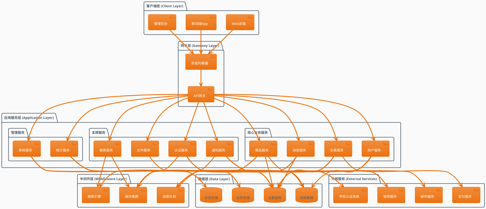

```plantuml

@startuml 校园二手交易平台系统架构

!theme aws-orange
skinparam backgroundColor #FAFAFA

package "客户端层 (Client Layer)" {
    [Web前端] as WebApp
    [移动端App] as MobileApp
    [管理后台] as AdminPanel
}

package "网关层 (Gateway Layer)" {
    [API网关] as Gateway
    [负载均衡器] as LoadBalancer
}

package "应用服务层 (Application Layer)" {
    package "核心业务服务" {
        [用户服务] as UserService
        [商品服务] as ProductService
        [交易服务] as TransactionService
        [消息服务] as MessageService
    }
    
    package "支撑服务" {
        [认证服务] as AuthService
        [文件服务] as FileService
        [通知服务] as NotificationService
        [搜索服务] as SearchService
    }
    
    package "管理服务" {
        [审核服务] as AuditService
        [统计服务] as AnalyticsService
    }
}

package "中间件层 (Middleware Layer)" {
    [消息队列] as MessageQueue
    [缓存集群] as RedisCluster
    [搜索引擎] as ElasticSearch
}

package "数据层 (Data Layer)" {
    database "主数据库" as MainDB
    database "读库集群" as ReadDB
    database "文件存储" as FileStorage
    database "日志存储" as LogStorage
}

package "外部服务 (External Services)" {
    [短信服务] as SMSService
    [邮件服务] as EmailService
    [学校认证系统] as SchoolAuth
    [支付服务] as PaymentService
}

' 连接关系
WebApp --> LoadBalancer
MobileApp --> LoadBalancer
AdminPanel --> LoadBalancer

LoadBalancer --> Gateway
Gateway --> UserService
Gateway --> ProductService
Gateway --> TransactionService
Gateway --> MessageService
Gateway --> AuthService
Gateway --> FileService
Gateway --> NotificationService
Gateway --> SearchService
Gateway --> AuditService
Gateway --> AnalyticsService

UserService --> RedisCluster
UserService --> MainDB
UserService --> ReadDB

ProductService --> RedisCluster
ProductService --> MainDB
ProductService --> ReadDB
ProductService --> ElasticSearch

TransactionService --> RedisCluster
TransactionService --> MainDB
TransactionService --> MessageQueue

MessageService --> RedisCluster
MessageService --> MainDB
MessageService --> MessageQueue

AuthService --> RedisCluster
AuthService --> MainDB
AuthService --> SchoolAuth

FileService --> FileStorage

NotificationService --> MessageQueue
NotificationService --> SMSService
NotificationService --> EmailService

SearchService --> ElasticSearch
SearchService --> RedisCluster

AuditService --> MainDB
AuditService --> LogStorage

AnalyticsService --> MainDB
AnalyticsService --> ReadDB
AnalyticsService --> LogStorage

TransactionService --> PaymentService

@enduml

```
