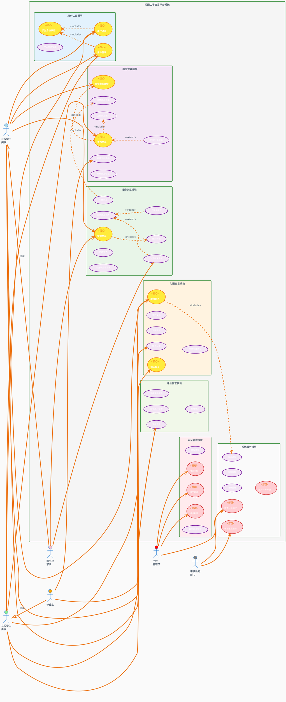

# 校园二手交易平台 - 用例图设计

## PlantUML用例图代码

## 用例图说明文档

### 1. 参与者（Actor）说明

| 参与者 | 描述 | 主要职责 |
|--------|------|----------|
| **在校学生买家** | 寻找和购买二手商品的在校学生 | 搜索商品、沟通议价、完成交易、评价反馈 |
| **在校学生卖家** | 出售闲置物品的在校学生 | 发布商品、管理商品、沟通交易、完成交易 |
| **毕业生** | 需要快速处理大量物品的毕业学生 | 批量发布商品、快速交易、物品传承 |
| **新生及家长** | 需要购买校园生活用品的新生群体 | 浏览新生专区、购买必需品、了解校园生活 |
| **平台管理员** | 负责平台运营和管理的工作人员 | 用户管理、内容审核、纠纷处理、数据分析 |
| **学校后勤部门** | 协助平台运营的学校管理部门 | 数据统计、政策制定、环保监督 |

### 2. 核心用例模块

#### 2.1 用户认证模块
- **UC001 学生身份认证**: 验证用户学生身份的核心功能
- **UC002 用户注册**: 新用户注册流程
- **UC003 用户登录**: 用户登录验证
- **UC004 个人信息管理**: 用户资料维护

#### 2.2 商品管理模块
- **UC005 发布商品**: 单个商品发布功能
- **UC006 批量发布商品**: 毕业生专用的批量发布功能
- **UC007-UC012**: 商品编辑、图片上传、价格设置等支持功能

#### 2.3 搜索浏览模块
- **UC013-UC020**: 商品搜索、浏览、筛选和推荐功能
- 包含新生专区和毕业季专区的特色功能

#### 2.4 沟通交易模块
- **UC021-UC026**: 从沟通到交易完成的完整流程
- 支持议价、预约、线下交接等功能

#### 2.5 评价信誉模块
- **UC027-UC030**: 交易评价和信誉管理系统
- 支持信誉计算和历史查询

#### 2.6 安全管理模块
- **UC031-UC035**: 平台安全和管理功能
- 包含举报、审核、纠纷处理等

### 3. 关系说明

#### 3.1 包含关系（Include）
- **身份认证包含**: 注册和登录都必须包含身份认证
- **商品发布包含**: 发布商品必须包含图片上传和价格设置
- **搜索包含**: 搜索功能包含分类和价格筛选
- **交易包含**: 交易相关操作包含地点验证和通知发送

#### 3.2 扩展关系（Extend）
- **价格建议扩展**: 在发布商品时可选择获取价格建议
- **个性化推荐扩展**: 在浏览商品时提供个性化推荐
- **专区浏览扩展**: 新生专区和毕业季专区扩展基础浏览功能
- **收藏扩展**: 在查看商品详情时可扩展收藏功能
- **举报扩展**: 在查看商品或聊天时可扩展举报功能

#### 3.3 泛化关系（Generalization）
- **毕业生** 是 **卖家** 的特殊类型，具有批量发布等特殊权限
- **新生** 是 **买家** 的特殊类型，具有新生专区等特殊服务

### 4. 用例优先级

#### P0 核心用例（必须实现）
- UC001 学生身份认证
- UC002 用户注册
- UC003 用户登录
- UC005 发布商品
- UC013 搜索商品
- UC021 即时聊天
- UC024 确认交易

#### P1 重要用例（优先实现）
- UC006 批量发布商品
- UC018 浏览新生专区
- UC022 发起议价
- UC027 交易评价
- UC032 内容审核

#### P2 增值用例（后期实现）
- UC012 获取价格建议
- UC017 收藏商品
- UC020 个性化推荐
- UC038 价格提醒
- UC040 用户行为分析

这个用例图全面展现了校园二手交易平台的功能架构和用户交互关系，为系统设计和开发提供了清晰的蓝图。