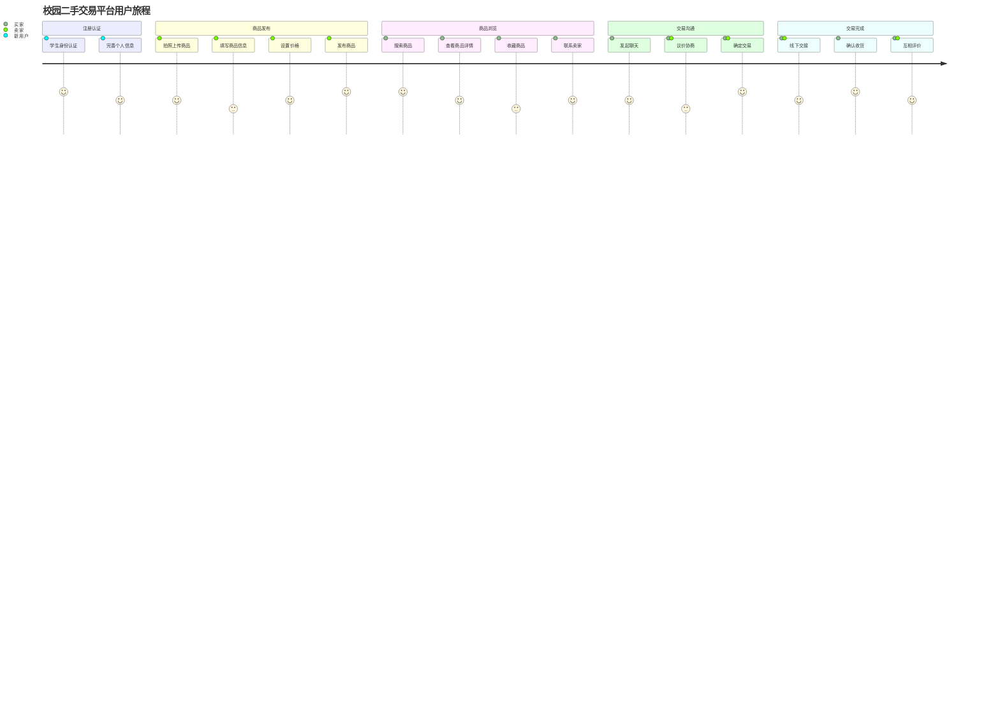

# 校园二手交易平台 - 核心用户故事

## 基于用户角色的核心用户故事

### 一、物品发布与管理场景

#### US001 - 快速发布商品
**作为** 在校学生卖家，**我希望** 能够快速发布商品信息（包括照片、描述、价格），**以便于** 尽快将闲置物品转让出去。

#### US002 - 批量发布功能
**作为** 毕业生，**我希望** 能够批量发布多个商品并设置统一的交易偏好，**以便于** 在有限的时间内快速处理大量闲置物品。

#### US003 - 商品管理
**作为** 在校学生卖家，**我希望** 能够随时编辑、下架或重新上架我的商品，**以便于** 灵活管理我的交易状态。

#### US004 - 价格建议
**作为** 在校学生卖家，**我希望** 系统能够基于同类商品提供价格建议，**以便于** 设置合理的售价提高成交率。

### 二、浏览与搜索场景

#### US005 - 智能搜索
**作为** 在校学生买家，**我希望** 能够通过关键词、分类、价格区间等条件快速找到需要的商品，**以便于** 高效地找到心仪的物品。

#### US006 - 新生专区
**作为** 新生及家长，**我希望** 有专门的新生推荐商品区域，**以便于** 快速了解校园生活必需品并找到性价比高的选择。

#### US007 - 毕业季专区
**作为** 在校学生买家，**我希望** 在毕业季能够浏览专门的毕业生商品区域，**以便于** 找到更多优质的学长学姐传承物品。

#### US008 - 商品收藏
**作为** 在校学生买家，**我希望** 能够收藏感兴趣的商品并设置价格提醒，**以便于** 在合适的时机购买心仪的物品。

### 三、沟通与议价场景

#### US009 - 即时沟通
**作为** 在校学生买家，**我希望** 能够与卖家进行实时聊天并查看对方的在线状态，**以便于** 快速了解商品详情并协商交易细节。

#### US010 - 议价功能
**作为** 在校学生买家，**我希望** 能够向卖家发起议价请求并进行协商，**以便于** 以更合理的价格购买商品。

#### US011 - 交易预约
**作为** 在校学生卖家，**我希望** 能够与买家预约具体的交易时间和地点，**以便于** 确保双方都能按时完成交易。

### 四、交易与评价场景

#### US012 - 安全交易
**作为** 在校学生买家，**我希望** 有担保交易或者见面交易确认机制，**以便于** 保障交易安全和商品质量。

#### US013 - 交易评价
**作为** 在校学生买家，**我希望** 完成交易后能够对卖家和商品进行评价，**以便于** 帮助其他用户做出更好的购买决策。

#### US014 - 信誉查看
**作为** 在校学生买家，**我希望** 能够查看卖家的历史交易记录和信誉评分，**以便于** 判断卖家的可信度。

### 五、校园认证与安全场景

#### US015 - 学生身份认证
**作为** 平台管理员，**我希望** 所有用户都必须通过学生证或学号进行身份认证，**以便于** 确保平台的封闭性和安全性。

#### US016 - 校园地点验证
**作为** 在校学生买家，**我希望** 交易地点限制在校园内的安全区域，**以便于** 保障交易安全并便于监管。

#### US017 - 举报违规
**作为** 在校学生买家，**我希望** 能够举报虚假信息、欺诈行为或不当内容，**以便于** 维护平台的良好秩序。

### 六、平台管理场景

#### US018 - 内容审核
**作为** 平台管理员，**我希望** 有自动化的内容审核工具来检测违规商品和信息，**以便于** 提高审核效率并保证平台内容质量。

#### US019 - 纠纷处理
**作为** 平台管理员，**我希望** 有完善的纠纷调解机制和处理流程，**以便于** 快速解决用户之间的交易争议。

#### US020 - 数据统计
**作为** 学校后勤管理部门，**我希望** 能够查看平台的交易数据和用户行为统计，**以便于** 了解校园二手交易情况并制定相关管理政策。

## 用户故事优先级分析

### 高优先级 (P0 - 核心功能)
- US001: 快速发布商品
- US005: 智能搜索
- US009: 即时沟通
- US015: 学生身份认证
- US012: 安全交易

### 中优先级 (P1 - 重要功能)
- US002: 批量发布功能
- US006: 新生专区
- US010: 议价功能
- US013: 交易评价
- US016: 校园地点验证

### 低优先级 (P2 - 增值功能)
- US004: 价格建议
- US008: 商品收藏
- US011: 交易预约
- US007: 毕业季专区
- US020: 数据统计

## 用户故事地图

## 场景覆盖度检查

✅ **物品发布与管理**: US001, US002, US003, US004  
✅ **浏览与搜索**: US005, US006, US007, US008  
✅ **沟通与议价**: US009, US010, US011  
✅ **交易与评价**: US012, US013, US014  
✅ **校园认证与安全**: US015, US016, US017  
✅ **平台管理**: US018, US019, US020  

## 补充场景

### 七、用户体验优化场景
- **个性化推荐**: 基于用户浏览和购买历史推荐相关商品
- **消息通知**: 及时通知用户关于交易状态、新消息等信息
- **帮助指导**: 为新用户提供平台使用指南和交易安全提示

这些用户故事全面覆盖了校园二手交易平台的核心功能需求，为后续的功能设计和开发提供了清晰的指导方向。