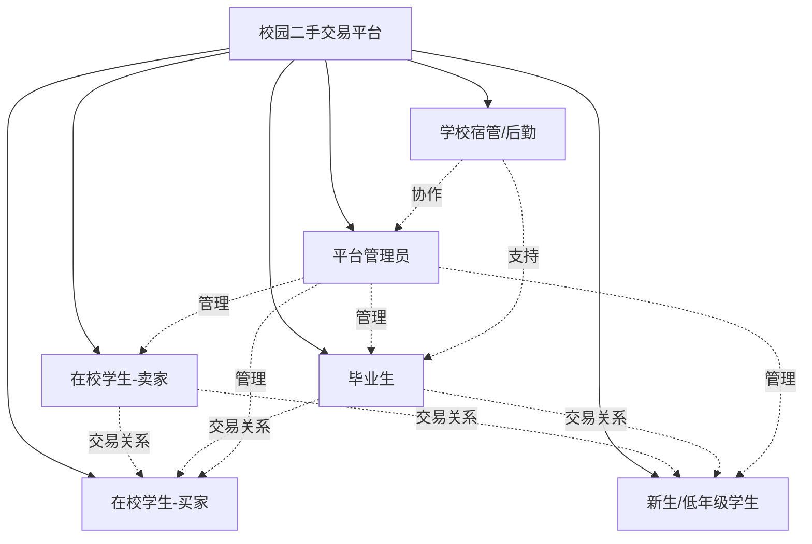

# 校园二手交易平台 - 用户角色分析

## 项目背景
校园二手交易平台是一个面向大学校园的封闭式交易社区，旨在解决毕业季闲置物品处理难、校外交易不安全等痛点。

## 核心用户角色分析

| 角色名称 | 主要痛点 | 核心诉求 |
|---------|---------|---------|
| **在校学生-卖家** | • 毕业季物品处理时间紧迫 • 担心交易安全性和买家信誉 • 定价困难，不知道合理价格 • 缺乏有效的推广渠道 | • 快速出售闲置物品 • 安全可靠的交易环境 • 便捷的商品发布和管理 • 合理的价格参考和建议 |
| **在校学生-买家** | • 担心商品质量和真实性 • 害怕遇到骗子或不诚信卖家 • 线下交易地点和时间安排困难 • 缺乏商品历史和卖家信息 | • 找到性价比高的二手商品 • 查看详细的商品信息和图片 • 安全便捷的支付方式 • 可靠的卖家信誉评价系统 |
| **毕业生** | • 大量物品需要快速处理 • 时间紧迫，无法逐一议价 • 担心交易纠纷影响毕业手续 • 希望物品能传承给学弟学妹 | • 批量快速处理物品 • 简化的交易流程 • 优先推荐和展示功能 • 便民的物品打包和交接服务 |
| **新生/低年级学生** | • 预算有限，需要经济实惠的选择 • 对校园生活用品需求大 • 缺乏对商品价值的判断经验 • 担心买到不适用的物品 | • 价格透明的优质二手商品 • 详细的商品使用说明和建议 • 新生专区和推荐功能 • 退换货保障机制 |
| **平台管理员** | • 需要维护平台秩序和安全 • 处理交易纠纷和投诉 • 识别和防范欺诈行为 • 保证平台内容质量 | • 高效的用户管理和审核工具 • 完善的举报和处理机制 • 数据分析和监控功能 • 自动化的内容审核系统 |
| **学校宿管/后勤** | • 毕业季大量废弃物品处理压力 • 学生搬离时物品遗留问题 • 缺乏有效的物品流转渠道 • 环保和资源循环利用需求 | • 协助学生有序处理物品 • 减少废弃物品数量 • 便于统计和管理的数据接口 • 支持绿色校园建设目标 |

## 用户角色关系图

## 核心用户群体特征分析

### 主要交易群体
- **卖家主力**：大三、大四学生和毕业生，拥有较多闲置物品
- **买家主力**：新生和低年级学生，对二手商品需求较大

### 交易高峰期
- **毕业季（5-7月）**：卖家集中，商品供应量大
- **开学季（8-9月）**：买家集中，商品需求量大
- **学期末**：考试结束后的物品整理期

### 平台价值主张
1. **安全性**：校园内部封闭环境，降低交易风险
2. **便利性**：同校交易，线下交接方便
3. **经济性**：学生群体价格敏感，追求性价比
4. **社交性**：学长学姐传承，增强校园归属感