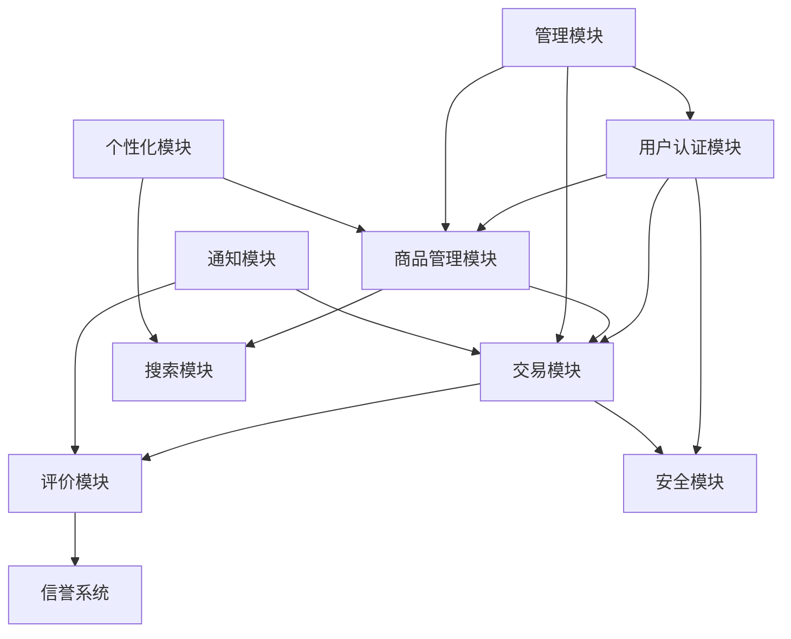

# 校园二手交易平台 - 需求列表

## 一、功能性需求

### 1. 用户模块 (User Module)

#### 1.1 用户注册与认证
- **REQ-U001**: 学生身份认证功能，支持学号、学生证验证
- **REQ-U002**: 手机号码绑定和短信验证
- **REQ-U003**: 用户基本信息管理（姓名、院系、年级、联系方式）
- **REQ-U004**: 头像上传和个人资料编辑
- **REQ-U005**: 账户安全设置（密码修改、登录设备管理）

#### 1.2 用户权限与角色
- **REQ-U006**: 基于学生身份的权限控制
- **REQ-U007**: 管理员角色权限管理
- **REQ-U008**: 用户状态管理（正常、冻结、注销）
- **REQ-U009**: 毕业生账户特殊标识和权限

#### 1.3 用户信誉系统
- **REQ-U010**: 用户信誉评分计算和展示
- **REQ-U011**: 交易历史记录查看
- **REQ-U012**: 用户评价和反馈系统
- **REQ-U013**: 违规记录和处罚机制

### 2. 商品模块 (Product Module)

#### 2.1 商品发布与管理
- **REQ-P001**: 商品信息发布功能（标题、描述、价格、图片）
- **REQ-P002**: 多图片上传和管理（最多9张）
- **REQ-P003**: 商品分类体系和标签管理
- **REQ-P004**: 商品状态管理（在售、已售、下架）
- **REQ-P005**: 批量商品发布功能（针对毕业生）
- **REQ-P006**: 商品编辑和更新功能
- **REQ-P007**: 商品删除和下架功能

#### 2.2 商品展示与推荐
- **REQ-P008**: 商品列表展示和分页
- **REQ-P009**: 商品详情页面展示
- **REQ-P010**: 相关商品推荐算法
- **REQ-P011**: 新生专区商品推荐
- **REQ-P012**: 毕业季专区商品展示
- **REQ-P013**: 价格建议功能（基于历史数据）

#### 2.3 商品搜索与筛选
- **REQ-P014**: 关键词搜索功能
- **REQ-P015**: 分类筛选功能
- **REQ-P016**: 价格区间筛选
- **REQ-P017**: 地理位置筛选（宿舍区域）
- **REQ-P018**: 商品状态筛选
- **REQ-P019**: 搜索历史和热门搜索

### 3. 交易模块 (Transaction Module)

#### 3.1 沟通与议价
- **REQ-T001**: 即时聊天功能
- **REQ-T002**: 图片和语音消息发送
- **REQ-T003**: 议价功能和价格协商
- **REQ-T004**: 交易预约功能（时间、地点）
- **REQ-T005**: 消息已读状态和在线状态显示

#### 3.2 交易流程管理
- **REQ-T006**: 交易订单创建和管理
- **REQ-T007**: 交易状态跟踪（待确认、进行中、已完成、已取消）
- **REQ-T008**: 线下交易确认机制
- **REQ-T009**: 交易取消和退款流程
- **REQ-T010**: 交易纠纷处理机制

#### 3.3 支付与结算
- **REQ-T011**: 担保交易功能（可选）
- **REQ-T012**: 现金交易记录功能
- **REQ-T013**: 交易金额统计和分析
- **REQ-T014**: 交易手续费管理（如有）

### 4. 评价模块 (Review Module)

#### 4.1 交易评价
- **REQ-R001**: 买家对卖家评价功能
- **REQ-R002**: 卖家对买家评价功能
- **REQ-R003**: 商品质量评价功能
- **REQ-R004**: 评价内容审核机制
- **REQ-R005**: 评价统计和展示

#### 4.2 信誉计算
- **REQ-R006**: 综合信誉分计算算法
- **REQ-R007**: 信誉等级划分和展示
- **REQ-R008**: 信誉历史变化记录
- **REQ-R009**: 恶意评价检测和处理

### 5. 安全模块 (Security Module)

#### 5.1 内容安全
- **REQ-S001**: 商品信息内容审核
- **REQ-S002**: 违禁物品检测和拦截
- **REQ-S003**: 虚假信息识别和处理
- **REQ-S004**: 敏感词过滤功能

#### 5.2 交易安全
- **REQ-S005**: 校园地点验证功能
- **REQ-S006**: 异常交易行为检测
- **REQ-S007**: 用户举报功能
- **REQ-S008**: 黑名单管理功能

#### 5.3 数据安全
- **REQ-S009**: 用户数据加密存储
- **REQ-S010**: 访问日志记录和监控
- **REQ-S011**: 数据备份和恢复机制
- **REQ-S012**: 隐私保护和数据脱敏

### 6. 管理模块 (Admin Module)

#### 6.1 用户管理
- **REQ-A001**: 用户信息查看和编辑
- **REQ-A002**: 用户账户冻结和解冻
- **REQ-A003**: 批量用户操作功能
- **REQ-A004**: 用户行为分析和统计

#### 6.2 内容管理
- **REQ-A005**: 商品信息审核和管理
- **REQ-A006**: 违规内容处理工具
- **REQ-A007**: 公告和通知发布功能
- **REQ-A008**: 平台规则和帮助文档管理

#### 6.3 数据分析
- **REQ-A009**: 交易数据统计和分析
- **REQ-A010**: 用户活跃度分析
- **REQ-A011**: 平台运营数据报表
- **REQ-A012**: 异常数据监控和告警

### 7. 通知模块 (Notification Module)

#### 7.1 消息通知
- **REQ-N001**: 站内消息通知功能
- **REQ-N002**: 短信通知功能（重要操作）
- **REQ-N003**: 邮件通知功能（可选）
- **REQ-N004**: 推送通知功能（移动端）

#### 7.2 通知管理
- **REQ-N005**: 通知偏好设置
- **REQ-N006**: 通知历史查看
- **REQ-N007**: 批量通知功能
- **REQ-N008**: 通知模板管理

### 8. 个性化模块 (Personalization Module)

#### 8.1 用户偏好
- **REQ-PE001**: 商品收藏功能
- **REQ-PE002**: 关注卖家功能
- **REQ-PE003**: 搜索历史记录
- **REQ-PE004**: 浏览历史记录

#### 8.2 推荐系统
- **REQ-PE005**: 个性化商品推荐
- **REQ-PE006**: 价格提醒功能
- **REQ-PE007**: 新品上架提醒
- **REQ-PE008**: 推荐算法优化

## 二、非功能性需求

### 1. 性能需求 (Performance Requirements)

#### **NFR-P001**: 并发处理能力
- **要求**: 系统应支持毕业季高峰期同时在线用户数不少于5000人
- **指标**: 在5000并发用户下，页面响应时间不超过3秒
- **场景**: 毕业季（5-7月）商品发布和浏览高峰期

#### **NFR-P002**: 系统响应时间
- **要求**: 正常负载下，页面加载时间不超过2秒
- **指标**: 95%的请求响应时间在2秒内，99%的请求响应时间在5秒内
- **场景**: 日常使用和搜索功能

#### **NFR-P003**: 数据库性能
- **要求**: 支持大量商品数据的快速检索和统计
- **指标**: 商品搜索响应时间不超过1秒，支持10万+商品数据
- **场景**: 商品搜索、筛选和推荐功能

### 2. 安全需求 (Security Requirements)

#### **NFR-S001**: 身份认证安全
- **要求**: 强制校园身份认证，确保平台封闭性
- **指标**: 100%用户必须通过学生身份验证，支持多重验证机制
- **场景**: 用户注册和敏感操作

#### **NFR-S002**: 数据传输安全
- **要求**: 所有敏感数据传输必须加密
- **指标**: 使用HTTPS协议，敏感数据采用AES-256加密
- **场景**: 用户登录、交易信息传输

#### **NFR-S003**: 隐私保护
- **要求**: 用户个人信息和交易数据严格保护
- **指标**: 符合数据保护法规，实现数据最小化原则
- **场景**: 用户信息存储和处理

### 3. 可用性需求 (Usability Requirements)

#### **NFR-U001**: 系统可用性
- **要求**: 系统7×24小时稳定运行
- **指标**: 年度可用性不低于99.5%，计划内维护时间不超过4小时/月
- **场景**: 全天候服务保障

#### **NFR-U002**: 用户体验
- **要求**: 界面友好，操作简单直观
- **指标**: 新用户完成首次交易的步骤不超过10步，学习成本低
- **场景**: 新生用户快速上手

### 4. 扩展性需求 (Scalability Requirements)

#### **NFR-SC001**: 系统扩展性
- **要求**: 支持多校区部署和用户规模扩展
- **指标**: 架构支持水平扩展，单校区支持2万+注册用户
- **场景**: 平台推广到多个校区

## 三、需求优先级矩阵

### P0 级需求（核心功能，必须实现）
- 用户注册认证（REQ-U001~U005）
- 商品发布管理（REQ-P001~P007）
- 基础搜索功能（REQ-P014~P016）
- 即时沟通功能（REQ-T001~T003）
- 交易流程管理（REQ-T006~T010）
- 基础安全功能（REQ-S001~S008）

### P1 级需求（重要功能，优先实现）
- 信誉评价系统（REQ-U010~U013, REQ-R001~R009）
- 商品推荐功能（REQ-P010~P012）
- 通知系统（REQ-N001~N004）
- 管理后台（REQ-A001~A008）
- 个性化功能（REQ-PE001~PE004）

### P2 级需求（增值功能，后期实现）
- 高级推荐算法（REQ-PE005~PE008）
- 数据分析功能（REQ-A009~A012）
- 扩展通知功能（REQ-N005~N008）
- 担保交易功能（REQ-T011~T014）

## 四、需求依赖关系

这个需求列表为校园二手交易平台的开发提供了完整的功能规划和技术要求，确保系统能够满足用户需求并具备良好的性能和安全性。